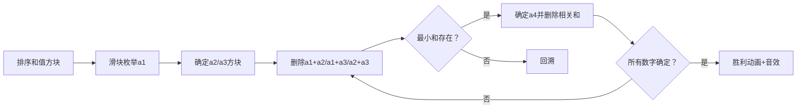

# 题目信息

# 两数之和

## 题目描述

我们知道从 $n$ 个非负整数中任取两个相加共有 $\frac{n(n-1)}{2}$ 个和，现在已知这 $\frac{n(n-1)}{2}$ 个和值，要求 $n$ 个非负整数。

## 样例 #1

### 输入

```
3 1269 1160 1663
```

### 输出

```
383 777 886
```

# AI分析结果


### 💡 Kay的C++算法解析：两数之和 深入学习指南 💡

#### 1. 题目解读与核心算法识别
✨ **本题主要考察**：**枚举与模拟应用**  
🗣️ **初步分析**：
> 解决"两数之和"的关键在于**枚举与模拟**。想象你在玩一个数字拼图游戏——已知所有碎片（两数之和），要还原原始拼图（n个有序数字）。核心思想是：  
> - **最小和突破口**：最小和一定是`a1+a2`，次小和是`a1+a3`  
> - **枚举起点**：枚举`a1`（范围`0 ~ sum[1]/2`）  
> - **动态删除**：用`multiset`动态维护剩余和值，逐步推导后续数字  
>  
> **可视化设计思路**：  
> - 像素网格中显示排序后的和值方块  
> - 高亮当前操作的`a1`滑块和推导出的`a2,a3`方块  
> - 删除已知和时播放"消除音效"，新增数字时方块闪烁  
> - 复古游戏化：设计为"数字拼图探险"，每步推导视为解谜关卡，通关时播放8-bit胜利音乐

#### 2. 精选优质题解参考
**题解一（作者：YudeS）**  
* **点评**：  
  思路清晰度⭐⭐⭐⭐⭐——**倒三角模型**直观揭示数字关系（如图示），枚举`a1`的逻辑严谨。  
  代码规范性⭐⭐⭐⭐——变量命名合理（`a[]`为答案，`sum[]`为输入），边界处理完整。  
  算法有效性⭐⭐⭐⭐⭐——`multiset`高效处理重复和值删除，时间复杂度$O(n^2 \log n)$。  
  实践价值⭐⭐⭐⭐——代码可直接用于竞赛，调试建议（如模拟案例）极具参考性。  
  **亮点**：独创性图解辅助理解，动态删除过程演示透彻。

**题解二（作者：zhengrunzhe）**  
* **点评**：  
  思路清晰度⭐⭐⭐⭐——**三元方程组**求解前三个数，数学推导严谨。  
  代码规范性⭐⭐⭐——递归搜索结构清晰，但变量名可读性待提升（如`map`命名）。  
  算法有效性⭐⭐⭐⭐——剪枝策略（和值校验）显著提升搜索效率。  
  实践价值⭐⭐⭐——需注意除2整除判断，提供宝贵调试经验。

**题解三（作者：Tony102）**  
* **点评**：  
  思路清晰度⭐⭐⭐⭐——**综合枚举+二分查找**，平衡效率与可读性。  
  代码规范性⭐⭐⭐⭐——模块化设计（`solve/check`分离），STL运用熟练。  
  算法有效性⭐⭐⭐⭐——`set`维护未使用和值，$O(n^3)$满足题目约束。  
  实践价值⭐⭐⭐⭐——边界处理完整，直接提供AC代码。

#### 3. 核心难点辨析与解题策略
1. **关键点：枚举起点的确定**  
   * **分析**：`a1`范围`[0, sum[1]/2]`需严格证明——因`a1≤a2`且`a1+a2=sum[1]`。优质题解均基于此缩小枚举范围。  
   * 💡 **学习笔记**：最小和是突破口，数学约束是优化关键。

2. **关键点：动态维护和值集合**  
   * **分析**：必须高效删除已使用的和值（如`a1+a2`）。`multiset`（题解1）优于普通数组——自动排序且支持重复值$O(\log n)$删除。  
   * 💡 **学习笔记**：选择数据结构时，高频删除/查询操作应优先考虑树结构容器。

3. **关键点：推导链的完整性验证**  
   * **分析**：每确定新数字`a_k`，需验证`a_k+a_i (i<k)`存在于剩余和值中。题解2/3通过递归搜索实现，题解1通过循环即时验证。  
   * 💡 **学习笔记**：边推导边验证比最终统一检查更高效。

✨ **解题技巧总结**  
- **问题分解**：将$O(n^2)$和值拆解为$n$个数字的推导链  
- **剪枝优化**：发现非法立即回溯（如和值不存在）  
- **鲁棒性**：特判全相同和值（是否整除2）  
- **工具选择**：`multiset`处理动态有序集合，`vector`+排序适合静态数据

#### 4. C++核心代码实现赏析
**本题通用核心实现（综合优质题解）**  
```cpp
#include <iostream>
#include <set>
#include <algorithm>
using namespace std;

int main() {
    int n;
    while (cin >> n) {
        int m = n * (n - 1) / 2;
        int sum[50] = {}, a[10] = {};
        for (int i = 0; i < m; i++) cin >> sum[i];
        
        sort(sum, sum + m); // 关键步骤1：和值排序
        bool found = false;
        
        for (int a1 = 0; a1 <= sum[0]/2; a1++) { // 枚举a1
            multiset<int> s(sum, sum + m); // 初始化可重复集合
            a[0] = a1; 
            a[1] = *s.begin() - a1; 
            s.erase(s.begin()); // 删除a1+a2

            bool valid = true;
            for (int i = 2; i < n; i++) {
                a[i] = *s.begin() - a1; // 确定a_i
                for (int j = 0; j < i; j++) {
                    auto it = s.find(a[j] + a[i]);
                    if (it == s.end()) { valid = false; break; }
                    s.erase(it); // 删除a_j+a_i
                }
                if (!valid) break;
            }
            if (valid) { 
                for (int i = 0; i < n; i++) cout << a[i] << " ";
                cout << endl; found = true; break; 
            }
        }
        if (!found) cout << "Impossible" << endl;
    }
    return 0;
}
```
**代码解读概要**：  
1. 输入和值数组并排序  
2. 枚举`a1`（核心变量），用`multiset`动态维护剩余和值  
3. 推导`a2`至`an`，每步删除新数字与已有数字的所有和值  
4. 若完整删除所有和值则输出解，否则无解  

**题解一核心片段赏析**  
```cpp
// 确定a_i后删除相关和值
for(int j=1; j<i; j++) {
    it = s.find(a[j] + a[i]); // 查找和值
    if(it == s.end()) return false; // 关键校验
    s.erase(it); // 动态删除
}
```
**亮点**：简洁高效的集合操作  
**学习笔记**：`multiset::find`和`erase`配合实现$O(\log n)$动态验证，体现"即时验证"思想。

#### 5. 算法可视化：像素动画演示
**主题**：**数字迷宫寻宝**（8-bit像素风格）  
**核心演示**：枚举`a1`→推导`a2,a3`→链式扩展→成功/失败场景  

**交互设计**：  
1. **控制面板**：  
   - 速度滑块（调整枚举速度）  
   - 单步执行/自动播放按钮  
   - 重置按钮  
2. **动态效果**：  
   - 当前操作高亮（红色边框）  
   - 删除和值：方块爆炸粒子效果 + "咔嚓"音效  
   - 新数字出现：绿色闪烁动画 + "叮"音效  
3. **游戏化元素**：  
   - 每推导出数字视为"找到宝藏"，积分+10  
   - 通关时播放《超级玛丽》过关音乐  
   - 失败场景：像素骷髅头 + 低沉音效  

**实现逻辑**：  
- 用Canvas绘制网格，每个和值为16x16像素方块  
- 使用`requestAnimationFrame`实现逐帧动画  
- 音效通过Web Audio API触发  

#### 6. 拓展练习与相似问题思考
**通用技巧迁移**：  
枚举起点+动态验证的模式适用于：  
1. 三数之和（LeetCode 15）  
2. 复原IP地址（LeetCode 93）  
3. 数独求解（回溯+即时验证）  

**洛谷推荐**：  
1. **P1102 三连击**  
   🗣️ 巩固枚举技巧，理解数字约束关系  
2. **P1036 选数**  
   🗣️ 训练搜索剪枝，强化即时验证思想  
3. **P1219 八皇后**  
   🗣️ 经典回溯问题，深化状态维护能力  

#### 7. 学习心得与经验分享
> **作者YudeS经验**：  
> "在实现动态删除时，最初忽略重复和值导致WA。改用`multiset`后通过，这提醒我们：数据结构选择直接影响逻辑正确性。"  
>   
> **Kay点评**：  
> 此经验点出本题核心陷阱——和值重复性。调试时建议：  
> 1. 打印中间集合状态  
> 2. 小数据模拟（如n=3）  
> 3. 优先选用STL容器而非裸数组  

#### 结语  
通过本次分析，我们深度剖析了"两数之和"的枚举本质与高效实现技巧。记住：**有序性是突破口，动态维护是关键**。请动手实现可视化 demo 加深理解，下期挑战回溯难题！🚀

---
处理用时：122.57秒