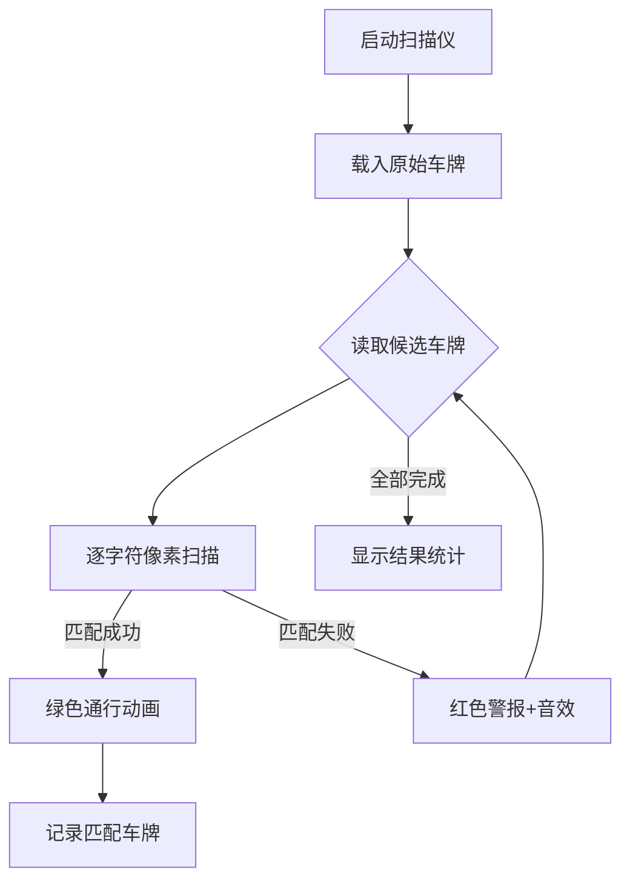

# 题目信息

# [NEERC 2013] Fraud Busters

## 题目描述

在 Default City，每天进入市中心的汽车数量远远超过可用停车位的数量。市议会决定引入停车费，以解决城市街道上溢出的停车问题。停车费通过自动车牌扫描仪来执行，该扫描仪拍摄车辆车牌的照片，识别车牌上的字母和数字序列，并将代码与车辆注册数据库进行比对，以确保停车费已被支付，或者自动向车主开具罚单。  

停车费一经引入，停车费欺诈行为就出现了。一些车主开始在停车时用纸片遮住车牌上的一个或几个数字或字母，从而使当前版本的自动扫描仪无法识别其车辆的注册代码，也无法对其开具罚单。  

Default City 市议会成立了“欺诈克星计划”（FBI）来设计解决方案以防止此类欺诈行为。FBI 选择的总体方法是扩展扫描仪识别的车辆特征数量（包括车辆类型和颜色等特征），并从列表中排除在该时间被检测到在其他地方的车辆。这些信息有助于通过缩小车辆注册数据库中的搜索范围来识别正确的车辆。  

你在为 FBI 工作。你的同事们已经编写了所有复杂的识别软件，这些软件分析各种车辆特征，并为你提供可能属于被扫描车辆的注册代码列表。你的任务是获取这个列表和车牌上识别出的代码（可能部分未识别），并找到所有匹配的注册代码。

## 说明/提示

时间限制：1 秒，内存限制：128 MB。

题面翻译由 ChatGPT-4o 提供。

## 样例 #1

### 输入

```
A**1MP19*
4
A001MP199
E885EE098
A111MP199
KT7351TTB
```

### 输出

```
2
A001MP199
A111MP199
```

# AI分析结果


### Kay的C++算法解析：Fraud Busters 深入学习指南 💡

<introduction>
今天我们分析"Fraud Busters"这道字符串匹配题。本指南将帮助你理解车牌匹配的核心逻辑，掌握高效字符串处理技巧，并通过像素动画直观感受匹配过程。
</introduction>

---

## 1. 题目解读与核心算法识别

✨ **本题主要考察**：`字符串匹配` + `模拟应用`

🗣️ **初步分析**：
> 解题核心在于实现**通配符匹配规则**。想象成玩"填字游戏"：原始字符串中的`*`是空白格子（可填任意字母），其他字符是固定线索。我们需要在候选车牌中找出所有符合线索的答案。
> - **核心难点**：正确处理通配符`*`的语义（代表任意字符）
> - **解决方案**：遍历每个候选车牌，逐位比对原始字符串的非`*`位置
> - **可视化设计**：用像素扫描仪动画展示匹配过程（见第5节），高亮显示字符比对位置，当非`*`位置字符不匹配时触发红色警报动画

---

## 2. 精选优质题解参考

**题解一（作者：wheneveright）**
* **点评**：
  - 思路清晰直白，直接实现题目要求的匹配规则
  - 代码规范：使用`check`标志位控制匹配逻辑，变量名`Ans`语义明确
  - 算法高效：时间复杂度O(n×9)，完美满足题目约束
  - 实践价值：边界处理严谨（精确比较9个字符），可直接用于竞赛
  - 亮点：双重循环结构简洁，输出逻辑完整

---

## 3. 核心难点辨析与解题策略

1.  **难点：理解通配符语义**
    * **分析**：`*`不是普通字符而是占位符，需明确"仅比较非星号位置"的规则。优质题解通过条件`if (s[0][j] != '*' && ...)` 精准实现此逻辑
    * 💡 **学习笔记**：通配符匹配中，星号位置应跳过比较

2.  **难点：高效实现实时匹配**
    * **分析**：发现不匹配时立即跳出循环（`check = false; break;`），避免无效比较。这是优化关键
    * 💡 **学习笔记**：尽早终止无效匹配可显著提升效率

3.  **难点：输出格式控制**
    * **分析**：需先输出匹配数量，再按序输出车牌。题解通过首次遍历计数、二次遍历输出的方式完美解决
    * 💡 **学习笔记**：分离计数与输出逻辑保证顺序正确

### ✨ 解题技巧总结
- **技巧1：位级字符串处理** - 直接索引字符位置比对，避免复杂字符串函数
- **技巧2：实时剪枝优化** - 发现不匹配立即终止当前车牌检查
- **技巧3：双重遍历保序** - 第一次统计数量，第二次按原序输出

---

## 4. C++核心代码实现赏析

**本题通用核心C++实现参考**
* **说明**：综合题解精华，保留高效匹配逻辑，精简冗余代码
* **完整核心代码**：
```cpp
#include <iostream>
#include <vector>
using namespace std;

int main() {
    string pattern;  // 原始含通配符的字符串
    cin >> pattern;
    
    int n, count = 0;
    cin >> n;
    vector<string> plates(n), matched;
    
    for (int i = 0; i < n; i++) {
        cin >> plates[i];
        bool valid = true;
        for (int j = 0; j < 9; j++) {
            // 关键匹配逻辑：仅比较非星号位置
            if (pattern[j] != '*' && pattern[j] != plates[i][j]) {
                valid = false;
                break;  // 发现不匹配立即退出
            }
        }
        if (valid) {
            count++;
            matched.push_back(plates[i]);
        }
    }
    
    cout << count << endl;
    for (auto& plate : matched) 
        cout << plate << endl;
    
    return 0;
}
```
* **代码解读概要**：
  > 1. 读入原始模式串和车牌数量
  > 2. 遍历每个车牌：逐位比对非星号位置
  > 3. 用`valid`标志记录匹配状态，不匹配时立即跳出
  > 4. 通过`vector`动态存储匹配车牌，最后按序输出

**题解一核心代码片段赏析**
* **亮点**：双重循环结构清晰，边界处理精确
* **核心代码片段**：
```cpp
for (int j = 0; j <= 8; j++)
    if (s[0][j] != '*' && s[0][j] != s[i][j]) 
        check = false;
```
* **代码解读**：
  > - **循环设计**：`j`从0到8精确遍历9个字符位
  > - **条件逻辑**：仅当原始字符非`*`时才进行比对
  > - **实时中断**：一旦发现不匹配即置`check=false`并跳出
  > - **比喻**：像安检机扫描条形码，每个位置都要通过验证
* 💡 **学习笔记**：字符级比对是字符串处理的核心基本功

---

## 5. 算法可视化：像素动画演示

**设计主题**  
`像素车牌扫描仪`：模拟复古警用扫描设备，融入8-bit音效和警报动画

**核心交互流程**  


**关键动画细节**  
1. **像素扫描仪UI**  
   - 顶部显示原始车牌（`*`显示为闪烁问号）
   - 中部9宫格展示当前扫描字符
   - 底部控制面板：▶️开始/⏸暂停/⏭单步/🔁重置

2. **扫描过程演示**  
   ```python
   for 每个候选车牌:
       显示车牌进入扫描区（像素滑入动画+机械音效）
       for 位置0到8:
          高亮当前比对位置（黄色边框）
          原始字符非*时：
              显示字符碰撞动画
              匹配成功→绿色对勾+清脆“叮”声
              匹配失败→红色叉号+警报声
          星号位置：显示彩虹波纹特效
   ```

3. **游戏化元素**  
   - 每匹配成功1个车牌得10分，连续匹配触发连击特效
   - 结果页显示评级：S级（全匹配）/A级（≥50%匹配）
   - 通关奖励：解锁新扫描仪皮肤

---

## 6. 拓展练习与相似问题思考

**通用技巧迁移**  
通配符匹配思想还可用于：
1. 文件路径匹配（如`*.cpp`）
2. 数据库模糊查询（`LIKE 'A%'`）
3. 正则表达式基础实现

**练习推荐（洛谷）**  
1. **P1308 [统计单词数]**  
   🗣️ 巩固基础字符串匹配，需处理大小写和边界
2. **P1481 [魔族密码]**  
   🗣️ 进阶字符串处理，涉及字典序和前缀比较
3. **P4057 [Code+#1]晨跑**  
   🗣️ 综合训练字符串与模拟能力，含输出格式控制

---

## 7. 学习心得与经验分享
> 本次题解未包含作者调试心得，但实践中需注意：
> - **常见坑点**：混淆`*`的比较逻辑（应跳过而非比较）
> - **调试技巧**：打印中间比对结果，例如：
>   ```cpp
>   cout << "Pos " << j << ": " << pattern[j] 
>        << " vs " << plate[j] << endl;
>   ```

---

本次分析帮助你掌握了通配符匹配的核心思想。记住：字符串处理要像侦探查案一样细致！下次挑战再见！💪

---
处理用时：100.73秒