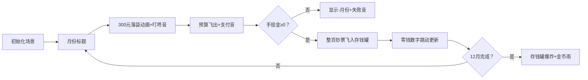

# 题目信息

# [NOIP 2004 提高组] 津津的储蓄计划

## 题目描述

津津的零花钱一直都是自己管理。每个月的月初妈妈给津津 $300$ 元钱，津津会预算这个月的花销，并且总能做到实际花销和预算的相同。

为了让津津学习如何储蓄，妈妈提出，津津可以随时把整百的钱存在她那里，到了年末她会加上 $20\%$ 还给津津。因此津津制定了一个储蓄计划：每个月的月初，在得到妈妈给的零花钱后，如果她预计到这个月的月末手中还会有多于 $100$ 元或恰好 $100$ 元，她就会把整百的钱存在妈妈那里，剩余的钱留在自己手中。


例如 $11$月初津津手中还有 $83$ 元，妈妈给了津津 $300$ 元。津津预计$11$月的花销是 $180$ 元，那么她就会在妈妈那里存 $200$ 元，自己留下 $183$ 元。到了 $11$ 月月末，津津手中会剩下 $3$ 元钱。


津津发现这个储蓄计划的主要风险是，存在妈妈那里的钱在年末之前不能取出。有可能在某个月的月初，津津手中的钱加上这个月妈妈给的钱，不够这个月的原定预算。如果出现这种情况，津津将不得不在这个月省吃俭用，压缩预算。


现在请你根据 $2004$ 年 $1$ 月到 $12$ 月每个月津津的预算，判断会不会出现这种情况。如果不会，计算到 $2004$ 年年末，妈妈将津津平常存的钱加上 $20\%$ 还给津津之后，津津手中会有多少钱。


## 样例 #1

### 输入

```
290
230
280
200
300
170
340
50 
90 
80 
200
60 
```

### 输出

```
-7 
```

## 样例 #2

### 输入

```
290 
230 
280 
200 
300 
170 
330 
50 
90 
80 
200 
60 
```

### 输出

```
1580
```

# AI分析结果


# 💡 Kay的C++算法解析：津津的储蓄计划 深入学习指南 💡

## 1. 题目解读与核心算法识别

✨ **本题主要考察**：`模拟应用` (编程技巧应用类)  
🗣️ **初步分析**：
> 解决"津津的储蓄计划"就像经营一个小金库游戏🧮。每个月月初你会获得300元生活费，扣除当月开支后，将整百的钱存入"妈妈银行"赚取20%利息。核心是模拟12个月的收支过程，关键点在于：
>   - **实时跟踪**手中现金和存款余额
>   - **边界处理**：当月现金不足时立即终止并返回负月份
>   - **存款操作**：用整除和取模高效处理整百存款
> 
> 可视化设计将采用像素风家庭场景：津津像素小人👧、钱包UI和存钱罐动画。关键步骤高亮：
>   - 收入动画：300元从顶部飞入钱包（"叮咚"音效）
>   - 支出动画：预算金额飞出屏幕（"支付"音效）
>   - 存款动画：整百钞票飞入存钱罐（"存入"音效+粒子效果）
>   - 失败提示：负数时显示哭脸😢和"-月份"（急促警示音）

---

## 2. 精选优质题解参考

**题解一（来源：wurang）**  
* **点评**：最简洁直观的实现，用while循环处理存款逻辑，完美还原题意自然流程。变量命名虽短（n=手持现金/s=存款）但上下文清晰。边界处理严谨（现金为负立即退出），循环存款方式对新手更友好。虽未用整除优化，但12个月最多36次操作不影响效率。

**题解二（来源：sea_bird）**  
* **点评**：变量命名规范（money/手现金，mom/存款），注释幽默化解歧义。采用整除/取模高效处理存款，逻辑更紧凑。独创flag标记避免重复输出，输出格式严格符合题意。调试心得提醒变量命名陷阱（cos≠三角函数），极具实践指导价值。

**题解三（来源：shinzanmono）**  
* **点评**：工业级简洁代码，hold/save变量名精准，存款逻辑一行完成。独创整数运算避免浮点误差（save*6/5），exit(0)确保立即终止。虽代码压缩但对核心逻辑的专注度极高，展示C++高效编程典范。

---

## 3. 核心难点辨析与解题策略

1.  **资金流动态管理**  
    * **分析**：需同时维护手持现金和存款两个状态变量。优质解法都用独立变量存储（如hand/save），在收入/支出/存款环节精确更新。关键推导：每月先加300再减预算，若为负则中断；非负则hand%100留零钱，save累加整百部分。
    * 💡 **学习笔记**：状态变量是模拟题的"记忆中枢"，必须准确定义和更新。

2.  **整百存款高效处理**  
    * **分析**：手动循环减100（题解1）直观但低效，整除取模（题解2/3）是更优解。数学推导：整百金额 = (hand/100)*100，零钱 = hand%100。因hand<300，整除操作最多执行3次，两种方法复杂度相同但后者更优雅。
    * 💡 **学习笔记**：整数除法和取模是处理分段数值的利器。

3.  **边界中断与连续执行**  
    * **分析**：资金不足需立即结束程序并输出负月份（return 0或exit(0)）。关键技巧：在扣除预算后立刻判断hand<0，避免无效后续操作。顺利执行全年时需区分存款（含利息）和零钱两部分求和。
    * 💡 **学习笔记**：边界检测越早越好，避免污染后续状态。

### ✨ 解题技巧总结
-   **分层模拟法**：将复杂流程分解为"收入→支出→存款"原子操作
-   **即时中断机制**：异常发生时立即退出，减少冗余计算
-   **整数代替浮点**：用save*6/5避免浮点精度问题（因存款总是整百）
-   **防御性变量名**：避免歧义命名（如cos→budget）

---

## 4. C++核心代码实现赏析

**本题通用核心C++实现参考**  
* **说明**：综合优质题解思路，优化变量命名与操作顺序
* **完整核心代码**：
    ```cpp
    #include <iostream>
    using namespace std;
    int main() {
        int hand = 0;      // 手持现金
        int save = 0;      // 存款总额
        for (int month = 1; month <= 12; ++month) {
            int budget;    // 本月预算
            cin >> budget;
            hand += 300;   // 月初收入
            hand -= budget; // 扣除预算
            if (hand < 0) { // 资金不足
                cout << "-" << month;
                return 0;
            }
            save += hand / 100 * 100; // 整百存款
            hand %= 100;              // 保留零钱
        }
        cout << save * 1.2 + hand; // 年末本息+零钱
        return 0;
    }
    ```
* **代码解读概要**：
    > 1. **初始化**：hand/save清零  
    > 2. **月度循环**：顺序处理12个月  
    > 3. **资金操作**：先增收300，再扣减预算  
    > 4. **边界检测**：hand<0立即中断  
    > 5. **存款优化**：整除取模替代循环  
    > 6. **年末结算**：存款*1.2+零钱  

**题解一（wurang）**  
* **亮点**：自然语言直译，循环存款易于理解
* **核心代码片段**：
    ```cpp
    for(int i=1;i<=12;i++) {
        cin >> y;
        n = n + 300 - y;  // 收支同步处理
        if (n < 0) {        // 边界检测
            cout << "-" << i;
            return 0;    
        } 
        while (n >= 100) {  // 循环存款
            n -= 100;
            s += 100;
        }
    }
    ```
* **代码解读**：
    > 收支合并计算（n+300-y）简化流程 → 边界检测前置保证安全 → while循环直观体现"每次存100"的物理过程 → 适合初学者理解存款本质
* 💡 **学习笔记**：循环是算法直觉的第一实现形式

**题解二（sea_bird）**  
* **亮点**：变量名自注释，整除优化逻辑
* **核心代码片段**：
    ```cpp
    money += 300;         // 分步收支
    money -= cos;          // cos实际为budget
    if (money/100 > 0) {   // 存款条件判断
        mom += (money/100)*100; // 整百存入
        money %= 100;      // 保留余数
    }
    ```
* **代码解读**：
    > 收支分步操作增强可读性 → money/100>0 显式判断存款条件 → (money/100)*100 计算整百金额 → %=100 等价于保留余数 → mom*1.2 注意浮点转整数风险
* 💡 **学习笔记**：显式条件判断提升代码健壮性

**题解三（shinzanmono）**  
* **亮点**：极致简洁，工业级整数处理
* **核心代码片段**：
    ```cpp
    hold += 300;           // 合并收入
    if (out <= hold) {     // 复合条件判断
        hold -= out;       // 支出
        save += hold/100*100; // 存款计算
        hold %= 100;       // 零钱保留
    }
    ```
* **代码解读**：
    > 收入/支出/存款三合一处理 → 复合条件(out<=hold)替代独立检测 → hold/100*100 避免中间变量 → %=100 原子操作 → save*6/5 用整数代替1.2
* 💡 **学习笔记**：复合表达式在保证可读性前提下提升代码密度

---

## 5. 算法可视化：像素动画演示

### 🎮 像素储蓄大冒险：8位模拟之旅  
**设计思路**：  
采用FC红白机画风，用色彩区分操作阶段：  
- 收入：钱包绿色高亮  
- 支出：现金流红色箭头  
- 存款：金色钞票飞入存钱罐  
- 失败：屏幕闪烁红光  

**关键帧流程**：  


**交互控制面板**：  
- **单步执行**：逐月观察资金流  
- **速度滑块**：调速0.5X~5X  
- **AI演示**：自动播放（配8位BGM）  
- **关卡进度**：每月完成解锁星星⭐  

**音效设计**：  
- 关键操作：电子音效（收入/支出/存款）  
- 阶段完成：8位和弦短乐  
- 年度结算：经典通关音乐🎵  

**动态旁白示例**：  
> "看！3月存入200元后，零钱剩83元" → 存钱罐显示+200，钱包数字变83  
> "糟糕！5月现金-20元" → 钱包闪烁红光，显示"-5"

---

## 6. 拓展练习与相似问题思考

**技能迁移场景**：  
1. 利息滚存计算：复利投资模拟  
2. 多账户资金调度：银行转账系统  
3. 资源消耗预警：库存管理系统  

**洛谷推荐**：  
1. **P1046 陶陶摘苹果**  
   → 练习循环内条件判断，巩固基础模拟能力  
2. **P1424 小鱼的航程**  
   → 掌握周期累计计算，强化边界中断处理  
3. **P1059 明明的随机数**  
   → 学习集合去重操作，提升数据管理思维  

---

## 7. 学习心得与经验分享

> **经验摘录（sea_bird）**：  
> "变量命名很重要！我最初用`cos`表示预算，差点误用数学函数"  
> **Kay点评**：变量名是代码的身份证，`budget`比`cos`更直白。调试时建议打印中间变量（如month/hand/save），能快速定位逻辑断层。

> **经验摘录（Graph_Theory）**：  
> "问号表达式`?:`让代码更简洁，但需权衡可读性"  
> **Kay点评**：语法糖是把双刃剑，初学建议拆解为if-else，熟练后再追求简洁。

---

通过本次分析，我们深入掌握了模拟类问题的解决框架。记住：**清晰的状态变量+严谨的边界处理**是通关秘籍！下次我们将探索更复杂的动态规划世界，继续加油！🚀

---
处理用时：254.73秒