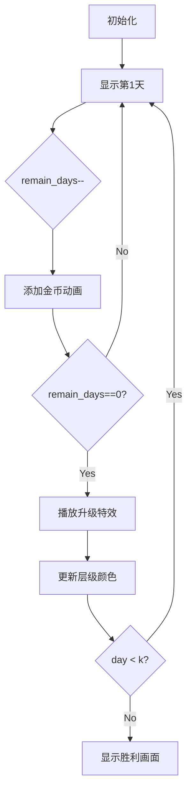

# 题目信息

# [NOIP 2015 普及组] 金币

## 题目背景

NOIP2015 普及组 T1

## 题目描述

国王将金币作为工资，发放给忠诚的骑士。第一天，骑士收到一枚金币；之后两天（第二天和第三天），每天收到两枚金币；之后三天（第四、五、六天），每天收到三枚金币；之后四天（第七、八、九、十天），每天收到四枚金币……；这种工资发放模式会一直这样延续下去：当连续 $n$ 天每天收到 $n$ 枚金币后，骑士会在之后的连续 $n+1$ 天里，每天收到 $n+1$ 枚金币。

请计算在前 $k$ 天里，骑士一共获得了多少金币。

## 说明/提示

**【样例 1 说明】**

骑士第一天收到一枚金币；第二天和第三天，每天收到两枚金币；第四、五、六天，每天收到三枚金币。因此一共收到 $1+2+2+3+3+3=14$ 枚金币。


对于 $100\%$ 的数据，$1\le k\le 10^4$。


## 样例 #1

### 输入

```
6```

### 输出

```
14```

## 样例 #2

### 输入

```
1000
```

### 输出

```
29820
```

# AI分析结果


# 💡 Kay的C++算法解析：金币问题 深入学习指南 💡

<introduction>
今天我们一起来探索NOIP2015普及组的经典题目——金币问题。这道题看似简单，但蕴含了模拟和数学优化的核心思想。本指南将带你深入理解解题思路，掌握关键技巧，并通过生动的像素动画直观感受算法执行过程。
</introduction>

## 1. 题目解读与核心算法识别

✨ **本题主要考察**：`模拟应用` 与 `数学优化`

🗣️ **初步分析**：
> 解决金币问题的核心在于理解金币发放的**阶梯式增长规律**。想象骑士每天领取金币的过程就像攀登一座金字塔：第一级台阶只有1天（领1金币），第二级有2天（每天2金币），以此类推。我们有两种主要攀登方式：
>   - **模拟法**：像数台阶一样逐天计算（O(k)时间复杂度）
>   - **数学法**：直接计算金字塔的完整层数和剩余台阶（O(1)时间复杂度）
>  
> 可视化设计思路：
>   - 用不同颜色的像素块表示不同层级的金币数（如1金币=黄色方块，2金币=蓝色方块）
>   - 高亮显示当前处理的天数和金币层级变化
>   - 采用复古游戏音效：金币累加时播放"叮"声，层级切换时播放升级音效

---

## 2. 精选优质题解参考

<eval_intro>
我从思路清晰度、代码规范性和算法效率等维度，精选了以下3个≥4星的优质题解：

### 题解一：XMK_萌新 (模拟法)
* **点评**：
思路清晰直白，完美还原题目描述的发放过程。变量命名简洁规范（`c`=当前金币数，`q`=剩余天数），边界处理严谨。循环控制逻辑优雅，通过`q--`和`if(q==0)`实现状态切换。实践价值极高，代码可直接用于竞赛，是初学者理解模拟思想的典范。

### 题解二：封禁用户 (分层计算法)
* **点评**：
提供多维解题视角，尤其擅长揭示问题本质——金币发放的三角形数据结构。代码展示多种分层处理技巧（先加后减/先加再减），并精准指出嵌套循环中`break`的陷阱。亮点在于用数学思维优化模拟过程，大幅提升代码可读性。

### 题解三：Starlight237 (数学公式法)
* **点评**：
运用平方和公式与高斯求和进行数学推导，实现O(1)时间复杂度的最优解。亮点在于创新性地推导出金币计算公式 $ans = n[d - \frac{(n+1)(n+2)}{6}] + d$ ，展示了算法优化的美学价值。虽实现稍复杂，但为追求极致效率的选手提供重要参考。

---

## 3. 核心难点辨析与解题策略

<difficulty_intro>
解决金币问题的关键难点与应对策略：

1.  **难点：状态切换的精确控制**
    * **分析**：模拟法中需在恰当时机更新金币数和剩余天数。优质解法通过`q--`递减计数器，在`q==0`时触发状态更新（如XMK_萌新的`c++; q=c;`）
    * 💡 **学习笔记**：设置状态计数器是控制流程切换的通用技巧

2.  **难点：分层计算的边界处理**
    * **分析**：数学法需精确计算完整层数$n$和剩余天数$r$。封禁用户展示的`coins -= i*(days-k)`和Starlight237的$n = (\sqrt{1+8k}-1)/2$都是处理边界的典范
    * 💡 **学习笔记**：边界处理能力直接决定算法鲁棒性

3.  **难点：数学模型的抽象构建**
    * **分析**：将实际问题转化为数学模型（如金币发放=平方和+线性项）需要深刻理解问题本质。Starlight237的公式推导展示了如何通过数学变换降低计算复杂度
    * 💡 **学习笔记**：优秀的算法工程师必须具备数学建模能力

### ✨ 解题技巧总结
<summary_best_practices>
通过对本题的深度剖析，提炼以下通用技巧：
</summary_best_practices>
- **技巧1：循环控制三板斧** - 初始化计数器→递减计数器→归零触发状态更新
- **技巧2：边界处理双保险** - 预先计算完整区块+独立处理剩余部分
- **技巧3：数学模型四步法** - 观察规律→建立模型→推导公式→验证边界

---

## 4. C++核心代码实现赏析

<code_intro_overall>
先看一个融合优质题解思想的通用实现，采用最直观的模拟法：

**本题通用核心C++实现参考**
* **说明**：综合XMK_萌新和Malkin_Moonlight的模拟法，优化变量命名和注释
* **完整核心代码**：
    ```cpp
    #include <iostream>
    using namespace std;
    
    int main() {
        int k;              // 总天数
        int curr_gold = 1;  // 当前每日金币数
        int remain_days = 1;// 当前阶段剩余天数
        int total_gold = 0; // 金币总量
        
        cin >> k;
        for (int day = 1; day <= k; day++) {
            total_gold += curr_gold;  // 当日金币累加
            remain_days--;
            
            // 阶段切换检测：当前金币段发放完毕
            if (remain_days == 0) {
                curr_gold++;         // 提升每日金币数
                remain_days = curr_gold; // 设置新阶段天数
            }
        }
        cout << total_gold;
        return 0;
    }
    ```
* **代码解读概要**：
    > 通过`curr_gold`和`remain_days`双变量精确控制金币发放阶段。每天递减`remain_days`，归零时进入下一阶段（金币数+1，剩余天数重置）。循环次数严格等于总天数k，时间复杂度O(k)。

---
<code_intro_selected>
### 题解一：XMK_萌新（模拟法）
* **亮点**：变量命名精简，状态切换逻辑清晰
* **核心代码片段**：
    ```cpp
    s += c;   // 累加当日金币
    q--;      // 剩余天数递减
    if (q == 0) {
        c++;   // 提升金币数
        q = c; // 重置剩余天数
    }
    ```
* **代码解读**：
    > 如何用最简变量控制状态？`s`（总量）累加`c`（当日金币）后，通过`q--`递减计数器。当`q`归零时，同时更新`c`和`q`进入新阶段。这种"检测→更新"模式是状态机的经典实现。
* 💡 **学习笔记**：好的状态机应具备明确的状态变量和转换条件

### 题解二：封禁用户（分层计算法）
* **亮点**：数学思维优化，避免逐日计算
* **核心代码片段**：
    ```cpp
    for (int i = 1; days < k; i++) {
        coins += i * i;      // 整层金币累加
        days += i;           // 天数累加
        if (days >= k) {
            coins -= i * (days - k); // 修正超额部分
            break;
        }
    }
    ```
* **代码解读**：
    > 为何能跳出逐日循环？将天数按金币数分层（i天发i金币），每层直接加i²金币。当总天数`days`≥k时，通过`i*(days-k)`修正多算的金币。这种分层处理将复杂度优化至O(√k)。
* 💡 **学习笔记**：发现数据中的区块规律可大幅提升效率

### 题解三：Starlight237（数学公式法）
* **亮点**：O(1)复杂度的最优解
* **核心代码片段**：
    ```cpp
    int n = (sqrt(1 + 8.0 * k) - 1) / 2; // 解二次方程求完整层数
    int m = n * (n + 1) / 2;            // 完整层总天数
    int ans = n * (k - (n+1)*(n+2)/6.0) + k; // 金币计算公式
    ```
* **代码解读**：
    > 如何从数学视角解决问题？通过金币发放规律建立方程：完整层数n满足n(n+1)/2 ≤ k。利用二次方程求根公式计算n，再通过金币数=完整层平方和+剩余天数×当前金币数的数学关系直接得出答案。
* 💡 **学习笔记**：数学建模是算法优化的终极武器

-----

## 5. 算法可视化：像素动画演示

<visualization_intro>
下面设计一个名为「金币大冒险」的像素动画方案，帮助大家直观理解金币发放过程：

### 动画主题
复古RPG风格，骑士在金字塔台阶上收集金币

### 核心设计
- **8位像素风格**：金币用闪烁的黄色像素块表示，不同层级用不同底色（蓝/绿/紫）
- **动态数据展示**：右侧面板实时显示天数(k)、当前金币数(curr_gold)、剩余天数(remain_days)、总金币(total_gold)
- **音效系统**：
  - 金币累加：8-bit "叮"声
  - 层级切换：升级音效
  - 完成收集：胜利旋律

### 关键帧流程


### 交互控制
- **控制面板**：开始/暂停｜单步执行｜速度滑块
- **AI演示模式**：自动展示完整流程，速度可调
- **关卡系统**：每完成一个金币层级解锁新成就

### 技术实现
- **Canvas绘制**：用16×16像素块构建金字塔
- **状态同步**：高亮当前天数对应的像素块
- **伪代码联动**：左侧显示C++代码，高亮当前执行行

<visualization_conclusion>
通过这个像素化演示，你将像玩经典RPG游戏一样理解金币发放的数学规律！
</visualization_conclusion>

-----

## 6. 拓展练习与相似问题思考

<similar_problems_intro>
掌握金币问题的核心思想后，可挑战以下相似问题：

### 通用技巧迁移
分层处理技巧适用于：累加数列计算｜阶梯式增长问题｜区块化数据处理

### 洛谷题目推荐
1. **P1424 小鱼的航程**  
   → 周期累加问题，强化循环控制能力  
2. **P2415 集合求和**  
   → 数学公式优化实践，巩固O(1)解法思想  
3. **P5723 质数口袋**  
   → 分层筛选思维，提升区块处理能力  
4. **P1089 津津的储蓄计划**  
   → 复杂状态模拟，深化状态机应用

-----

## 7. 学习心得与经验分享

<insights_intro>
题解中的经验教训值得每位学习者深思：

> **参考经验 (封禁用户)**：  
> "在嵌套循环中使用break时，最初忽略了它只能跳出当前循环，导致外层循环继续执行产生错误"  
>   
> **Kay的总结**：  
> 这个调试经历提醒我们：  
> 1. 在多重循环中慎用break/continue  
> 2. 通过`return`直接退出函数可避免嵌套问题  
> 3. 将边界条件写入循环条件最安全（如`for(;days<k;)`）  
>   
> 这些经验对处理复杂循环结构具有普适价值！

-----

<conclusion>
本次金币问题的探索之旅告一段落。记住：  
✨ 简单问题蕴含深刻思想  
✨ 多解法对比激发创新思维  
✨ 可视化让算法触手可及  
保持好奇心，我们下次算法冒险再见！🚀
</conclusion>
```

---
处理用时：180.26秒