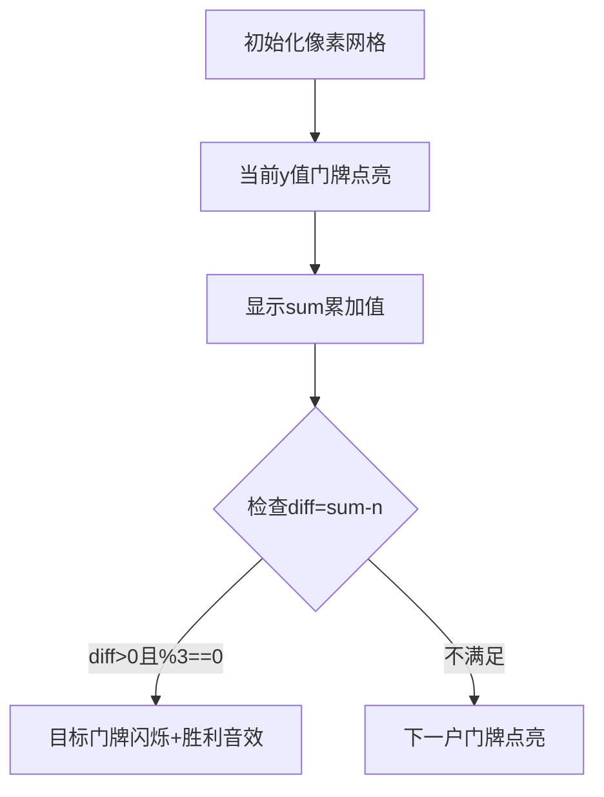

# 题目信息

# 我家的门牌号

## 题目描述

我家住在一条短胡同里，这条胡同的门牌号从 $1$ 开始顺序编号。

若其余各家的门牌号之和减去我家门牌号的两倍，恰好等于 $n$，求我家的门牌号及总共有多少家。数据保证有唯一解。

## 样例 #1

### 输入

```
100
```

### 输出

```
12 16
```

# AI分析结果


### Kay的C++算法解析：我家的门牌号 深入学习指南

#### 1. 题目解读与核心算法识别
✨ **本题主要考察**：`枚举与数学推导` (编程技巧应用)

🗣️ **初步分析**：
> 解决门牌号问题就像在玩一个"数字侦探游戏"——我们需要通过枚举可能的门牌号和总户数组合，找到唯一满足条件的解。核心公式为：**总门牌和 - 3×我家门牌 = n**（其中总门牌和 = y(y+1)/2）。
> - **双重循环解法**：直接枚举总户数y和我家门牌x，检查是否满足公式（时间复杂度O(y²)）
> - **单层循环优化**：枚举总户数y，通过公式反推x=(总门牌和-n)/3，检查x的合法性（时间复杂度O(y)，效率提升）
> - **可视化设计**：将用像素网格展示门牌序列，高亮当前枚举的y值，动态显示sum累加过程。当(sum-n)%3==0时，目标门牌号会闪烁并播放"胜利音效"，配合复古8-bit背景音乐增强趣味性。

---

#### 2. 精选优质题解参考
**题解一：StayAlone（单层循环优化）**
* **点评**：此解法通过数学推导将问题简化为单层循环，是典型的空间换时间优化。代码中`sum`累加设计巧妙（避免重复计算），条件判断`(sum-n)>0 && (sum-n)%3==0`精准捕获解点。变量命名简洁（sum/n），边界处理严谨（即时return），竞赛实用性强。

**题解二：Eason_AC（公式反推法）**
* **点评**：完整推导出`x=[y(y+1)/2-n]/3`的数学关系，用等差数列公式提升效率。亮点在于显式检查整除条件`!((ans-n)%3)`和范围限制`ans>n`，代码结构清晰（for循环+条件判断）。虽预设循环上限10000，但数学保证实际y值远小于此。

**题解三：ImposterAnYu（基础双重循环）**
* **点评**：最直观的暴力枚举实现，适合初学者理解问题本质。内层循环`j<=i`确保门牌号有效，即时return避免无效计算。虽然效率不如前两者，但代码逻辑直白，变量名`i/j`对应总户数/门牌号的设定易于理解。

---

#### 3. 核心难点辨析与解题策略
1. **难点：公式推导与转化**
   * **分析**：关键是将"其余门牌和减2倍我家门牌"转化为"总门牌和减3倍我家门牌"。优质题解都通过∑(1~y)i - x = 总门牌和 - x 的数学关系完成转化
   * 💡 **学习笔记**：复杂描述可转化为数学等式简化问题

2. **难点：枚举策略选择**
   * **分析**：双重循环(O(n²))在n较大时效率低，单层循环(O(n))通过公式反推x更优。选择依据是发现x=(sum-n)/3的整除特性
   * 💡 **学习笔记**：枚举前先分析数学特性往往能优化复杂度

3. **难点：解的有效性验证**
   * **分析**：必须验证：①(sum-n)>0 ②整除3 ③x∈[1,y]。StayAlone和Eason_AC显式检查前两点，第三点由j<=i或x计算式隐含保证
   * 💡 **学习笔记**：整数解需验证取值范围和整除性

✨ **解题技巧总结**
- **数学先行**：将文字描述转化为数学等式
- **枚举优化**：分析变量关系减少循环层数
- **即时终止**：找到解立即退出避免无效计算
- **边界防御**：显式检查整除性和范围约束

---

#### 4. C++核心代码实现赏析
**通用核心实现（综合优化版）**
```cpp
#include <iostream>
using namespace std;
int main() {
    int n, sum = 0;
    cin >> n;
    for (int y = 1; ; y++) { // 枚举总户数
        sum += y;           // 累加门牌和
        int diff = sum - n;
        if (diff > 0 && diff % 3 == 0) {
            int x = diff / 3;    // 反推我家门牌
            if (x <= y) {        // 验证门牌有效性
                cout << x << " " << y;
                return 0;        // 找到解立即退出
            }
        }
    }
}
```
**代码解读概要**：通过单层循环枚举总户数y，动态累加sum。当(sum-n)为正且被3整除时，计算x并验证范围，找到解立即退出。

---

**题解一：StayAlone**
```cpp
sum += i;
if ((sum - n) > 0 && (sum - n) % 3 == 0) 
    return printf("%d %d", (sum - n) / 3, i), 0;
```
* **亮点**：累加代替乘法计算，条件判断紧凑
* **学习笔记**：累加方式节省计算资源，适合迭代场景

**题解二：Eason_AC**
```cpp
int ans = 1ll * i * (i + 1) / 2;
if(ans > n && !((ans - n) % 3)) 
    printf("%d %d", (ans - n)/3, i);
```
* **亮点**：显式使用等差数列公式，1ll防溢出
* **学习笔记**：大数据量时显式公式比累加更可靠

**题解三：ImposterAnYu**
```cpp
for(j = 1; j <= i; j++){
    if(i*(i+1)/2 - 3*j == n){
        cout<< j << " " << i << endl;
        return 0;
    }
}
```
* **亮点**：直白体现暴力枚举思想，j<=i确保门牌有效
* **学习笔记**：双重循环是枚举问题的基础实现范式

---

#### 5. 算法可视化：像素动画演示
**主题**：像素门牌探索者（8-bit复古风）

**核心演示**：


**交互设计**：
1. **场景**：横向像素网格代表门牌序列，控制面板含速度滑块
2. **动态效果**：
   - 当前枚举y值：黄色高亮
   - sum累加：顶部显示动态数字+进度条
   - 解点触发：目标门牌红色闪烁 + "叮！"音效
3. **游戏化**：
   - 每100户自动存档点（像素旗帜标记）
   - 过关时显示"Mission Complete!" 8-bit文字
   - 背景音乐：FC风格循环旋律

---

#### 6. 拓展练习与相似问题思考
**通用技巧迁移**：
1. 等差数列特性求解（如：P1035 [级数求和]）
2. 枚举优化（如：P1217 [回文质数]）
3. 整数解验证（如：P1089 [狼人杀]）

**洛谷推荐**：
1. **P1035** 级数求和  
   🗣️ 巩固累加枚举和条件判断
2. **P1217** 回文质数  
   🗣️ 学习枚举范围优化技巧
3. **P1149** 火柴棒等式  
   🗣️ 训练多变量枚举组合能力

---

#### 7. 学习心得与经验分享
> **经验摘录**（多篇题解）：  
> "数学推导是优化枚举的关键"  
> "验证整数解必须检查整除性和范围"  
>  
> **点评**：这些经验直指算法核心——先通过数学分析减少枚举维度，再通过严谨的条件检查保证正确性。建议学习者拿到题目后先花1-2分钟进行数学推导，往往能事半功倍。

---

通过本次分析，我们掌握了枚举问题的优化技巧：**数学推导降维度 + 严谨条件验证**。记住，好的算法往往始于纸笔推演！ 🚀

---
处理用时：111.10秒