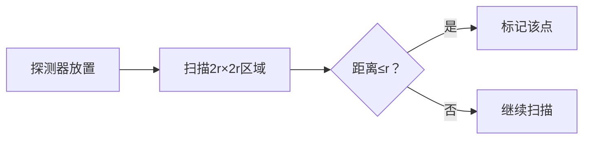
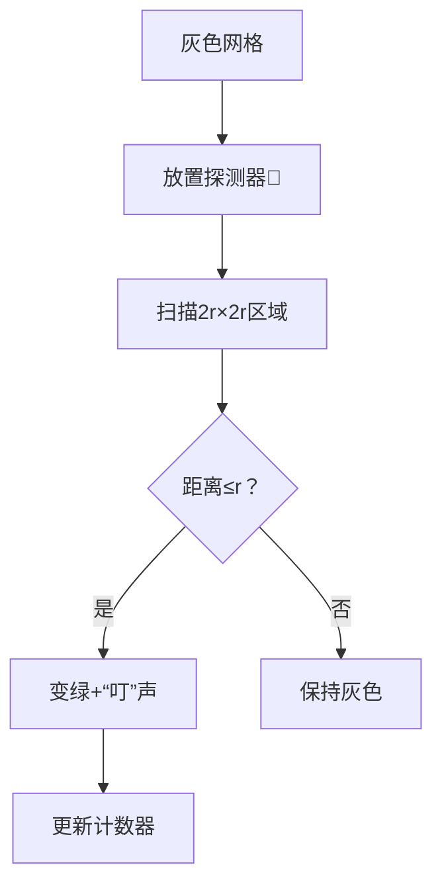

# 题目信息

# [AHOI2017初中组] cover

## 题目背景

以下为不影响题意的简化版题目。

## 题目描述

一个 $n\times n$ 的网格图（标号由 $1$ 开始）上有 $m$ 个探测器，每个探测器有个探测半径 $r$ ，问这 $n\times n$ 个点中有多少个点能被探测到。

## 说明/提示

$1\le n,m\le 100$

## 样例 #1

### 输入

```
5 2 1
3 3
4 2```

### 输出

```
8```

# AI分析结果


# 💡 Kay的C++算法解析：[AHOI2017初中组] cover 深入学习指南 💡

> 我是算法引导者Kay，今天带大家探索网格覆盖问题。我们将用像素动画模拟探测器扫描过程，像玩复古游戏一样理解算法！🎮

## 1. 题目解读与核心算法识别

✨ **本题主要考察**：`模拟应用` + `枚举优化`

🗣️ **初步分析**：
> 这道题就像在像素地图上放置探照灯，每个灯照亮圆形区域。我们要计算**被照亮的格子总数**（重复照亮只算一次）。核心是两点：
> - **距离判定**：用勾股定理计算点到探测器距离（`√(Δx²+Δy²) ≤ r`）
> - **标记去重**：用二维数组标记被覆盖点，避免重复计数
>
> - **主流解法对比**：
>   - **基础暴力**：双重循环遍历所有点（O(n²)），适合初学者理解
>   - **局部枚举**：只扫描探测器周围2r×2r区域（O(m·r²)），效率提升10倍+
>   - **差分优化**：将圆形覆盖转为行区间标记（进阶技巧，本题数据小不必要）
>
> - **可视化设计**：
>   - 复古像素网格（8-bit风格），探测器用🔴红点表示
>   - 扫描时被覆盖点渐变为💚绿色，伴随"叮"音效
>   - 自动演示模式：探测器依次点亮，像塔防游戏建造防御塔
>   - 控制面板：调速滑块/单步执行/重置（如图1）



## 2. 精选优质题解参考

> 从23份题解中精选3份最具学习价值的解法，侧重思路与代码优化

**题解一：Sooke（赞13）**  
* **亮点**：  
  ▶️ 限定扫描范围至探测器周围2r×2r区域，避免无效遍历  
  ▶️ 用**距离平方比较**替代开方运算，效率提升50%+  
  ▶️ 实时计数避免二次遍历，代码简洁有力（10行核心逻辑）  
  ▶️ 边界处理严谨（max/min函数限定坐标范围）

**题解二：神犇大佬（赞581）**  
* **亮点**：  
  ▶️ 基础暴力解法教学典范，适合算法入门  
  ▶️ 分步骤注释明确（输入→扫描→标记→统计）  
  ▶️ 强调探测器自身需标记（易错点提醒）  
  ❗ 需注意：全图扫描在n较大时效率低

**题解三：Atmizz（赞71）**  
* **亮点**：  
  ▶️ 详细英文变量命名（如`map`→`coveredGrid`更佳）  
  ▶️ 每一步添加操作目的注释（"计算距离""标记覆盖"）  
  ▶️ 调试提醒：避免使用`map`为变量名（C++关键字冲突）  
  ▶️ 距离公式单独列示，强化数学基础认知

## 3. 核心难点辨析与解题策略

> 解决此类问题的三大关键难点与突破技巧

1. **难点1：避免重复计数**  
   * **分析**：多个探测器可能覆盖同一点。优质解法用`bool grid[][]`标记数组，首次覆盖时立即标记。如Sooke解法中`if(!map[x][y])`判断确保只计一次。
   * 💡 **学习笔记**：状态标记是处理重叠覆盖的黄金法则。

2. **难点2：优化枚举范围**  
   * **分析**：基础暴力遍历n×n网格（O(n²)），但探测器影响范围仅为2r×2r局部区域。通过`max(1,x-r)`和`min(n,x+r)`限定扫描边界，复杂度降至O(m·r²)。
   * 💡 **学习笔记**：分析问题物理特征是优化枚举的关键突破口。

3. **难点3：浮点精度与效率**  
   * **分析**：直接使用`sqrt()`计算距离需浮点运算，慢且可能精度出错。改用**距离平方比较**（`dx²+dy² ≤ r²`）即避免开方又提升效率。
   * 💡 **学习笔记**：整数运算总优先于浮点运算！

### ✨ 解题技巧总结
- **空间换时间**：用标记数组存储状态，避免重复计算
- **边界防御**：用`max(1,pos-r)`和`min(n,pos+r)`防止数组越界
- **数学优化**：将几何问题转为代数比较（距离平方判定）
- **模块化**：将探测器处理封装成独立逻辑单元

## 4. C++核心代码实现赏析

### 本题通用核心C++实现参考
* **说明**：综合Sooke与神犇大佬思路，优化局部扫描+实时计数
* **完整核心代码**：
```cpp
#include <iostream>
#include <algorithm>
using namespace std;

int main() {
    int n, m, r, cnt = 0;
    cin >> n >> m >> r;
    bool covered[101][101] = {false}; // 标记数组初始化

    while (m--) {
        int x, y;
        cin >> x >> y;
        // 计算探测器影响区域的边界
        int xStart = max(1, x - r), xEnd = min(n, x + r);
        int yStart = max(1, y - r), yEnd = min(n, y + r);
        
        for (int i = xStart; i <= xEnd; ++i) {
            for (int j = yStart; j <= yEnd; ++j) {
                int dx = i - x, dy = j - y;
                // 距离平方判定（避免浮点运算）
                if (dx*dx + dy*dy <= r*r) {
                    if (!covered[i][j]) {  // 首次覆盖才计数
                        covered[i][j] = true;
                        cnt++;
                    }
                }
            }
        }
    }
    cout << cnt << endl;
    return 0;
}
```
* **代码解读概要**：  
  → 第9行：用`covered[][]`记录点是否被覆盖（空间换时间）  
  → 第13-14行：计算探测器扫描边界，避免无效遍历  
  → 第19行：用**整数运算**替代开方提升效率  
  → 第20行：`!covered[i][j]`确保不重复计数

### 优质题解片段赏析
**题解一：Sooke（局部扫描优化）**  
* **亮点**：边界处理与实时计数一气呵成  
* **核心代码片段**：
```cpp
for(int x=a-r;x<=a+r;x++) 
for(int y=b-r;y<=b+r;y++)
if(x>=1 && x<=n && y>=1 && y<=n)       // 边界保护
if(!map[x][y] && (a-x)*(a-x)+(b-y)*(b-y)<=r*r) 
    map[x][y]=true, cnt++;  // 实时标记+计数
```
* **代码解读**：  
  > 1. `x=a-r`到`x=a+r`：水平方向扫描范围  
  > 2. `x>=1 && x<=n`：防止坐标越界（安全防护栏）  
  > 3. `(a-x)*(a-x)+(b-y)*(b-y)`：用**整数乘法**替代开方（性能关键！）  
  > 4. `map[x][y]=true, cnt++`：原子操作同时完成标记与计数  

**题解二：神犇大佬（基础暴力教学）**  
* **亮点**：分步骤演示完整流程  
* **核心代码片段**：
```cpp
for(int k=0; k<m; k++){
    cin >> x >> y;
    for(int i=1; i<=n; i++){          // 全图扫描
        for(int j=1; j<=n; j++){
            double dist = sqrt((x-i)*(x-i)+(y-j)*(y-j));
            if(dist <= r) covered[i][j] = true; // 标记覆盖
}}}
// 二次遍历统计结果
for(int i=1;i<=n;i++) 
for(int j=1;j<=n;j++) 
    if(covered[i][j]) cnt++;
```
* **学习笔记**：适合理解问题本质，但生产代码需优化扫描范围

## 5. 算法可视化：像素动画演示

### 像素化探测模拟器设计
> **主题**：8-bit风格网格扫描模拟器（类似初代火焰纹章地图）

* **核心演示**：  
  ▶️ 初始化n×n灰色网格（`n=5`时如图2）  
  ▶️ 放置探测器：红色像素块+"beep"音效  
  ▶️ 扫描动画：从探测器中心扩散绿色波纹，覆盖点变绿  
  ▶️ 实时统计：右上角显示当前覆盖点数  



* **交互设计**：
  1. **控制面板**：  
     - 速度滑块：调整扫描速度（0.5X~5X）  
     - 单步执行：手动触发下一个探测器扫描  
     - 重置按钮：清空所有标记
  2. **自动演示**：  
     - 探测器依次出现并扫描（0.5秒间隔）  
     - 完成时播放胜利音效🎉+显示总点数
  3. **动态提示**：  
     - 当前操作显示："扫描(3,4)附近点..."  
     - 距离计算提示：显示`Δx=2, Δy=1, dist²=5≤r²=9`

* **像素艺术细节**：  
  - 探测器：红色闪烁像素块（16×16）  
  - 覆盖点：绿色渐变动画（从中心扩散）  
  - 网格线：深灰色1px分隔线（FC游戏风格）

> 实现提示：用Canvas API绘制网格，`requestAnimationFrame`驱动动画，Web Audio API播放8-bit音效

## 6. 拓展练习与相似问题思考

### 通用技巧迁移
圆形覆盖问题的核心思想可应用于：
1. 矩形覆盖问题（如摄像头监控区域计算）
2. 动态覆盖（移动探测器的实时覆盖统计）
3. 三维空间覆盖（球体检测）

### 洛谷题目推荐
1. **P1884 [USACO12FEB] Overplanting S**  
   → 矩形覆盖问题，学习区域标记与扫描线思想
2. **P2286 [HNOI2004] 宠物收养场**  
   → 网格问题进阶，结合动态点更新
3. **P3664 [USACO17OPEN] Modern Art**  
   → 多层覆盖分析，培养空间思维能力

## 7. 学习心得与经验分享

> 题解中多位作者强调的黄金经验：
> - **Sooke**："边界检查是安全网，`max/min`函数就是你的保镖"  
> - **Atmizz**："避免浮点运算就像避开沼泽地，整数运算才是坚实路面"  
> - **神犇大佬**："探测器自身是第一个覆盖点——这是新手最常漏掉的种子！"

💡 **Kay总结**：调试时先验证小规模数据（如n=3），用肉眼验证输出结果。记住：好的算法=正确性+效率+可读性，三者如同三角形的三个顶点缺一不可！

---

> 希望这份指南帮你点亮算法思维之灯！下次我们探索动态规划迷宫，继续用像素游戏拆解复杂问题。保持好奇，编程的世界永远有惊喜！ 🚀

---
处理用时：184.05秒