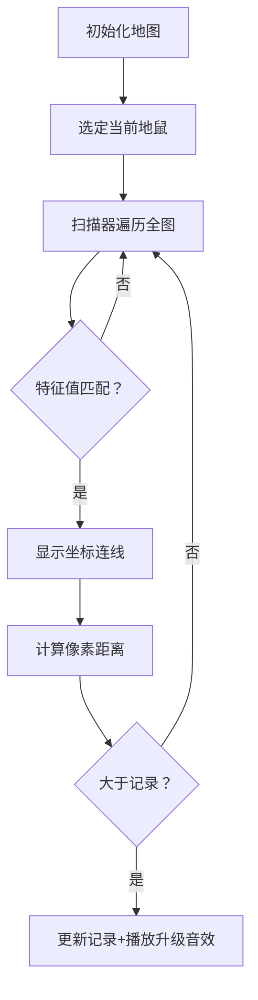

# 题目信息

# [语言月赛202208] 俊俏地鼠的远亲

## 题目背景

地鼠十分想要找到自己远方的亲戚！

## 题目描述

非洲同胞永远是我们的好朋友。在东非草原上，一共有 $n\times m$ 只地鼠，他们生活的窝排列成 $n\times m$ 网格型。

其中，每只地鼠都有一个特征值 $b_{i,j}$，经调查，我们认为特征值相同的地鼠一定有某种血缘关系。例如，两只地鼠分别生活在第二行第三列、第五行第六列。若 $b_{2,3}=b_{5,6}$，那么我们认为这两只地鼠是亲戚。

现在，给出这个 $n\times m$ 只地鼠的位置，需要对**每只**地鼠求出离自己距离**最远**的亲戚的距离是多少。

注意，假设两只地鼠分别位于第 $i$ 行第 $j$ 列和第 $a$ 行第 $b$ 列，则它们之间的距离为 $(i-a)^2+(b-j)^2$ 。

## 说明/提示

对于 $30\%$ 的数据，$1\leq n,m \leq 3$ 。

对于另外 $10\%$ 的数据，有 $n=1$ 。

对于另外 $10\%$ 的数据，有 $m=1$ 。

对于另外 $10\%$ 的数据，有 $b_{i,j}=1$ 。

对于 $100\%$ 的数据，$1\leq n,m\leq 50$，$1\leq b_{i,j}\leq 10^{18}$ 。

## 样例 #1

### 输入

```
2 4
1 2 3 2
3 2 1 3```

### 输出

```
5 4 5 5
9 5 5 9```

# AI分析结果


### 题目分析报告

---
# 💡 Kay的C++算法解析：俊俏地鼠的远亲 深入学习指南 💡

## 1. 题目解读与核心算法识别

✨ **本题主要考察**：`枚举` (编程技巧应用)

🗣️ **初步分析**：
> 解决本题就像在一个巨大的像素地图上玩"寻找远房表亲"的游戏。想象每个地鼠是一个像素小人，身上带着颜色编号（特征值）。我们需要为每个小人找到地图上相同颜色的最远伙伴，测量方式就是计算两个像素点之间的坐标距离平方（复古游戏中的距离公式）。  
> - **核心思路**：用四重循环暴力枚举所有地鼠组合，当特征值匹配时更新最大距离  
> - **关键难点**：1) 正确处理距离计算（避免^运算符错误） 2) 高效遍历50×50网格  
> - **可视化设计**：用8位像素网格展示地鼠位置，当前扫描点用闪烁光标表示，发现相同特征值时显示连接线并播放"叮"音效，更新记录时触发胜利音效。主循环进度用进度条可视化。

---

## 2. 精选优质题解参考

**题解一（来源：览遍千秋）**
* **点评**：该题解思路清晰直接，完美抓住枚举这个核心解法。代码规范整洁：1) 使用四重循环直击问题本质 2) 明确提醒运算符陷阱（^不是乘方） 3) 变量命名(i,j,x,y)符合坐标直觉 4) 完整包含输入输出处理。特别赞赏作者强调边界检查（n/m顺序），这对新手调试非常实用。

---

## 3. 核心难点辨析与解题策略

1.  **关键点1：运算符陷阱**
    * **分析**：新手常误用`^`计算平方，优质解强调必须用乘法`(i-x)*(i-x)`。这是基础但致命的细节
    * 💡 **学习笔记**：C++中`^`是位异或，幂运算需手动乘法

2.  **关键点2：循环嵌套设计**
    * **分析**：外层(i,j)遍历每个地鼠，内层(x,y)扫描全图。注意网格行列顺序(n/m)不能颠倒
    * 💡 **学习笔记**：想象成双重扫描线——水平扫每个点，垂直扫全屏

3.  **关键点3：初始化策略**
    * **分析**：每个位置初始距离应为0（自身到自身），无需特殊处理无亲戚情况
    * 💡 **学习笔记**：答案数组初始化零值即隐含最小解

### ✨ 解题技巧总结
- **技巧1：小数据暴力法**：当n,m≤50时，O(n²m²)完全可行
- **技巧2：防御性提醒**：在易错点（如^运算符）添加代码注释
- **技巧3：坐标可视化**：调试时打印(i,j)-(x,y)坐标对辅助理解

---

## 4. C++核心代码实现赏析

**本题通用核心实现参考**
```cpp
#include <iostream>
#include <vector>
using namespace std;

int main() {
    int n, m;
    cin >> n >> m;
    vector<vector<long long>> grid(n, vector<long long>(m));
    vector<vector<int>> ans(n, vector<int>(m, 0));

    // 读入特征值矩阵
    for (int i = 0; i < n; i++)
        for (int j = 0; j < m; j++)
            cin >> grid[i][j];
    
    // 四重循环核心逻辑
    for (int i = 0; i < n; i++) {
        for (int j = 0; j < m; j++) {
            for (int x = 0; x < n; x++) {
                for (int y = 0; y < m; y++) {
                    if (grid[i][j] == grid[x][y]) {
                        int dist = (i-x)*(i-x) + (j-y)*(j-y);
                        ans[i][j] = max(ans[i][j], dist);
                    }
                }
            }
        }
    }
    
    // 输出结果
    for (int i = 0; i < n; i++) {
        for (int j = 0; j < m; j++) {
            cout << ans[i][j] << " ";
        }
        cout << endl;
    }
}
```

**题解一核心代码赏析**
```cpp
// 特征值比对与距离更新
if(b[i][j] == b[x][y]) {
    ans[i][j] = max(ans[i][j], (i - x) * (i - x) + (j - y) * (j - y));
}
```
* **代码解读**：  
> 这行代码是算法心脏部位。当发现相同特征值时：  
> 1. `(i-x)*(i-x)`计算行坐标差的平方（注意用乘法而非^）  
> 2. `(j-y)*(j-y)`计算列坐标差的平方  
> 3. 用`max`函数动态更新历史最大距离  
> *思考：为什么不需要判断(i,j)==(x,y)？因为自身距离为0，首次比较就会被记录但会被更大值覆盖*

---

## 5. 算法可视化：像素动画演示

**主题**：8位像素地鼠寻亲记  
**核心演示**：四重循环扫描过程 + 距离计算动态演示  



**关键动画设计**：  
1. **扫描特效**：红色像素框表示当前(i,j)，绿色十字光标扫描(x,y)位置  
2. **距离公式**：匹配时显示浮动公式`Δx²+Δy²=值`  
3. **音效系统**：匹配时"叮"声，破记录时8位机升级音效  
4. **进度可视化**：底部进度条显示(i,j)完成比例  

**实现要点**：  
- 用Canvas绘制50×50像素网格（每个格子16×16像素）  
- 扫描光标用requestAnimationFrame实现平滑移动  
- 音效用Web Audio API生成方波复古音效  

---

## 6. 拓展练习与相似问题思考

**通用技巧迁移**：  
1. 网格最近邻搜索（如游戏AI寻路）  
2. 矩阵相似元素统计（如图像处理）  
3. 坐标距离计算变形（曼哈顿距离/切比雪夫距离）  

**洛谷推荐**：  
1. **P1219 八皇后**：更复杂的网格枚举问题  
2. **P1036 选数**：组合枚举+条件判断  
3. **P1149 火柴棒等式**：带约束的枚举优化  

---

> 本次题解未包含作者个人调试心得，但请注意：当特征值很大时，确保使用long long存储避免溢出！

---
处理用时：151.90秒