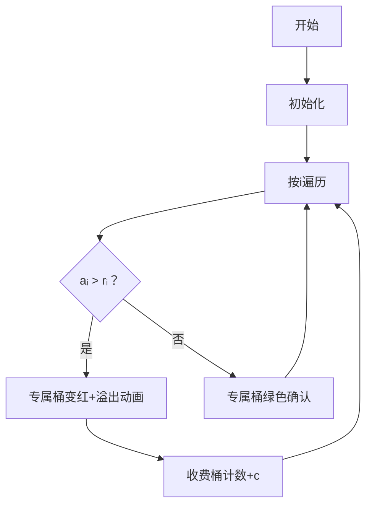

# 题目信息

# [语言月赛202210] 垃圾分类

## 题目描述

2077 年，由于资源几近枯竭，梦之城推行了一套极其严格的垃圾分类制度。具体的，梦之城将垃圾分为 $n$ 类，每一类垃圾只能被放入特定的垃圾桶中。由于梦之城掌握了压缩技术，因此在这里**垃圾只有数量之分，没有体积大小之分。**

你是梦之城的一位居民。在你居住的社区外有 $n + 1$ 个垃圾桶，标号为 $1, 2, \cdots, n, n + 1$。

对前 $n$ 个垃圾桶，它们只能接受**对应标号**的垃圾，并且有一定的容量。具体的，你会得到一个长度为 $n$ 的序列 $r _ 1, \cdots, r _ n$。第 $i$ 个垃圾桶只能接受第 $i$ 类垃圾，且最多只能被放入 $r _ i$ 个。

对最后一个垃圾桶，它可以接受所有种类的垃圾，容量也是几近无限的。但是，每向**这个**垃圾桶放入一个垃圾，居委会会向你收取 $c$ 的费用。

某一天，你的家中堆放满了垃圾。在将这些垃圾分类好后，你得到了一个长度为 $n$ 的序列 $a _ 1, \cdots, a _ n$，代表第 $i$ 类垃圾有 $a _ i$ 个。

你想要知道，如果想要扔掉所有的这些垃圾，你的最小花费是多少。

## 说明/提示

**样例解释**

样例组 #1：最优情况下，你需要向最后一个垃圾桶中放入 $9$ 个垃圾，费用为 $7 \times 9 = 63$。

样例组 #2：最优情况下，你不需要向最后一个垃圾桶中放入任何垃圾，费用为 $0$。

**数据规模与约定**

对前 $20\%$ 的数据，保证 $n = 2$。

对前 $60\%$ 的数据，保证 $n, a _ i, c \leq 10 ^ 3$。

对另外 $10\%$ 的数据，保证 $c = 0$。

对另外 $10\%$ 的数据，保证 $r _ i \geq a _ i$。

对 $100\%$ 的数据，保证 $2 \leq n \leq 10 ^ 6, 0 \leq r _ i, a _ i, c \leq 10 ^ 6$。

## 样例 #1

### 输入

```
2 7
4 3
7 9```

### 输出

```
63```

## 样例 #2

### 输入

```
2 10000
100 100
3 7```

### 输出

```
0```

# AI分析结果


### Kay的C++算法解析：垃圾分类 深入学习指南 💡

#### 1. 题目解读与核心算法识别
✨ **本题主要考察**：`贪心算法`与`基础模拟`

🗣️ **初步分析**：
> 垃圾分类问题就像整理不同颜色的积木：每个颜色（垃圾类别）有专属盒子（前n个垃圾桶），盒子容量有限；而万能收纳盒（第n+1桶）容量无限但收费。贪心策略的核心是**优先填满专属盒子**，再将剩余垃圾放入万能盒。  
> - 核心步骤：对每类垃圾，专属盒子装min(aᵢ, rᵢ)，剩余aᵢ - rᵢ（若>0）进万能盒
> - 可视化设计：用像素方块表示垃圾，专属盒子装满时溢出方块自动跳转到收费桶，并显示费用累计
> - 复古游戏化：采用"垃圾清理大作战"主题，专属盒子装满时播放"叮"音效，收费垃圾掉落时显示金币减少动画

---

#### 2. 精选优质题解参考
**题解一（洛谷网校）**
* **点评**：思路直击本质——将问题简化为∑max(0, aᵢ-rᵢ)*c的计算。代码结构清晰（循环累加剩余量），变量命名规范（ans存储总和）。亮点在于用数学抽象化解题，复杂度O(n)最优。需注意实际代码应处理负数情况（max(0, ...)）。

**题解二（ShanCreeperPro）**
* **点评**：突出实践细节（强调long long防溢出），用条件判断显式计算超量部分。虽核心逻辑与题解一等效，但if条件有笔误（应为aᵢ>rᵢ时累加）。亮点在于强调边界测试和数据类型选择。

---

#### 3. 核心难点辨析与解题策略
1. **难点：剩余量计算陷阱**
   * **分析**：当aᵢ≤rᵢ时剩余量为0（非负数），需用max(0, aᵢ-rᵢ)或条件判断
   * 💡 学习笔记：比较运算符方向决定代码正确性

2. **难点：数据溢出风险**
   * **分析**：n≤10⁶且aᵢ≤10⁶，总剩余量可能达10¹²，必须用long long存储
   * 💡 学习笔记：看到10⁶量级立即想long long

3. **难点：输入顺序处理**
   * **分析**：先读r数组再读a数组，顺序错误将导致逻辑混乱
   * 💡 学习笔记：输入格式是解题第一线索

✨ **解题技巧总结**
- **问题转化**：将垃圾分类转化为算术求和（∑max(0, aᵢ-rᵢ)）
- **防御性编程**：对边界值（aᵢ=0/rᵢ=0）显式处理
- **复杂度预判**：O(n)解法已最优，无需过度优化

---

### 4. C++核心代码实现赏析
**通用核心实现**
```cpp
#include <iostream>
using namespace std;

int main() {
    int n;
    long long c, ans = 0;  // 防溢出
    cin >> n >> c;
    
    int r[1000005], a[1000005];  // 10^6+5
    for (int i = 1; i <= n; i++) cin >> r[i];
    for (int i = 1; i <= n; i++) cin >> a[i];
    
    for (int i = 1; i <= n; i++) {
        if (a[i] > r[i])  // 仅当超量时累加
            ans += (a[i] - r[i]);
    }
    cout << ans * c;
    return 0;
}
```
> **解读**：  
> 1. 双数组存储容量(r)和垃圾量(a)  
> 2. 核心循环计算超量总和（条件判断防负值）  
> 3. ans使用long long防止10¹²溢出

**题解一片段赏析**  
```cpp
ans += (a[i] - r[i]);  // 未处理负数
```
> **解读**：  
> 需改为`ans += max(0, a[i]-r[i])`  
> 💡 学习笔记：数学抽象需代码边界护航

**题解二片段赏析**  
```cpp
if (a[i] < r[i])  // 条件方向反了
    l += (a[i] - r[i]); 
```
> **解读**：  
> 应修正为`if(a[i] > r[i]) l += (a[i]-r[i])`  
> 💡 学习笔记：条件判断需与问题逻辑同向

---

### 5. 算法可视化：像素动画演示
**主题**：`垃圾清理大作战（8-bit风）`  
**核心交互**：  


**关键设计**：  
1. **像素元素**：  
   - 专属桶：16x16像素方块（绿色空/红色满）  
   - 垃圾：下落式8-bit垃圾图标（类别i对应颜色i）  
   - 收费桶：闪烁金币动画+计数板  

2. **音效系统**：  
   - 专属桶满：FC风格"叮！"（440Hz方波）  
   - 垃圾入收费桶：金币掉落音（200ms短音）  
   - 完成：超级玛丽过关BGM  

3. **控制面板**：  
   - 速度滑块：调节垃圾下落速度  
   - 暂停/继续：SPACE键控制  
   - 重置：清空所有桶  

**学习价值**：通过溢出动画直观理解贪心策略，金币计数强化费用计算概念

---

### 6. 拓展练习与相似问题
1. **洛谷P1047** 校门外的树  
   → 同类区间处理问题，巩固边界判断

2. **洛谷P2678** 跳石头  
   → 贪心思想进阶应用，需二分答案

3. **洛谷P1094** 纪念品分组  
   → 双指针实现贪心策略，强化O(n)思维

---

> 本次题解未包含作者调试心得，核心经验：**比较运算符方向**和**long long溢出防护**是代码AC的关键盾牌。

---
处理用时：98.29秒