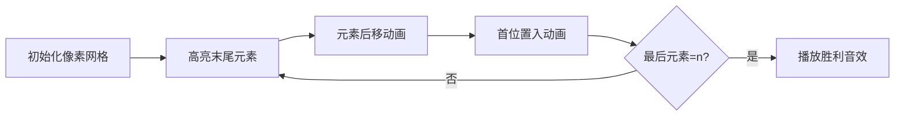

# 题目信息

# [语言月赛202212] 旋转排列

## 题目背景

我们称一个数列 $p$ 是一个长度为 $n$ 的排列，当且仅当 $p$ 满足如下条件：

1. $p$ 的长度为 $n$；
2. $1, 2, 3, \dots n$ 这 $n$ 个数在 $p$ 中均**恰好**出现一次。

## 题目描述

对于一个排列 $p$，定义一次“shift”操作是指：将 $p$ 里的每一个数字都依次向后移动一位，并把 $p$ 的最后一个数字移动到开头去。

例如，若排列 $p$ 初始时为 $[1,4,2,3]$，则“shift”一次以后将变为 $[3,1,4,2]$。

现在，给定一个长度为 $n$ 的排列 $p$，请你按照如下规定循环操作：
1. 对当前的排列 $p$ 做一次“shift”操作；
2. 输出本次“shift”以后的排列 $p$；
3. 判断排列 $p$ 的最后一个数字是否是 $n$，如果是，则结束循环操作；否则回到 $1$ 继续操作。

提示：**请严格按照题目给出的顺序进行循环操作。**

## 说明/提示

### 样例 2 解释

对 $p = [1, 2, 3]$，按如下顺序进行循环操作：

1. 进行一次“shift”操作，$p$ 变为 $[3,1,2]$；
2. 输出当前的排列 $p$，故输出第一行为 `3 1 2`；
3. 判断 $p_3 = 2 \neq 3$，故继续循环操作；
4. 进行一次“shift”操作，$p$ 变为 $[2,3,1]$；
5. 输出当前的排列 $p$，故输出第二行为 `2 3 1`；
6. 输出判断 $p_3 = 1 \neq 3$，故继续循环操作；
7. 进行一次“shift”操作，$p$ 变为 $[1,2,3]$；
8. 输出当前的排列 $p$，故输出第二行为 `1 2 3`；
9. 输出判断 $p_3 = 3 =3$，故停止循环；

### 数据规模与约定

各测试点的信息如下表：
| 测试点编号 | $n = $ | 特殊约定 |
| :-: | :-: | :-: |
| $1$ | $1$ | 无|
| $2$ | $2$ | 无 |
| $3$ | $3$ | 无 |
| $4 \sim 6$ | $2000$ | $p_{n - 1} = n$ |
| $7 \sim 10$ | $2000$ | 无 |

对全部的测试点，保证 $1 \leq p_i \leq n \leq 2000$，$p$ 是长度为 $n$ 的排列。

By 一扶苏一

## 样例 #1

### 输入

```
4
1 4 2 3```

### 输出

```
3 1 4 2
2 3 1 4```

## 样例 #2

### 输入

```
3
1 2 3```

### 输出

```
3 1 2
2 3 1
1 2 3```

## 样例 #3

### 输入

```
10
1 7 6 5 8 4 3 9 10 2```

### 输出

```
2 1 7 6 5 8 4 3 9 10```

# AI分析结果


### 题目分析报告：旋转排列

---

#### 💡 Kay的C++算法解析：旋转排列 深入学习指南 💡

**引言**  
今天我们一起分析"旋转排列"这道C++编程题。题目要求对一个排列进行循环移位操作（shift），每次移位后输出当前排列，直到排列的最后一个元素为最大值n时停止。本指南将帮助大家理解模拟类问题的解法核心。

---

### 1. 题目解读与核心算法识别

✨ **本题主要考察**：`模拟应用`  

🗣️ **初步分析**：  
> 解决旋转排列的关键在于**精确模拟题目描述的移位操作流程**。就像玩"俄罗斯方块"时移动方块一样，我们需要把数组的最后一个元素移到开头，其余元素依次后移一位。  
> - **核心思路**：使用临时变量保存最后一个元素，倒序移动数组元素，最后将临时变量放入首位  
> - **难点**：正确实现移位操作和循环终止条件，避免数组覆盖错误  
> - **可视化设计**：采用8位像素风格展示数组元素移动过程，高亮当前移动元素和变化位置  
> - **复古游戏化**：添加方块移动音效，每次移位后数组显示在像素网格中，当最后元素=n时播放胜利音效  

---

### 2. 精选优质题解参考

**题解一（来源：一扶苏一）**  
* **点评**：  
  思路清晰直白，将移位操作分解为三步：保存末尾→后移元素→首位赋值。代码规范使用`p[1]`到`p[n]`的索引，变量名`temp`含义明确。采用do-while循环完美匹配"先执行后判断"的题目要求。输出部分使用`" \n"[i==n]`技巧优雅处理行末空格问题，是值得学习的竞赛级代码实践。

---

### 3. 核心难点辨析与解题策略

1. **难点：移位操作的覆盖问题**  
   * **分析**：直接移动元素会导致数据丢失。如题解所示，必须先用`temp`保存`p[n]`，再倒序移动元素（从后往前），最后填充首位
   * 💡 **学习笔记**：数组操作中，"从后向前"移动常能避免数据覆盖问题

2. **难点：循环控制的选择**  
   * **分析**：题目要求至少执行一次移位。题解使用do-while确保先移位再判断`p[n]==n`，比while循环更符合题意
   * 💡 **学习笔记**：当操作必须执行至少一次时，优先考虑do-while结构

3. **难点：输出格式控制**  
   * **分析**：行末不能有多余空格。题解采用字符串索引技巧`" \n"[i==n]`，根据索引智能输出空格或换行
   * 💡 **学习笔记**：利用C++字符串特性可简洁处理格式控制

#### ✨ 解题技巧总结
- **技巧1：模拟问题分解** → 将复杂操作拆解为原子步骤（保存/移动/赋值）
- **技巧2：边界保护** → 使用临时变量保护可能丢失的数据
- **技巧3：循环匹配** → 根据"执行-判断"需求选择do-while
- **技巧4：输出优化** → 用编译时字符串处理格式边界

---

### 4. C++核心代码实现赏析

**通用核心实现参考**  
* **说明**：基于优质题解优化的完整可运行代码  
* **完整核心代码**：
```cpp
#include <iostream>
using namespace std;

int main() {
    int n, p[2005];
    cin >> n;
    for (int i = 1; i <= n; ++i) cin >> p[i];
    
    do {
        int temp = p[n];              // 保存末尾元素
        for (int i = n; i >= 2; --i) // 倒序移动元素
            p[i] = p[i-1]; 
        p[1] = temp;                  // 首位赋值
        
        for (int i = 1; i <= n; ++i) // 智能输出
            cout << p[i] << " \n"[i == n];
    } while (p[n] != n);             // 终止条件判断
    
    return 0;
}
```
* **代码解读概要**：  
  > 1. 读取排列长度`n`和数组`p`  
  > 2. **do-while循环**：先执行移位操作再判断终止条件  
  > 3. **移位三部曲**：`temp`存末尾→倒序后移→首位置入  
  > 4. **智能输出**：利用字符串索引技巧处理行末空格  

---

### 5. 算法可视化：像素动画演示

**主题**：8位像素风格数组移位模拟  
**核心演示**：动态展示移位三步曲，高亮元素移动轨迹  

**动画设计**：  


**关键交互设计**：  
1. **像素网格**：每个数组元素显示为16色像素方块，标注数值  
2. **移位动画**：  
   - 末尾元素变红→上浮→移动到首位（伴随"滴"声）  
   - 其余元素蓝色方块逐个右移（伴随移动音效）  
3. **控制面板**：  
   - 速度滑块：调节移位动画速度  
   - 单步执行：分步观察移位过程  
   - 自动演示：AI自动完成所有移位  
4. **状态反馈**：  
   - 成功时：网格边框变金，播放8bit胜利音乐  
   - 移动中：显示当前操作步骤伪代码  

---

### 6. 拓展练习与相似问题思考

**通用技巧迁移**：  
移位操作的核心思想可应用于：  
1. 循环队列的实现  
2. 字符串循环移位加密  
3. 约瑟夫环问题元素删除  

**洛谷推荐练习**：  
1. **P1996 约瑟夫环**  
   → 巩固循环删除元素操作  
2. **P1056 排座椅**  
   → 练习数组移位与位置计算  
3. **P1563 玩具谜题**  
   → 进阶环形数组操作  

---

### 7. 学习心得与经验分享  
> 本次题解未包含作者个人调试心得。Kay建议：在模拟类问题中，可先用小规模数据手动演算（如n=3），验证移位逻辑后再编码实现。

---

**结语**  
通过本次分析，我们掌握了数组移位操作的核心技巧和模拟类问题的解法框架。记住：精确分解操作步骤+合理选择循环结构是解决此类问题的关键。下次遇到类似挑战时，不妨先画图模拟操作流程哦！🚀

---
处理用时：151.75秒