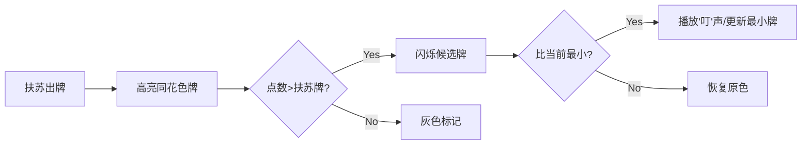

# 题目信息

# [语言月赛202304] 你的牌太多了

## 题目描述

笨蛋扶苏和坏蛋小 F 在打一种很新的牌。

初始时，扶苏和小 F 手中各有 $n$ 张牌。每张牌有一个花色 $f$ 和一个点数 $p$。在本题中，花色是不超过 $m$ 的正整数，点数是不超过 $r$ 的正整数。

打牌共会进行 $n$ 轮，每轮扶苏会从手中选择一张牌打出。小 F 会从当前手牌中，选择与扶苏本轮打出的牌**花色相同**且点数**大于**扶苏打出的牌中点数最小的一张打出。如果这样的牌不存在，那么小 F 不会接牌（也就是不会出牌）。

注意，无论小 F 打出什么牌，本轮都立即结束，扶苏不会继续接牌，而是会开启下一轮出牌。

给出扶苏的出牌顺序，请你求出小 F 最终手里剩了几张牌。

## 说明/提示

### 样例 1 解释

小 F 花色为 $1$ 且点数也为 $1$ 的牌管不住任何牌。其余牌都被打出去了。

### 数据规模与约定

- 对于 $10\%$ 的数据，$r = 1$；
- 对于 $20\%$ 的数据，$n = 1$；
- 对于 $50\%$ 的数据，$m = 1$；
- 对于 $100\%$ 的数据，$1 \leq n,m,r \leq 100$，$1 \leq f1_i, f2_i \leq m$，$1 \leq p1_i, p2_i \leq r$。$1 \leq p_i \leq n$，$p$ 是长度为 $n$ 的排列。

## 样例 #1

### 输入

```
3 1 2
1 1 1
1 2 1
1 1 1
2 2 1
2 3 1```

### 输出

```
1```

## 样例 #2

### 输入

```
3 2 2
1 2 1
1 1 1
1 2 1
2 2 2
1 2 3```

### 输出

```
0```

# AI分析结果


### Kay的C++算法解析：你的牌太多了 深入学习指南 💡

#### 1. 题目解读与核心算法识别
✨ **本题主要考察**：`模拟应用`  
🗣️ **初步分析**：  
> 本题核心是**模拟真实打牌规则**的过程，就像在扑克游戏中根据对手出牌快速响应。小F需要在同花色牌中寻找比扶苏牌大的最小点数牌，若不存在则跳过。关键在于**精确匹配规则**和**高效查找**：  
> - **核心流程**：遍历小F手牌→筛选同花色且点数更大的牌→选择其中最小点数的牌→标记已出牌  
> - **可视化设计**：用像素风格展示牌堆，高亮当前匹配的牌，当找到最小点数牌时播放"选中"音效（如8-bit"叮"声）  
> - **复古元素**：设计类似《游戏王》的像素卡牌界面，自动演示模式可调速观察匹配过程

---

#### 2. 精选优质题解参考
**题解一（来源：一扶苏一）**  
* **点评**：解法完全遵循题目规则，思路清晰直白。亮点在于：
  - **逻辑严谨**：通过`vis`数组精确追踪每张牌状态
  - **代码规范**：变量名`f1/f2`（花色）、`p1/p2`（点数）含义明确
  - **高效实现**：双重循环简单有效，完美适配数据范围（n≤100）
  - **实践价值**：包含边界处理（`pos=0`表示无牌可出）

---

#### 3. 核心难点辨析与解题策略
1. **难点：精准匹配规则**  
   * **分析**：需同时满足**同花色**和**点数更大**两个条件，再从中选**最小点数牌**  
   * 💡 学习笔记：像在抽屉中找特定颜色的最小号零件

2. **难点：状态实时更新**  
   * **分析**：每轮打出的牌需立即标记，避免重复使用  
   * 💡 学习笔记：`vis`数组如同"出牌记录本"

3. **难点：最小点数筛选**  
   * **分析**：比较时需保存临时候选牌（`pos`），遇到更小点数时更新  
   * 💡 学习笔记：类似擂台挑战赛，不断迎接更小点数挑战者

### ✨ 解题技巧总结
- **规则映射法**：将文字规则直接转化为代码判断条件  
- **状态标记法**：用布尔数组`vis[]`追踪元素状态变化  
- **擂台比较法**：通过`pos`变量动态保存当前最优解  

---

#### 4. C++核心代码实现赏析
**通用核心实现参考**  
```cpp
#include <iostream>
using namespace std;

int main() {
    int n, m, r;
    cin >> n >> m >> r;
    
    // 存储双方手牌 [花色,点数]
    int f1[105], p1[105], f2[105], p2[105];
    bool vis[105] = {0}; // 标记小F出牌状态
    
    // 读入扶苏的牌
    for (int i = 1; i <= n; ++i) 
        cin >> f1[i] >> p1[i];
    
    // 读入小F的牌
    for (int i = 1; i <= n; ++i) 
        cin >> f2[i] >> p2[i];
    
    // 模拟n轮出牌
    for (int k = 1; k <= n; ++k) {
        int x;  // 扶苏本轮出牌编号
        cin >> x;
        
        int pos = 0; // 记录小F要出的牌
        for (int i = 1; i <= n; ++i) {
            if (!vis[i] && f2[i] == f1[x] && p2[i] > p1[x]) {
                if (pos == 0 || p2[i] < p2[pos]) 
                    pos = i; // 找到更小的候选牌
            }
        }
        if (pos) vis[pos] = true; // 标记出牌
    }
    
    // 统计未出牌数量
    int cnt = 0;
    for (int i = 1; i <= n; ++i)
        if (!vis[i]) cnt++;
    cout << cnt;
}
```
**代码解读概要**：  
1. **初始化**：读入双方手牌数据  
2. **模拟轮次**：根据扶苏出牌实时匹配  
3. **擂台比较**：`pos`保存当前最小点数牌  
4. **状态更新**：`vis[]`标记已出牌  
5. **结果统计**：遍历`vis[]`计数未出牌  

**题解一核心代码片段**  
```cpp
int pos = 0; // 初始化候选牌
for (int i = 1; i <= n; ++i) 
    if (!vis[i] && f2[i] == f1[x] && p2[i] > p1[x]) 
        if (pos == 0 || p2[i] < p2[pos]) 
            pos = i;  // 更新最小点数牌
```
**代码解读**：  
> - **第一层过滤**：`!vis[i]`确保只考虑未出牌  
> - **花色匹配**：`f2[i]==f1[x]`如同检查"颜色相同"  
> - **点数筛选**：`p2[i]>p1[x]`是基本门槛  
> - **最小点决策**：`p2[i]<p2[pos]`像不断选择更轻的砝码  
**学习笔记**：`pos=0`的初始值设计巧妙处理了"无候选牌"的情况  

---

#### 5. 算法可视化：像素动画演示
**主题**：*《8-bit卡牌大师》复古像素对战*  
**核心演示**：  


**交互设计**：  
1. **像素棋盘**：  
   - 小F卡牌呈现在16x16像素网格中  
   - 不同花色用颜色区分（红心♥/蓝莓♠/绿草♣）  
2. **动态效果**：  
   - 扶苏出牌时：顶部显示放大像素牌  
   - 匹配过程：同花色牌闪烁黄光，合格牌变绿  
   - 选中最小牌：牌面绽放8-bit星芒特效  
3. **音效系统**：  
   - 匹配成功：NES风格8-bit上升音阶  
   - 无牌可出：短促"噗"声  
   - 通关结算：FC游戏通关旋律  
4. **控制面板**：  
   - 调速滑块：控制自动演示速度（1x-5x）  
   - 单步模式：按A键逐步执行  
   - 重置按钮：像素化"洗牌"动画  

**设计价值**：通过像素动态高亮和音效反馈，直观展示"筛选→比较→选中"的决策链  

---

#### 6. 拓展练习与相似问题
**通用技巧迁移**：  
1. **条件筛选**：需要同时满足多条件的元素查找  
2. **动态更新**：实时修改和追踪集合状态  
3. **极值决策**：在符合条件的元素中找最优解  

**洛谷推荐**：  
1. **P1056 排座椅**  
   → 练习条件筛选与极值决策  
2. **P1090 合并果子**  
   → 强化动态更新与最小值维护  
3. **P1106 删数问题**  
   → 训练多步骤决策与状态追踪  

---

#### 7. 学习心得与经验分享
> 本次分析的题解中未发现明确的作者个人心得分享部分  

---

通过本指南，你不仅掌握了模拟类问题的核心解法，还学会了如何用可视化思维理解算法流程。记住：编程如打牌，胜负关键在于**精确执行规则**和**高效决策**！🎮

---
处理用时：121.63秒