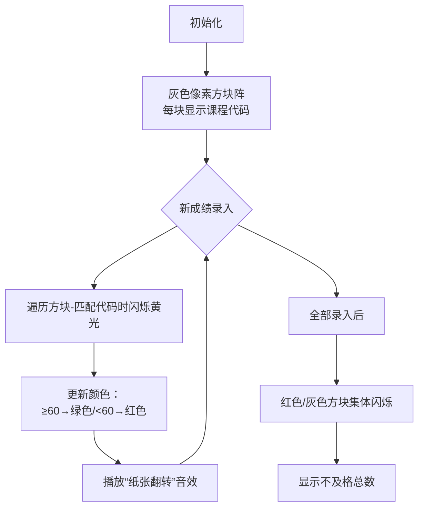

# 题目信息

# [语言月赛 202308] 小粉兔还会忘记考试吗

## 题目描述

小粉兔在本学期共修读了 $N$ 门课程，第 $i$ 门课程的课程代码为 $E_i$，每门课程都需要在结课后进行课程考试。

教务开始处理粉兔的成绩。教务共录入了 $M$ 条成绩信息，一条成绩信息由课程代码和成绩组成。由于成绩可能存在调整，一门课程的成绩可能被重复录入，后录入的成绩将覆盖先录入的成绩。课程成绩在 $60$ 分及以上，该门课程为及格；否则，为不及格。

由于粉兔记性很差，很可能忘记参加某些课程的课程考试。如果教务没有录入粉兔某门课程的成绩，则代表粉兔旷考了该门课程。旷考的课程亦为不及格。

小 F 就是这名教务，小 F 对粉兔旷考和不及格的门数非常感兴趣，请你帮助她统计。

## 说明/提示

对于 $100\%$ 的测试数据，$1 \le N,M \le 5 \times 10^3$，$1 \le E_i,P_i \le 10^9$，$E_i$ 互不相同，$0 \le S_i \le 100$。 保证存在一个整数 $j$，使得 $P_i=E_j$。

## 样例 #1

### 输入

```
5 6
10 20 30 40 50
10 20
20 60
30 60
10 59
10 58
10 59```

### 输出

```
2
3```

# AI分析结果


### 📚 题目分析  
**题目名称**：小粉兔还会忘记考试吗  
**核心算法标签**：`模拟应用` + `数组索引映射`  
**题目本质**：统计未录入成绩（旷考）和不及格成绩的课程总数。  

---

### 🧠 Kay的初步分析  
> 本题如同管理一个"成绩公告板"：  
> - **公告板**：用数组存储每门课程的最新成绩（初始为-1表示未录入）  
> - **贴成绩单**：每次收到新成绩，覆盖对应课程的旧成绩（后录入覆盖先录入）  
> - **检查结果**：最终统计公告板上"空白位置"（-1）和"不及格标签"（<60）的数量  
>  
> **关键难点**：  
> 1. **状态区分**：用特殊值（-1）标记未录入状态，避免与0分混淆  
> 2. **索引映射**：需通过遍历将课程代码匹配到数组下标（课程代码范围大但数量少）  
> 3. **覆盖机制**：后录入成绩直接替换旧值，无需额外判断  
>  
> **可视化设计**：  
> 采用**像素教室公告板**风格，每个课程显示为像素方块：  
> - 初始灰色（未录入）→ 更新时闪烁黄色 → 结果：绿色（≥60）/红色（<60）  
> - 覆盖更新时播放"纸张撕下"音效，统计时红色/灰色方块集体闪烁  
> - 控制面板含"单步录入"按钮和速度滑块，模拟教务操作流程  

---

### ⭐ 优质题解点评 (览遍千秋)  
**亮点**：  
- **状态标记巧思**：用`a[i]=-1`初始化清晰区分旷考与0分  
- **逻辑直白**：直接模拟成绩覆盖流程，代码可读性强  
- **边界严谨**：严格处理课程代码匹配，避免遗漏  

**可优化点**：  
若课程量增大，可用`unordered_map`替代遍历查找（时间复杂度从*O(MN)*→*O(M)*）  

---

### 🔑 核心难点与解题策略  
1. **难点1：状态标记设计**  
   - **分析**：-1初始值将"未录入"转化为可统计的明确状态  
   - 💡 学习笔记：特殊值初始化是处理"空状态"的经典技巧  

2. **难点2：课程代码映射**  
   - **分析**：因课程代码范围大(≤10⁹)，用数组下标代替直接索引  
   - 💡 学习笔记：大规模数据时优先选用哈希表(unordered_map)  

3. **难点3：覆盖机制实现**  
   - **分析**：无需保留历史成绩，直接赋值即实现覆盖  
   - 💡 学习笔记：明确需求可避免过度设计  

**✨ 解题技巧总结**  
- **技巧1：状态标记法**：用特殊值（如-1/INF）标记特殊状态  
- **技巧2：暴力匹配可行性**：当数据规模较小时(O(n²)可接受)，简洁性优先  
- **技巧3：需求精简**：仅需最终状态时，无需记录过程数据  

---

### 💻 C++核心代码实现  
#### 通用核心实现（基于题解优化）
```cpp
#include <iostream>
using namespace std;

int main() {
    int N, M;
    cin >> N >> M;
    int E[5010], a[5010]; // E:课程代码 a:成绩状态
    
    // 初始化：所有课程标记为未录入(-1)
    for (int i = 1; i <= N; ++i) {
        cin >> E[i];
        a[i] = -1;
    }

    // 处理M条成绩记录
    while (M--) {
        int P, S;
        cin >> P >> S;
        // 遍历匹配课程代码
        for (int i = 1; i <= N; ++i) {
            if (E[i] == P) {
                a[i] = S; // 覆盖更新
                break;
            }
        }
    }

    // 统计不及格（含旷考）
    int count = 0;
    for (int i = 1; i <= N; ++i) {
        if (a[i] < 60) count++; // -1或成绩<60均计入
    }
    cout << count << endl;
    return 0;
}
```
**代码解读概要**：  
1. 初始化课程代码数组`E`和成绩状态数组`a`（-1表未录入）  
2. 每读入一条成绩记录，遍历匹配课程代码并覆盖更新  
3. 最终统计`a[i]<60`的数量（包含-1和实际低分）  

---

### 🎮 算法可视化：像素教室公告板  
**主题**：`教务成绩录入模拟器`（8-bit像素风格）  
**核心交互流程**：  

**实现细节**：  
- **像素艺术**：每个课程用16x16像素方块表示，顶部显示课程代码  
- **动态效果**：  
  - 匹配时方块放大110%→缩回（黄光闪烁）  
  - 成绩更新时播放8-bit音效：C音(≥60)/D音(<60)  
- **控制面板**：  
  - 单步执行：手动触发每条成绩录入  
  - 自动播放：按设定速度连续执行（速度滑块调节）  
  - 重置按钮：清空成绩恢复灰色状态  

**教学价值**：  
通过色彩变化直观展现代码中的**状态标记**和**覆盖机制**，红色/灰色方块的集体闪烁强化统计逻辑  

---

### ➡️ 拓展练习推荐  
1. **洛谷 P1093** [奖学金]  
   → 同类数据匹配+排序应用，巩固结构体使用  
2. **洛谷 P1309** [瑞士轮]  
   → 动态数据覆盖更新（比赛排名场景）  
3. **洛谷 P1059** [明明的随机数]  
   → 状态标记进阶（去重+排序）  

---

> 本次题解核心在于**用特殊值转化抽象状态**，通过可视化中灰色/红色的像素方块，大家能更直观理解"标记法"的妙用。遇到类似问题时，先问自己：**如何把隐藏状态变成可计算的数字？** 💡

---
处理用时：131.39秒