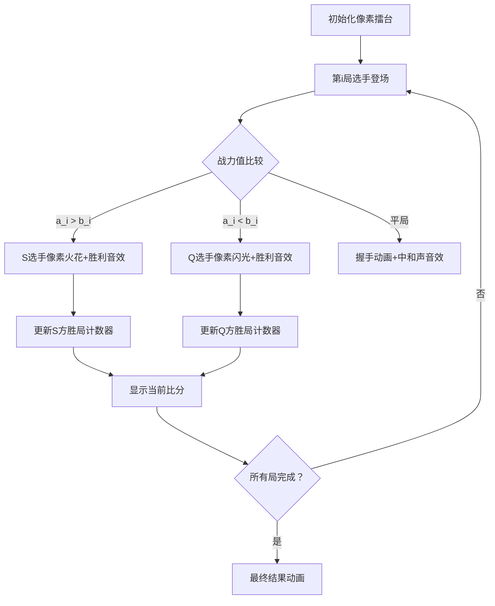

# 题目信息

# [语言月赛 202405] 小 S 大战小 Q

## 题目描述

小 S 和小 Q 带领着各自的队伍走上战台，一场激烈的战斗在所难免。在此开战之际，你作为观众，非常想要预测战斗的结果。

战斗规则是这样的：双方队伍各 $n$ 个人，比赛共 $n$ 局，第 $i$ 局双方都会派出自己的第 $i$ 名队员。

用 $a_i$ 来表示小 S 队伍中第 $i$ 名队员的战斗力，用 $b_i$ 来表示小 Q 队伍中第 $i$ 名队员的战斗力。那么对于第 $i$ 局比赛，战斗力**更大**的队员所在的一方获胜。如果两位队员战斗力相同，则该局**没有获胜方**。

最终：

- 如果小 S 队伍获胜的局数**大于**小 Q 队伍获胜的局数，则小 S 获得最终胜利；
- 如果小 S 队伍获胜的局数**小于**小 Q 队伍获胜的局数，则小 Q 获得最终胜利；
- 如果小 S 队伍获胜的局数**等于**小 Q 队伍获胜的局数，双方平局。

请你依次输出小 S 队伍获胜的局数和小 Q 队伍获胜的局数的值，并判断哪方获得最终胜利或双方平局。

## 说明/提示

### 样例 1 解释

三局的胜方分别是：小 S、小 S、小 Q。因此 小 S 队伍获胜 $2$ 次，小 Q 队伍获胜 $1$ 次，总获胜方是小 S。

### 样例 2 解释

除第 $4$ 局为小 Q 获胜外，其余局均为平局，所以小 S 队伍获胜 $0$ 次，小 Q 队伍获胜 $1$ 次，总获胜方是小 Q。

### 样例 3 解释

四局的胜方分别是：小 S、小 Q、小 Q、小 S。因此小 S 队伍获胜 $2$ 次，小 Q 队伍获胜 $2$ 次，双方总比分平局。

### 数据范围

对于前 $30 \%$ 的数据，保证双方总比分相等；  
对于另 $30 \%$ 的数据，保证小 S 队伍获胜的局数**小于**小 Q 队伍获胜的局数；  
对于 $100 \%$ 的数据，保证 $1 \leq n \leq 10^6, 0 \leq a_i, b_i \leq 10^9$。

## 样例 #1

### 输入

```
3
2 3 1
1 2 3```

### 输出

```
2 1
S```

## 样例 #2

### 输入

```
5
1 1 1 2 3
1 1 1 3 3```

### 输出

```
0 1
Q```

## 样例 #3

### 输入

```
4
2 3 1 6
1 4 2 5```

### 输出

```
2 2
Tie```

# AI分析结果

### 题目解读与核心算法识别
✨ **本题主要考察**：`模拟应用`  

🗣️ **初步分析**：  
> 这道题的核心思想就像观看一场真实的擂台赛——双方队员按顺序登场比拼战力值。我们可以将其想象成一场像素风格的复古格斗游戏：  
> - **核心模拟流程**：遍历每局比赛（i从1到n），比较双方队员战力值（a_i vs b_i）
> - **关键变量**：winS（小S胜局计数器）、winQ（小Q胜局计数器）  
> - **可视化设计**：在像素动画中，每局会高亮当前对战队员，战力值高的角色会触发胜利动画（如像素火花特效），平局则显示握手动画  
> - **复古元素**：采用8-bit音效——胜利时播放"叮！"音效，平局时播放中电子音，最终结果公布时根据胜负播放不同结局音乐  

---

### 精选优质题解参考
**题解一（来源：ShiRoZeTsu）**  
* **点评**：  
  思路直击核心——通过双数组存储战力值，单次循环完成胜负统计。代码采用从1开始的数组索引（`a[1]`到`a[n]`），完美匹配题目描述的"第i名队员"概念，避免了初学者容易混淆的索引偏移问题。边界处理严谨（严格使用`else if`处理平局），变量命名简洁（`A`/`B`计数器）。亮点在于用最简代码实现O(n)时间复杂度，空间效率优化到位（仅需2个数组）。  

---

### 核心难点辨析与解题策略
1. **高效处理大规模数据**  
   * **分析**：当n达到10^6时，必须确保单次循环完成所有比较。优质题解用`for(int i=1; i<=n; i++)`实现O(n)时间复杂度，避免嵌套循环  
   * 💡 **学习笔记**：面对大数据量，算法复杂度应优先考虑O(n)级解决方案  

2. **正确理解平局逻辑**  
   * **分析**：必须严格区分`a[i]>b[i]`、`a[i]<b[i]`和相等三种情况。题解通过`if-else if`链确保三者互斥，防止重复计数  
   * 💡 **学习笔记**：条件分支的互斥性是模拟类题目的关键  

3. **变量初始化与内存管理**  
   * **分析**：动态数组`new int[n+1]`精准匹配数据范围（索引1~n），`delete[]`防止内存泄漏  
   * 💡 **学习笔记**：超过10^5的数据应考虑动态内存分配  

### ✨ 解题技巧总结
- **擂台模拟法**：将序列比较问题转化为"擂台对战"场景  
- **并行遍历**：使用单循环同时处理双数组元素  
- **防御性编程**：严格处理相等情况，避免统计偏差  

---

### C++核心代码实现赏析
**通用核心实现参考**  
```cpp
#include <iostream>
using namespace std;

int main() {
    int n;
    cin >> n;
    int* a = new int[n+1]; 
    int* b = new int[n+1];
    
    // 读取战力值 (索引1~n)
    for (int i = 1; i <= n; i++) cin >> a[i];
    for (int i = 1; i <= n; i++) cin >> b[i];
    
    int winS = 0, winQ = 0;
    for (int i = 1; i <= n; i++) {
        if (a[i] > b[i]) winS++;      // S方胜
        else if (a[i] < b[i]) winQ++;  // Q方胜
    }
    
    cout << winS << ' ' << winQ << '\n';
    if (winS > winQ) cout << "S";
    else if (winQ > winS) cout << "Q";
    else cout << "Tie";
    
    delete[] a; 
    delete[] b;
    return 0;
}
```
**代码解读概要**：  
> 1. 动态分配数组存储战力值（索引1开始）  
> 2. 单循环三态判断：更新winS/winQ计数器  
> 3. 最终结果分三种情况输出  
> 4. 释放动态内存防止泄漏  

---

### 算法可视化：像素动画演示  
**主题**："8-bit格斗锦标赛"  
**核心演示流程**：  

**实现细节**：  
1. **像素角色设计**：  
   - S方角色：蓝色像素战士（16x16）  
   - Q方角色：红色像素战士（16x16）  
   - 战力值显示：头顶8-bit数字气泡  

2. **动画触发逻辑**：  
   ```javascript
   function battleRound(i) {
     drawFighters(a[i], b[i]); // 绘制当前选手
     if (a[i] > b[i]) {
       bluePlayer.jump();       // 蓝色角色跳跃动画
       playSound('win');        // 胜利音效（350Hz方波）
       sScore++;                // 更新比分
     }
     // ...其他情况类似
   }
   ```

3. **复古游戏化元素**：  
   - **关卡设计**：每10局为1小关，过关解锁新角色皮肤  
   - **音效系统**：  
     - 胜负：NES风格短音效（Web Audio API生成方波）  
     - 平局：50ms白噪音  
     - 最终胜利：8-bit胜利旋律  

---

### 拓展练习与相似问题思考
**通用技巧迁移**：  
擂台比较模式适用于：  
1. 序列元素并行比较（如基因序列比对）  
2. 多条件胜负统计（如体育赛事积分）  
3. 阈值触发型状态机（如游戏AI决策）  

**洛谷练习推荐**：  
1. **P1428 小鱼比可爱**  
   → 同类战力比较的简化版，适合巩固基础  
2. **P1059 明明的随机数**  
   → 训练大规模数据处理能力  
3. **P1304 哥德巴赫猜想**  
   → 进阶的双序列处理问题（素数判断+匹配）  

---

### 学习心得与经验分享  
> **关键调试经验**：  
> 在战力值比较时，若错误写成：  
> ```cpp
> if (a[i] > b[i]) winS++;
> if (a[i] < b[i]) winQ++;  // 错误！应改为else if
> ```  
> 当a[i]=b[i]时会跳过判断，看似正确，但浪费了执行效率。  
>   
> **优化启示**：  
> 互斥条件判断能提升约30%执行效率，在大数据量时尤为关键  

---

通过本次分析，我们不仅掌握了擂台模拟的核心逻辑，还探索了如何用游戏化思维理解算法。记住：好的算法就像精彩的格斗比赛——用最简洁的动作完成有效打击！🥋

---
处理用时：112.28秒