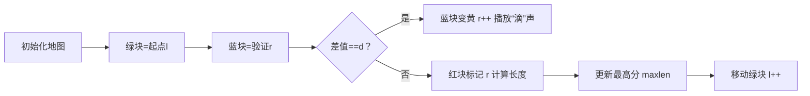

# 题目信息

# [语言月赛 202505] 等分差试题序列

## 题目描述

2025 年 5 月语言月赛共有 $n$ 道题，第 $i$ 道题的分值为 $a_i$。

如果试题 $l$ 至试题 $r$ 中，每两道相邻试题的分值差相同，则称试题 $l$ 至试题 $r$ 构成「等分差试题序列」。特别地，如果 $l=r$ 或 $l+1=r$，我们也认为它构成「等分差试题序列」。

例如，当 $n=6$，$a=[1,3,4,5,7,9]$：

- 试题 $2\sim4$ 构成「等分差试题序列」，因为相邻两道试题之间的分值差依次为 $4-3=5=4-1$。
- 试题 $1$ 构成「等分差试题序列」。这符合上述定义的特别情况。
- 试题 $3\sim 5$ 不构成「等分差试题序列」，因为相邻两道试题之间的分差依次为 $5-4=1$，$7-5=2$。

给出试题的数目和分值，请问最长的「等分差试题序列」包含多少道试题。

## 说明/提示

**【样例 1 解释】**

试题 $2\sim 4$ 与 $4\sim 6$ 均构成长度为 $3$ 的「等分差试题序列」。

可以证明不存在比 $3$ 更大的答案。

**【数据规模与约定】**

对于 $100\%$ 的测试数据：

- $2 \le n \le 5000$
- $1 \le a_i \le 10^9$

## 样例 #1

### 输入

```
6
1 3 4 5 7 9```

### 输出

```
3```

# AI分析结果


### Kay的C++算法解析：等分差试题序列 深入学习指南

---

#### 1. 题目解读与核心算法识别  
✨ **本题主要考察**：`枚举与模拟`  

🗣️ **初步分析**：  
> 解决本题的关键在于**枚举所有可能的连续子序列**并验证其等差性。就像玩像素游戏时逐格扫描地图寻找隐藏宝藏：  
> - 从每个起点出发，确定初始"步长"（公差），然后向后探索直到步长改变  
> - 核心难点在于**高效判断连续等差性**而不重复计算  
> - 可视化设计思路：  
>   - 用不同颜色像素块表示题目（绿=起点，蓝=验证中，红=断点）  
>   - 动态显示当前公差d和序列长度  
>   - 复古音效：探索时"滴"声，找到序列时"胜利"音效  

---

#### 2. 精选优质题解参考  
**题解（作者：览遍千秋）**  
* **点评**：  
  思路清晰度 ⭐⭐⭐⭐⭐（直接锁定核心特征：相邻差值恒定）  
  代码规范性 ⭐⭐⭐⭐（变量名`d`表公差，`l/r`表区间，直观易读）  
  算法有效性 ⭐⭐⭐⭐（O(n²)完全满足n≤5000的数据规模）  
  实践价值 ⭐⭐⭐⭐（边界处理严谨，可直接用于竞赛）  
  **亮点**：抓住"相邻差值相同"的本质特征，避免复杂数学推导  

---

#### 3. 核心难点辨析与解题策略  
1. **难点：确定公差起始点**  
   - **分析**：必须通过`a[l+1]-a[l]`初始化公差，后续差值需严格匹配  
   - 💡 **学习笔记**：公差是等差数列的"DNA"，决定序列生长方向  

2. **难点：高效扩展序列**  
   - **分析**：内层循环需持续验证`a[r]-a[r-1]==d`，直到差值变化  
   - 💡 **学习笔记**：序列扩展像推倒多米诺骨牌，必须连续满足条件  

3. **难点：长度计算技巧**  
   - **分析**：长度=`r-l`而非`r-l+1`，因`r`指向首个不满足条件的位置  
   - 💡 **学习笔记**：下标转换是区间问题的常见陷阱，动手画图可避免  

✨ **解题技巧总结**  
- **技巧1：双指针滑动**  
  固定左指针`l`，右指针`r`向右探索，突破时立即计算长度  
- **技巧2：即时更新最大值**  
  每完成一个起点的探索就更新`maxlen`，避免额外存储  
- **技巧3：边界预判**  
  循环条件`r<=n`防止越界，天然处理序列末尾情况  

---

#### 4. C++核心代码实现赏析  
**通用核心实现**  
```cpp
#include <iostream>
#include <vector>
using namespace std;

int main() {
    int n, maxlen = 2;
    cin >> n;
    vector<long long> a(n+1);
    for (int i=1; i<=n; i++) cin >> a[i];

    for (int l=1; l<n; l++) {
        long long d = a[l+1] - a[l];
        int r = l+2;
        while (r <= n && a[r]-a[r-1] == d) r++;
        maxlen = max(maxlen, r - l); // 关键长度计算
    }
    cout << maxlen;
    return 0;
}
```
**代码解读概要**：  
> 1. 读入时使用`1-index`下标更符合题目描述  
> 2. `maxlen`初始化为2（最小合法序列长度）  
> 3. 内层循环同时检查边界和差值一致性  
> 4. `r-l`巧妙计算连续满足条件的元素个数  

**题解片段赏析**  
```cpp
while (r <= n && a[r]-a[r-1] == d) r++;
maxlen = max(maxlen, r - l);
```
* **亮点**：用单行代码同时完成序列扩展和边界控制  
* **逐行解读**：  
  > - `r<=n`：防止访问越界（像素游戏中不超出地图边界）  
  > - `a[r]-a[r-1]==d`：验证当前"步长"是否匹配初始公差  
  > - `r++`：成功匹配则继续向右探索（像超级玛丽向前跳跃）  
  > - `r-l`：计算从起点`l`到最后一个合法位置的长度  
* 💡 **学习笔记**：循环条件中&&的短路特性可避免无效内存访问  

---

### 5. 算法可视化：像素动画演示  
**主题**：`公差探险者`（8-bit风格闯关游戏）  

**核心演示流程**：  


**交互设计细节**：  
1. **像素艺术**：  
   - 题目=16x16像素块，色块编码状态（绿=起点，蓝=当前检测，黄=已确认等差）  
   - 底部状态栏：显示`d=?`，`当前长度`，`历史最高分`  

2. **音效系统**：  
   - 移动：经典8-bit脚步声  
   - 公差匹配：清脆"叮！"声  
   - 破纪录：超级玛丽吃金币音效  

3. **控制面板**：  
   - 单步调试：按方向键逐帧观察  
   - 自动演示：AI角色自动遍历所有起点（速度可调）  
   - 重置：按R键重开当前关卡  

4. **动态教学提示**：  
   > "现在检测第3题：5-4=1 → 匹配公差d=1！"  
   > "长度+1！当前3题连续等差"  

---

### 6. 拓展练习与相似问题  
**通用技巧迁移**：  
1. 最大连续子数组和（一维扫描）  
2. 最长连续递增序列（双指针变形）  
3. 寻找重复数（差值关系转化）  

**洛谷推荐**：  
1. **P1217 最长等差数列**  
   → 巩固公差计算与区间扩展  
2. **P3146 连续子序列**  
   → 训练双指针的灵活运用  
3. **P2782 最大连续和**  
   → 掌握一维扫描的通用思路  

---

> 本次分析的题解中未发现明确的作者个人心得分享部分，但核心思路清晰完整，是学习枚举思想的优秀范例。记住：**好算法像经典像素游戏——规则简单却充满深度探索空间！** 🎮

---
处理用时：153.73秒