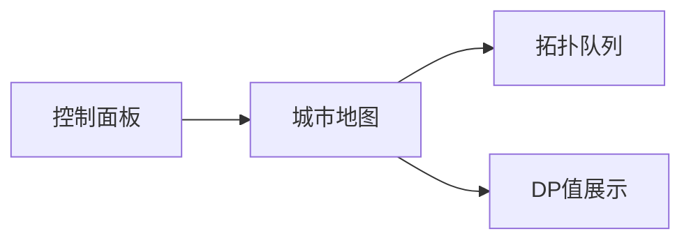

# 题目信息

# 旅行计划

## 题目描述

小明要去一个国家旅游。这个国家有 $N$ 个城市，编号为 $1$ 至 $N$，并且有 $M$ 条道路连接着，小明准备从其中一个城市出发，并只往东走到城市 $i$ 停止。

所以他就需要选择最先到达的城市，并制定一条路线以城市 $i$ 为终点，使得线路上除了第一个城市，每个城市都在路线前一个城市东面，并且满足这个前提下还希望游览的城市尽量多。

现在，你只知道每一条道路所连接的两个城市的相对位置关系，但并不知道所有城市具体的位置。现在对于所有的 $i$，都需要你为小明制定一条路线，并求出以城市 $i$ 为终点最多能够游览多少个城市。

## 说明/提示

均选择从城市 $1$ 出发可以得到以上答案。

- 对于 $20\%$ 的数据，$1\le N ≤ 100$；
- 对于 $60\%$ 的数据，$1\le N ≤ 1000$；
- 对于 $100\%$ 的数据，$1\le N ≤ 100000$，$1\le M ≤ 200000$。


## 样例 #1

### 输入

```
5 6
1 2
1 3
2 3
2 4
3 4
2 5
```

### 输出

```
1
2
3
4
3
```

# AI分析结果


### 💡 Kay的C++算法解析：旅行计划 深入学习指南 💡

#### 1. 题目解读与核心算法识别
✨ **本题主要考察**：`拓扑排序 + 动态规划`  
🗣️ **初步分析**：
> 解决"旅行计划"的关键在于理解有向无环图（DAG）的特性。想象城市是游戏关卡节点，道路是单向传送门，拓扑排序就像规划关卡的解锁顺序——必须先通关前置关卡才能开启后续关卡。核心步骤：
> - **拓扑排序**：将城市按"西→东"依赖关系线性排序，确保处理每个城市时其西侧所有城市已计算完毕
> - **动态规划**：`dp[i]`表示以城市i为终点的最大游览数，状态转移：`dp[i] = max(dp[j]+1)`（j→i有道路）
> - **可视化设计**：像素动画将展示拓扑队列的进出过程，高亮当前处理的节点和更新的dp值，数据流动效果类似流水线作业。采用8-bit风格，入队/出队时触发"叮"音效，dp更新时显示数字跳动动画。

---

#### 2. 精选优质题解参考
**题解一：星星之火 (拓扑排序+显式DP)**  
* **点评**：思路清晰度⭐⭐⭐⭐⭐ 代码规范性⭐⭐⭐⭐  
  作者用队列实现拓扑排序后单独进行DP，逻辑分离明确。变量名`ts[]`存储拓扑序，`dp[]`记录结果，边界处理严谨（所有节点初始化为1）。亮点在于详细解释拓扑序如何保证DP无后效性，帮助理解算法本质。代码可直接用于竞赛，空间复杂度O(n)。

**题解二：_ZZH (拓扑排序中隐式DP)**  
* **点评**：代码简洁性⭐⭐⭐⭐⭐ 算法效率⭐⭐⭐⭐⭐  
  在拓扑排序过程中直接更新`f[]`数组，减少遍历次数。邻接表存储优雅，`lin[]`替代传统head数组，`in[]`记录入度。亮点在于"一箭双雕"的优化思想，同步完成排序和DP，时间复杂度严格O(n+m)。

**题解三：归山_ (反向建图+记忆化搜索)**  
* **点评**：思维创新性⭐⭐⭐⭐ 教学价值⭐⭐⭐⭐  
  通过反向建图将终点转化为起点，`dfs(x)`返回从x出发的路径长度。记忆化`dp[x]`避免重复计算，代码用`memset`初始化-1很巧妙。亮点在于逆向思维转换问题，适合帮助理解DAG的对称性。

---

#### 3. 核心难点辨析与解题策略
1. **难点：DP无后效性保障**  
   * **分析**：若直接按输入顺序DP，东侧城市可能依赖未计算的西侧城市。优质解法均通过拓扑排序确保处理城市i时所有可能的前驱j已计算完毕。
   * 💡 **学习笔记**：拓扑序是DAG上DP的"安全执行顺序表"

2. **难点：多起点初始化**  
   * **分析**：入度为0的城市（起点）`dp[i]`初始化为1（自身）。在拓扑排序开始时需将所有起点入队，如星星之火解法中`if(ru[i]==0) q.push(i)`。
   * 💡 **学习笔记**：起点是DP的"基础燃料层"

3. **难点：状态转移实现**  
   * **分析**：更新时机有两种：拓扑排序后遍历（星星之火）或排序过程中实时更新（_ZZH）。后者效率更优但需注意更新顺序。
   * 💡 **学习笔记**：状态转移本质是"西侧城市成果向东侧传递"

✨ **解题技巧总结**  
- **DAG特性利用**：无环确保拓扑序存在，是算法前提  
- **邻接表选择**：`vector`或链式前向星（`head[]`+`edge[]`）应对大规模稀疏图  
- **边界防御**：显式初始化所有`dp[i]=1`，避免漏掉孤立点  

---

#### 4. C++核心代码实现赏析
```cpp
// 通用核心实现 (综合优化版)
#include <iostream>
#include <vector>
#include <queue>
using namespace std;

int main() {
    int n, m;
    cin >> n >> m;
    vector<int> in(n+1, 0), dp(n+1, 1);
    vector<vector<int>> graph(n+1);

    // 建图
    while(m--) {
        int u, v;
        cin >> u >> v;
        graph[u].push_back(v);
        in[v]++;
    }

    // 拓扑排序+DP
    queue<int> q;
    for(int i=1; i<=n; i++) 
        if(!in[i]) q.push(i);

    while(!q.empty()) {
        int u = q.front(); q.pop();
        for(int v : graph[u]) {
            dp[v] = max(dp[v], dp[u] + 1); // 核心状态转移
            if(--in[v] == 0) q.push(v);
        }
    }

    // 输出
    for(int i=1; i<=n; i++) 
        cout << dp[i] << endl;
}
```
**代码解读概要**：  
1. 邻接表`graph`存储道路关系  
2. 队列`q`维护拓扑序，入度归零节点入队  
3. 动态更新`dp[v]`（关键转移方程）  
4. 时间复杂度O(n+m)，空间O(n)  

**题解片段赏析**：  

1. 星星之火（拓扑排序后DP）  
```cpp
topsort(); // 生成拓扑序ts[]
for(int i=1; i<=n; i++) {
    int u=ts[i];
    for(int j=head[u]; j; j=edge[j].next)
        dp[edge[j].to] = max(dp[edge[j].to], dp[u]+1);
}
```
> 💡 **学习笔记**：显式两步走结构清晰，适合教学演示

2. _ZZH（拓扑中DP）  
```cpp
while(!q.empty()) {
    int cnt=q.front(); q.pop();
    for(int i=lin[cnt]; i; i=e[i].next) {
        f[e[i].to] = max(f[e[i].to], f[cnt]+1); // 同步更新
        if(--in[e[i].to]==0) q.push(e[i].to);    
    }
}
```
> 💡 **学习笔记**：高效合并操作，减少循环次数

3. 归山_（记忆化搜索）  
```cpp
int dfs(int x) {
    if(dp[x]!=-1) return dp[x];
    dp[x] = 1;
    for(int i=head[x]; i; i=e[i].next)
        dp[x] = max(dp[x], dfs(e[i].to)+1);
    return dp[x];
}
// 调用: add(y,x) 反向建图
```
> 💡 **学习笔记**：递归思路直观，注意避免栈溢出

---

#### 5. 算法可视化：像素动画演示
**主题**：8-bit风格《拓扑大冒险》  
**核心演示**：  


1. **场景设计**：
   - 城市节点：16x16像素方块，西侧浅蓝→东侧深蓝渐变
   - 道路：黄色闪烁箭头（FC《勇者斗恶龙》风格）
   - 控制面板：复古液晶屏显示`队列大小:3 当前dp:4`

2. **动画流程**：
   - 初始：入度0的城市闪烁绿色（播放"发现"音效）
   - 拓扑推进：
     ```python
     while queue:
        当前城市 = 队列.pop()  # 方块爆炸特效
        for 每个邻接城市v:
            dp[v] = max(dp[v], dp[u]+1)  # 数字跳动动画
            in[v]--  # 入度计数器减1
            if in[v]==0: 
                队列.push(v)  # 方块旋转入场+入队音效
     ```
   - 特效：dp更新时城市上方显示`+1`粒子效果，道路高亮0.5秒

3. **游戏化元素**：
   - 每完成5个城市触发"COMBO"奖励音效
   - 进度条显示拓扑完成度，通关解锁成就徽章
   - 错误处理：发现环时全屏闪烁红光（经典《魂斗罗》警报声）

---

#### 6. 拓展练习与相似问题思考
**思维迁移**：  
1. 加权DAG最长路（边权非1）  
2. 拓扑序计数（如课程安排方案数）  
3. 关键路径（AOE网）  

**洛谷推荐**：  
1. P1113 杂务 - `DAG最长路基础变形`  
2. P4017 最大食物链计数 - `拓扑排序+DP计数`  
3. P3385 【模板】负环 - `对比有环图处理差异`

---

#### 7. 学习心得与经验分享
> **经验摘录**（来自星星之火）：  
> *"DP需要满足无后效性，拓扑序u在前v在后的性质是解题关键"*  
> **Kay点评**：这是理解DAG上DP的精髓——执行顺序决定计算正确性。调试时可打印拓扑序验证逻辑链。

> **经验摘录**（来自归山_）：  
> *"反向建图让终点变起点，记忆化搜索避免重复计算"*  
> **Kay点评**：逆向思维转换问题视角，是算法设计的重要技巧。注意DFS可能爆栈，大数据建议用迭代DP。

---

### 结语  
通过拓扑排序和动态规划的组合拳，我们高效解决了DAG最长路径问题。记住：好算法=正确数据结构+合理执行顺序+状态优化。下次挑战见！🚀

---
处理用时：123.82秒