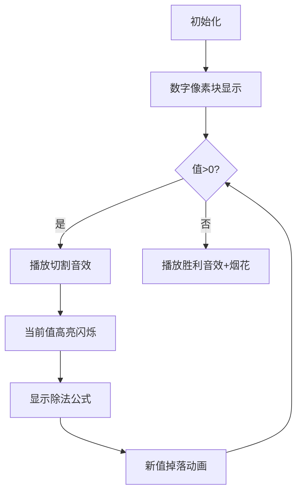

# 题目信息

# [蓝桥杯 2020 省 B1] 整除序列

## 题目描述

有一个序列，序列的第一个数是 $n$，后面的每个数是前一个数整除 $2$，请输出这个序列中值为正数的项。

## 说明/提示

对于 $80\%$ 的评测用例，$1\le n\le10^9$。

对于所有评测用例，$1\le n\le10^{18}$。

蓝桥杯 2020 第一轮省赛 B 组 F 题。

## 样例 #1

### 输入

```
20```

### 输出

```
20 10 5 2 1```

# AI分析结果


### 💡 Kay的C++算法解析：[蓝桥杯 2020 省 B1] 整除序列 深入学习指南 💡

<introduction>
今天我们来分析蓝桥杯2020年省赛的"整除序列"题目。这道题看似简单，但包含重要的编程思维训练点，尤其适合巩固循环和数据处理基础。
</introduction>

---

## 1. 题目解读与核心算法识别

✨ **本题主要考察**：`编程技巧应用` (循环控制与边界处理)

🗣️ **初步分析**：
> 解决这道题就像操作一台像素风格的"数字粉碎机"——不断将数字对半切割，直到无法切割为止。关键在于：
> - 循环控制：设计精确的终止条件（n>0）
> - 边界处理：使用long long避免数据溢出
> - 输出策略：即时输出避免存储大序列
> 
> **可视化设计思路**：我们将创建8位游戏机风格的动画，初始数字显示为像素方块，每次除以2时：
> - 当前数字高亮闪烁（黄色）
> - 播放"咔嚓"切割音效
> - 新数字从上方像素掉落
> - 控制面板支持调速/单步执行，当数字归零时播放胜利音效+烟花特效

---

## 2. 精选优质题解参考

**题解一（lichenzhen）**
* **点评**：
思路直击核心——用最简for循环实现需求。省略循环初始条件，将迭代操作(n/=2)直接融入循环结构，代码极度精简（仅7行）。变量命名规范，使用long long严谨处理大数据边界，是"少即是多"的典范。特别亮点：循环条件n>0精准覆盖所有情况，避免冗余判断。

**题解二（Ggsddu_zzy）**
* **点评**：
采用先输出后处理的策略，逻辑清晰易理解。特别注重1的特殊处理（n!=1条件），体现对边界情况的周全考虑。代码结构工整，包含完整头文件和处理流程，适合初学者学习标准实现范式。小建议：循环条件n>0更直观，当前n!=1在极端情况（如n=3）可能引起困惑。

**题解三（_Haoomff_）**
* **点评**：
创新性使用分段输出策略：循环内处理大于1的值，循环外补足最后1。这种"主体+收尾"的结构既避免重复输出又确保完整性。优化IO流加速大数据处理，体现竞赛编程技巧。亮点：严格处理输出格式，确保末尾无多余空格，展现专业输出控制能力。

---

## 3. 核心难点辨析与解题策略

1.  **数据范围陷阱**
    * **分析**：80%测试点n≤10⁹，但全部用例n≤10¹⁸。int类型最大仅2×10⁹，必须使用long long（最大9×10¹⁸）。题解中Lovely_Elaina的调试经历印证此点
    * 💡 **学习笔记**：看到10⁹以上数据范围立即切换long long

2.  **循环终止条件设计**
    * **分析**：三种主流方案各有优势：
      - n>0（最直接，覆盖所有正整数）
      - n!=1（需配合先输出策略）
      - n>1+后置输出（确保1精确输出）
    * 💡 **学习笔记**：n>0是最稳健的通用方案

3.  **输出时序控制**
    * **分析**：必须在数值变化前输出当前值。若先除后输出（如n=3：先除得1再输出），会漏掉原始值
    * 💡 **学习笔记**：循环内先输出再更新

### ✨ 解题技巧总结
- **数据敏感训练**：对10⁶/10⁹/10¹⁸建立条件反射
- **边界沙盘推演**：手工模拟n=1,2,3等特殊情况
- **循环结构优选**：while(n>0) > for(;n>0;n/=2) > 分段输出
- **输出即处理**：避免存储整个序列（节省内存）

---

## 4. C++核心代码实现赏析

**通用核心实现参考**
* **说明**：综合最优解法，采用稳健的while循环结构
```cpp
#include <iostream>
using namespace std;

int main() {
    long long n;        // 关键：10¹⁸必须long long
    cin >> n;
    while (n > 0) {     // 精确终止条件
        cout << n << " "; // 先输出当前值
        n /= 2;          // 后更新数值
    }
    return 0;
}
```
* **代码解读概要**：
  > 1. 读入long long型变量n
  > 2. 当n仍为正数时循环执行：
  >    - 输出当前n值（带空格）
  >    - n整除2更新
  > 3. 当n=0时自动退出循环

---

**题解一片段赏析**（lichenzhen）
```cpp
for(;n>0;n/=2)   // 创新循环结构
    cout<<n<<" "; 
```
* **亮点**：循环迭代与操作融合
* **代码解读**：
  > 省略for循环初始化语句，将迭代操作n/=2直接放在第三表达式位置。每次循环后自动更新n值，循环体内只需专注输出。相当于：
  > ```
  > while(n>0) {
  >     cout...;
  >     n/=2;   // 此操作移至for声明中
  > }
  > ```
* 💡 **学习笔记**：灵活运用循环语法可大幅精简代码

**题解二片段赏析**（Ggsddu_zzy）
```cpp
cout<<n<<" ";       // 首次输出
while(n!=1){        // 特殊条件
    n/=2;           // 先更新
    cout<<n<<" ";   // 后输出
}
```
* **亮点**：分离首次输出逻辑
* **代码解读**：
  > 1. 在循环前输出初始值（保证n=1时正确）
  > 2. 循环条件n!=1确保至少执行一次除法
  > 3. **注意执行顺序**：先更新再输出（与主流相反）
* 💡 **学习笔记**：输出顺序决定结果正确性

**题解三片段赏析**（_Haoomff_）
```cpp
while(n>1){         // 排除1的特殊处理
    cout<<n<<" ";
    n/=2;
}
cout<<n;            // 补充最后1
```
* **亮点**：分段输出策略
* **代码解读**：
  > 1. 主循环只处理>1的值
  > 2. 循环外单独输出最终值（必为1）
  > 3. 避免循环内额外判断n==1的情况
* 💡 **学习笔记**：分离边界处理使主逻辑更清晰

---

## 5. 算法可视化：像素动画演示

**主题**："数字分解工厂"（8位像素风）

**核心演示流程**：


**交互控制面板**：
```plaintext
[20]  ← 当前数字像素块
[▷] [‖] [□]  ← 播放/暂停/重置
[⚡]  ← 单步执行
[►◼]  ← 速度调节滑块
```

**关键动画细节**：
1. **像素数字块**：16×16像素，使用NES经典配色（灰色背景+亮蓝数字）
2. **除法动画**：
   - 当前数字分裂为两半（8位撕裂特效）
   - 右侧显示 `20/2=10` 公式
   - 新数字10从上方掉落（带重力效果）
3. **音效系统**：
   - 数字变化："咔嚓"（8位芯片音）
   - 错误操作："嘟"（短促提示音）
   - 完成序列："胜利旋律"（《超级玛丽》过关音效）
4. **教学模式**：
   - 按[?]触发旁白：*"注意：当数字为1时，下次切割将归零！"*
   - 自动演示时显示路径轨迹（虚线连接数字）

---

## 6. 拓展练习与相似问题思考

**技巧迁移场景**：
1. 进制转换（除K取余法）
2. 数字位分解（除10取余）
3. 幂次衰减检测（如辐射半衰期模拟）

**洛谷推荐**：
1. **P1469** 找筷子 - 训练位运算与数字特性
   > *"巩固整除技巧的变式应用"*
2. **P1226** 快速幂 - 延伸除法的对数级优化
   > *"理解除法的优化方向：O(n)→O(logn)"*
3. **P5657** 进制转换 - 整除与取余的综合训练
   > *"将整除技巧扩展到多进制场景"*

---

## 7. 学习心得与经验分享

> **参考经验 (来自 Lovely_Elaina)**：
> *"第一次用int只过80%测试点，检查数据范围才发现需要long long——就像准备小水桶接瀑布，必须提前确认水量！"*
>
> **Kay点评**：
> 这个案例生动说明：审题时**数据范围分析**与算法设计同等重要。建议：
> 1. 建立范围敏感度：10⁶→int, 10¹⁸→long long
> 2. 测试边界值：n=1, n=10¹⁸
> 3. 使用`sizeof()`验证类型字节数

---

<conclusion>
通过本次分析，我们不仅掌握了整除序列的实现技巧，更训练了关键编程思维：数据边界意识、循环结构优化和即时处理策略。记住，优秀的程序员既是建筑师（设计结构）也是会计师（精算数据）！下次挑战见！💪
</conclusion>

---
处理用时：250.97秒