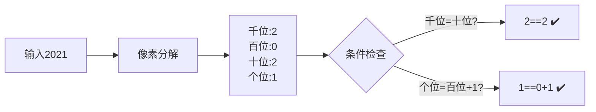

# 题目信息

# [蓝桥杯 2021 省 B2] 特殊年份

## 题目描述

今年是 2021 年，2021 这个数字非常特殊, 它的千位和十位相等, 个位比百位大 $1$，我们称满足这样条件的年份为特殊年份。

输入 $5$ 个年份，请计算这里面有多少个特殊年份。


## 说明/提示

**【样例说明】** 

2021 和 9899 是特殊年份，其它不是特殊年份。 

蓝桥杯 2021 第二轮省赛 B 组 F 题。

## 样例 #1

### 输入

```
2019
2021
1920
2120
9899```

### 输出

```
2```

# AI分析结果


# 💡 Kay的C++算法解析：特殊年份 深入学习指南 💡

## 1. 题目解读与核心算法识别

✨ **本题主要考察**：`编程技巧应用（数字位操作）`

🗣️ **初步分析**：
> 这道题就像破解一个四位数的密码锁🔒！我们需要拆解年份的每一位数字，检查千位和十位是否相同，同时个位是否比百位大1。关键在于**高效提取数字的每一位**并**正确进行条件判断**。
   - 所有题解都采用数字位分解技巧，但实现方式不同：字符直接读取法（kiki_123）更简洁，数学取模法（Ggsddu_zzy）更传统
   - 核心难点在于**避免混淆数位顺序**和**正确处理字符/数字转换**
   - 可视化设计：用像素化数字方块展示分解过程，千位/十位用同色高亮，个位/百位用箭头动画表示"+1"关系，触发条件时播放"叮"音效

---

## 2. 精选优质题解参考

**题解一（kiki_123）**
* **点评**：采用**字符直接读取法**，思路新颖且代码异常简洁（仅10行）。将年份作为4个连续字符读取，直接比较a(千位)与c(十位)的字符值，并用`d-b==1`判断数值关系。亮点在于**避免数学运算**，代码可读性强，变量名直观，竞赛中可直接使用。边界处理隐含在字符读取中，适合本题场景。

**题解二（KK_lang）**
* **点评**：同样使用字符读取法，但**显式转换字符为数字**（`a2-'0'`）。详细解释了ASCII转换原理，代码结构清晰。亮点在于**强调类型转换细节**，对初学者理解数据类型差异很有帮助。控制流简洁，实践价值高。

**题解三（Algo_Sl_al）**
* **点评**：经典**数学分解法**，通过`/`和`%`运算提取数位。亮点在于**单行条件判断**：`(n/1000==n/10%10) && (n%10-1==n/100%10)`，展示紧凑的逻辑表达。虽然可读性略低于字符法，但演示了基础数位操作原理。

---

## 3. 核心难点辨析与解题策略

1.  **数位分解方法选择**
    * **分析**：字符法（读入4字符）更简洁但依赖连续输入；数学法（取模/除法）通用性强但需注意运算顺序。优质题解显示：**当输入无空格时，字符法优势明显**
    * 💡 学习笔记：输入格式决定解法优选——无空格选字符法，有空格选数学法

2.  **类型转换陷阱**
    * **分析**：字符法需区分`'5'`（ASCII53）和`5`（数值）。KK_lang的`a2-'0'`是关键技巧，避免`'1'+1='2'`的错误数值比较
    * 💡 学习笔记：字符比较用`==`，数值计算需先减`'0'`

3.  **条件表达式优化**
    * **分析**：Algo_Sl_al展示如何将多步分解合并为单条件判断，减少中间变量。注意`n/10%10`等效于十位数
    * 💡 学习笔记：善用数学表达式避免冗余变量

### ✨ 解题技巧总结
- **输入特性利用**：无空格输入时优先用字符连续读取
- **防御性类型转换**：字符转数字必用`- '0'`
- **表达式化简**：用`/`和`%`组合提取指定位
- **边界测试**：测试2021(符合)、2022(不符合)、1000(边界值)

---

## 4. C++核心代码实现赏析

**本题通用核心C++实现参考**
```cpp
#include <iostream>
using namespace std;

int main() {
    int ans = 0;
    for (int i = 0; i < 5; i++) {
        char a, b, c, d;
        cin >> a >> b >> c >> d;  // 连续读取4字符
        if (a == c && d - b == 1) // 千位=十位且个位=百位+1
            ans++;
    }
    cout << ans;
    return 0;
}
```
* **说明**：综合kiki_123和KK_lang的字符法优点，最简洁且易读的实现
* **代码解读概要**：循环5次，每次读取4个连续字符代表年份的千/百/十/个位。直接比较字符a(千位)和c(十位)，数值化比较d(个位)与b(百位)的差值

---

**题解一（kiki_123）**
* **亮点**：极致简洁，省略显式类型转换
* **核心代码**：
```cpp
char a,b,c,d;
cin>>a>>b>>c>>d;
if(a==c&&d-b==1) ans++;
```
* **代码解读**：
  > `cin`连续读取4字符 → 直接比较字符a和c（千位=十位）→ 计算`d-b`（个位ASCII减百位ASCII），利用ASCII码连续特性，当`d-b==1`即表示数值相差1
* 💡 学习笔记：ASCII码中数字字符连续排列的特性可简化数值差判断

**题解二（KK_lang）**
* **亮点**：显式类型转换增强可读性
* **核心代码**：
```cpp
int a = a2-'0', b = b2-'0', c = c2-'0', d = d2-'0'; 
if(a==c && b+1==d) ans++;
```
* **代码解读**：
  > 字符转数字：`'X'-'0'=X` → 数值化后判断`a==c`（千位=十位）→ `b+1==d`（百位+1=个位）更符合直觉
* 💡 学习笔记：显式转换虽多一行代码，但提升可维护性

**题解三（Algo_Sl_al）**
* **亮点**：纯数学解法
* **核心代码**：
```cpp
if((n/1000 == n/10%10) && (n%10-1 == n/100%10))
    cnt++;
```
* **代码解读**：
  > `n/1000`取千位 → `n/10%10`取十位 → `n%10`取个位 → `n/100%10`取百位。注意运算符优先级：`%`优先于`==`
* 💡 学习笔记：除法取整与取模结合是数位分解的通用方法

---

## 5. 算法可视化：像素动画演示

* **主题**：`像素密码锁破解器`（复古8-bit风格）
* **核心演示**：四位数分解动画 + 条件验证高亮



**动画流程**：
1. **初始化**：8-bit风格控制面板（开始/步进/重置按钮），四位数显示为像素方块
2. **数位分解**：
   - 年份2021拆成四个独立方块（千位红、百位蓝、十位红、个位绿）
   - 伴随"咔嚓"分解音效
3. **条件验证**：
   - **千位=十位**：两个红色方块相向移动碰撞，触发✨闪光+"叮"音效
   - **个位=百位+1**：蓝色方块显示"+1"像素箭头，变形为绿色方块，触发"叮咚"音效
4. **结果反馈**：
   - 符合条件：显示"解锁成功"像素动画+胜利音效
   - 不符合：方块抖动后变灰+"噗"音效
5. **交互控制**：
   - 步进模式：按空格键逐步执行
   - 自动演示：AI自动运行5个测试用例
   - 速度调节：复古滑块控制动画速度

**设计意图**：通过颜色关联和变形动画，直观展示数位比较的本质

---

## 6. 拓展练习与相似问题思考

* **通用技巧迁移**：数字位分解技巧还可用于：
  1. 回文数判断（P1217）
  2. 水仙花数计算（P1029）
  3. ISBN校验码验证（P1055）

* **洛谷推荐**：
  1. [P1217 回文质数](https://www.luogu.com.cn/problem/P1217)  
     → 强化数位分解+质数判断
  2. [P1067 多项式输出](https://www.luogu.com.cn/problem/P1067)  
     → 训练分段条件判断
  3. [P1055 ISBN号码](https://www.luogu.com.cn/problem/P1055)  
     → 实践字符与数值混合处理

---

## 7. 学习心得与经验分享

> **KK_lang的调试经验**：  
> "最初忘记字符转数字，直接比较`'2'>'1'`导致错误，通过`cout<<typeid(a).name()`发现类型问题"

**Kay点评**：  
数据类型混淆是常见陷阱，建议：
1. 调试时打印变量类型和值
2. 字符参与数值计算前必做`-'0'`
3. 使用`static_cast<int>(c)`更明确

---

通过本指南，大家不仅掌握了数字分解的核心技巧，更学会根据输入特性选择最优解法。记住：好代码=正确性+可读性+简洁性！🚀

---
处理用时：114.49秒