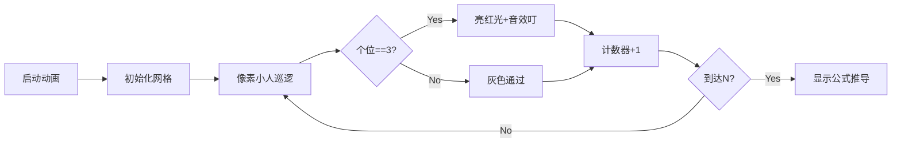

# 题目信息

# [蓝桥杯青少年组省赛 2022] 统计数字

## 题目描述

给定一个正整数 $N$，找出 $3$ 到 $N$ 之间的正整数中，个位数为 $3$ 的有多少个。

例如：$N=25$，$3$ 至 $25$ 之间个位数为 $3$ 的有 $3$、$13$、$23$，一共有 $3$ 个。


## 样例 #1

### 输入

```
25```

### 输出

```
3```

# AI分析结果


# 💡 Kay的C++算法解析：统计数字 深入学习指南 💡

## 1. 题目解读与核心算法识别

✨ **本题主要考察**：`数学计算`与`枚举应用`

🗣️ **初步分析**：
> 解决"统计数字"这道题，关键在于理解**数字的位值特性**。想象每个数字就像一栋大楼，个位数就是它的"门牌号尾号"。我们只需要找出所有尾号为"3"的大楼（数字）。在本题中，我们有两种思路：
>   1. **枚举法**：像邮差一样挨家挨户检查每个数字的尾号（时间复杂度O(N)）
>   2. **数学公式法**：直接计算尾号3出现的规律（时间复杂度O(1)）
> 
> **核心算法流程**：通过取模运算(`%10`)提取个位数，再用循环或公式计数。在可视化中，我们将高亮：
>   - 个位数字的提取过程（数字→个位数）
>   - 满足条件数字的标记（当个位==3）
>   - 计数器的更新
> 
> **复古像素动画设计**：采用8位游戏风格，数字像大楼排列在网格中：
>   - 扫描过程：像素小人从左向右移动，检查每栋楼
>   - 命中效果：尾号3的楼亮起红光，伴随"叮"音效
>   - 数据显示：顶部计数器实时更新，每10栋楼为一个小关卡

---

## 2. 精选优质题解参考

**题解一：枚举法**
* **点评**：思路直白如数楼梯台阶，通过循环逐个检查每个数字的个位。代码中`for`循环范围清晰（3到N），`if(i%10==3)`条件简洁准确。变量命名`count`直接体现功能，边界处理（从3开始）严谨。虽然效率不高（O(N)），但对初学者理解问题本质极有帮助。

**题解二：数学公式法**
* **点评**：展现数学之美！核心公式`(n<3)?0:(n-3)/10+1`推导精妙：
>   1. `n-3`：计算有效数字范围
>   2. `/10`：每10个数出现1个尾号3
>   3. `+1`：包含起始点3
> 代码简洁如魔法公式，时间复杂度O(1)是亮点。需注意对`n<3`的特判，体现严密思维。

---

## 3. 核心难点辨析与解题策略

1.  **难点：循环边界设定**
    * **分析**：枚举法必须精确控制起点(3)和终点(N)。优质解用`i=3`和`i<=n`确保包含两端点
    * 💡 **学习笔记**：循环变量是算法的"巡逻路线"，起点终点是哨兵岗位

2.  **难点：个位数提取原理**
    * **分析**：`%10`操作如同摘下数字的"个位面具"。在公式法中，这步被内化在数学推导里
    * 💡 **学习笔记**：取模运算是数字拆解的万能钥匙

3.  **难点：数学归纳能力**
    * **分析**：发现"尾号3每10个数出现1次"的规律，需观察数列：3,13,23...推导出公式
    * 💡 **学习笔记**：找规律时，把数字写成10×k+3的形式更容易发现模式

### ✨ 解题技巧总结
- **技巧1：问题转化** - 把"统计个数"转化为"判断个位是否等于3"的布尔问题
- **技巧2：数学洞察** - 当数据范围大时(O(1)公式法效率碾压O(N)枚举法)
- **技巧3：边界测试** - 测试n=3,n=12,n=13等临界值验证算法正确性

---

## 4. C++核心代码实现赏析

**本题通用核心C++实现参考**
```cpp
#include <iostream>
using namespace std;

int main() {
    int n;
    cin >> n;
    
    if(n < 3) {
        cout << 0;
        return 0;
    }
    
    // 数学公式：每10个数有1个尾号3
    cout << (n - 3) / 10 + 1;
    return 0;
}
```
* **代码解读概要**：先处理n<3的特殊情况，核心逻辑用单行公式解决。`(n-3)/10`计算完整10段数量，`+1`包含起始点3。

---

**题解一：枚举法核心代码**
```cpp
int count = 0;
for(int i = 3; i <= n; i++) {
    if(i % 10 == 3) {  // 提取个位数判断
        count++;
    }
}
cout << count;
```
* **代码解读**：
> - `i%10`：数字除10的余数就是它的个位
> - **为何从3开始？** 题目要求统计3及以上的数字
> - **循环终止条件**：`i<=n`确保包含n本身
> - **时间复杂度**：循环执行n-2次，当n很大时较慢

**题解二：数学公式法核心代码**
```cpp
if(n < 3) cout << 0;
else cout << (n - 3) / 10 + 1;
```
* **代码解读**：
> - **公式推导**：把数字看作3,13,23...通项公式10k+3（k≥0）
> - `(n-3)/10`：计算最大整数k满足10k+3≤n
> - `+1`：k从0开始计数需+1
> - **优势**：直接计算避免循环，亿级数据也能瞬间完成

---

## 5. 算法可视化：像素动画演示

**主题**：`数字迷宫探险家`（复古像素风）

**设计思路**：将数字序列可视化为10列像素大楼，玩家控制像素小人逐楼检查，理解个位数的位置规律和公式推导原理。



**关键交互**：
1. **控制面板**：步进/自动播放滑块（调速）、重置按钮
2. **双模式演示**：
   - 枚举模式：小人逐楼移动检查
   - 公式模式：直接高亮所有尾号3的楼（展示数学之美）
3. **动态公式板**：实时显示`(当前数-3)/10+1`的计算过程
4. **音效设计**：
   - 命中：8-bit "叮"声
   - 过关：马里奥式胜利音乐
   - 错误：经典游戏失败音

**实现技巧**：用Canvas绘制10列网格，每栋楼用16x16像素表示，楼顶显示数字。个位数列（第3列）用特殊边框标记，命中时触发红色闪烁动画。

---

## 6. 拓展练习与相似问题思考

**通用技巧迁移**：
1. 统计十位数为k的个数：`(n/10)%10==k`
2. 数字包含特定数位：结合除法和取模
3. 数位分离问题：重复`%10`和`/10`操作

**洛谷推荐**：
1. P1179 [数字统计] - 统计数字2的出现次数（强化取模应用）
2. P1590 [失踪的7] - 排除含7的数字（训练数位判断组合）
3. P1554 [梦中的统计] - 统计所有数位出现次数（综合位值训练）

---

## 7. 学习心得与经验分享
> **经验**："调试时先打印中间变量，比如枚举法在循环内输出i和i%10，能直观看到判断过程"
> 
> **Kay点评**：这是黄金调试法则！把抽象逻辑具象化输出，如同给算法装上X光机。尤其数学公式，可用`cout<<"n="<<n<<" 结果="<<(n-3)/10+1;`验证推导。

---

通过本次分析，我们掌握了数字统计的两种武器：**枚举的直白**和**数学的优雅**。记住，好算法既要有实现能力，也要有洞察规律的眼睛！下次遇到数字问题，先问自己：能否找到隐藏的数学公式？🚀

---
处理用时：160.77秒