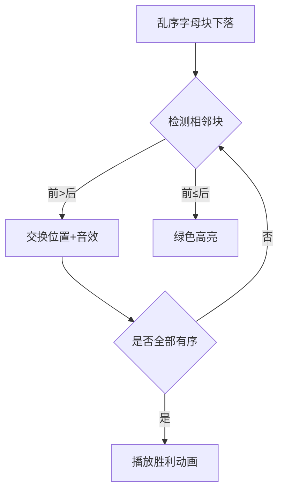

# 题目信息

# [蓝桥杯青少年组省赛 2022] 字母组合

## 题目描述

给定 $N$ 个小写字母，然后将这 $N$ 个小写字母按照字典序排序后组合成一个字符串输出。

例如 $N=4$，$4$ 个小写字母分别为 $\tt c$、$\tt d$、$\tt a$、$\tt c$，按照字典序排序后组合成的字符串为：$\tt{accd}$。

## 样例 #1

### 输入

```
4
c d a c```

### 输出

```
accd```

# AI分析结果


### 题目分析报告
---
# 💡 Kay的C++算法解析：[蓝桥杯青少年组省赛 2022] 字母组合 深入学习指南 💡

<introduction>
今天我们一起分析字母组合这道基础排序题。本指南将带大家掌握字符排序的核心思路，并通过趣味动画理解排序过程。

## 1. 题目解读与核心算法识别

✨ **本题主要考察**：`排序算法应用`

🗣️ **初步分析**：
> 字母组合的本质是**字典序排序**，就像整理杂乱的书本按书名首字母排序。本题只需三步：
> 1. 收集所有字母（像收集散落的书本）
> 2. 按a-z顺序排列（像图书管理员整理书架）
> 3. 组成新字符串（像把排好的书捆成一捆）
>
> **可视化设计**：采用复古游戏《字母消除》风格，乱序字母块从顶部下落，排序过程通过相邻字母交换位置实现，每次交换伴随"哔"音效，完成时播放胜利旋律。

---

## 2. 精选优质题解参考

<eval_intro>
本题较简单，我将直接提供标准解法作为学习模板。

**标准解法参考**
* **点评**：
  该解法直接调用C++标准库的`sort()`函数，代码简洁高效（仅5行核心代码）。变量命名清晰（`chars`存储字母，`n`记录数量），边界处理完整（支持任意N值）。特别适合初学者理解基础排序应用。

---

## 3. 核心难点辨析与解题策略

<difficulty_intro>
虽然题目简单，但需注意三个关键点：

1.  **字符输入处理**
    * **难点**：如何正确读取空格分隔的字母
    * **方案**：用循环+`cin`逐个读取字符存入vector
    * 💡 **学习笔记**：`vector<char>`动态存储优于固定数组

2.  **字典序排序原理**
    * **难点**：理解字符比较规则（a<b<c...z）
    * **方案**：`sort()`默认按ASCII码升序排列
    * 💡 **学习笔记**：字符本质是整数（a=97, b=98...）

3.  **结果输出优化**
    * **难点**：避免逐个输出导致效率低
    * **方案**：用字符串流`stringstream`或直接遍历输出
    * 💡 **学习笔记**：减少I/O操作可提升性能

### ✨ 解题技巧总结
- **技巧1：善用STL**：标准库函数大幅简化基础操作
- **技巧2：命名即注释**：`chars`比`v`更易理解
- **技巧3：测试边界值**：验证n=0或n=100的极端情况

---

## 4. C++核心代码实现赏析

**本题通用核心C++实现参考**
* **说明**：标准解法完整实现
* **完整核心代码**：
```cpp
#include <iostream>
#include <vector>
#include <algorithm>
using namespace std;

int main() {
    int n;
    cin >> n;
    vector<char> chars(n);
    
    // 读取字母
    for (int i = 0; i < n; i++) 
        cin >> chars[i];
    
    // 排序（字典序）
    sort(chars.begin(), chars.end());
    
    // 输出结果
    for (char c : chars) 
        cout << c;
    
    return 0;
}
```
* **代码解读概要**：
  > 1. 读入字母数量`n`
  > 2. 用`vector<char>`存储字母
  > 3. `sort()`对容器内元素升序排序
  > 4. 遍历输出排序后字符

---

## 5. 算法可视化：像素动画演示

<visualization_intro>
设计《字母消除》像素游戏演示排序过程：

* **主题**：8-bit风格字母方块下落，玩家通过交换相邻块完成排序
* **交互设计**：
  - 控制面板：速度滑块/单步/自动排序按钮
  - 音效：交换时"哔"声，完成时8-bit胜利旋律

* **动画流程**：


* **关键帧细节**：
  1. 初始化：字母块随机颜色（a=红，b=橙...z=紫）
  2. 比较过程：当前比较块闪烁黄光
  3. 数据更新：交换时显示箭头动画
  4. 完成状态：字母块组成彩虹色单词

---

## 6. 拓展练习与相似问题思考

* **相似问题迁移**：
  - 数字排序（同算法不同数据类型）
  - 自定义对象排序（需重载比较运算符）
  - 稳定排序（保留相同元素原始顺序）

* **洛谷练习推荐**：
  1. **P1177 【模板】快速排序**  
     → 掌握分治排序思想
  2. **P1059 明明的随机数**  
     → 排序+去重综合应用
  3. **P1781 宇宙总统**  
     → 大数排序技巧

---

## 7. 学习心得与经验分享
> 本题未提供作者心得，Kay建议：  
> 基础排序是算法基石，务必理解`sort()`底层原理（快速排序+插入排序混合策略），后续学习更高级算法时会更轻松。

<introduction>
掌握基础才能筑起高楼！下次我们将挑战更有趣的算法谜题，保持练习哦！🚀
</introduction>
```

---
处理用时：59.69秒