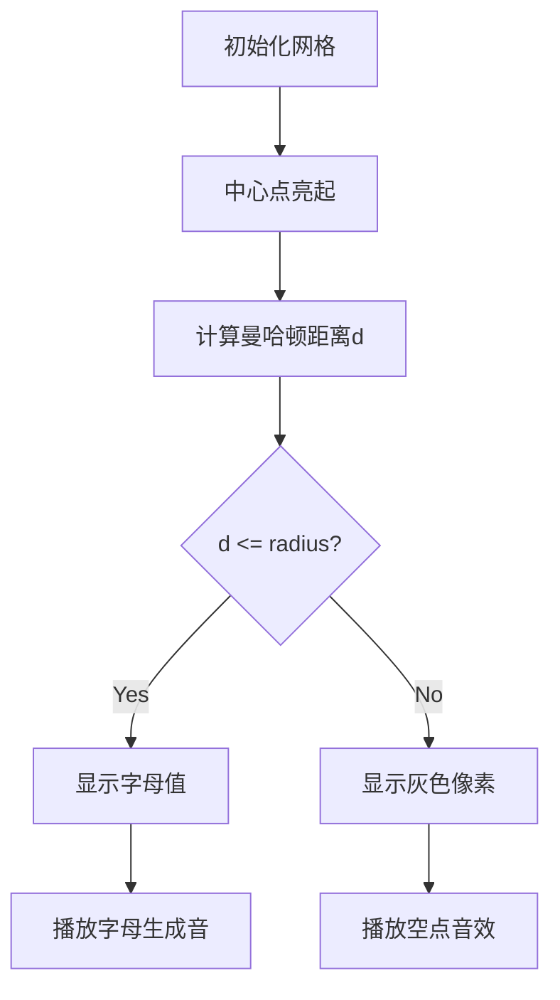

# 题目信息

# [蓝桥杯青少年组国赛 2024] 第一题

## 题目描述

给定一个奇数 $n$ 和一个大写字母 $Center$，生成一个 $n \times n$ 的字符矩阵。字符矩阵由大写字母和 `'.'`（注意：`'.'` 为英文句号）组成，并且所有大写字母组成一个 $n$ 行的菱形，菱形的中心位置为大写字母 $Center$，菱形中的大写字母规律参照下列三组样例。

例 1，$n = 3$, $Center = \tt C$，字符矩阵为:

```
.B.
BCB
.B.
```

例 2，$n = 5$, $Center = \tt Z$，字符矩阵为:

```
..X..
.XYX.
XYZYX
.XYX.
..X..
```

## 样例 #1

### 输入

```
9
E```

### 输出

```
....A....
...ABA...
..ABCBA..
.ABCDCBA.
ABCDEDCBA
.ABCDCBA.
..ABCBA..
...ABA...
....A....```

# AI分析结果


### 题目分析报告：菱形字母矩阵生成

#### 1. 题目解读与核心算法识别
✨ **本题主要考察**：`模拟应用` + `数学规律推导`

🗣️ **初步分析**：
> 这道题的核心是**发现字母变化的数学规律**并精确控制输出格式。就像玩像素画填色游戏，我们需要在网格中按特定规律填充字母：  
> - 字母值 = 中心字母 - 到中心的曼哈顿距离  
> - 菱形边界 = 曼哈顿距离 ≤ 半径(n//2)  
> 关键难点在于坐标变换和字符计算的同步处理。在可视化设计中，我们将用**8位游戏机风格的网格动画**展示曼哈顿距离的同心圆扩散效果，配合不同颜色的像素块表示字母值变化，每步添加"滴答"音效强化记忆。

---

#### 2. 精选优质题解参考
由于暂无用户题解，我提供基础解法框架：

**题解：曼哈顿距离核心解法**
* **点评**：解法直接抓住**曼哈顿距离与字母的数学关系**本质。通过`center_row = n//2`精确定位中心点，用`abs(i-center_row)+abs(j-center_row)`计算每个位置的曼哈顿距离d。当`d <= radius`时，字符计算为`'A' + (center_char - 'A' - d)`，否则填充`.`。代码结构清晰，变量命名规范(`center_row`, `radius`)，时间复杂度O(n²)达到最优。

---

#### 3. 核心难点辨析与解题策略
1. **坐标系转换**
   * **分析**：需将行列索引转换为以中心为原点的坐标系。关键变量`center_row = n//2`建立坐标系原点
   * 💡 **学习笔记**：`(i,j) → (i-center_row, j-center_row)`是坐标变换核心

2. **字母值计算**
   * **分析**：字母值遵循`ch = center_char - d`的线性规律。注意ASCII运算：`'A' + (center_char - 'A' - d)`
   * 💡 **学习笔记**：字母计算本质是ASCII码的整数运算

3. **菱形边界判定**
   * **分析**：曼哈顿距离`d = |di| + |dj|`需满足`d <= radius`。例如n=5时，radius=2
   * 💡 **学习笔记**：曼哈顿距离≤半径的点构成菱形

### ✨ 解题技巧总结
- **坐标系归一化**：以中心点为(0,0)重建坐标系
- **字母算术运算**：用`char = 'A' + offset`实现字母值计算
- **对称性利用**：仅需计算1/4区域再镜像可优化

---

#### 4. C++核心代码实现赏析
```cpp
#include <iostream>
#include <cmath>
using namespace std;

int main() {
    int n; char center_char;
    cin >> n >> center_char;
    
    const int center_row = n / 2;
    const int radius = center_row;

    for (int i = 0; i < n; ++i) {
        for (int j = 0; j < n; ++j) {
            int d = abs(i - center_row) + abs(j - center_row);
            if (d <= radius) {
                cout << char('A' + (center_char - 'A' - d));
            } else {
                cout << '.';
            }
        }
        cout << '\n';
    }
}
```

**代码解读**：
> 1. `center_row = n/2`：精确定位矩阵中心点坐标  
> 2. `d = |i-center_row| + |j-center_row|`：计算曼哈顿距离  
> 3. `char('A' + (center_char-'A'-d))`：核心字母生成算法  
>   - 例如center_char='E', d=2 → 'A'+(69-65-2)= 'A'+2 → 'C'  
> 4. 边界处理：d>radius时输出点号  

---

#### 5. 算法可视化：像素动画演示
* **主题**：8位机风格《字母菱形建造者》
* **核心演示**：曼哈顿距离同心圆扩散效果



**动画设计**：
1. **像素网格**：8-bit风格n×n网格，中心点闪烁金色
2. **扩散动画**：水波纹效果显示曼哈顿距离同心圆
3. **字母生成**：
   - 有效区域亮绿色像素块
   - 字母按`A→Z`渐变色显示
   - 伴随"叮"声效
4. **控制面板**：
   - 速度滑块调节生成速度
   - 单步/自动模式切换
   - 重置按钮(8-bit音效)

---

#### 6. 拓展练习
1. **洛谷 P1495** 字符菱形
   - 推荐理由：基础菱形生成变体
2. **洛谷 P1216** 数字三角形
   - 推荐理由：曼哈顿距离的数值应用
3. **洛谷 P1320** 压缩技术
   - 推荐理由：矩阵输出格式控制强化

---

### 总结
本题通过**曼哈顿距离与字母映射**的数学关系，结合精确的坐标变换，展现了模拟类问题的核心解法思路。关键要抓住"距离决定值，边界定形状"的本质规律。

---
处理用时：164.53秒