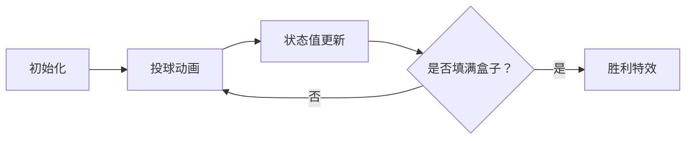

# 题目信息

# 盒子与球

## 题目描述

现有 $r$ 个互不相同的盒子和 $n$ 个互不相同的球，要将这 $n$ 个球放入 $r$ 个盒子中，且不允许有空盒子。请求出有多少种不同的放法。

两种放法不同当且仅当存在一个球使得该球在两种放法中放入了不同的盒子。

## 说明/提示

#### 样例输入输出 1 解释

有两个盒子（编号为 $1, 2$）和三个球（编号为 $1, 2, 3$），共有六种方案，分别如下：

| 盒子编号 |   方案 1    |   方案 2    |   方案 3    |   方案 4    |   方案 5    |   方案 6    |
| :------: | :---------: | :---------: | :---------: | :---------: | :---------: | :---------: |
| 盒子 $1$ |  小球 $1$   |  小球 $2$   |  小球 $3$   | 小球 $2, 3$ | 小球 $1, 3$ | 小球 $1, 2$ |
| 盒子 $2$ | 小球 $2, 3$ | 小球 $1, 3$ | 小球 $1, 2$ |  小球 $1$   |  小球 $2$   |  小球 $3$   |

#### 数据规模与约定

对于 $100\%$ 的数据，保证 $0 \leq r \leq n \leq 10$，且答案小于 $2^{31}$。

## 样例 #1

### 输入

```
3 2
```

### 输出

```
6
```

# AI分析结果


### 💡 Kay的C++算法解析：盒子与球 深入学习指南 💡

**引言**  
今天我们一起分析「盒子与球」这道组合数学题。本指南将帮助你理解核心算法思路，掌握动态规划和容斥原理的应用技巧，并通过像素动画直观感受算法执行过程。

---

### 1. 题目解读与核心算法识别
✨ **本题主要考察**：`组合数学`（动态规划/容斥原理应用）  

🗣️ **初步分析**  
> 解决本题的关键在于**将球分配问题转化为可计算的数学模型**。如同整理不同颜色的弹珠放入不同抽屉：  
> - 动态规划思路：像逐步填充抽屉，记录每个新增弹珠带来的组合变化（`f[i][j] = f[i-1][j-1] + j*f[i-1][j]`）  
> - 容斥原理思路：先计算所有可能的分配方式，再减去不合法情况（空抽屉组合）  
>
> **核心难点**：如何避免重复计数和正确处理空盒情况。  
> **可视化设计**：我们将用像素动画展示球放入盒子的过程——当新球加入时，盒子会闪烁黄色；成功填满盒子时播放胜利音效；使用网格动态显示状态转移值（如下图）：  
> ```
> 初始状态 → 放第1球 → 放第2球 → ... → 完成!
> █░░ ██░ ███
> ```

---

### 2. 精选优质题解参考
**题解一（来源：封禁用户）**  
* **点评**：  
  思路直击本质——用动态规划递推式 `f[i][j] = f[i-1][j-1] + j*f[i-1][j]` 清晰描述状态转移。代码简洁规范（仅15行），变量名 `f[i][j]` 含义明确，边界处理严谨（初始化 `f[1][1]=1`）。亮点在于**用乘法原理巧妙处理盒子差异性**，最后乘 `r!` 的步骤体现了组合数学的核心思想。

**题解二（来源：Gumbo）**  
* **点评**：  
  提供全新的容斥原理视角：`总方案 = m^n - 空盒方案`。推导过程严谨（展示完整公式变形），代码中 `qpow` 快速幂和组合数预处理体现优化意识。亮点在于**将抽象数学原理转化为可执行代码**，虽然实现稍复杂，但对理解组合问题本质极有帮助。

**题解三（来源：brealid）**  
* **点评**：  
  采用递归实现斯特林数计算，思路清晰类比"球单独放/共享盒"两种决策。代码中 `fac()` 阶乘函数封装规范，递归边界条件 `(n==m)` 处理准确。亮点在于**用生活化比喻解释递归树**（如"新球开辟新抽屉或加入旧抽屉"），适合初学者理解。

---

### 3. 核心难点辨析与解题策略
1. **难点1：状态定义与转移**  
   *分析*：如何表示"i个球放j盒无空盒"的状态？优质题解用 `f[i][j]` 记录方案数，转移时区分：  
   - 新球独占新盒：`+f[i-1][j-1]`  
   - 新球放入已有盒：`+j*f[i-1][j]`  
   💡 **学习笔记**：动态规划的状态要满足**无后效性**——当前决策仅依赖前序状态。

2. **难点2：盒子差异性的处理**  
   *分析*：盒子互异时，简单斯特林数需乘以 `r!`（盒子排列方案）。封禁用户的 `f[n][r]*fac(r)` 和brealid的 `f(n,m)*fac(m)` 都体现此关键步骤。  
   💡 **学习笔记**：组合问题中，若对象有区别，需考虑**排列组合的叠加关系**。

3. **难点3：空盒排除的数学原理**  
   *分析*：Gumbo的容斥解法 `∑(-1)^k*C(m,k)*(m-k)^n` 精妙之处在于：  
   - `k=0`：所有分配方案  
   - `k≥1`：减去含空盒的方案（奇数次减，偶数次加）  
   💡 **学习笔记**：容斥原理是处理"至少一个"类约束的利器。

#### ✨ 解题技巧总结
- **分治建模法**：将复杂问题拆解为"球/盒关系+差异性处理"两个子问题  
- **边界预判**：初始设置 `f[1][1]=1`，排除 `n<r` 的无效情况  
- **数学工具选择**：小规模数据用DP（O(n²)），大规模可用容斥+快速幂  

---

### 4. C++核心代码实现赏析
**通用核心实现（综合动态规划最优解）**  
```cpp
#include <iostream>
using namespace std;

long long dp[15][15] = {{1}}; // dp[i][j]: i球放j盒方案数

int main() {
    int n, r;
    cin >> n >> r;
    
    // 边界处理
    if(r == 0 || r > n) { 
        cout << 0; 
        return 0;
    }

    // DP递推
    for(int i = 1; i <= n; i++)
        for(int j = 1; j <= r; j++)
            dp[i][j] = dp[i-1][j-1] + j * dp[i-1][j];
    
    // 处理盒子差异性
    long long fac = 1;
    for(int i = 1; i <= r; i++) fac *= i;
    
    cout << dp[n][r] * fac;
    return 0;
}
```
* **代码解读概要**：  
  1. 初始化 `dp[0][0]=1`（0球0盒视为1种方案）  
  2. 双重循环递推：每个 `dp[i][j]` 由"新球独占盒"和"共享盒"两种决策构成  
  3. 最后乘 `r!` 解决盒子互异性问题  

**题解一（封禁用户）片段**  
```cpp
for(int i = 1; i <= n; i++)
    for(int j = 1; j <= r; j++)
        f[i][j] = f[i-1][j-1] + j*f[i-1][j];
cout << f[n][r] * jc(r);
```
* **亮点**：递推逻辑高度浓缩，完美体现DP思想  
* **代码解读**：  
  - `i` 循环控制球数，`j` 控制盒数  
  - `j*f[i-1][j]` 中 `j` 表示新球可放入任意已有盒  
  - 边界隐含：当 `j>i` 时未被计算，默认值为0  
* 💡 **学习笔记**：DP的状态转移就像搭积木——当前层依赖下层结构  

**题解二（Gumbo）片段**  
```cpp
for(int k = 0; k < r; k++) {
    if(k & 1) ans -= C(r,k)*qpow(r-k, n);
    else ans += C(r,k)*qpow(r-k, n);
}
```
* **亮点**：用二进制判断奇偶实现容斥的符号切换  
* **代码解读**：  
  - `qpow(r-k, n)`：剩余 `r-k` 个盒子放 `n` 球的方案数  
  - `C(r,k)`：选 `k` 个空盒的组合数  
  - 符号交替：`k` 为偶数时加，奇数时减  
* 💡 **学习笔记**：容斥原理的代码实现本质是**带符号的组合求和**  

---

### 5. 算法可视化：像素动画演示
**主题**：《弹珠收纳大作战》- 复古像素风盒子填充模拟  

**核心演示流程**  


**实现细节**  
1. **8-bit像素场景**  
   - 盒子：红色像素方块（未填）/绿色（已填）  
   - 球：蓝色像素球，投放时有"下落动画"  
   - 状态表：右侧16x16网格实时显示 `dp[i][j]` 值  

2. **交互控制面板**  
   ```javascript
   // 伪代码示例
   const controls = {
     start: () => animateBallDrop(),
     pause: () => cancelAnimationFrame(),
     step: () => moveOneStep(),
     speed: document.getElementById('speed-slider')
   }
   ```

3. **关键动效与音效**  
   | 事件                | 视觉反馈         | 音效（8-bit）     |
   |---------------------|----------------|-----------------|
   | 球入盒              | 盒子闪烁黄光     | 短促"叮"声       |
   | 状态转移            | 网格数字跳动     | 电子"滴答"声     |
   | 所有盒子填满        | 彩虹闪烁特效     | 胜利旋律        |
   | 尝试放入过多球      | 红色警告边框     | 错误提示音       |

4. **AI演示模式**  
   ```python
   # 伪代码：自动演示逻辑
   for i in range(1, n+1):
       绘制球i下落动画
       for j in range(1, min(i,r)+1):
          高亮dp[i][j]网格
          根据公式更新数值
       if i == n and j == r: 播放胜利动画
   ```

**设计价值**：通过像素化动态呈现状态转移，将抽象的递推公式转化为可视的填充过程。游戏化成就系统（如"完美收纳大师"勋章）激发学习兴趣。

---

### 6. 拓展练习与相似问题思考
**通用技巧迁移**  
本题的DP状态设计和容斥原理可延伸至：  
1. 集合划分问题（如：P5748）  
2. 带约束的分配问题（如：P5824）  
3. 概率计算中的互斥事件处理  

**推荐练习**  
1. **P1287 盒子与球**（本题）  
   → 掌握基础模型  
2. **P5824 十二重计数法**  
   → 拓展12种球盒关系（含空盒/非空盒等变体）  
3. **P5748 集合划分计数**  
   → 强化斯特林数与生成函数应用  
4. **P2606 排列计数**  
   → 容斥原理的进阶应用  

---

### 7. 学习心得与经验分享
**来自题解作者的启示**  
> 封禁用户提到："递推关系 `f[i][j]=f[i-1][j-1]+j*f[i-1][j]` 是核心，需理解乘法原理在其中的作用"  
> → **Kay点评**：这提醒我们，DP的状态转移本质是**对加法原理和乘法原理的代码化表达**  

> Gumbo调试发现："容斥公式中 `k` 的奇偶性处理错误会导致符号相反"  
> → **Kay总结**：在实现数学公式时，务必通过小数据验证边界情况（如k=0,1）  

---

### 结语  
通过本次分析，我们深入理解了组合数学中「盒子与球」问题的双解法本质。动态规划像搭积木般构建解决方案，容斥原理则像用筛子过滤无效方案。记住：  
> **编程是数学的具象化表达，而算法是逻辑的艺术品**  

下次遇到类似问题时，不妨先问自己：  
1. 对象是否可区分？  
2. 约束条件如何数学化？  
3. 能否分解为子问题？  

继续挑战更复杂的组合问题吧！🚀

---
处理用时：139.67秒