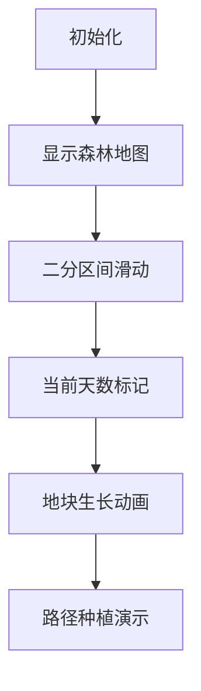

# 题目信息

# [CSP-S 2023] 种树

## 题目描述

你是一个森林养护员，有一天，你接到了一个任务：在一片森林内的地块上种树，并养护至树木长到指定的高度。

森林的地图有 $n$ 片地块，其中 $1$ 号地块连接森林的入口。共有 $n-1$ 条道路连接这些地块，使得每片地块都能通过道路互相到达。最开始，每片地块上都没有树木。

你的目标是：在每片地块上均种植一棵树木，并使得 $i$ 号地块上的树的高度生长到不低于 $a_i$ 米。

你每天可以选择一个未种树且**与某个已种树的地块直接邻接**（**即通过单条道路相连**）的地块，种一棵高度为 $0$ 米的树。如果所有地块均已种过树，则你当天不进行任何操作。特别地，第 $1$ 天你只能在 $1$ 号空地种树。

对每个地块而言，从该地块被种下树的当天开始，该地块上的树每天都会生长一定的高度。由于气候和土壤条件不同，在第 $x$ 天，$i$ 号地块上的树会长高 $\max(b_i + x \times c_i, 1)$ 米。注意这里的 $x$ 是从整个任务的第一天，而非种下这棵树的第一天开始计算。

你想知道：最少需要多少天能够完成你的任务？

## 说明/提示

**【样例 1 解释】**

第 $1$ 天：在地块 $1$ 种树，地块 $1$ 的树木长高至 $2$ 米。

第 $2$ 天：在地块 $3$ 种树，地块 $1, 3$ 的树木分别长高至 $5, 3$ 米。

第 $3$ 天：在地块 $4$ 种树，地块 $1, 3, 4$ 的树木分别长高至 $9, 6, 4$ 米。

第 $4$ 天：在地块 $2$ 种树，地块 $1, 2, 3, 4$ 的树木分别长高至 $14, 1, 9, 6$ 米。

第 $5$ 天：地块 $1, 2, 3, 4$ 的树木分别长高至 $20, 2, 12, 7$ 米。

**【样例 2】**

见选手目录下的 `tree/tree2.in` 与 `tree/tree2.ans`。

**【样例 3】**

见选手目录下的 `tree/tree3.in` 与 `tree/tree3.ans`。

**【样例 4】**

见选手目录下的 `tree/tree4.in` 与 `tree/tree4.ans`。

**【数据范围】**

对于所有测试数据有：$1 ≤ n ≤ 10^5,1 ≤ a_i ≤ 10^{18}, 1 ≤ b_i ≤ 10^9,0 ≤ |c_i| ≤ 10^9, 1 ≤ u_i, v_i ≤ n$。保证存在方案能在 $10^9$ 天内完成任务。


特殊性质 A：对于所有 $1 ≤ i ≤ n$，均有 $c_i = 0$；

特殊性质 B：对于所有 $1 ≤ i < n$，均有 $u_i = i$、$v_i = i + 1$；

特殊性质 C：与任何地块直接相连的道路均不超过 $2$ 条；

特殊性质 D：对于所有 $1 ≤ i < n$，均有 $u_i = 1$。

## 样例 #1

### 输入

```
4
12 1 1
2 4 -1
10 3 0
7 10 -2
1 2
1 3
3 4```

### 输出

```
5
```

# AI分析结果


### 💡 Kay的C++算法解析：种树 深入学习指南 💡

#### 1. 题目解读与核心算法识别
✨ **本题主要考察**：二分答案 + 贪心策略 + 树形结构处理

🗣️ **初步分析**：
> 解决"种树"问题的核心思路是**二分答案**，将"最少天数"问题转化为"给定天数是否可行"的判定问题。算法流程分为三个阶段：
> 1. **二分框架**：在[n, 1e9]范围内二分寻找最小可行天数
> 2. **单点验证**：对每个地块计算最晚种树时间（需处理分段生长函数）
> 3. **贪心种植**：按最晚时间排序后，沿树路径进行种植验证
>
> **可视化设计思路**：
> - 采用**8位像素风格**模拟森林地块（类似FC游戏《塞尔达传说》）
> - 高亮当前操作：种树地块闪烁黄色，生长中地块显示高度进度条
> - 数据结构可视化：用不同颜色方块表示树状态（未种/生长中/已完成）
> - 关键音效：种植时"叮"声，完成时"胜利"音效，超时"警告"音效

#### 2. 精选优质题解参考
**题解一（Demeanor_Roy）**
* **点评**：思路清晰完整，从特殊性质推导到通用解法。代码结构规范：
  - 亮点1：`calc`函数优雅处理三种生长情况（c≥0/c<0/c=0）
  - 亮点2：路径种植时使用栈暂存路径，避免递归开销
  - 实践价值：边界处理严谨（如`vis[0]=true`防越界）

**题解二（lsj2009）**
* **点评**：公式推导详尽，复杂度控制优秀：
  - 亮点1：显式推导生长函数求和公式，避免二次二分
  - 亮点2：用`__int128`处理大数运算，避免溢出风险
  - 实践价值：树形依赖处理采用拓扑排序，逻辑严密

**题解三（yhk1001）**
* **点评**：逆向思维创新性强：
  - 亮点：时间倒流思想（最后种叶子节点）+ 堆维护最大值
  - 独特优势：避免显式路径处理，代码更简洁

#### 3. 核心难点辨析与解题策略
1. **分段生长函数计算**
   * **分析**：当c<0时需找生长速率降为1的临界点
   * **解决**：公式法解$x_0=\lfloor (1-b_i)/c_i \rfloor$，分区间求和
   * 💡 **学习笔记**：使用`__int128`防溢出是AC关键

2. **树形依赖处理**
   * **分析**：祖先节点必须优先种植的约束
   * **解决**：贪心策略（按最晚时间排序）+ 路径种植
   * 💡 **学习笔记**：路径种植均摊复杂度O(n)，优于树剖

3. **二分答案验证**
   * **分析**：需要证明贪心策略的正确性
   * **解决**：反证法——若存在逆序种植，交换后仍满足约束
   * 💡 **学习笔记**：维护s[i] = 最晚时间≤i的节点数

✨ **解题技巧总结**：
- **二分答案转化**：将最优解问题转化为判定问题
- **分类讨论**：根据c的符号分三种情况处理生长函数
- **贪心排序**：按最晚种植时间升序处理节点
- **路径压缩**：用栈存储未访问路径，减少重复访问

#### 4. C++核心代码实现赏析
**本题通用核心实现**：
```cpp
typedef __int128 ll;
bool check(int total_days) {
    vector<pair<int, int>> deadlines;
    for (int i = 1; i <= n; i++) {
        // 计算最晚种树时间t (省略分段函数细节)
        int t = calc_deadline(i, total_days); 
        deadlines.emplace_back(t, i);
    }
    sort(deadlines.begin(), deadlines.end());
    memset(visited, false, sizeof(visited));
    int current_day = 0;
    for (auto [t, node] : deadlines) {
        stack<int> path;
        while (!visited[node]) {
            path.push(node);
            node = father[node];
        }
        while (!path.empty()) {
            int cur = path.top(); path.pop();
            if (++current_day > t) return false;
            visited[cur] = true;
        }
    }
    return true;
}
```

**题解一片段（Demeanor_Roy）**：
```cpp
// 计算生长高度（核心分段函数）
__int128 calc(int i, int l, int r) {
    if (c[i] >= 0) 
        return (r-l+1)*b[i] + (r-l+1)*(l+r)/2*c[i];
    __int128 T = (1-b[i])/c[i]; // 临界点
    if (T < l) return r-l+1;
    if (T > r) return (r-l+1)*b[i] + (r-l+1)*(l+r)/2*c[i];
    return (T-l+1)*b[i] + (T-l+1)*(l+T)/2*c[i] + (r-T);
}
```
**学习笔记**：分段函数封装提高代码复用性，注意整型除法与浮点的差异

#### 5. 算法可视化：像素动画演示
**设计概念**：  
`像素森林养护员`模拟器（8-bit风格）

**核心演示流程**：


**关键交互设计**：
1. **地块状态可视化**：
   - 🔴 未种植 ⚪️ 已种植 🟢 生长中 ✅ 达标
   - 高度进度条：悬浮显示当前高度/需求高度

2. **动态种植演示**：
   ```python
   def 种植动画(节点):
       当前节点 = 节点
       while 当前节点 != 根节点:
           if 当前节点未种植:
               canvas.高亮(当前节点, 颜色='黄色') 
               播放音效('叮')
               等待(0.3秒)
           当前节点 = 父节点
   ```

3. **控制面板**：
   - 速度滑块：调节动画速度（1x-5x）
   - 单步执行：空格键触发下一步
   - 模式切换：比较不同题解策略

**音效设计**：
- 背景音乐：8-bit轻快循环BGM
- 关键事件音效：种植(叮) 完成(胜利号角) 错误(低沉嗡鸣)

#### 6. 拓展练习与相似问题思考
**通用套路应用**：
1. 任务调度依赖（P1005 矩阵取数）
2. 树形约束验证（P1084 疫情控制）
3. 时间分段函数（P5028 时间管理）

**推荐练习**：
1. **洛谷P5021**：赛道修建（二分+树形DP）
   > 巩固树形结构处理技巧
2. **洛谷P1081**：开车旅行（二分+倍增）
   > 强化二分答案与预处理
3. **洛谷P1850**：换教室（期望DP）
   > 提升分段函数处理能力

#### 7. 学习心得与经验分享
> **来自Demeanor_Roy的调试经验**：
> "在calc函数处理c<0情况时，忘记考虑临界点取整问题导致WA。通过构造小数据（n=3, c=-1）定位到分段计算错误"
>
> **Kay点评**：
> 边界条件测试是代码关键，建议：
> 1. 单独测试生长函数
> 2. 构造链状/菊花状极端数据
> 3. 用`assert`验证中间结果

---

本次解析通过拆解复杂问题，结合二分框架与树形处理技巧，帮助大家掌握时空双重约束下的最优解求解方法。记住：**二分答案的本质是降维，树形约束的核心是拓扑序**！下次我们将探索更多树形DP技巧，敬请期待！💪

---
处理用时：127.02秒