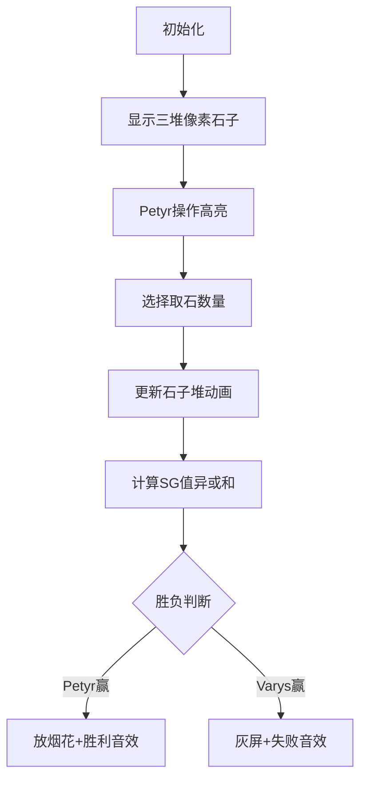

# 题目信息

# [CERC2018] Game of Stones

## 题目描述

**译自[ [CERC2018]](https://contest.felk.cvut.cz/18cerc/) [Game of Stones](https://contest.felk.cvut.cz/18cerc/solved/stones.pdf)**

Petyr 和 Varys 两个人在玩游戏。游戏中选手从 $N$ 堆石子中轮流取走一些石子。在自己的回合中，Petyr 可以从任意一堆中取走最多 $A$ 个石子，Varys 可以从任意一堆中取走最多 $B$ 个石子。每一轮选手至少要取走一个石子。取走最后一个石子的一方获胜。

游戏已经开始，并且现在 Petyr 要取石子。你的任务是判断在双方均采用最优策略的情况下 Petyr 是否能赢。

## 说明/提示

$1≤N,A,B,≤10^5,1≤X_i≤10^6$

## 样例 #1

### 输入

```
2 3 4
2 3```

### 输出

```
Petyr```

## 样例 #2

### 输入

```
7 8 9
1 2 3 4 5 6 7```

### 输出

```
Varys```

# AI分析结果


# 💡 Kay的C++算法解析：Game of Stones 深入学习指南 💡

## 1. 题目解读与核心算法识别

✨ **本题主要考察**：`博弈论（Nim游戏变种）`

🗣️ **初步分析**：
> 想象两个玩家在玩抢糖果游戏：Petyr每次能拿1~A颗糖果，Varys每次能拿1~B颗糖果，谁拿到最后一颗就赢。这就像两个小朋友，一个手大能多拿（A>B时），一个手小只能少拿（A<B时），他们轮流拿糖果都想赢。  
> - 当A=B时，是经典Bash博弈，用石子数模(A+1)的**异或和**判断胜负
> - 当A>B时，先手有额外优势：若能直接获胜或存在一堆>B的石子，就能赢
> - 当A<B时，先手必须一步操作就让对手陷入必败局面
> - 可视化设计：用像素方块堆表示石子堆，操作时高亮目标堆并显示石子减少动画，同步更新SG值面板。加入8-bit音效（操作"叮"声，胜利欢快音乐）和"关卡"概念（每阶段完成亮星奖励）

---

## 2. 精选优质题解参考

### 题解一（来源：QuQi_ZhouSi）
* **点评**：思路清晰分层解释三种情况，变量命名规范（如xor_sum, countBig），完整呈现博弈逻辑。代码结构工整，包含必要注释，边界处理严谨。亮点在于对A<B情况的枚举操作有完整推导，实践可直接用于竞赛。

### 题解二（来源：VinstaG173）
* **点评**：算法正确且高效（O(n)），但变量名较简略（如f,v,r）。亮点在于点出"若存在>B堆可拿B+1"的关键策略，并分享调试心得，提醒注意代码细节。虽可读性稍弱，但核心逻辑提炼精准。

---

## 3. 核心难点辨析与解题策略

1.  **关键点1：三种情况的分类逻辑**
    * **分析**：A=B时是标准Bash博弈；A>B时先手有"超额操作"机会；A<B时先手必须一步制造对手必败局面。优质题解通过SG值计算统一框架
    * 💡 **学习笔记**：博弈问题先分析操作约束的对称性

2.  **关键点2：A<B时的操作验证**
    * **分析**：需枚举每堆石子计算操作后能否满足：(1)所有堆≤A (2)异或和=0 (3)原>A堆数≤1。代码中通过`new_x = x_i - x_i%(A+1) + target_sg`实现状态转移
    * 💡 **学习笔记**：改变一个SG值影响全局异或和

3.  **关键点3：SG函数的灵活应用**
    * **分析**：根据A/B大小动态选择模数（A+1或B+1），本质是压缩状态空间。当A>B时按B计算SG值；A<B时按A计算
    * 💡 **学习笔记**：SG值是博弈问题的"状态指纹"

### ✨ 解题技巧总结
-   **技巧A：分类讨论** - 根据参数关系划分三种解题模式
-   **技巧B：边界扫描** - 始终检查石子数>max(A,B)的特殊堆
-   **技巧C：逆向验证** - A<B时反向推导"操作后能否必赢"
-   **技巧D：状态压缩** - 用模运算降低问题规模

---

## 4. C++核心代码实现赏析

**本题通用核心C++实现参考**
* **说明**：综合优质题解逻辑，优化变量名可读性
* **完整核心代码**：
```cpp
#include <iostream>
using namespace std;
const int MAXN = 1e5+10;

int main() {
    int n, A, B, x[MAXN];
    cin >> n >> A >> B;
    for (int i = 0; i < n; i++) cin >> x[i];
    
    if (A == B) {
        int xor_sum = 0;
        for (int i = 0; i < n; i++) 
            xor_sum ^= x[i] % (A+1);
        cout << (xor_sum ? "Petyr" : "Varys");
        return 0;
    }
    
    if (A > B) {
        int xor_sum = 0;
        bool existBigB = false;
        for (int i = 0; i < n; i++) {
            xor_sum ^= x[i] % (B+1);
            if (x[i] > B) existBigB = true;
        }
        cout << (xor_sum || existBigB ? "Petyr" : "Varys");
        return 0;
    }

    // A < B 情况
    int xor_sum = 0, countBigA = 0;
    for (int i = 0; i < n; i++) {
        xor_sum ^= x[i] % (A+1);
        if (x[i] > A) countBigA++;
    }
    
    bool afterOpBig = false;
    for (int i = 0; i < n; i++) {
        int target = xor_sum ^ (x[i] % (A+1));
        int new_val;
        if (target > x[i] % (A+1)) 
            new_val = x[i] - x[i]%(A+1) + target - (A+1);
        else 
            new_val = x[i] - x[i]%(A+1) + target;
            
        if (new_val > A) afterOpBig = true;
    }
    
    if (xor_sum && !afterOpBig && countBigA < 2) 
        cout << "Petyr";
    else 
        cout << "Varys";
    return 0;
}
```
* **代码解读概要**：
  1. 读取石子堆数据
  2. A=B时直接计算模(A+1)异或和
  3. A>B时检查异或和或存在>B的石子堆
  4. A<B时先计算原始异或和和大堆数，再枚举操作验证可行性

---

### 题解一（QuQi_ZhouSi）核心代码
* **亮点**：清晰的变量命名和条件分层
* **核心代码片段**：
```cpp
for(int i=1;i<=n;i++){
    r ^= x[i] % (a+1);
    v += (x[i] > a); // 统计大堆
}
for(int i=1;i<=n;i++){
    t = x[i] % (a+1) ^ r; // 目标SG值
    if(t > x[i] % (a+1)) 
        x[i] = x[i] - x[i]%(a+1) + t - a - 1;
    else 
        x[i] = x[i] - x[i]%(a+1) + t;
    f |= (x[i] > a); // 检查操作后是否仍大
}
if(r && !f && v<2) puts("Petyr");
```
* **代码解读**：
  > 第一轮循环计算初始异或和`r`和>a的堆数`v`  
  > 第二轮循环尝试操作：计算使全局SG=0的目标值`t`  
  > `if-else`调整石子数：当目标值>原SG值时需跨周期调整  
  > 最后检查三个获胜条件：初始异或非零&操作后无大堆&原大堆≤1
* 💡 **学习笔记**：SG值调整是博弈操作的核心映射

### 题解二（VinstaG173）核心代码
* **亮点**：极致简洁的状态处理
* **核心代码片段**：
```cpp
for(int i=0;i<n;++i)
    r ^= x[i]%(a+1), (x[i]>a)&&(++v);
    
for(int i=0;i<n;++i)
    t=x[i]%(a+1)^r,
    x[i]=(t>x[i]%(a+1)) ? 
        (x[i]-x[i]%(a+1)+t-a-1) : 
        (x[i]-x[i]%(a+1)+t),
    (x[i]>a)&&(f=1);
    
puts((r&&!f&&v<2)?"Petyr":"Varys");
```
* **代码解读**：
  > 用逗号运算符合并计算，`(x[i]>a)&&(++v)`等效于if判断  
  > 三目运算符处理两种调整方式  
  > 逻辑运算符`&&`替代flag赋值  
  > 最终判断整合到输出语句
* 💡 **学习笔记**：精简代码需确保边界正确性

---

## 5. 算法可视化：像素动画演示

**主题**："石子大作战"8-bit风格演示  
**核心内容**：动态展示SG值计算与石子堆操作  

### 动画设计


### 实现细节
1. **像素建模**：
   - 石子堆：绿色像素块垂直堆叠（高度=石子数）
   - 操作高亮：目标堆闪烁红色边框
   - SG面板：右侧8-bit字体显示当前模数和异或和

2. **操作演示**：
   ```python
   # 伪代码示例
   def operate_pile(selected_pile, take_count):
       play_sound("select")  # 选择音效
       for i in range(take_count):
           selected_pile.height -= 1
           draw_pixel_animation(selected_pile)  # 像素块下落动画
           play_sound("stone")  # 石子音效
       update_sg_display()  # 刷新SG值
   ```

3. **游戏化元素**：
   - **关卡挑战**：每通过一种博弈场景（A=B/A>B/A<B）点亮一颗星
   - **音效系统**：
     - 操作："叮"（8-bit短音）
     - 胜利：《超级玛丽》过关旋律
     - 失败：低沉和弦
   - **AI演示模式**：自动播放最优操作路径（速度可调）

4. **状态同步**：
   - 当前操作对应代码行高亮显示
   - 旁白提示框："Petyr取3个→SG值从5变2"

---

## 6. 拓展练习与相似问题思考

### 通用思路迁移
`SG函数+异或和`的博弈模型还可用于：
1. 移动棋子受限的棋盘博弈
2. 阶梯Nim（分段取石子）
3. 资源争夺的对抗决策

### 洛谷推荐
1. **P2197【模板】nim游戏**  
   → 掌握最基础的SG异或和应用
2. **P1246 取石子游戏**  
   → 练习Bash博弈的扩展变形
3. **P1288 取数游戏II**  
   → 学习环形博弈的破环策略
4. **P2148 [SDOI2009] E&D**  
   → 挑战组合博弈的分治技巧

---

## 7. 学习心得与经验分享

> **参考经验（来自VinstaG173）**：  
> "整天写错各种细节...这就是我CF打得不好的原因"

**点评**：这个反思极其珍贵！在博弈编码中：
1. 注意`x[i]%(A+1)`的边界（当x[i]<A+1时）
2. 操作后石子数不能为负
3. 用`x[i]=1, A=3, t=3`等临界值测试

---

通过本指南，你不仅掌握了Game of Stones的解法，更学会了博弈问题的分析框架。记住：理解SG函数的本质比记忆代码更重要！下次遇到博弈题时，试试先画状态转移图吧！💪

---
处理用时：345.92秒