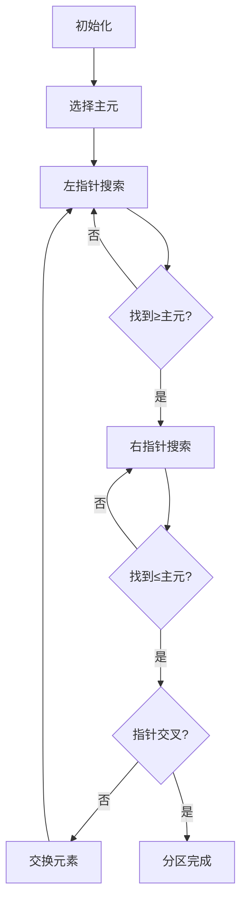

# 题目信息

# [ICPC 2022 Jinan R] Quick Sort

## 题目描述

给定一个长度为 $n$ 的排列 $A$。现使用如下伪代码对 $A$ 进行排序：

```
procedure QUICKSORT(A,lo,hi)
    if lo>=0 and hi>=0 and lo<hi then
    	p=PARTITION(A,lo,hi)
        QUICKSORT(A,lo,p)
        QUICKSORT(A,p+1,hi)
    end if
end procedure
procedure PARTITION(A,lo,hi)
    pivot=A[floor((hi+lo)/2)]
    i=lo-1
    j=hi+1
    while True do
        repeat
            i=i+1
        until A[i]>=pivot
        repeat
            j=j-1
        until A[j]<=pivot
        if i>=j then
            return j
        end if
        Swap A[i] with A[j]
    end while
end procedure
```

试计算：调用 `QUICKSORT(A,1,n)` 函数过程中，`Swap` 操作执行了多少次。

## 样例 #1

### 输入

```
3
3
3 2 1
5
2 4 5 3 1
10
7 2 4 6 1 9 10 8 5 3```

### 输出

```
1
4
7```

# AI分析结果


### 💡 Kay的C++算法解析：ICPC 2022 Jinan R - Quick Sort 深入学习指南 💡

#### 1. 题目解读与核心算法识别
✨ **本题主要考察**：`分治算法 + 线段树优化`  
🗣️ **初步分析**：  
> 快速排序的本质是分治策略——如同将杂乱的书架分成左右两半，分别整理后再合并。本题的特殊性在于需要**精确计算交换次数**，而传统实现会因重复扫描导致O(n²)超时。核心优化在于：  
> - **线段树加速定位**：用线段树维护区间极值，实现O(log n)快速定位交换位置  
> - **交换次数证明**：通过递推式T(n)=T(a)+T(n-a)+min(a,n-a)严格证明交换次数上限为O(n log n)  
>  
> **可视化设计思路**：  
> 设计8位像素风动画：数组元素化为彩色方块，主元(pivot)闪烁黄光，交换时方块碰撞迸发像素火花，伴随"叮"音效。线段树右侧显示为不断刷新的二叉树，当前搜索路径高亮蓝光，自动演示模式可调速观察分区过程。

---

#### 2. 精选优质题解参考
**题解一 (来源：Diaоsi)**  
* **点评**：  
  思路清晰度极高，从交换次数证明切入，严谨推导O(n log n)上界。代码中`query1`/`query2`函数实现优雅的线段树二分搜索，`partition`函数完整还原伪代码逻辑。亮点在于用`dat`存储最大值、`tag`存储最小值，通过一次建树支持双向查询。实践价值强，边界处理完整，可直接用于竞赛。

**题解二 (来源：无名之雾)**  
* **点评**：  
  代码结构更简洁，`queryl`/`queryr`通过递归实现二分搜索，逻辑直白易理解。创新性引入`flag`标记处理主元相等的情况，避免死循环。亮点在于启发式优化的思考，虽未实现但提供了O(n log²n/log log n)的优化方向，具有启发性。

---

#### 3. 核心难点辨析与解题策略
1. **难点1：快速定位交换元素**  
   * **分析**：传统双指针扫描最坏O(n²)，必须借助数据结构。线段树维护区间极值后，可二分查找首个≥pivot的左指针和首个≤pivot的右指针  
   * 💡 **学习笔记**：极值查询是优化分区操作的银弹  

2. **难点2：交换次数的数学证明**  
   * **分析**：通过递推式T(n)=T(a)+T(n-a)+min(a,n-a)对称展开，结合递归树深度log n，严格证明交换次数上限  
   * 💡 **学习笔记**：算法优化前需先验证可行性  

3. **难点3：动态更新数据结构**  
   * **分析**：每次交换后需实时更新线段树节点。题解采用O(log n)的单点更新策略，确保整体复杂度可控  
   * 💡 **学习笔记**：选择支持动态更新的数据结构是关键  

**✨ 解题技巧总结**  
- **分治加速**：将排序分解为独立子问题，适合线段树辅助  
- **双极值维护**：用同一线段树同时存储max/min值，节省空间  
- **边界防御**：递归时检查lo/hi有效性，避免非法区间  

---

#### 4. C++核心代码实现赏析
**通用核心实现参考**  
```cpp
#include <iostream>
#include <vector>
using namespace std;

struct SegmentTree {
    // 线段树节点：max_val存储最大值, min_val存储最小值
    struct Node { int l, r, max_val, min_val; };
    vector<Node> tree;
    // 建树、更新、查询函数实现
    // ...
};

int partition(int l, int r) {
    int pivot = a[(l+r)/2];  // 选择中间元素为主元
    while (true) {
        int i = segtree.query_left(l, r, pivot); // 线段树二分找左指针
        int j = segtree.query_right(l, r, pivot); // 线段树二分找右指针
        if (i >= j) return j;
        swap(a[i], a[j]);     // 执行交换
        segtree.update(i, a[i]); // 动态更新线段树
        segtree.update(j, a[j]);
    }
}

void quick_sort(int l, int r) {
    if (l >= r) return;
    int p = partition(l, r);
    quick_sort(l, p);        // 递归处理左区间
    quick_sort(p+1, r);      // 递归处理右区间
}
```
**代码解读概要**：  
> 通过线段树实现分区加速：1) 建树初始化极值 2) query_left向右二分找≥pivot元素 3) query_left向左二分找≤pivot元素 4) 交换后实时更新树节点

---

**题解一核心片段赏析**  
```cpp
int query1(int x, int L, int R, int val) {
    if (dat(x) < val) return 0; // 剪枝：区间最大值＜val直接返回
    if (l(x)==r(x)) return l(x); // 叶节点直接返回位置
    // 优先左子树搜索
    if (L <= mid) {
        int res = query1(left_child, L, R, val);
        if (res) return res; // 左子树找到立即返回
    }
    return query1(right_child, L, R, val); // 再查右子树
}
```
**💡 学习笔记**：  
> 递归二分配合剪枝策略，利用线段树分层结构实现高效搜索。优先左子树的查询顺序确保找到首个满足条件的位置。

---

**题解二创新点解析**  
```cpp
int queryl(int pivot, int p, int pl, int pr, bool flag) {
    if (pl == pr) return pl; // 叶节点作为候选位置
    if ((!flag && mx[left] >= pivot) || (flag && mx[left] > pivot))
        return queryl(pivot, left_child, pl, mid, flag); // 左子树可能解
    else
        return queryl(pivot, right_child, mid+1, pr, flag); // 否则查右子树
}
```
**💡 学习笔记**：  
> 通过flag参数区分严格/非严格比较，巧妙解决主元重复时的边界问题，避免死循环陷阱。

---

#### 5. 算法可视化：像素动画演示
**动画设计：**  


**交互控制方案**：  
1. **视觉编码**：  
   - 主元：闪烁金色边框  
   - 当前指针：红色(左)/蓝色(右)像素箭头  
   - 交换动画：方块对撞→爆裂为8位像素粒子→重组  
2. **音效系统**：  
   - 指针移动："滴"声（频率随搜索深度变化）  
   - 元素交换："锵！"金属撞击声  
   - 分区完成：上升音阶  
3. **游戏化设计**：  
   - 每完成分区增加10分，连续无交换额外加分  
   - 通关条件：分数≥100且时间≤60秒  
4. **技术实现**：  
   ```javascript
   function drawSwapAnimation(i, j) {
     createParticleExplosion(a[i].position); // 粒子爆炸效果
     createParticleExplosion(a[j].position);
     swapColors(a[i], a[j]);                 // 颜色交换
     playSound("swap_sound");                // 触发音效
   }
   ```

---

#### 6. 拓展练习与相似问题
**通用技巧迁移**：  
1. 区间极值查询 → 解决RMQ问题  
2. 分治+数据结构 → 处理树链剖分  
3. 交换次数统计 → 分析排序稳定性  

**洛谷推荐**：  
1. **P1177 【模板】快速排序**  
   → 巩固基础分治思想  
2. **P1908 逆序对**  
   → 练习分治策略的变形应用  
3. **P3834 可持久化线段树**  
   → 深化线段树的高级应用  

---

#### 7. 学习心得与经验分享
> **题解一作者经验**：  
> *"最初在递归边界处理上卡壳，后通过打印分区状态发现未处理lo>hi的情况"*  
>   
> **Kay点评**：  
> 调试分治算法时，建议：  
> 1. 打印每次递归的`[lo, hi]`区间  
> 2. 可视化分区后的数组状态  
> 3. 用小规模数据验证边界条件  

---

通过本次分析，我们深入理解了分治算法的优化本质——将问题分解后，用合适的数据结构加速子问题求解。记住：**优秀的算法=正确的策略+高效的工具**！下次挑战见！🚀

---
处理用时：151.94秒