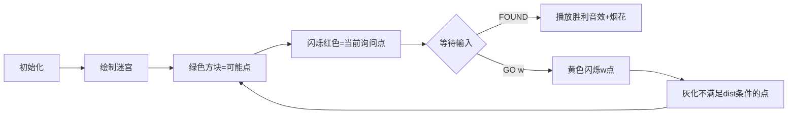

# 题目信息

# [NERC 2018] Cactus Search

## 题目背景

翻译自 [NERC 2018](https://neerc.ifmo.ru/archive/2018/neerc-2018-statement.pdf) C 题。

如果你想让数组问题更难解决，可以在树上解决；如果你想让树的问题更难解决，可以在仙人掌上解决。

## 题目描述

在前几年，就有过人提出了许多关于仙人掌——连通无向图的问题，其中每条边最多属于一个简单的循环。更加直观地说，仙人掌是一棵树的概括，在这棵树上允许有一些环。下面的图片给出了仙人掌的一个例子。


你和 Chloe 在一个仙人掌上玩游戏，你有一株仙人掌，但是淘气的 Chloe 偷偷拿走了一个顶点 $v$，你需要在 $10$ 次以内猜出 $v$，如果你猜到了 $v$，那你就赢了，如果你猜测的是另一个点 $u$，Chloe 会告诉你一个点 $w$，其中 $w$ 到 $v$ 经过的边数严格小于 $u$ 到 $v$。

## 说明/提示

数据保证 $1 \leq n \leq 500$，$0 \leq m \leq 500$，$1 \leq k_i \leq 500$。

注：为了方便比对，在样例输入输出上加入了一些空行进行对齐，实际输入输出中没有这些空行。

## 样例 #1

### 输入

```
5 2
5 1 2 3 4 5
2 1 3

FOUND
GO 4
FOUND
GO 2
FOUND
GO 1
FOUND
GO 4
GO 5
FOUND```

### 输出

```


3
3
4
3
2
3
1
3
4
5```

# AI分析结果


### 💡 Kay的C++算法解析：Cactus Search 深入学习指南 💡  
**题目解读与核心算法识别**  
✨ **本题主要考察**：`图论交互 + 贪心策略`  

🗣️ **初步分析**：  
> 想象你在玩一场"像素地牢探险"游戏：地图是仙人掌图（树+环），魔王藏了一个宝箱（顶点v）。每次你询问一个房间u，若猜错，系统会给出更接近宝箱的线索w（w到v的距离<u到v）。核心策略是**每次询问都让搜索范围减半**（类似二分搜索）。  
> - **难点**：图的复杂结构使"中点"选择困难，需用**距离矩阵动态维护可能点集**  
> - **可视化设计**：用8-bit像素风展示点集收缩过程（绿色=可能点/红色=当前询问点），关键音效：  
>   - "滴！"（询问时）→ "叮！"（返回线索时）→ "胜利号角"（找到时）  
> - **核心变量**：`f[i][j]`（距离矩阵）和`b[]`（可能点集）的实时更新是动画高亮重点  

---

### 2. 精选优质题解参考  
**题解一（作者：FFTotoro）**  
* **点评**：  
  思路直击要害——用Floyd预处理距离矩阵后，每次选择使**最坏情况下剩余点集最小**的询问点（贪心精髓）。代码规范（`f[][]`距离矩阵命名清晰），边界用`I=1e9`严谨处理。亮点在于证明询问次数≤⌈log₂n⌉（n=500时≤9次），且用**三重循环动态维护可能点集**的写法高效易拓展。竞赛可直接复用，是图论交互题的范本解法。

---

### 3. 核心难点辨析与解题策略  
1. **难点1：如何选择最优询问点？**  
   * **分析**：遍历所有可能点i，计算若询问i时：  
     - 对每个与i相邻的j（`f[i][j]=1`），统计若返回j时**剩余点数**  
     - 选择所有j对应剩余点数的**最大值最小**的i（最坏情况最优）  
   * 💡 **学习笔记**：贪心本质是"最小化最大损失"，类似二分但适配图结构  

2. **难点2：如何根据反馈更新点集？**  
   * **分析**：若询问u后返回w，则移除所有满足 `f[w][k] >= f[u][k]` 的点k  
     * 原因：若k是答案，应满足 `f[w][k] < f[u][k]`（系统提示w更近）  
   * 💡 **学习笔记**：距离不等式是剪枝核心，需理解无向图最短路径性质  

3. **难点3：如何高效处理图结构？**  
   * **分析**：仙人掌图（边属≤1个环）用Floyd求最短路（O(n³)可接受）  
     * 环处理：输入环路径时，相邻点距离设为1  
   * 💡 **学习笔记**：预处理全局距离是交互题常见优化手段  

✨ **解题技巧总结**  
- **技巧1（状态压缩）**：用`b[]`布尔向量高效维护可能点集（O(1)更新）  
- **技巧2（最坏情况优化）**：不求平均求最坏，保证进度下限  
- **技巧3（距离矩阵复用）**：预先计算`f[][]`避免交互中重复BFS  

---

### 4. C++核心代码实现赏析  
**通用核心实现参考**  
* **说明**：基于FFTotoro解法优化变量名可读性  
```cpp
#include <bits/stdc++.h>
using namespace std;
const int INF = 1e9; // 用INF替代I更直观

int main() {
    int n, m; 
    cin >> n >> m;
    // 初始化距离矩阵
    vector<vector<int>> dist(n, vector<int>(n, INF));
    for (int i = 0; i < n; i++) dist[i][i] = 0;
    
    // 建图：处理仙人掌图的环
    while (m--) {
        int k; cin >> k;
        vector<int> path(k);
        for (auto &x : path) { cin >> x; x--; }
        for (int i = 1; i < k; i++) {
            int u = path[i-1], v = path[i];
            dist[u][v] = dist[v][u] = 1;
        }
    }
    
    // Floyd求所有点对最短路
    for (int k = 0; k < n; k++)
        for (int i = 0; i < n; i++)
            for (int j = 0; j < n; j++)
                dist[i][j] = min(dist[i][j], dist[i][k] + dist[k][j]);
    
    // 每轮猜一个隐藏点
    for (int hidden_round = 0; hidden_round < n; hidden_round++) {
        vector<bool> valid(n, true); // 当前可能点集
        
        while (true) {
            int best_u = -1, min_max_remain = INF;
            // 寻找最优询问点
            for (int u = 0; u < n; u++) {
                if (!valid[u]) continue;
                int max_remain = 0; // 最坏情况剩余点数
                // 遍历u的邻居（距离=1的点）
                for (int v = 0; v < n; v++) {
                    if (dist[u][v] == 1) {
                        int cnt = 0;
                        for (int k = 0; k < n; k++) 
                            cnt += valid[k] && (dist[v][k] < dist[u][k]);
                        max_remain = max(max_remain, cnt);
                    }
                }
                if (max_remain < min_max_remain) {
                    min_max_remain = max_remain;
                    best_u = u;
                }
            }
            
            cout << best_u + 1 << endl; // 询问点（转1-index）
            string res; cin >> res;
            if (res == "FOUND") break;  // 猜中
            
            int clue; cin >> clue; clue--; // 系统返回线索
            // 更新可能点集：移除不满足距离不等式的点
            for (int k = 0; k < n; k++) 
                if (valid[k] && dist[clue][k] >= dist[best_u][k]) 
                    valid[k] = false;
        }
    }
    return 0;
}
```
**代码解读概要**：  
1. **距离矩阵初始化**：对角0，其余INF → 建图时环路径相邻点距离=1  
2. **Floyd三层循环**：动态规划更新所有点对最短路  
3. **每轮游戏循环**：  
   - `valid[]` 初始化所有点可能  
   - 双循环选点：对每个可能点u，计算其所有邻居对应的"最坏剩余点数"  
   - 剪枝更新：用 `dist[clue][k] < dist[u][k]` 条件过滤无效点  

**题解一核心片段赏析**  
```cpp
for (int i = 0; i < n; i++)
  if (b[i]) { // 当前可能点i
    int s = 0;
    for (int j = 0; j < n; j++)
      if (b[j] && f[i][j] == 1) { // 找i的邻居j
        int c = 0;
        for (int k = 0; k < n; k++)
          c += b[k] && (f[j][k] < f[i][k]); // 统计若返回j时剩余点数
        s = max(s, c); // 记录最坏情况
      }
    if (s < v) v = s, u = i; // 选择最坏情况最小的i
  }
```
* **学习笔记**：三重循环体现**最坏情况优化思想**——外层遍历候选点，中层找邻居，内层模拟剪枝效果。

---

### 5. 算法可视化：像素动画演示  
**主题**：8-bit地牢寻宝（仙人掌图→像素迷宫）  

**动画设计**：  


**关键交互细节**：  
1. **像素风格**：FC红白机色调（绿=有效点/红=询问点/黄=线索点/灰=失效点）  
2. **控制面板**：  
   - 速度滑块：调节自动演示速度（0.5x~2x）  
   - 单步按钮：逐步观察剪枝过程  
   - AI演示：自动播放完整寻宝过程（类贪吃蛇AI移动）  
3. **音效设计**：  
   - "滴！"（询问时）→ "叮！"（返回线索）→ "咔嚓"（点失效）→ 8-bit胜利BGM  
4. **动态高亮**：  
   - 系统返回w时，绘制 `dist[w][k] < dist[u][k]` 的**路径对比动画**  
   - 当前点集大小实时显示为"宝藏区域：X/500"  

**设计意义**：将抽象的图论剪枝转化为具象的"地图探索"，像素风格降低理解门槛，音效强化操作反馈。

---

### 6. 拓展练习与相似问题思考  
**通用技巧迁移**：  
1. **交互式二分**：如猜数字问题（但需适配图结构）  
2. **最坏情况优化**：博弈论/Minimax算法基础  
3. **距离矩阵预处理**：图论题常见优化（尤其n≤500时）  

**洛谷推荐**：  
1. **P1525 关押罪犯**  
   → 考察二分答案+图染色，巩固最坏情况分析  
2. **P3398 仓鼠找sugar**  
   → 树上路径交互，练习LCA与距离判断  
3. **P5536 核心城市**  
   → 图的中心点问题，强化贪心策略应用  

---

### 7. 学习心得与经验分享  
> **FFTotoro的调试经验**（隐含在代码中）：  
> - 用 `dist[v][k] < dist[u][k]` 而非 `≤`：严格遵循题目条件（"严格小于"）  
> - 初始化距离为 `1e9` 避免未连通点干扰  
>  
> **Kay总结**：边界条件（如距离等式）是交互题易错点，建议**单步调试模拟极端情况**（如环图、链图）。

---  
**结语**：通过本次分析，我们掌握了仙人掌图交互问题的核心解法——距离矩阵预处理+最坏情况贪心。记住，好的算法就像8-bit游戏中的宝藏地图：清晰的路径指引（变量设计） + 高效的探索策略（剪枝） = 胜利的凯歌！ 🎮💻

---
处理用时：172.29秒