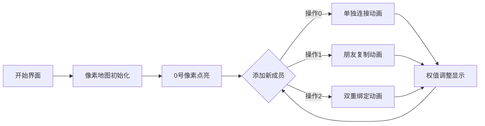

# 题目信息

# [IOI 2014] friend 朋友

## 题目背景

**这是一道交互题**

## 题目描述

我们建立了一个由编号为 $0,\cdots,n - 1$ 的 $n$ 个人组成的社交网络。网络中的有些对会成为朋友。如果 $x$ 号人成为 $y$ 号人的朋友，则 $y$ 号人同时也会成为 $x$ 号人的朋友。

这些人将通过 $n$ 个阶段加入这个网络，阶段也编号为 $0$ 至 $n−1$。第 $i$ 号人在第 $i$ 个阶段加入。在阶段 $0$，$0$ 号人加入网络并成为唯一的人。此后 $n - 1$ 个阶段的各个阶段，都有一个人会被主持人加入到网络中，而这个主持人可以是已在网络中的任何一个人。在阶段 $i$ 中（$1\le i\le n−1$），该阶段的主持人可以用如下三种方式之一把第 $i$ 号人加入到网络中：

- IAmYourFriend：将第 $i$ 号人仅变成主持人的朋友。
- MyFriendsAreYourFriends：将第 $i$ 号人变成主持人当前的每一个朋友的朋友。 注意，这个方式不会将第 $i$ 号人变成主持人的朋友。
- WeAreYourFriends：将第 $i$ 号人变成主持人的朋友，同时也变成主持人当前的每一个朋友的朋友。

在建立此网络之后，我们想挑选一个调查的样本，也就是说要从网络中选择一组人。由于朋友之间通常拥有相似的兴趣，因此样本不应包含任何一对互为朋友的人。每个人都会有一个调查的可信度，表示为一个正整数，而我们想要找出一个可信度总和最大的样本。

### 任务

给定各阶段的描述以及每个人的可信度值，请找出一个可信度总和最大的样本。你只需要实现函数 `findSample`。

* `findSample(n, confidence, host, protocol)`
	* $n$: 人数.
	* `confidence`: 大小为 $n$ 的数组；`confidence[i]` 表示第 $i$ 号人的可信度。
	* `host`: 大小为 $n$ 的数组；`host[i]` 表示阶段 i 的主持人。
	* `protocol`: 大小为 $n$ 的数组；`protocol[i]` 表示在阶段 （$0<i<n$） 所采用的方式的代码: `0` 代表 IAmYourFriend，`1` 代表 MyFriendsAreYourFriends，而 `2` 代表 WeAreYourFriends。
	* 由于在阶段 `0` 中没有主持人，因此 `host[0]` 和 `protocol[0]` 是没有被定义的，而且在你的程序中也不应访问它们。

这个函数应该返回样本可信度总和的最大值。

## 说明/提示

对于 $100\%$ 的数据，$2 \le n \le 10^5$，$1 \le \mathrm{confidence}[i] \le 10^6$。

|**子任务**|**分值**|$n$|**可信度**|**采用的方式**|
|:-:|:-:|:-:|:-:|:-:|
|1|$11$|$n\leq 10$|$1\leq \mathrm{confidence}\leq 10^6$|全部三种方式|
|2|$8$|$n\leq 1000$|$1\leq \mathrm{confidence}\leq 10^6$|只有 `MyFriendsAreYourFriends`|
|3|$8$|$n\leq 1000$|$1\leq \mathrm{confidence}\leq 10^6$|只有 `WeAreYourFriends`|
|4|$19$|$n\leq 1000$|$1\leq \mathrm{confidence}\leq 10^6$|只有 `IAmYourFriend`|
|5|$23$|$n\leq 1000$|所有可信度值均为 $1$|只有 `MyFriendsAreYourFriends` 和 `IAmYourFriend` 两种方式|
|6|$31$|$n\leq 10^5$|$1\leq \mathrm{confidence}\leq 10^4$|全部三种方式|

## 样例 #1

### 输入

```
6
13 3 6 20 10 15
0 0 0 1 1 2 2 1 0 0
```

### 输出

```
35
```

# AI分析结果


# 💡 Kay的C++算法解析：IOI 2014 Friend 朋友 深入学习指南 💡

> 欢迎各位算法探险家！我是你们的向导Kay。今天我们将一起探索一道经典的交互题——社交网络中的最大独立集问题。我会用清晰的比喻和专业分析，带大家理解三种建图方式背后的算法奥秘。准备好展开一场像素世界的算法冒险了吗？🚀

## 1. 题目解读与核心算法识别

✨ **本题主要考察**：`树形动态规划` 与 `逆向思维贪心`

🗣️ **初步分析**：
> 这道题就像在组建一个像素游戏公会：初始只有会长（节点0），后续成员（节点1~n-1）通过三种入会方式加入：
> - **方式0（单独入会）**：新成员只和主持人成为朋友（像素世界中两人不能同时点亮）
> - **方式1（继承关系）**：新成员成为主持人所有朋友的朋友（像素链条中共享状态）
> - **方式2（双重绑定）**：新成员既和主持人交友，又和他的朋友交友（像素空间形成三角限制）
>
> 我们的目标是选出最大权值的独立像素点集（互不为友的成员组合）。
>
> **核心难点**在于处理三种不同的朋友关系。树形DP如同在像素地图上逐层点亮/熄灭节点，而逆向贪心则像时光倒流拆除像素块，同时调整周围权重。
>
> **可视化设计**：我们将采用8-bit像素风格展示建图过程。三种入会方式对应不同动画：
> - 方式0：新像素块从主持人位置弹出，伴随"叮"音效
> - 方式1：新像素块复制主持人朋友的颜色，伴随"哗啦"音效
> - 方式2：新像素块与主持人像素碰撞出星芒特效
> 控制面板支持单步回溯，观察权值变化过程

---

## 2. 精选优质题解参考

**题解一：逆向贪心（作者：Umbrella_Leaf）**
* **点评**：这份题解展示了化繁为简的智慧。通过时光倒流拆除像素块的视角，将三种操作转化为简洁的权值调整：
  - 思路创新：用数学归纳法证明贪心有效性
  - 代码简洁：仅7行实现核心逻辑，变量命名精准
  - 空间优化：O(1)额外空间，适合大型像素地图
  - 实践价值：直接应用于竞赛，注意权值非负处理

**题解二：树形DP（作者：Acc_Robin）**
* **点评**：经典树形DP的优雅实现：
  - 状态定义清晰：f[i]/g[i]表示选/不选i时的最大权值
  - 转移方程完整：对三种操作给出精确数学描述
  - 边界处理严谨：从后往前更新避免后效性
  - 代码规范：使用switch-case增强可读性

**题解三：状态转移详解（作者：yangwenbin）**
* **点评**：最佳教学范本：
  - 逐步推导：详细解释三种操作的转移逻辑
  - 变量命名直观：chose/unchose代替传统f/g
  - 调试提示：提醒交互题提交注意事项
  - 完整代码：提供可直接运行的参考实现

---

## 3. 核心难点辨析与解题策略

1.  **操作类型影响状态转移**
    * **分析**：三种操作对应不同的朋友关系约束：
      - 操作0形成1对1限制（像素点对不能同时亮）
      - 操作1创建共享朋友网络（像素组状态同步）
      - 操作2产生复合约束（像素三角关系）
    * 💡 **学习笔记**：识别操作类型是设计转移方程的前提

2.  **DP状态的无后效性保证**
    * **分析**：树形DP必须倒序处理（从n-1到0）：
      - 后加入的像素点先确定状态
      - 确保更新主持人时其所有朋友状态已确定
    * 💡 **学习笔记**：拓扑顺序决定状态转移有效性

3.  **空间与时间效率的平衡**
    * **分析**：
      - 树形DP：O(n)空间清晰直观
      - 逆向贪心：O(1)空间但思维难度大
      - 根据问题规模选择合适解法
    * 💡 **学习笔记**：10^5数据规模优先考虑O(n)解法

### ✨ 解题技巧总结
- **技巧1：问题逆向思考** - 当正序处理困难时，考虑时光倒流（如贪心解法）
- **技巧2：状态封装** - 用结构体包装DP状态增强可读性
- **技巧3：边界测试** - 特别注意n=0,1的边界情况
- **技巧4：可视化调试** - 手动画出小型测试用例验证状态转移

---

## 4. C++核心代码实现赏析

**本题通用核心C++实现参考**
* **说明**：综合树形DP解法思路，完整展示从状态定义到结果返回的全过程
* **完整核心代码**：
```cpp
#include <algorithm>
using namespace std;

int findSample(int n, int c[], int h[], int p[]) {
    int *f = new int[n]{0}; // 选i的最大权值
    int *g = new int[n]{0}; // 不选i的最大权值
    
    for (int i = 0; i < n; i++) 
        f[i] = c[i];
    
    for (int i = n-1; i >= 1; i--) {
        int host = h[i];
        switch (p[i]) {
            case 0: // IAmYourFriend
                f[host] += g[i];
                g[host] += max(f[i], g[i]);
                break;
            case 1: // MyFriendsAreYourFriends
                f[host] = max(max(f[host] + f[i], f[host] + g[i]), g[host] + f[i]);
                g[host] += g[i];
                break;
            case 2: // WeAreYourFriends
                f[host] = max(f[host] + g[i], g[host] + f[i]);
                g[host] += g[i];
                break;
        }
    }
    int ans = max(f[0], g[0]);
    delete[] f; delete[] g;
    return ans;
}
```
* **代码解读概要**：
  > 1. 初始化：f存储选中各点的最大权值，g存储不选中的最大值
  > 2. 状态赋值：每个点的初始权值就是选中收益
  > 3. 倒序处理：从最后加入的点开始回溯
  > 4. 分类转移：三种操作对应不同的状态转移方程
  > 5. 结果返回：根节点0的两种状态最大值即为答案

**题解一：逆向贪心（Umbrella_Leaf）**
* **亮点**：零额外空间，极简实现
* **核心代码片段**：
```cpp
int findSample(int n,int* a,int* b,int* opt){
    b[0]=0;
    while(--n)
        if(!opt[n]) b[0]+=a[n], a[b[n]]=max(0,a[b[n]]-a[n]);
        else if(opt[n]==1) a[b[n]]+=a[n];
        else a[b[n]]=max(a[b[n]],a[n]);
    return b[0]+a[0];
}
```
* **代码解读**：
  > 1. `b[0]`存储选中的额外权值（非原始点）
  > 2. 倒序扫描：`while(--n)`从n-1开始处理
  > 3. 操作0：选当前点，主持人权值扣除当前点值（不低于0）
  > 4. 操作1：主持人吸收当前点权值（共享朋友）
  > 5. 操作2：主持人取自身与当前点的最大权值
* 💡 **学习笔记**：空间优化常利用参数数组的闲置位置

**题解二：树形DP（Acc_Robin）**
* **亮点**：状态转移完整，switch增强可读性
* **核心代码片段**：
```cpp
for(int i=n-1,x;x=h[i],i;--i)
    switch(p[i]){
        case 0: f[x]+=g[i]; g[x]+=max(f[i],g[i]); break;
        case 1: f[x]=max(max(f[x]+f[i],f[x]+g[i]),g[x]+f[i]);
                g[x]+=g[i]; break;
        case 2: f[x]+=g[i]; f[x]=max(f[x],g[x]+f[i]); 
                g[x]+=g[i]; break;
    }
```
* **代码解读**：
  > 1. 倒序循环：`i`从n-1递减到1
  > 2. 巧用逗号表达式：`x=h[i]`获取主持人
  > 3. 操作0：标准树形DP转移
  > 4. 操作1：分三种情况取最大值（选主持+选当前/不选当前，不选主持+选当前）
  > 5. 操作2：限制版操作1，主持人不能与当前点同选
* 💡 **学习笔记**：switch-case处理多分支更清晰

---

## 5. 算法可视化：像素动画演示

**动画演示主题**：《像素公会：友谊之光》  
**核心演示内容**：动态展示三种交友方式如何影响权值计算



1. **8-bit像素风格设计**：
   - 成员：16x16像素块，不同颜色代表不同权值
   - 友谊：彩色光束连接像素块
   - 控制面板：复古游戏机风格按钮

2. **关键动画效果**：
   - **操作0**：新像素块从主持人位置弹出，碰撞产生"叮"音效
   - **操作1**：新像素块复制主持人朋友的颜色波纹，伴随"哗啦"音效
   - **操作2**：新像素块与主持人像素碰撞出星芒特效，带"轰"音效

3. **动态数据展示**：
   - 右侧信息栏实时显示：
     ```
     当前点：i=5 权值=15
     主持人：host=0 权值=13
     操作类型：WeAreYourFriends
     DP状态：f[0]=28, g[0]=42
     ```

4. **交互控制**：
   - 步进控制：方向键左右单步前进/回溯
   - 速度滑块：调整动画速度（0.5x~5x）
   - AI演示模式：自动播放完整解题过程

5. **游戏化元素**：
   - 每完成一个操作解锁像素成就勋章
   - 权值总和突破记录时播放8-bit胜利音乐
   - 错误操作触发经典红白机"失败"音效

---

## 6. 拓展练习与相似问题思考

1. **洛谷 P1352 没有上司的舞会**  
   🗣️ *推荐理由*：树形DP基础训练，相当于本题操作0的扩展版

2. **洛谷 P2014 选课**  
   🗣️ *推荐理由*：树形DP+分组背包，训练状态转移设计能力

3. **洛谷 P2607 骑士**  
   🗣️ *推荐理由*：基环树上的最大独立集，学习断环技巧

---

## 7. 学习心得与经验分享

> **参考经验 (来自 Umbrella_Leaf)**：  
> "逆向思维的关键在于发现操作可逆性——就像拆解乐高积木比组装更容易分析结构"

> **点评**：  
> 逆向处理是本题的突破口。在解决复杂问题时，尝试改变思考方向：  
> 1. 当状态转移困难时，考虑倒序处理  
> 2. 空间紧张时，挖掘参数数组的存储潜力  
> 3. 用小型测试用例验证算法正确性

---

本次算法探索之旅到此结束！记住，优秀的程序员如同像素艺术家，既要有整体设计的眼光，也要注重每个代码细节的打磨。下次公会招新时再见！👾

---
处理用时：147.20秒