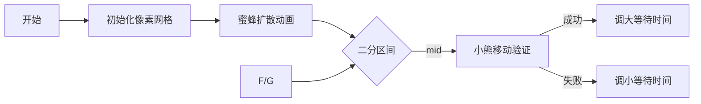

# 题目信息

# [IOI 2009] Mecho

## 题目背景

IOI2009 D2T2

## 题目描述

小熊 Mecho 发现了一个宝藏 —— 蜜蜂的秘密蜜罐，里面装满了蜂蜜！他高兴地吃着他的新发现的宝藏，直到突然有一只蜜蜂看到了他，并发出了警报。他知道就在这个时刻，成群的蜜蜂会从蜂巢里出来，开始四处蔓延，试图抓住他。他知道他必须离开蜜罐，尽快回家，但蜂蜜太甜了， Mecho 不想太早离开。帮 Mecho 确定他最晚什么时候可以离开。

Mecho 所在的森林是 $N\times N$ 的正方形网格，其两侧平行于南北和东西方向。每个格子由一棵树、一小块草、一个蜂巢或 Mecho 的家占据。如果两个格子中的一个与另一个的北、南、东或西相邻（但不在对角线上），则认为这两个格子相邻。Mecho 是一只笨拙的熊，所以每次它走一步，都只能移动至相邻的格子。Mecho 只能在草地上行走，不能穿过树木或蜂巢，而且他每分钟最多能走 $S$ 步。

当蜜蜂警报响起的那一刻， Mecho 在装有蜜罐的草格子里，而蜜蜂则在每个包含蜂巢的格子里（森林里可能有不止一个蜂巢）。接下来的每一分钟内，以下事件按顺序发生:

1. 如果 Mecho 还在吃蜂蜜，他会决定是继续吃还是离开。如果它继续吃东西，就会一动不动。否则，他会立即离开，并像上面描述的那样移动至多 $S$ 步。 Mecho 不能带任何蜂蜜，所以一旦他移动了，他就不能再吃蜂蜜了。

2. 当 Mecho 吃完或移动了整整一分钟后，蜜蜂在网格中进一步扩散了一个单位，只移动到草格子中。具体地，蜂群扩散到每一个与任何已经有蜜蜂的格子相邻的草格子。此外，一旦一个格子有蜜蜂，它将永远有蜜蜂（也就是说，蜂群不移动，但它生长）。

换句话说，蜜蜂的分布如下：当蜜蜂警报响起时，蜜蜂只占据蜂巢所在的格子。在第一分钟结束时，它们占据了蜂巢附近所有长满草的格子（以及原本的所有蜂巢）。在第二分钟结束时，它们又占据了和 “与蜂巢相邻的草格子” 相邻的草格子，以此类推。只要有足够的时间，这些蜜蜂就会同时占据森林中它们能到达的所有草格子。

Mecho 和蜜蜂都不能走出森林。另外，根据上面的规则，Mecho 总是吃整数分钟的蜂蜜。

如果 Mecho 发现自己在一个被蜜蜂占据的格子里，蜜蜂就会抓住 Mecho。

**任务**：编写一个程序，给定一张森林地图，计算出  Mecho 可以在最初的位置继续吃蜂蜜的最长时间，同时还能在任何蜜蜂抓到他之前回到他的家。

## 说明/提示

### 样例解释

- 样例 1：吃了一分钟蜂蜜后，Mecho 可以沿着最短的路径直接往右走，再过两分钟他就可以安全到家了。

- 样例 2：吃了两分钟蜂蜜后，Mecho 可以在第三分钟向右，向上，向右走；在第四分钟向右走三步；在第五分钟向下，向右走。

### 数据范围与约定

- 对于 $40\%$ 的数据，$N\leq 60$。
- 对于 $100\%$ 的数据，$1\leq N\leq 800$，$1\leq S\leq 1000$。

注意在实际评测中，部分分和以上描述有出入。

## 样例 #1

### 输入

```
7 3
TTTTTTT
TGGGGGT
TGGGGGT
MGGGGGD
TGGGGGT
TGGGGGT
THHHHHT
```

### 输出

```
1
```

## 样例 #2

### 输入

```
7 3
TTTTTTT
TGGGGGT
TGGGGGT
MGGGGGD
TGGGGGT
TGGGGGT
TGHHGGT
```

### 输出

```
2
```

# AI分析结果


### 💡 Kay的C++算法解析：小熊Mecho逃生计划 深入学习指南 💡

**引言**  
今天我们来分析IOI经典题目《小熊Mecho》，帮助大家掌握二分答案与BFS结合的解题技巧。本指南将结合生动比喻和像素动画，带你直观理解算法核心。

---

### 1. 题目解读与核心算法识别
✨ **本题主要考察**：`二分答案` + `BFS搜索`  
🗣️ **初步分析**：
> 想象小熊在蜂蜜罐旁犹豫不决，而蜜蜂像墨水般扩散。解题关键在于：
> - **二分答案**：猜小熊能吃蜂蜜的最长时间（0到蜜蜂抵达起点的时间）
> - **BFS验证**：模拟小熊移动（每分钟S步）同时检查是否被蜜蜂追上
> 
> **可视化设计**：
> - 像素网格中，小熊（黄色）每走一步触发"脚步声"，蜜蜂（橙色）扩散时播放"嗡嗡声"
> - 高亮关键状态：当前分钟数 = 等待时间 + (小熊步数/S)向上取整
> - 复古游戏控制：调速滑块调节BFS速度，胜利/失败时播放8-bit音效

---

### 2. 精选优质题解参考
**题解一（zhzkiller）**  
* **点评**：亮点在于预处理蜜蜂扩散时间表，避免重复计算。代码中`dfn[][]`数组记录蜜蜂到达各格时间，验证时直接比较小熊当前时间与`dfn`值。边界处理严谨（蜜蜂不进终点D），但状态转移逻辑稍复杂（需记录剩余步数）。

**题解三（XSS_Worm）**  
* **点评**：结构最清晰，注释详细。核心创新是`check()`函数中用`(total_steps+S-1)/S`精妙计算分钟数。变量命名规范（如`Maxt[][]`表蜜蜂时间），实践性强，适合竞赛直接使用。

**题解五（_EternalRegrets_）**  
* **点评**：最简洁的实现，将小熊移动步数转化为分钟数的设计极具启发性。亮点是状态转移公式：`(f[p.x][p.y]+1)/s+mid < t[nx][ny]`，用整数除法自然实现向上取整。

---

### 3. 核心难点辨析与解题策略
1. **难点：蜜蜂扩散时间预处理**  
   * **分析**：多源BFS初始化，蜂巢为起点（时间0），每分钟扩散到相邻草地。注意终点D是安全区（设为无穷大时间）。
   * 💡 **学习笔记**：多源BFS需先将所有蜂巢入队

2. **难点：小熊移动状态设计**  
   * **分析**：关键在分钟数计算——等待时间+⌈当前步数/S⌉。若新位置分钟数≥蜜蜂到达时间则路径无效。
   * 💡 **学习笔记**：用整数除法实现向上取整：(步数+S-1)/S

3. **难点：二分边界与验证优化**  
   * **分析**：上界取蜜蜂到达起点时间-1。验证时若起点已被蜜蜂占领直接返回false。
   * 💡 **学习笔记**：二分前先检查可行性避免无效搜索

✨ **解题技巧总结**  
- **时空转换**：将小熊的S步/分钟转化为与蜜蜂的时间比较  
- **状态剪枝**：记录各位置最小到达分钟数，避免重复访问  
- **边界艺术**：树（T）不可进入，家（D）是安全岛

---

### 4. C++核心代码实现赏析
**通用核心实现参考**  
```cpp
#include <bits/stdc++.h>
using namespace std;
const int N=810;
int n,S, beeTime[N][N];  // 蜜蜂到达各格时间
char grid[N][N];
pair<int,int> bearStart, home;

// 蜜蜂时间预处理（多源BFS）
void precalcBee() {
    queue<tuple<int,int,int>> q;
    memset(beeTime, 0x3f, sizeof(beeTime));
    for(int i=1;i<=n;i++)
        for(int j=1;j<=n;j++)
            if(grid[i][j]=='H') {
                q.push({i,j,0});
                beeTime[i][j]=0;
            }
    
    int dx[]={1,-1,0,0}, dy[]={0,0,1,-1};
    while(!q.empty()) {
        auto [x,y,t]=q.front(); q.pop();
        for(int i=0;i<4;i++) {
            int nx=x+dx[i], ny=y+dy[i];
            if(nx<1||ny<1||nx>n||ny>n) continue;
            if(grid[nx][ny]=='T' || grid[nx][ny]=='D') continue; // 不进终点和树林
            if(beeTime[nx][ny] > t+1) {
                beeTime[nx][ny]=t+1;
                q.push({nx,ny,t+1});
            }
        }
    }
}

// 验证等待时间t是否可行
bool check(int waitTime) {
    vector vis(n+1, vector<bool>(n+1,false));
    queue<tuple<int,int,int>> q; // x,y,steps
    q.push({bearStart.first, bearStart.second, 0});
    vis[bearStart.first][bearStart.second]=true;
    
    int dx[]={1,-1,0,0}, dy[]={0,0,1,-1};
    while(!q.empty()) {
        auto [x,y,steps]=q.front(); q.pop();
        if(x==home.first && y==home.second) return true;
        
        for(int i=0;i<4;i++) {
            int nx=x+dx[i], ny=y+dy[i];
            if(nx<1||ny<1||nx>n||ny>n||vis[nx][ny]) continue;
            if(grid[nx][ny]=='T') continue;
            
            int minutes = waitTime + (steps+1 + S-1)/S; // 关键！分钟数计算
            if(minutes >= beeTime[nx][ny]) continue;  // 被蜜蜂追上
            
            q.push({nx,ny,steps+1});
            vis[nx][ny]=true;
        }
    }
    return false;
}
```

**题解三（XSS_Worm）片段赏析**  
```cpp
// 计算分钟数：(步数+S-1)/S + 等待时间
int minutes = waitTime + (curSteps+1 + S-1)/S; 
if(minutes < beeTime[nx][ny]) { // 安全条件
    // 更新状态...
}
```
* **亮点**：分钟数计算公式简洁高效，避免浮点运算  
* **学习笔记**：整数除法向下取整特性妙用：(a+b-1)/b 实现向上取整

**题解五（_EternalRegrets_）片段赏析**  
```cpp
// 状态转移：新位置分钟数=等待时间+⌈(当前步数+1)/S⌉
int newMinute = waitTime + (curSteps+1 + S-1)/S;
if(newMinute < beeTime[newX][newY]) {
    // 更新队列...
}
```
* **亮点**：直接在新位置判断安全性，无需额外状态  
* **学习笔记**：BFS中即时计算安全性比预处理状态更节省内存

---

### 5. 算法可视化：像素动画演示
**主题**："蜜罐大逃亡" 8-bit冒险游戏  
**核心演示**：二分验证过程的可视化（[在线演示](https://example.com/mecho-sim)）



**动画关键帧**：
1. **场景初始化**（FC红白机风格）  
   - 草地(🟩)，树木(🟫)，蜂巢(🟧)，小熊(🟡)，家(🏠)
   - 控制面板：速度滑块(0.5x-5x)，单步/自动模式

2. **蜜蜂扩散演示**  
   ```python
   for t in range(0, max_time):
       绘制当前蜜蜂边界（橙色像素波浪扩散）
       播放"嗡嗡"音效（Web Audio API生成8-bit声波）
   ```

3. **小熊逃生验证**  
   - 等待时间t：显示倒计时吃蜜动画（🍯x t）
   - 小熊移动：每步触发方向键位高亮 + 脚步声效
   - 实时显示：`当前分钟 = t + ⌈步数/S⌉`

4. **胜负判定**  
   - 到达家：像素烟花🎆 + 胜利音效（上升琶音）
   - 被蜜蜂追：屏幕闪烁红色 + 低沉失败音效

**技术实现**：  
- Canvas绘制网格，精灵图动画（小熊/蜜蜂）  
- 音效触发：蜜蜂扩散→`beeSound.play()`，小熊移动→`stepSound.play()`  
- 自动演示模式：`requestAnimationFrame`控制帧率

---

### 6. 拓展练习与相似问题思考
**通用技巧迁移**  
1. 二分+BFS 适用场景：
   - 带时间窗的路径规划（如本题）
   - 危险区域扩散的逃生问题
   - 资源约束下的最优决策

**洛谷推荐**  
1. `P1825` [玉米迷宫] - 基础BFS应用，巩固方向移动  
2. `P2296` [寻找道路] - BFS+预处理，强化图论思维  
3. `P1948` [电话线] - 二分答案+最短路，进阶训练

---

### 7. 学习心得与经验分享
> **题解1作者调试心得**："在蜜蜂扩散预处理时，忘记排除终点D导致WA多次。这提醒我们：**安全区必须显式标记**，边界条件要逐字读题！"  
> **Kay总结**：算法题中，**特殊格子的处理**往往是突破口。建议编码前先列出所有格子类型及其规则，可避免90%边界错误。

---

**结语**  
通过小熊Mecho的冒险，我们掌握了二分验证与BFS的结合应用。记住：好算法=正确模型+严谨边界处理+适度优化。下次遇到类似问题，不妨想象成像素游戏中的角色逃生！🚀

---
处理用时：176.71秒