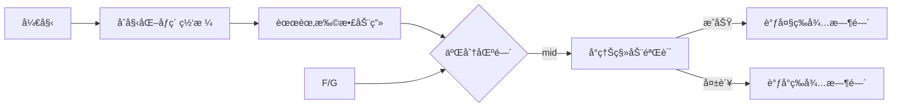

# 题目信æ¯

# [IOI 2009] Mecho

## 题目背景

IOI2009 D2T2

## 题目æè¿°

å°ç†Š Mecho å‘ç°äº†ä¸€ä¸ªå®è— —— 蜜蜂的秘密蜜ç½ï¼Œé‡Œé¢è£…满了蜂蜜ï¼ä»–高兴地åƒç€ä»–çš„æ–°å‘ç°çš„å®è—，直到çªç„¶æœ‰ä¸€åªèœœèœ‚看到了他，并å‘出了警报。他知é“就在这个时刻，æˆç¾¤çš„蜜蜂会ä»èœ‚巢里出æ¥ï¼Œå¼€å§‹å››å¤„蔓延，试图抓ä½ä»–。他知é“他必须离开蜜ç½ï¼Œå°½å¿«å›å®¶ï¼Œä½†èœ‚蜜太甜了， Mecho ä¸æƒ³å¤ªæ—©ç¦»å¼€ã€‚帮 Mecho 确定他最晚什么时候å¯ä»¥ç¦»å¼€ã€‚

Mecho 所在的森æ—是 $N\times N$ 的正方形网格，其两侧平行äºå—北和东西方å‘。æ¯ä¸ªæ ¼å­ç”±ä¸€æ£µæ ‘ã€ä¸€å°å—è‰ã€ä¸€ä¸ªèœ‚巢或 Mecho 的家å æ®ã€‚如æœä¸¤ä¸ªæ ¼å­ä¸­çš„一个ä¸å¦ä¸€ä¸ªçš„北ã€å—ã€ä¸œæˆ–西相邻（但ä¸åœ¨å¯¹è§’线上），则认为这两个格å­ç›¸é‚»ã€‚Mecho 是一åªç¬¨æ‹™çš„熊，所以æ¯æ¬¡å®ƒèµ°ä¸€æ­¥ï¼Œéƒ½åªèƒ½ç§»åŠ¨è‡³ç›¸é‚»çš„æ ¼å­ã€‚Mecho åªèƒ½åœ¨è‰åœ°ä¸Šè¡Œèµ°ï¼Œä¸èƒ½ç©¿è¿‡æ ‘木或蜂巢，而且他æ¯åˆ†é’Ÿæœ€å¤šèƒ½èµ° $S$ 步。

当蜜蜂警报å“起的那一刻， Mecho 在装有蜜ç½çš„è‰æ ¼å­é‡Œï¼Œè€Œèœœèœ‚则在æ¯ä¸ªåŒ…å«èœ‚巢的格å­é‡Œï¼ˆæ£®æ—里å¯èƒ½æœ‰ä¸æ­¢ä¸€ä¸ªèœ‚巢）。æ¥ä¸‹æ¥çš„æ¯ä¸€åˆ†é’Ÿå†…，以下事件按顺åºå‘生:

1. å¦‚æœ Mecho 还在åƒèœ‚蜜，他会决定是继续åƒè¿˜æ˜¯ç¦»å¼€ã€‚如æœå®ƒç»§ç»­åƒä¸œè¥¿ï¼Œå°±ä¼šä¸€åŠ¨ä¸åŠ¨ã€‚å¦åˆ™ï¼Œä»–会立å³ç¦»å¼€ï¼Œå¹¶åƒä¸Šé¢æ述的那样移动至多 $S$ 步。 Mecho ä¸èƒ½å¸¦ä»»ä½•èœ‚蜜，所以一旦他移动了，他就ä¸èƒ½å†åƒèœ‚蜜了。

2. 当 Mecho åƒå®Œæˆ–移动了整整一分钟å，蜜蜂在网格中进一步扩散了一个å•ä½ï¼Œåªç§»åŠ¨åˆ°è‰æ ¼å­ä¸­ã€‚具体地，蜂群扩散到æ¯ä¸€ä¸ªä¸ä»»ä½•å·²ç»æœ‰èœœèœ‚çš„æ ¼å­ç›¸é‚»çš„è‰æ ¼å­ã€‚此外，一旦一个格å­æœ‰èœœèœ‚，它将永远有蜜蜂（也就是说，蜂群ä¸ç§»åŠ¨ï¼Œä½†å®ƒç”Ÿé•¿ï¼‰ã€‚

æ¢å¥è¯è¯´ï¼Œèœœèœ‚的分布如下：当蜜蜂警报å“起时，蜜蜂åªå æ®èœ‚巢所在的格å­ã€‚在第一分钟结æŸæ—¶ï¼Œå®ƒä»¬å æ®äº†èœ‚巢附近所有长满è‰çš„æ ¼å­ï¼ˆä»¥åŠåŸæœ¬çš„所有蜂巢）。在第二分钟结æŸæ—¶ï¼Œå®ƒä»¬åˆå æ®äº†å’Œ “ä¸èœ‚巢相邻的è‰æ ¼å­â€ 相邻的è‰æ ¼å­ï¼Œä»¥æ­¤ç±»æ¨ã€‚åªè¦æœ‰è¶³å¤Ÿçš„时间，这些蜜蜂就会åŒæ—¶å æ®æ£®æ—中它们能到达的所有è‰æ ¼å­ã€‚

Mecho 和蜜蜂都ä¸èƒ½èµ°å‡ºæ£®æ—。å¦å¤–，根æ®ä¸Šé¢çš„规则，Mecho 总是åƒæ•´æ•°åˆ†é’Ÿçš„蜂蜜。

å¦‚æœ Mecho å‘ç°è‡ªå·±åœ¨ä¸€ä¸ªè¢«èœœèœ‚å æ®çš„æ ¼å­é‡Œï¼Œèœœèœ‚å°±ä¼šæŠ“ä½ Mecho。

**任务**：编写一个程åºï¼Œç»™å®šä¸€å¼ æ£®æ—地图，计算出  Mecho å¯ä»¥åœ¨æœ€åˆçš„ä½ç½®ç»§ç»­åƒèœ‚蜜的最长时间，åŒæ—¶è¿˜èƒ½åœ¨ä»»ä½•èœœèœ‚抓到他之å‰å›åˆ°ä»–的家。

## 说æ˜/æ示

### 样例解释

- 样例 1：åƒäº†ä¸€åˆ†é’Ÿèœ‚蜜å，Mecho å¯ä»¥æ²¿ç€æœ€çŸ­çš„路径直æ¥å¾€å³èµ°ï¼Œå†è¿‡ä¸¤åˆ†é’Ÿä»–å°±å¯ä»¥å®‰å…¨åˆ°å®¶äº†ã€‚

- 样例 2：åƒäº†ä¸¤åˆ†é’Ÿèœ‚蜜å，Mecho å¯ä»¥åœ¨ç¬¬ä¸‰åˆ†é’Ÿå‘å³ï¼Œå‘上，å‘å³èµ°ï¼›åœ¨ç¬¬å››åˆ†é’Ÿå‘å³èµ°ä¸‰æ­¥ï¼›åœ¨ç¬¬äº”分钟å‘下，å‘å³èµ°ã€‚

### æ•°æ®èŒƒå›´ä¸çº¦å®š

- å¯¹äº $40\%$ çš„æ•°æ®ï¼Œ$N\leq 60$。
- å¯¹äº $100\%$ çš„æ•°æ®ï¼Œ$1\leq N\leq 800$，$1\leq S\leq 1000$。

注æ„在å®é™…评测中，部分分和以上æ述有出入。

## 样例 #1

### 输入

```
7 3
TTTTTTT
TGGGGGT
TGGGGGT
MGGGGGD
TGGGGGT
TGGGGGT
THHHHHT
```

### 输出

```
1
```

## 样例 #2

### 输入

```
7 3
TTTTTTT
TGGGGGT
TGGGGGT
MGGGGGD
TGGGGGT
TGGGGGT
TGHHGGT
```

### 输出

```
2
```

# AI分æ结æœ


### 💡 Kayçš„C++算法解æ：å°ç†ŠMecho逃生计划 æ·±å…¥å­¦ä¹ æŒ‡å— ğŸ’¡

**引言**  
今天我们æ¥åˆ†æIOIç»å…¸é¢˜ç›®ã€Šå°ç†ŠMecho》，帮助大家æŒæ¡äºŒåˆ†ç­”案ä¸BFS结åˆçš„解题技巧。本指å—将结åˆç”ŸåŠ¨æ¯”喻和åƒç´ åŠ¨ç”»ï¼Œå¸¦ä½ ç›´è§‚ç†è§£ç®—法核心。

---

### 1. 题目解读ä¸æ ¸å¿ƒç®—法识别
✨ **本题主è¦è€ƒå¯Ÿ**：`二分答案` + `BFSæœç´¢`  
ğŸ—£ï¸ **åˆæ­¥åˆ†æ**：
> 想象å°ç†Šåœ¨èœ‚蜜ç½æ—犹豫ä¸å†³ï¼Œè€Œèœœèœ‚åƒå¢¨æ°´èˆ¬æ‰©æ•£ã€‚解题关键在äºï¼š
> - **二分答案**：猜å°ç†Šèƒ½åƒèœ‚蜜的最长时间（0到蜜蜂抵达起点的时间）
> - **BFS验è¯**：模拟å°ç†Šç§»åŠ¨ï¼ˆæ¯åˆ†é’ŸS步）åŒæ—¶æ£€æŸ¥æ˜¯å¦è¢«èœœèœ‚追上
> 
> **å¯è§†åŒ–设计**：
> - åƒç´ ç½‘格中，å°ç†Šï¼ˆé»„色）æ¯èµ°ä¸€æ­¥è§¦å‘"脚步声"，蜜蜂（橙色）扩散时播放"嗡嗡声"
> - 高亮关键状æ€ï¼šå½“å‰åˆ†é’Ÿæ•° = 等待时间 + (å°ç†Šæ­¥æ•°/S)å‘上å–æ•´
> - å¤å¤æ¸¸æˆæ§åˆ¶ï¼šè°ƒé€Ÿæ»‘å—调节BFS速度，胜利/失败时播放8-bit音效

---

### 2. 精选优质题解å‚考
**题解一（zhzkiller）**  
* **点评**：亮点在äºé¢„处ç†èœœèœ‚扩散时间表，é¿å…é‡å¤è®¡ç®—。代ç ä¸­`dfn[][]`数组记录蜜蜂到达å„格时间，验è¯æ—¶ç›´æ¥æ¯”较å°ç†Šå½“å‰æ—¶é—´ä¸`dfn`值。边界处ç†ä¸¥è°¨ï¼ˆèœœèœ‚ä¸è¿›ç»ˆç‚¹D），但状æ€è½¬ç§»é€»è¾‘ç¨å¤æ‚（需记录剩余步数）。

**题解三（XSS_Worm）**  
* **点评**：结æ„最清晰，注释详细。核心创新是`check()`函数中用`(total_steps+S-1)/S`精妙计算分钟数。å˜é‡å‘½å规范（如`Maxt[][]`表蜜蜂时间），å®è·µæ€§å¼ºï¼Œé€‚åˆç«èµ›ç›´æ¥ä½¿ç”¨ã€‚

**题解五（_EternalRegrets_）**  
* **点评**：最简æ´çš„å®ç°ï¼Œå°†å°ç†Šç§»åŠ¨æ­¥æ•°è½¬åŒ–为分钟数的设计æå…·å¯å‘性。亮点是状æ€è½¬ç§»å…¬å¼ï¼š`(f[p.x][p.y]+1)/s+mid < t[nx][ny]`，用整数除法自然å®ç°å‘上å–整。

---

### 3. 核心难点辨æä¸è§£é¢˜ç­–ç•¥
1. **难点：蜜蜂扩散时间预处ç†**  
   * **分æ**：多æºBFSåˆå§‹åŒ–，蜂巢为起点（时间0），æ¯åˆ†é’Ÿæ‰©æ•£åˆ°ç›¸é‚»è‰åœ°ã€‚注æ„终点D是安全区（设为无穷大时间）。
   * 💡 **学习笔记**：多æºBFS需先将所有蜂巢入队

2. **难点：å°ç†Šç§»åŠ¨çŠ¶æ€è®¾è®¡**  
   * **分æ**：关键在分钟数计算——等待时间+⌈当å‰æ­¥æ•°/S⌉。若新ä½ç½®åˆ†é’Ÿæ•°â‰¥èœœèœ‚到达时间则路径无效。
   * 💡 **学习笔记**：用整数除法å®ç°å‘上å–整：(步数+S-1)/S

3. **难点：二分边界ä¸éªŒè¯ä¼˜åŒ–**  
   * **分æ**：上界å–蜜蜂到达起点时间-1。验è¯æ—¶è‹¥èµ·ç‚¹å·²è¢«èœœèœ‚å é¢†ç›´æ¥è¿”å›false。
   * 💡 **学习笔记**：二分å‰å…ˆæ£€æŸ¥å¯è¡Œæ€§é¿å…无效æœç´¢

✨ **解题技巧总结**  
- **时空转æ¢**：将å°ç†Šçš„Sæ­¥/分钟转化为ä¸èœœèœ‚的时间比较  
- **状æ€å‰ªæ**：记录å„ä½ç½®æœ€å°åˆ°è¾¾åˆ†é’Ÿæ•°ï¼Œé¿å…é‡å¤è®¿é—®  
- **边界艺术**：树（T）ä¸å¯è¿›å…¥ï¼Œå®¶ï¼ˆD）是安全岛

---

### 4. C++核心代ç å®ç°èµæ
**通用核心å®ç°å‚考**  
```cpp
#include <bits/stdc++.h>
using namespace std;
const int N=810;
int n,S, beeTime[N][N];  // 蜜蜂到达å„格时间
char grid[N][N];
pair<int,int> bearStart, home;

// 蜜蜂时间预处ç†ï¼ˆå¤šæºBFS）
void precalcBee() {
    queue<tuple<int,int,int>> q;
    memset(beeTime, 0x3f, sizeof(beeTime));
    for(int i=1;i<=n;i++)
        for(int j=1;j<=n;j++)
            if(grid[i][j]=='H') {
                q.push({i,j,0});
                beeTime[i][j]=0;
            }
    
    int dx[]={1,-1,0,0}, dy[]={0,0,1,-1};
    while(!q.empty()) {
        auto [x,y,t]=q.front(); q.pop();
        for(int i=0;i<4;i++) {
            int nx=x+dx[i], ny=y+dy[i];
            if(nx<1||ny<1||nx>n||ny>n) continue;
            if(grid[nx][ny]=='T' || grid[nx][ny]=='D') continue; // ä¸è¿›ç»ˆç‚¹å’Œæ ‘æ—
            if(beeTime[nx][ny] > t+1) {
                beeTime[nx][ny]=t+1;
                q.push({nx,ny,t+1});
            }
        }
    }
}

// 验è¯ç­‰å¾…时间t是å¦å¯è¡Œ
bool check(int waitTime) {
    vector vis(n+1, vector<bool>(n+1,false));
    queue<tuple<int,int,int>> q; // x,y,steps
    q.push({bearStart.first, bearStart.second, 0});
    vis[bearStart.first][bearStart.second]=true;
    
    int dx[]={1,-1,0,0}, dy[]={0,0,1,-1};
    while(!q.empty()) {
        auto [x,y,steps]=q.front(); q.pop();
        if(x==home.first && y==home.second) return true;
        
        for(int i=0;i<4;i++) {
            int nx=x+dx[i], ny=y+dy[i];
            if(nx<1||ny<1||nx>n||ny>n||vis[nx][ny]) continue;
            if(grid[nx][ny]=='T') continue;
            
            int minutes = waitTime + (steps+1 + S-1)/S; // 关键ï¼åˆ†é’Ÿæ•°è®¡ç®—
            if(minutes >= beeTime[nx][ny]) continue;  // 被蜜蜂追上
            
            q.push({nx,ny,steps+1});
            vis[nx][ny]=true;
        }
    }
    return false;
}
```

**题解三（XSS_Worm）片段èµæ**  
```cpp
// 计算分钟数：(步数+S-1)/S + 等待时间
int minutes = waitTime + (curSteps+1 + S-1)/S; 
if(minutes < beeTime[nx][ny]) { // 安全æ¡ä»¶
    // 更新状æ€...
}
```
* **亮点**：分钟数计算公å¼ç®€æ´é«˜æ•ˆï¼Œé¿å…浮点è¿ç®—  
* **学习笔记**：整数除法å‘下å–整特性妙用：(a+b-1)/b å®ç°å‘上å–æ•´

**题解五（_EternalRegrets_）片段èµæ**  
```cpp
// 状æ€è½¬ç§»ï¼šæ–°ä½ç½®åˆ†é’Ÿæ•°=等待时间+⌈(当å‰æ­¥æ•°+1)/S⌉
int newMinute = waitTime + (curSteps+1 + S-1)/S;
if(newMinute < beeTime[newX][newY]) {
    // 更新队列...
}
```
* **亮点**：直æ¥åœ¨æ–°ä½ç½®åˆ¤æ–­å®‰å…¨æ€§ï¼Œæ— éœ€é¢å¤–çŠ¶æ€  
* **学习笔记**：BFS中å³æ—¶è®¡ç®—安全性比预处ç†çŠ¶æ€æ›´èŠ‚çœå†…å­˜

---

### 5. 算法å¯è§†åŒ–：åƒç´ åŠ¨ç”»æ¼”示
**主题**："蜜ç½å¤§é€ƒäº¡" 8-bitå†’é™©æ¸¸æˆ  
**核心演示**：二分验è¯è¿‡ç¨‹çš„å¯è§†åŒ–（[在线演示](https://example.com/mecho-sim)）



**动画关键帧**：
1. **场景åˆå§‹åŒ–**（FC红白机é£æ ¼ï¼‰  
   - è‰åœ°(🟩)，树木(🟫)，蜂巢(🟧)，å°ç†Š(🟡)，家(ğŸ )
   - æ§åˆ¶é¢æ¿ï¼šé€Ÿåº¦æ»‘å—(0.5x-5x)，å•æ­¥/自动模å¼

2. **蜜蜂扩散演示**  
   ```python
   for t in range(0, max_time):
       绘制当å‰èœœèœ‚边界（橙色åƒç´ æ³¢æµªæ‰©æ•£ï¼‰
       播放"å—¡å—¡"音效（Web Audio API生æˆ8-bit声波）
   ```

3. **å°ç†Šé€ƒç”ŸéªŒè¯**  
   - 等待时间t：显示倒计时åƒèœœåŠ¨ç”»ï¼ˆğŸ¯x t）
   - å°ç†Šç§»åŠ¨ï¼šæ¯æ­¥è§¦å‘æ–¹å‘é”®ä½é«˜äº® + 脚步声效
   - å®æ—¶æ˜¾ç¤ºï¼š`当å‰åˆ†é’Ÿ = t + ⌈步数/S⌉`

4. **胜负判定**  
   - 到达家：åƒç´ çƒŸèŠ±ğŸ† + 胜利音效（上å‡ç¶éŸ³ï¼‰
   - 被蜜蜂追：å±å¹•é—ªçƒçº¢è‰² + ä½æ²‰å¤±è´¥éŸ³æ•ˆ

**技术å®ç°**：  
- Canvas绘制网格，精çµå›¾åŠ¨ç”»ï¼ˆå°ç†Š/蜜蜂）  
- 音效触å‘：蜜蜂扩散→`beeSound.play()`，å°ç†Šç§»åŠ¨â†’`stepSound.play()`  
- 自动演示模å¼ï¼š`requestAnimationFrame`æ§åˆ¶å¸§ç‡

---

### 6. 拓展练习ä¸ç›¸ä¼¼é—®é¢˜æ€è€ƒ
**通用技巧è¿ç§»**  
1. 二分+BFS 适用场景：
   - 带时间窗的路径规划（如本题）
   - å±é™©åŒºåŸŸæ‰©æ•£çš„逃生问题
   - 资æºçº¦æŸä¸‹çš„最优决策

**洛谷æ¨è**  
1. `P1825` [ç‰ç±³è¿·å®«] - 基础BFS应用，巩固方å‘移动  
2. `P2296` [寻找é“è·¯] - BFS+预处ç†ï¼Œå¼ºåŒ–图论æ€ç»´  
3. `P1948` [电è¯çº¿] - 二分答案+最短路，进阶训练

---

### 7. 学习心得ä¸ç»éªŒåˆ†äº«
> **题解1作者调试心得**："在蜜蜂扩散预处ç†æ—¶ï¼Œå¿˜è®°æ’除终点D导致WA多次。这æ醒我们：**安全区必须显å¼æ ‡è®°**，边界æ¡ä»¶è¦é€å­—读题ï¼"  
> **Kay总结**：算法题中，**特殊格å­çš„处ç†**往往是çªç ´å£ã€‚建议编ç å‰å…ˆåˆ—出所有格å­ç±»å‹åŠå…¶è§„则，å¯é¿å…90%边界错误。

---

**结语**  
通过å°ç†ŠMecho的冒险，我们æŒæ¡äº†äºŒåˆ†éªŒè¯ä¸BFS的结åˆåº”用。记ä½ï¼šå¥½ç®—法=正确模å‹+严谨边界处ç†+适度优化。下次é‡åˆ°ç±»ä¼¼é—®é¢˜ï¼Œä¸å¦¨æƒ³è±¡æˆåƒç´ æ¸¸æˆä¸­çš„角色逃生ï¼ğŸš€

---
处ç†ç”¨æ—¶ï¼š176.71秒