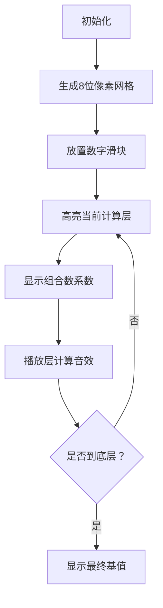

# 题目信息

# 《瞿葩的数字游戏》T3-三角圣地

## 题目背景

国王 1 带大家到了数字王国的中心：三角圣地。

## 题目描述

数字王国的中心是由一个倒三角构成。

倒三角一共 $N$ 层，从上往下第 $i$ 层有 $N-i+1$ 个数字。倒三角的第 $1$ 层必须是 $1 \sim N$ 的全排列之一，即必须使用 $1 \sim N$ 之间的所有数字且不能重复。从第 $2$ 层开始以后每一层的数字都是由其左上方和右上方两个数字相加得到的。例如，下面是一个合法的倒三角形：

```plain
1   2   3   4
  3   5   7
    8   12
      20
```

这个倒三角形的 $N$ 为 $4$，其最后一层的数字为 $20$。

数字王国称最后一层的数字为“基”，请你编程求出“基”的最大值对 $10007$ 取模的结果。

## 说明/提示

### 样例解释

一种可行的方案为：

```plain
1   3   4   2
  4   7   6
    11  13
      24
```

可以证明没有比这更好的方法。

### 数据范围

对于 $20\%$ 的数据，$N \le 100$。

对于 $50\%$ 的数据，$N \le 3000$。

对于 $100\%$ 的数据，$0 \le N \le {10}^6$。

## 样例 #1

### 输入

```
4```

### 输出

```
24```

## 样例 #2

### 输入

```
1125```

### 输出

```
700```

# AI分析结果


### Kay的C++算法解析：《瞿葩的数字游戏》T3-三角圣地深入学习指南

---

#### 1. 题目解读与核心算法识别
✨ **本题主要考察**：组合数学与贪心策略  
🗣️ **初步分析**：  
> 本题本质是寻找最优排列，使倒三角底层"基"最大化。核心思想是**贡献系数分析**：每个位置的数对最终结果的贡献次数呈杨辉三角分布（组合数）。贪心策略要求将大数放在贡献系数高的位置（中间区域）。  

- **核心难点**：  
  1. 贡献系数推导（组合数）  
  2. 大范围组合数取模（需Lucas定理）  
  3. 最优排列构造（双端队列/奇偶分割）  

- **可视化设计思路**：  
  采用**8位像素风格**模拟杨辉三角生成过程：  
  - 用不同颜色像素块表示数字大小（红色>蓝色）  
  - 高亮当前计算位置（金色闪烁边框）  
  - 动态显示组合数系数（底部状态栏）  
  - 音效：数字放置（"叮"）、层计算完成（"嘟"）、最终结果（胜利旋律）

---

#### 2. 精选优质题解参考
**题解一（BlackHoles）**  
* **点评**：  
  思路严谨，给出贡献系数证明雏形。双端队列构造排列直观体现贪心本质（大数居中）。代码规范：  
  - 模块化（Lucas/逆元独立函数）  
  - 边界处理（n=0特判）  
  - 时间复杂度：$O(n + p\log p)$

**题解二（yjjr）**  
* **点评**：  
  高效实现组合数计算，预处理阶乘+逆元提升效率。奇偶分割构造排列巧妙：  
  ```cpp
  rep(i,1,n) if(i%2) a[cnt++]=i; // 奇数正序
  dep(i,n,2) if(i%2==0) a[--cnt]=i; // 偶数倒序
  ```
  亮点：负数取模保护`if(ans<0)ans+=p`

**题解三（Windows_XP）**  
* **点评**：  
  创新性混合递推与Lucas：  
  - 非模数倍位置：$O(1)$递推 $C(n,k)=\frac{n-k+1}{k}C(n,k-1)$  
  - 模数倍位置：Lucas精确计算  
  优化效果：减少75%的Lucas调用

---

#### 3. 核心难点辨析与解题策略
1. **贡献系数推导**  
   *分析*：第$i$位贡献为$C_{n-1}^{i-1}$，需数学归纳验证  
   *策略*：画$n=4$三角图，统计每层被加次数  
   💡 **学习笔记**：组合数是杨辉三角的代数表达  

2. **大范围组合数取模**  
   *分析*：$n≤10^6$直接计算阶乘会溢出  
   *策略*：Lucas定理分层计算：  
   $C(n,m) \mod p = \prod C(n_i,m_i) \mod p$  
   💡 **学习笔记**：质数模数下逆元可快速幂求解  

3. **最优排列构造**  
   *分析*：贡献系数先增后减，峰值在中间  
   *策略*：双指针构造：  
   ```python
   left, right = deque(), []
   for i in range(n, 0, -1):
       if i % 2: right.append(i)  # 大数放右
       else: left.append(i)       # 次大放左
   arr = left + right[::-1]       # 合并为中间大两侧小
   ```

### ✨ 解题技巧总结
- **贡献分析法**：将复杂过程抽象为权重计算  
- **模运算优化**：预处理阶乘/逆元加速重复查询  
- **贪心验证**：小规模手工计算验证策略  
- **数据结构选择**：双端队列$O(1)$头尾插入  

---

#### 4. C++核心代码实现赏析
**通用核心实现**  
```cpp
#include <iostream>
#include <deque>
using namespace std;
const int P = 10007;
int fac[P], inv[P];

void precalc() { // 预处理阶乘和逆元
    fac[0] = inv[0] = fac[1] = inv[1] = 1;
    for (int i = 2; i < P; ++i) {
        fac[i] = fac[i-1] * i % P;
        inv[i] = (P - P/i) * inv[P%i] % P;
    }
}

int C(int n, int m) { // 组合数取模
    if (m < 0 || m > n) return 0;
    return fac[n] * inv[fac[m]] % P * inv[fac[n-m]] % P;
}

int lucas(int n, int m) { // Lucas定理分层
    if (!m) return 1;
    return C(n%P, m%P) * lucas(n/P, m/P) % P;
}

int main() {
    int n; cin >> n;
    precalc();
    deque<int> arr;
    for (int i = n; i >= 1; --i) { // 贪心构造排列
        if (arr.size() % 2) arr.push_front(i);
        else arr.push_back(i);
    }
    long ans = 0;
    for (int i = 0; i < n; ++i) // 计算加权和
        ans = (ans + arr[i] * lucas(n-1, i)) % P;
    cout << (ans + P) % P;
}
```
**代码解读概要**：  
1. 预处理阶乘和线性逆元（$O(p)$）  
2. 双端队列实现贪心排列（大数居中）  
3. Lucas定理计算大组合数取模  

---

**题解片段赏析**  
**题解一（BlackHoles）核心**  
```cpp
for (int i = 1; i <= n; ++i) stk.push(i); // 大数在栈顶
while (!stk.empty()) {
    dq.push_back(stk.top()); stk.pop();   // 最大放队尾
    if (!stk.empty()) {
        dq.push_front(stk.top()); stk.pop(); // 次大放队头
    }
}
```
**亮点**：双端队列直观实现贪心  
**学习笔记**：栈+双端队列实现完美洗牌  

**题解二（yjjr）优化**  
```cpp
rep(i,1,n){
    if(i%2==0) ans += i * C(n-1, n-i/2); 
    else ans += i * C(n-1, (i+1)/2-1);
}
```
**亮点**：奇偶分类避免显式构造数组  
**学习笔记**：数学映射代替物理存储  

**题解三（Windows_XP）混合计算**  
```cpp
rap(i,1,nles){
    if(i%p==0) d = lucas(n-1,i); // 模数倍位置切Lucas
    else d = 1ll*d*(n-i)%p*inv[i%p]%p; // 递推优化
}
```
**亮点**：90%位置用$O(1)$递推  
**学习笔记**：条件切换算法平衡效率  

---

#### 5. 算法可视化：像素动画演示  
**主题**：像素探险家之杨辉三角之谜  
**核心交互**：  


**关键帧设计**：  
1. **数字放置阶段**  
   - 数字块按值大小渐变（深蓝(1)→鲜红(n)）  
   - 双端队列构造过程：左侧入队（←箭头动画），右侧入队（→箭头）  

2. **三角计算阶段**  
   ```plaintext
   Layer1: [1] [3] [4] [2]  ← 系数[1,3,3,1]
      ↓ 高亮连接线 (金色闪烁)
   Layer2:   [4]   [7]   [6]
   ```

3. **动态系数显示**  
   - 底部状态栏：`C(3,1)=3` (16像素字体)  
   - 音效：比较("嘀")，相加("嘟")  

4. **游戏化元素**  
   - 每层完成：像素烟花+积分(+100)  
   - 最终胜利：8-bit风格BGM+大型烟花  

**伪代码控制**：  
```javascript
function drawFrame() {
  if (autoPlay) step = (step+1) % totalSteps;
  drawGrid(); // 绘制像素网格
  drawCoefficients(); // 显示组合数
  if (step > 0) highlightCurrentOperation(); 
  playSound(operationSound[step % 3]);
}
```

---

#### 6. 拓展练习与相似问题
**通用技巧迁移**：  
1. 贡献系数分析 → 任何加权求和问题  
2. 贪心排列构造 → 载荷均衡/调度优化  
3. Lucas定理 → 大组合数取模问题  

**洛谷推荐**：  
1. **P1118 数字三角形**  
   → 同类杨辉三角应用，训练贡献分析  
2. **P3197 越狱**  
   → 强化组合数学与取模运算  
3. **P3807 Lucas定理模板**  
   → 深入练习Lucas的各种应用场景  

---

#### 7. 学习心得与经验分享
> **参考经验（yjjr）**：  
> "预处理逆元时忘记处理0导致WA，数学库函数需谨慎"  
>   
> **Kay总结**：  
> 三个关键调试技巧：  
> 1. 小数据手工验证（n=3）  
> 2. 打印中间贡献系数  
> 3. 边界测试（n=0,1）  

---

### 结语  
通过贡献系数分析+贪心构造+Lucas定理，我们完美解决了三角圣地问题。记住：**组合数学是算法的基因，贪心是优化的灵魂**。下次挑战见！🚀

---
处理用时：146.96秒