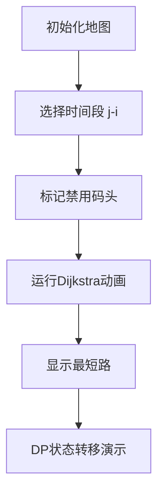

# 题目信息

# [ZJOI2006] 物流运输

## 题目描述

物流公司要把一批货物从码头 A 运到码头 B。由于货物量比较大，需要 $n$ 天才能运完。货物运输过程中一般要转停好几个码头。  

物流公司通常会设计一条固定的运输路线，以便对整个运输过程实施严格的管理和跟踪。由于各种因素的存在，有的时候某个码头会无法装卸货物。这时候就必须修改运输路线，让货物能够按时到达目的地。  

但是修改路线是—件十分麻烦的事情，会带来额外的成本。因此物流公司希望能够订一个 $n$ 天的运输计划，使得总成本尽可能地小。


## 说明/提示

【数据范围】
对于 $100\%$ 的数据，$1 \le n \le 100$，$1\le m \le 20$, $1 \le k \le 500$, $1 \le e \le 200$。

【样例输入说明】


上图依次表示第 $1$ 至第 $5$ 天的情况，阴影表示不可用的码头。

【样例输出说明】

前三天走 $1 \to 4 \to 5$，后两天走 $1 \to 3 \to 5$，这样总成本为 $(2+2)\times 3+(3+2)\times 2+10=32$。

\_NOI导刊2010提高（01）


## 样例 #1

### 输入

```
5 5 10 8
1 2 1
1 3 3
1 4 2
2 3 2
2 4 4
3 4 1
3 5 2
4 5 2
4
2 2 3
3 1 1
3 3 3
4 4 5
```

### 输出

```
32```

# AI分析结果


# 💡 Kay的C++算法解析：物流运输 深入学习指南 💡

## 1. 题目解读与核心算法识别

✨ **本题主要考察**：`动态规划 + 最短路算法`

🗣️ **初步分析**：
> 解决物流运输这道题，关键在于理解并运用 **动态规划与最短路算法的结合**。就像规划一条长期运输策略，我们需要将整个运输周期划分为若干连续时间段，每个时间段内选择一条最优路线并坚持使用，只在必要时切换路线（需支付额外成本）。

在本题中：
1. **动态规划(DP)** 用于计算最小总成本：定义 `dp[i]` 表示前 i 天的最小成本，通过枚举上一次路线变更的时间点进行状态转移
2. **最短路算法(Dijkstra/SPFA)** 用于预处理：计算任意时间段 `[j, i]` 内在可用码头限制下的最短路程

核心算法流程：
- **预处理阶段**：对每个时间段 `[j, i]` 标记不可用码头 → 求最短路 → 存储为 `cost[j][i]`
- **DP阶段**：`dp[i] = min(dp[j] + cost[j+1][i]*(i-j) + k)`，表示在第 j 天后变更路线

可视化设计要点：
- **像素动画**：用网格地图展示码头（不同颜色区分可用/禁用状态）
- **高亮显示**：当前处理的时间段、不可用码头（红色）、最短路计算过程（路径高亮）
- **复古元素**：8-bit风格码头图标，路线变更时播放"叮"音效，成功时播放胜利音效

---

## 2. 精选优质题解参考

**题解一（作者：ycyaw）**
* **点评**：思路清晰直白，完整呈现DP+SPFA的核心逻辑。亮点在于：
  - 预处理 `co[i][j]` 的推导过程简洁（标记禁用码头→SPFA→存储）
  - 准确指出 `long long` 陷阱（90→100分的关键）
  - 代码规范：变量名 `co[i][j]` 含义明确，边界处理完整
  - 实践价值：竞赛标准实现，可直接用于类似场景

**题解二（作者：DavidJing）**
* **点评**：解题框架严谨，突出状态转移方程的物理意义：
  - 用 `f[i][j]` 表示最短路程，`dp[i]` 表示最小成本，层次分明
  - 详细注释关键步骤："第j天后变更路线"的转移逻辑
  - 算法优化：优先队列Dijkstra实现，时间复杂度更稳定
  - 调试提示：强调不可用码头的处理技巧

**题解三（作者：litble）**
* **点评**：提供创新解法（DFS+状压DP）：
  - 亮点：用状态压缩表示路径（`zt` 二进制状态）
  - 独特优势：当码头数少时避免重复计算最短路
  - 代码技巧：`tmp[zt]` 剪枝优化提升效率
  - 学习价值：展示不同思维角度，拓展解题视野

---

## 3. 核心难点辨析与解题策略

1. **难点：跨时间段的最短路预处理**
   - **分析**：需要高效计算任意 `[j,i]` 时间段的最短路，需排除期间任意天不可用的码头
   - **解决**：双重循环枚举时间段 + 状态压缩标记禁用码头 → 调用最短路算法
   - 💡 **学习笔记**：预处理是时空权衡的关键，避免DP中重复计算

2. **难点：DP状态转移设计**
   - **分析**：`dp[i]` 需考虑所有可能的路线变更点 `j`，转移方程包含路线成本与变更成本
   - **解决**：`dp[i] = min(dp[j] + cost[j+1][i]*(i-j) + k)` 其中 `dp[0] = -k` 抵消首次成本
   - 💡 **学习笔记**：`dp[0]=-k` 是保证转移正确性的精妙设置

3. **难点：码头禁用状态的动态处理**
   - **分析**：不同时间段禁用码头集合不同，需快速获得可用码头图
   - **解决**：用二维数组 `ban[i][j]` 标记码头 `i` 第 `j` 天状态，预处理时按位或运算合并
   - 💡 **学习笔记**：状态合并用位运算可加速

### ✨ 解题技巧总结
- **预处理优化**：时空权衡，预先计算所有时间段最短路
- **DP状态设计**：用 `dp[i]` 表示前 i 天最小成本，枚举最后变更点
- **数据类型控制**：成本可能超 `int`，需用 `long long`
- **调试技巧**：小数据模拟验证状态转移（如样例 n=5）

---

## 4. C++核心代码实现赏析

**本题通用核心C++实现参考**
* **说明**：综合自优质题解的精简实现，包含完整DP框架与Dijkstra最短路
* **完整核心代码**：
```cpp
#include <bits/stdc++.h>
using namespace std;
typedef long long ll;
const int N=105, M=25;
const ll INF=1e15;

ll dp[N], cost[N][N];
bool ban[M][N], now[M];
vector<pair<int, int>> g[M]; // 邻接表存图

ll dijkstra() {
    priority_queue<pair<ll, int>> pq;
    vector<ll> dis(M, INF);
    vector<bool> vis(M, false);
    dis[1] = 0;
    pq.push({0, 1});
    while (!pq.empty()) {
        int u = pq.top().second;
        pq.pop();
        if (vis[u]) continue;
        vis[u] = true;
        for (auto [v, w] : g[u]) {
            if (now[v]) continue; // 跳过禁用码头
            if (dis[v] > dis[u] + w) {
                dis[v] = dis[u] + w;
                pq.push({-dis[v], v});
            }
        }
    }
    return dis[M-1]; // 返回1→m的最短路
}

int main() {
    int n, m, k, e, d;
    cin >> n >> m >> k >> e;
    while (e--) {
        int u, v, w;
        cin >> u >> v >> w;
        g[u].push_back({v, w});
        g[v].push_back({u, w});
    }
    cin >> d;
    while (d--) {
        int p, a, b;
        cin >> p >> a >> b;
        for (int i = a; i <= b; i++)
            ban[p][i] = true;
    }

    // 预处理cost[i][j]
    for (int i = 1; i <= n; i++) {
        memset(now, 0, sizeof(now));
        for (int j = i; j <= n; j++) {
            for (int p = 1; p <= m; p++)
                now[p] |= ban[p][j]; // 标记禁用
            ll tmp = dijkstra();
            cost[i][j] = (tmp == INF) ? INF : tmp * (j-i+1);
        }
    }

    // DP求解
    dp[0] = -k;
    for (int i = 1; i <= n; i++) {
        dp[i] = cost[1][i]; // 全程不换路线
        for (int j = 0; j < i; j++) {
            if (cost[j+1][i] == INF) continue;
            dp[i] = min(dp[i], dp[j] + cost[j+1][i] + k);
        }
    }
    cout << dp[n] << endl;
    return 0;
}
```

* **代码解读概要**：
  1. **图存储**：使用 `vector<pair<int,int>> g[M]` 邻接表
  2. **Dijkstra**：优先队列实现，跳过 `now[]` 标记的禁用码头
  3. **预处理**：双循环处理所有时间段，`now[p] |= ban[p][j]` 动态更新禁用集
  4. **DP转移**：关键转移 `dp[i] = min(dp[i], dp[j] + cost[j+1][i] + k)`

---

## 5. 算法可视化：像素动画演示

### 设计概念：**"物流指挥官"复古像素模拟**
- **整体风格**：8-bit像素风（类FC游戏），码头用不同色块表示
- **动画流程**：



1. **场景初始化**（像素网格）：
   - 码头1：绿色像素块，码头m：金色宝箱图标
   - 不可用码头：闪烁红色，障碍物：深灰色

2. **最短路计算演示**：
   - 当前节点：黄色闪烁边框
   - 松弛操作：蓝色脉冲动画 + "滴"音效
   - 路径更新：路径线逐渐点亮（蓝色→绿色）

3. **DP决策演示**：
   - 时间轴：底部进度条显示天数
   - 决策点：第 j 天显示"变更路线"提示
   - 成本计算：`cost[j+1][i]` 显示为路径长度 x 天数

4. **交互控制**：
   - 步进控制：←→键单步执行，空格暂停/继续
   - 速度滑块：右下角调速器（乌龟→兔子）
   - 模式切换：Tab键切换"最短路"/"DP"视图

5. **音效设计**：
   - 路径变更："咔嚓"机械声
   - 错误路线：短促"哔"声
   - 完成运输：胜利号角音效

---

## 6. 拓展练习与相似问题思考

### 相似问题场景
1. **带时间窗的最短路径**：码头禁用扩展为时间窗限制
2. **动态边权规划**：道路维修导致通行时间变化
3. **多目标点运输**：需服务多个港口后返回

### 推荐练习（洛谷）：
1. **P1073 最优贸易**  
   → 同类技术：最短路+DP，学习状态分层设计
2. **P1948 电话线**  
   → 强化训练：最短路与决策结合（二分答案）
3. **P2296 寻找道路**  
   → 进阶：图预处理技巧（反图+最短路）

---

## 7. 学习心得与经验分享
> **来自ycyaw的调试经验**：  
> "90分→100分的关键：发现 `cost[i][j]` 可能达到 `10^6` 量级，n=100时总成本超 `int` 范围，改为 `long long` 后AC"

**Kay的总结**：  
- **数据范围意识**：即使题目规模小，中间结果可能溢出
- **DP初始化技巧**：`dp[0]=-k` 抵消首次变更成本是关键
- **调试建议**：用n=3小样例手工验证状态转移

---

本次分析就到这里，理解DP与最短路的结合是解这类问题的核心。记住：好算法=正确策略+细节处理！下次见！🚚💨

---
处理用时：173.13秒