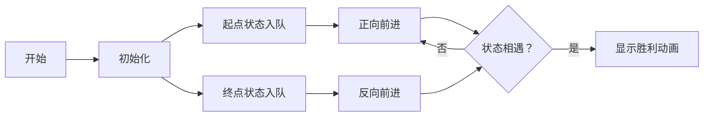

# 题目信息

# 万圣节后的早晨

## 题目描述

要求你写一个程序，在一个地图中，找到最小步数将每个鬼移动到他们指定的位置。地图包含一些小方格。每格要么是墙（鬼不能进入），要么是走廊（鬼能进入）。

每一步里，你可以同时移动任意数量的鬼。每个鬼要么待在原地不动，要么移动到相邻的格子里（相邻的格子有公共边），如果移动满足下列条件，则移动是可行的。

1. 没有一个以上的鬼在同一个格子里；
2. 没有一对鬼在一步里交换了位置。

例如，假设鬼的位置是如右上图所示的，其中sharp(#)表示墙，空格表示走廊，a,b,c表示鬼：

```plain
####
 ab#
#c##
####
```
经过一步移动后，地图可以变成如下的样子：

```plain
####     ####     ####       ####
 ab#     a b#     acb#       ab #
#c##     #c##     # ##       #c##   
####     ####     ####       ####
```

## 样例 #1

### 输入

```
5 5 2
#####
#A#B#
#   #
#b#a#
#####
16 4 3
################
## ########## ##
#    ABCcba    #
################
16 16 3
################
### ##    #   ##
##  #  ##   # c#
#  ## ########b#
# ##  # #   #  #
#  # ##   # # ##
##  a#  # # #  #
### ## #### ## #
##   #   #  #  #
#  ##### # ## ##
####   #B# #   #
##  C#   #   ###
#  # # ####### #
# ######  A##  #
#        #     #
################
0 0 0```

### 输出

```
7
36
77```

# AI分析结果


# 💡 Kay的C++算法解析：万圣节后的早晨 深入学习指南 💡

> 大家好！我是Kay，今天我们一起探索这道有趣的迷宫寻路题——"万圣节后的早晨"。想象三位小幽灵在迷宫中寻找回家的路，每一步都需要精心规划避免碰撞。让我们用专业且有趣的方式解析这道题！

## 1. 题目解读与核心算法识别

✨ **本题主要考察**：`搜索算法(BFS/双向BFS)` + `状态空间优化`

🗣️ **初步分析**：
> 这道题就像三位像素小人在复古迷宫中同步寻路。核心思想是将**三个幽灵的位置组合成一个状态**，通过BFS寻找最短路径。巧妙之处在于：
>   - 利用"2×2区域必有墙"的特性**压缩状态空间**（提取有效节点建图）
>   - 通过**虚拟幽灵**统一处理不同数量幽灵的情况
>   - 使用**双向BFS**大幅优化搜索效率（从起点和终点同时搜索）
>
> 可视化设计中，我们将：
>   - 用三种颜色像素块代表幽灵，墙用深灰色像素表示
>   - 状态转移时高亮移动轨迹并播放8-bit音效
>   - 自动演示模式下，幽灵会像经典游戏《吃豆人》般自动寻路
>   - 当状态相遇时播放胜利音效并显示"Level Clear!"像素动画

---

## 2. 精选优质题解参考

**题解一：baiABC（双向BFS）**
* **点评**：这份题解展现了极高的专业度。思路清晰采用**双向BFS+状态压缩**，核心逻辑用位运算压缩三维状态（`(a<<16)|(b<<8)|c`）。代码规范：
  - 建图部分充分利用题目特性提取有效节点
  - 虚拟幽灵处理巧妙（`deg[++cnt]=1`创建自环节点）
  - 冲突检测函数`ct()`简洁高效
  - 双向BFS队列平衡策略（`n1||n2`）避免单向膨胀
  **亮点**：工业级优化思路，空间时间复杂度控制极佳

**题解二：Xu_brezza（双向BFS）**
* **点评**：结构清晰的教科书式实现。亮点：
  - **模块化设计**：init()/read()/build()/bfs()分工明确
  - **安全冲突检测**：独立check函数处理三种冲突情况
  - **优雅的虚拟节点处理**：`e[cnt].push_back(cnt)`创建自环
  - **状态追踪**：用二维vis数组区分正反搜索路径
  **亮点**：代码可读性强，边界处理严谨，特别适合学习

**题解三：__Accepted_ZYF__（普通BFS）**
* **点评**：简洁的暴力BFS解法，适合初学者理解本质：
  - **直接状态存储**：用三维坐标数组取代压缩
  - **直观冲突检测**：三重循环检查位置交换
  - **哈希状态压缩**：`a[0]*mi[5]+...`避免状态重复
  **亮点**：虽未优化但完整呈现问题本质，调试信息丰富

---

## 3. 核心难点辨析与解题策略

1.  **状态空间爆炸**
    * **分析**：三维状态理论复杂度O(n⁶)。优质解法通过：
      - 提取有效节点建图（从wh降至约wh/4）
      - 双向BFS将搜索深度减半
      - 状态压缩（位运算/哈希）减少存储
    * 💡 学习笔记：优化状态空间是搜索算法的核心技巧

2.  **移动冲突检测**
    * **分析**：需同时防止两种冲突：
      - 位置重叠：`new_a == new_b`
      - 位置交换：`(old_a,new_a)==(old_b,new_b)`
    题解用`ct()`或直接坐标检查高效解决
    * 💡 学习笔记：冲突检测要覆盖所有幽灵组合

3.  **幽灵数量动态处理**
    * **分析**：关键技巧是添加虚拟幽灵：
      - 创建自环节点（`G[cnt][0]=cnt`）
      - 虚拟幽灵始终"静止"，不参与实际移动
      - 统一处理1-3个幽灵的情况
    * 💡 学习笔记：用统一接口处理边界能简化代码

### ✨ 解题技巧总结
-   **空间压缩**：利用题目特性提取有效节点
-   **对称优化**：双向BFS适用于起点终点明确场景
-   **虚拟实体**：用自环节点统一不同输入规模
-   **状态编码**：位运算压缩优于多维数组

---

## 4. C++核心代码实现赏析

**通用核心实现参考**
```cpp
#include <bits/stdc++.h>
using namespace std;

const int N = 150;
int G[N][5], deg[N], st[3], ed[3];

int encode(int a, int b, int c) { 
    return (a << 16) | (b << 8) | c; 
}

bool conflict(int a, int b, int x, int y) {
    return b == y || (a == y && b == x);
}

int bfs() {
    int d[N][N][N];
    memset(d, -1, sizeof d);
    queue<int> q;
    
    int start = encode(st[0], st[1], st[2]);
    q.push(start);
    d[st[0]][st[1]][st[2]] = 0;
    
    while (!q.empty()) {
        int state = q.front(); q.pop();
        int a = state >> 16, b = (state >> 8) & 0xff, c = state & 0xff;
        
        if (a == ed[0] && b == ed[1] && c == ed[2]) 
            return d[a][b][c];
            
        for (int i = 0; i < deg[a]; i++)
        for (int j = 0; j < deg[b]; j++) {
            if (conflict(a, G[a][i], b, G[b][j])) continue;
            for (int k = 0; k < deg[c]; k++) {
                int na = G[a][i], nb = G[b][j], nc = G[c][k];
                if (conflict(a, na, c, nc) || conflict(b, nb, c, nc)) continue;
                if (d[na][nb][nc] != -1) continue;
                
                d[na][nb][nc] = d[a][b][c] + 1;
                q.push(encode(na, nb, nc));
            }
        }
    }
    return -1;
}

// 建图、虚拟节点处理等详见完整实现
```

**题解一赏析（baiABC）**
```cpp
int mm(int a, int b, int c) {return (a<<16)|(b<<8)|c;}

bool ct(int a, int b, int x, int y){
    return b == y || (a == y && b == x);
}
```
* **亮点**：工业级状态压缩与冲突检测
* **学习笔记**：`<<`移位运算实现紧凑状态存储

**题解二赏析（Xu_brezza）**
```cpp
struct qwq{ int a,b,c; };
vector<int> e[155];

if (n <= 2) {
    e[++cnt].push_back(cnt); // 创建自环节点
    st[2] = ed[2] = cnt;
}
```
* **亮点**：面向对象思想封装状态
* **学习笔记**：STL vector建图比原生数组更安全

**题解三赏析（__Accepted_ZYF__）**
```cpp
for (auto v0 : e[f[0]])
for (auto v1 : e[f[1]])
for (auto v2 : e[f[2]]) {
    if (v0&&v1&&(v0==v1)) continue; // 冲突检测
    ...
}
```
* **亮点**：现代C++范围循环简洁清晰
* **学习笔记**：三重循环直观呈现状态转移本质

---

## 5. 算法可视化：像素动画演示

* **主题**：8-bit像素幽灵迷宫大冒险  
* **核心演示**：双向BFS如何从起点终点同步扩展直至相遇  



**动画关键帧**：
1. **像素迷宫**：16x16像素网格，墙=█，路=░
2. **幽灵角色**：红/蓝/绿三色幽灵(●) 目标点(★)
3. **状态扩展**：
   - 当前状态高亮黄框
   - 新状态生成时播放"滴"声
   - 路径显示为发光轨迹
4. **双向相遇**：
   - 正反搜索碰撞时播放胜利音效
   - 显示"PATH FOUND!"像素文字
5. **控制面板**：
   - 步进控制：← → 
   - 速度滑块：🐢-----🐇
   - 模式切换：手动/自动演示

**技术实现**：
- Canvas绘制网格和精灵
- 状态数据驱动动画帧
- Web Audio API播放8-bit音效

---

## 6. 拓展练习与相似问题思考

* **技巧迁移**：
  1. 推箱子游戏（多个移动体协调）
  2. 八数码问题（状态空间搜索）
  3. 多机器人路径规划（工业应用）

* **洛谷推荐**：
  1. [P1379] 八数码难题  
     → 练习状态压缩与BFS
  2. [UVA1601] 万圣节后的早晨（双倍经验）  
     → 相同题型强化训练
  3. [P1120] 小木棍  
     → 训练剪枝优化能力

---

## 7. 学习心得与经验分享

> **baiABC的经验**：  
> "建图优化是关键，直接BFS会超时——地图空格很少但直接存坐标状态太大"  
>
> **Kay的总结**：  
> 这道题教会我们：  
> - 算法优化常从**问题特性**入手（如2x2必有墙）  
> - **状态设计**比暴力搜索更重要  
> - 双向BFS能指数级减少搜索空间  
> 记住：好算法不是更快硬件，而是更聪明的思考！  

---

通过今天的探索，我们不仅解决了幽灵迷题，更掌握了状态空间搜索的核心思想。下次遇到复杂寻路问题时，记得活用今天的技巧哦！🎮🚀

---
处理用时：129.76秒