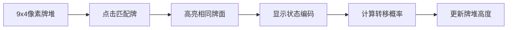

# 题目信息

# 单人纸牌

## 题目描述

单人纸牌游戏，共 $36$ 张牌分成 $9$ 叠，每叠 $4$ 张牌面向上。每次，游戏者可以从某两个不同的牌堆最顶上取出两张牌面相同的牌（如黑桃 $10$ 和梅花 $10$）并且一起拿走。如果最后所有纸牌都被取走，则游戏者就赢了，否则游戏者就输了。

George 很热衷于玩这个游戏，但是一旦有时有多种选择的方法，George 就不知道取哪一种好了，George 会从中随机地选择一种走，例如：顶上的 $9$ 张牌为 $\tt KS,\tt KH,\tt KD,\tt 9H,\tt 8S,\tt 8D,\tt 7C,\tt 7D,\tt 6H$，显然有 $5$ 种取法：$\tt (KS,KH),(KS,KD),(KH,KD),(8S,8D),(7C,7D)$，当然 George 取到每一种取法的概率都是 $1/5$。

有一次，George 的朋友 Andrew 告诉他，这样做是很愚蠢的，不过 George 不相信，他认为如此玩最后成功的概率是非常大的。请写一个程序帮助 George 证明他的结论：计算按照他的策略，最后胜利的概率。

## 样例 #1

### 输入

```
AS 9S 6C KS 

JC QH AC KH 

7S QD JD KD 

QS TS JS 9H 

6D TD AD 8S 

QC TH KC 8D 

8C 9D TC 7C 

9C 7H JH 7D 

8H 6S AH 6H ```

### 输出

```
0.589314```

# AI分析结果


### 💡 Kay的C++算法解析：单人纸牌 深入学习指南 💡

**引言**  
今天我们来分析洛谷P1837《单人纸牌》这道动态规划经典题。本指南将带大家理解状态压缩技巧在概率DP中的应用，掌握九维DP的实现方式，并通过像素动画直观感受算法流程。

---

## 1. 题目解读与核心算法识别

✨ **本题主要考察**：`状态压缩动态规划`  

🗣️ **初步分析**：  
> 本题可看作在9×4的牌阵中按规则取牌的路径计数问题。核心如同在迷宫中寻找所有能通关的路径——每次需选择两张相同的牌（分叉路口），最终统计所有成功路径的总概率。  
> - **核心难点**：状态空间巨大（9堆×5种状态=195万），需高效表示状态转移关系  
> - **解决方案**：  
>   • 五进制状压：用单整数表示9堆状态（zimujun解法）  
>   • 九维数组：直观但高内存消耗（jixuan解法）  
> - **可视化设计**：  
>   • 用9列像素块表示牌堆，高度随取牌下降  
>   • 高亮相同牌面时播放"匹配音效"  
>   • 底部实时显示当前状态编码和概率值  

---

## 2. 精选优质题解参考

**题解一：zimujun（状压DP）**  
* **点评**：思路创新性强，用五进制压缩状态（`t/5^i%5`取状态），将九维空间压至一维，大幅提升效率。代码中`pow5`预计算数组、位运算取状态等技巧极具实战价值。边界处理严谨（检查`%5>0`），概率转移公式`f[t]-=pow5[p1]+pow5[p2]`的写法简洁高效，是竞赛级实现的典范。

**题解二：jixuan（九维DP）**  
* **点评**：采用最直观的九维数组，虽内存消耗大但逻辑清晰。亮点在于：  
  1. 输入时倒序存储牌堆（`a[x][i]=s[1]`）  
  2. 循环内动态计算可选方案数`cnt`  
  3. 回溯式更新状态（`f[i]++; ... f[i]--`）  
  代码结构工整，是理解DP状态转移的优质教学模板。

**题解三：Furina_Saikou（记忆化搜索）**  
* **点评**：创新性使用九维数组记忆化，避免重复计算。亮点在于：  
  - 用`v[9]`记录堆顶位置  
  - 递归前预判`if(v[i]==4)continue`  
  - 概率累加公式`sum+=dfs1()/cnt`自然体现分治思想  
  虽递归深度较大，但提供了DFS解DP的新视角。

---

## 3. 核心难点辨析与解题策略

1. **状态空间爆炸**  
   * **分析**：9堆牌每堆5种状态（0-4张），传统数组需$5^9=195万$项。优质解法采用：  
     - 五进制压缩（zimujun）  
     - 动态计算合法转移（jixuan）  
   * 💡 **学习笔记**：状态压缩是处理高维DP的利器

2. **概率转移计算**  
   * **分析**：每次操作概率=1/当前可行方案数。关键技巧：  
     - 先遍历所有牌堆计算`cnt`（jixuan）  
     - 用`f[t]/cnt`更新子状态（zimujun）  
   * 💡 **学习笔记**：概率DP需同步维护状态值和转移权重

3. **输入顺序处理**  
   * **分析**：输入按堆底到堆顶给出，需倒序存储：  
     ```cpp
     for(int j=4;j>=1;j--) cin>>s; // 倒序读入
     ```
   * 💡 **学习笔记**：仔细审题是避免调试陷阱的关键

### ✨ 解题技巧总结
- **空间压缩术**：用进制转换思想压缩高维状态
- **倒序存储法**：根据输入特点调整数据结构
- **预计算优化**：提前计算`pow5`数组避免重复求幂
- **回溯式更新**：临时修改状态后还原，保持代码整洁

---

## 4. C++核心代码实现赏析

**通用核心实现参考**  
```cpp
// 基于zimujun的状压DP简化版
const int pow5[] = {1,5,25,125,625,3125,15625,78125,390625,1953125};
double f[2000000] = {0}; // 状态数组
char a[9][5]; // 牌面存储

int main() {
    // 倒序读入牌堆（代码略）
    f[1953124] = 1.0; // 初始状态(4,4,...,4)
    for(int state = 1953124; state >=0; state--){
        double p = f[state];
        int cnt = 0;
        // 计算当前可操作数cnt（略）
        for(int i=0; i<9; i++){
            for(int j=i+1; j<9; j++){
                if(可匹配){
                    int new_state = state - pow5[i] - pow5[j];
                    f[new_state] += p / cnt;
                }
            }
        }
    }
    cout << f[0]; // 目标状态(0,0,...,0)
}
```
**代码解读概要**：  
1. `pow5`数组实现五进制位权快速计算  
2. `state`整数通过`/pow5[i]%5`解码各堆状态  
3. 倒序枚举保证子状态先于父状态计算  
4. `f[0]`对应所有牌取完的理想状态  

---

## 5. 算法可视化：像素动画演示

**主题**：`8-bit风纸牌冒险`  
**核心演示**：状压DP的状态解码与概率转移  



**动画设计细节**：  
1. **像素建模**：
   - 9列×4行LED风格牌块，配色参考FC游戏《俄罗斯方块》
   - 牌面用大写字母（A/K/Q/J）显示

2. **动态演示**：  
   - 选中两张牌时播放8-bit"叮"声
   - 牌堆高度随取牌下降，带像素粒子消散效果
   - 底部状态栏实时显示五进制编码（如"1023->0312"）

3. **交互控制**：
   ```javascript
   // 伪代码示例
   const animations = {
     onMatch: () => playSound('match.wav'),
     onStateChange: (state) => {
       drawGrid(state); // 重绘牌堆
       showProbability(f[state]); 
     }
   }
   ```

4. **游戏化元素**：
   - 每清空一列获得金币音效
   - 完全通关时播放《超级玛丽》过关音乐
   - "AI演示模式"自动匹配可操作牌对

---

## 6. 拓展练习与相似问题思考

**通用技巧迁移**：  
1. 棋盘覆盖问题（骨牌覆盖方案数）  
2. 多队列任务调度（状态表示资源分配）  
3. 图遍历路径计数（压缩访问状态）  

**洛谷推荐**：  
1. **P1433 吃奶酪**  
   🗣️ 状压DP经典，练习坐标压缩技巧  
2. **P2831 愤怒的小鸟**  
   🗣️ 抛物线覆盖问题，强化状态设计能力  
3. **P3052 [USACO]摩天大楼**  
   🗣️ 九维DP变种，提升高维状态处理能力  

---

## 7. 学习心得与经验分享

**作者经验**：  
> "输入顺序陷阱让我调试2小时——牌堆从底向上给数据，必须倒序存储！"（jixuan）  

**Kay点评**：  
> 这反映两个关键点：  
> 1. 仔细阅读输入格式描述  
> 2. 用`cout<<a[i][j]`验证存储结构  
> 建议编写parse函数集中处理输入转换  

---

**结语**  
通过《单人纸牌》我们掌握了状态压缩DP的核心技巧：五进制编码、倒序状态转移、概率归一化处理。记住Kay的秘诀："高维DP想压缩，进制转换是法宝"！下次遇到类似问题，不妨先画状态转移图哦~ 💪

---
处理用时：114.57秒