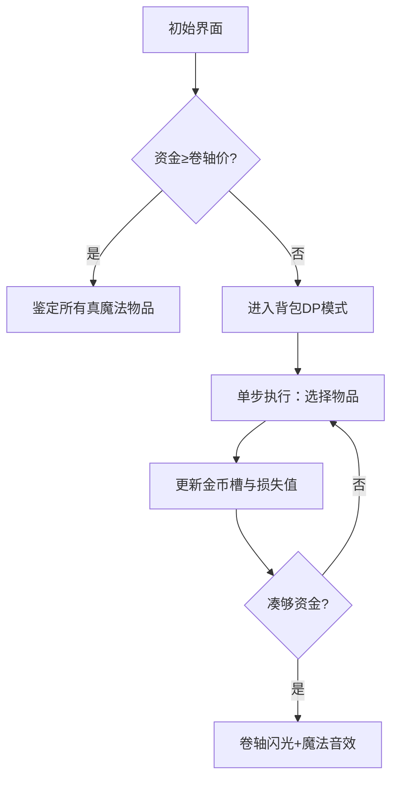

# 题目信息

# 魔法物品

## 题目描述


有两种类型的物品：普通物品和魔法物品。普通物品没有魔法属性，而魔法物品拥有一些魔法属性。每种普通物品有一个价值 $P$，但每种魔法物品有两种价值：鉴定前的价值 $P_1$ 和鉴定后的价值 $P_2$（当然，$P_2$ 总是大于 $P_1$）。

为了鉴定一个魔法物品，你需要购买一个鉴定卷轴，用它来鉴定魔法物品。鉴定完一件魔法物品以后，鉴定卷轴便会消失。每个鉴定卷轴将会消耗 $P_i$ 元钱。如果没有足够的钱，你将无法购买任何鉴定卷轴。    
现在，你正在一个集市中，同时拥有很多物品。你知道每件物品的价值并且想要出售全部物品。那么，你最多能够获得多少钱呢？

你可以假定：

- 开始的时候你没有钱。
- 所有的魔法物品都还没有被鉴定。
- 只要你有足够的钱，你可以购买任意多的鉴定卷轴。

## 说明/提示

对于 $30\%$ 的数据，$1\le N \le 50$。  
对于 $100\%$ 的数据，$1 \le N \le 1000$。

## 样例 #1

### 输入

```
2 10
10
20 100
```

### 输出

```
100
```

# AI分析结果


# 💡 Kay的C++算法解析：魔法物品 深入学习指南 💡

> 今天我们一起探索"魔法物品"这道动态规划与贪心策略结合的经典题目。本指南将带大家理解物品分类策略、背包问题建模，并通过像素游戏化动画直观感受算法流程！

## 1. 题目解读与核心算法识别

✨ **本题主要考察**：`动态规划（背包问题）` + `贪心策略`

🗣️ **初步分析**：
> 解决魔法物品问题就像经营一家魔法商店：我们需要**明智决策**哪些物品直接售卖（普通物品）、哪些值得鉴定（真魔法物品）。关键在于运用**贪心预处理**剔除劣质魔法物品，再通过**背包DP**解决资金不足时的鉴定决策问题：
> - **贪心核心**：若魔法物品鉴定利润(P2-P1-P)≤0，直接作为普通物品售卖
> - **背包核心**：当初始资金不足时，选择部分真魔法物品以未鉴定价出售凑钱，同时最小化鉴定利润损失
> - **可视化设计**：采用像素风商店界面，货架分类展示三类物品。背包DP过程用"金币槽"动态显示资金缺口，物品选择时触发不同音效（金币声/魔法音效）。关键高亮：当前处理的魔法物品、状态转移时的数值变化、卷轴购买成功时的闪光特效

---

## 2. 精选优质题解参考

### 题解一（Drifterming）
* **点评**：思路清晰划分"真假魔法物品"概念，代码规范（变量名`profit`直观测算利润）。DP设计完整处理边界：当无法凑够资金时回退未鉴定方案。亮点在于详细注释+字符串流处理复杂输入，实践价值高（可直接用于竞赛）

### 题解二（xkcdjerry）
* **点评**：最简洁高效实现（仅25行），创新getchar检测空格代替字符串流。背包状态范围优化到5000极大提升效率。亮点在于空间复杂度优化和输入处理技巧，适合竞赛场景

### 题解三（cdcq）
* **点评**：独特逆向思维——定义f[j]为获得j元时的最大收益而非最小损失。通过"开包自持性"理论（只要开第一个包后面可连锁鉴定）简化问题本质，适合培养深度思考能力

---

## 3. 核心难点辨析与解题策略

1. **物品分类与预处理**
   * **分析**：准确区分普通物品、假魔法物品(P2-P1≤P)、真魔法物品是解题基础。优质题解都先进行贪心预处理筛除劣质项
   * 💡 学习笔记：预处理能简化DP状态，是复杂问题拆解的关键技巧

2. **背包状态设计**
   * **分析**：资金不足时需决策：卖哪些真魔法物品凑钱？设计f[j]=凑j元的最小损失。状态转移：`f[j]=min(f[j], f[j-P1]+(P2-P1-P))`
   * 💡 学习笔记：背包本质是"代价与收益"的权衡，将商业决策转化为数学模型

3. **边界处理与状态初始化**
   * **分析**：当∑P1<P（卖光也凑不够钱）需回退未鉴定方案。DP初始值设为极大数（不可达状态），f[0]=0
   * 💡 学习笔记：健壮的程序必须考虑所有边界，特别是"无解"场景

### ✨ 解题技巧总结
- **问题分解**：将复杂商业决策拆解为（贪心预处理+背包DP+边界处理）三阶段
- **变量命名**：使用profit、cost等业务相关变量名提升可读性
- **数据范围估算**：背包状态上限=∑P1（最大1e4）而非∑P2（可能1e7）
- **输入鲁棒性**：用getchar检测空格或stringstream处理不定长输入

---

## 4. C++核心代码实现赏析

### 本题通用核心实现
```cpp
#include <iostream>
#include <vector>
#include <cstring>
using namespace std;

int main() {
    int n, P, total = 0, base = 0;
    cin >> n >> P;
    vector<int> items; // 存储真魔法物品的利润损失
    vector<int> values; // 存储真魔法物品的未鉴定价
    
    // 输入处理与分类
    for(int i=0; i<n; ++i) {
        int p1, p2;
        char c = getchar();
        if(c == ' ') { // 魔法物品
            cin >> p2;
            if(p2 - p1 > P) { // 真魔法物品
                items.push_back(p2 - p1 - P);
                values.push_back(p1);
            } else base += p1; // 假魔法物品
        } else base += p1; // 普通物品
    }
    
    // 资金充足时直接鉴定
    if(base >= P) {
        for(int profit : items) base += profit;
        cout << base;
        return 0;
    }
    
    // 背包DP求最小损失
    int need = P - base;
    vector<int> dp(need+1, 1e9);
    dp[0] = 0;
    for(int i=0; i<items.size(); ++i) {
        for(int j=need; j>=values[i]; --j) {
            dp[j] = min(dp[j], dp[j-values[i]] + items[i]);
        }
    }
    
    // 处理结果
    if(dp[need] == 1e9) { // 无法凑够
        for(int v : values) base += v;
        cout << base;
    } else {
        for(int profit : items) base += profit;
        cout << base - dp[need];
    }
}
```
* **代码解读概要**：
  1. 输入阶段：用getchar检测空格区分物品类型
  2. 分类存储：真魔法物品单独记录未鉴定价和鉴定利润
  3. 资金判断：base≥P直接鉴定所有真魔法物品
  4. 背包DP：凑齐P-base资金的最小损失
  5. 结果输出：区分能否凑够卷轴资金的情况

### 题解一（Drifterming）片段赏析
```cpp
if(s>>b && b-P-a>0) { // 真魔法物品判定
    profit[mf]=b-P-a; // 鉴定利润计算
}
// 背包DP核心
for(int i=1;i<=mf;++i) {
    for(int j=allv-v;j>=p1[i];--j) {
        dp[j]=min(dp[j], dp[j-p1[i]]+profit[i]);
    }
}
```
* **亮点**：显式利润计算与状态转移分离，逻辑清晰
* **学习笔记**：将业务概念(profit)与算法实现(dp)解耦提升可维护性

### 题解二（xkcdjerry）片段赏析
```cpp
// 输入处理技巧
if(getchar()==' ') { // 检测空格判断魔法物品
    scanf("%d",&y);
    if(x>=y-p) v+=x; // 假魔法物品
    else a[m]=x,b[m++]=y; // 真魔法物品存储
}
```
* **亮点**：极简输入处理避免字符串流开销
* **学习笔记**：利用输入格式特征优化是竞赛实用技巧

---

## 5. 算法可视化：像素动画演示

### 魔法商店模拟器（8-bit风格）

* **设计思路**：复古RPG商店界面帮助理解三类物品：
  - 普通物品：灰色货架（直接售卖）
  - 假魔法物品：蓝色货架（鉴定亏本）
  - 真魔法物品：金色货架（需决策）

### 动画流程


### 交互设计
1. **控制面板**：
   - 速度滑块：调节DP执行速度
   - 单步/自动模式：空格键单步，A键自动演示
   - 重置按钮：圆形箭头图标
2. **音效系统**：
   - 普通售卖："金币叮当"(Web Audio API)
   - 物品选择："卡牌滑动"音效
   - 成功鉴定："魔法咏唱"上升音阶
3. **游戏化元素**：
   - 进度奖励：每完成10%DP进度获得像素星星
   - 损失统计：屏幕下方实时显示鉴定利润损失值
   - 卷轴动画：购买时像素卷轴展开特效

### 实现要点
```javascript
// 伪代码：背包DP可视化核心
function drawDPStep(itemIndex, currentMoney) {
  highlightItem(itemIndex); // 高亮当前物品
  playSound('select'); 
  let prevMoney = currentMoney - items[itemIndex].cost;
  drawMoneyFlow(prevMoney, currentMoney); // 金币流动动画
  if(currentMoney >= P) {
    playSound('magic');
    startSparkleAnimation(); // 卷轴闪光
  }
}
```

---

## 6. 拓展练习与相似问题思考

### 通用技巧迁移
背包DP+贪心预处理的核心思路适用于：
1. 资源受限的优化问题（如投资组合）
2. 成本效益决策（如生产计划）
3. 阶梯式消费场景（如优惠券组合使用）

### 洛谷推荐
1. **P1048 采药**  
   → 基础背包问题，巩固状态转移
2. **P1060 开心的金明**  
   → 背包问题变种，引入满意度权重
3. **P1156 垃圾陷阱**  
   → 时间维度背包，拓展DP设计思维

---

## 7. 学习心得与经验分享

> **cdcq的调试经验**：  
> *"我在处理DP状态初始化时卡了很久，后来通过打印dp数组发现未设置不可达状态"*  
> **Kay点评**：这提醒我们初始化是DP的关键步骤，特别是边界值。建议：
> 1. 用`0x3f3f3f3f`显式标记不可达状态
> 2. 小规模测试验证DP表正确性
> 3. 先手算样例再对照程序输出

---

通过本次分析，我们掌握了动态规划在实际问题中的灵活应用。记住：好的算法设计=问题抽象能力+边界处理意识+代码实现技巧。下次遇到类似问题时，不妨想想魔法商店的经营策略哦！💪

---
处理用时：127.95秒