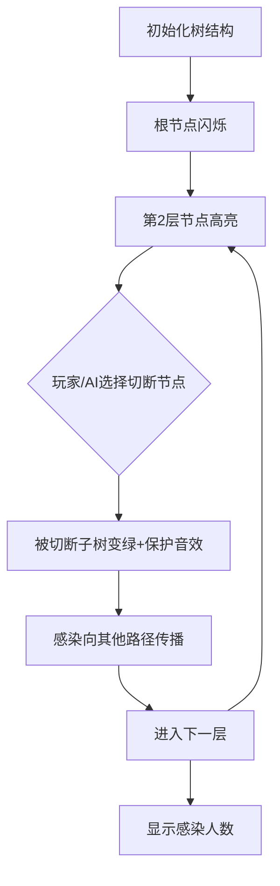

# 题目信息

# [NOIP 2003 提高组] 传染病控制

## 题目背景

本题是错题，后来被证明没有靠谱的多项式复杂度的做法。测试数据非常的水，各种玄学做法都可以通过，不代表算法正确。因此本题题目和数据仅供参考。

[关于此类题目的详细内容](https://www.luogu.com.cn/paste/pf94n89x)

---

近来，一种新的传染病肆虐全球。蓬莱国也发现了零星感染者，为防止该病在蓬莱国大范围流行，该国政府决定不惜一切代价控制传染病的蔓延。不幸的是，由于人们尚未完全认识这种传染病，难以准确判别病毒携带者，更没有研制出疫苗以保护易感人群。于是，蓬莱国的疾病控制中心决定采取切断传播途径的方法控制疾病传播。经过 WHO（世界卫生组织）以及全球各国科研部门的努力，这种新兴传染病的传播途径和控制方法已经研究清楚，剩下的任务就是由你协助蓬莱国疾控中心制定一个有效的控制办法。


## 题目描述

研究表明，这种传染病的传播具有两种很特殊的性质；

第一是它的传播途径是树型的，一个人 $X$ 只可能被某个特定的人 $Y$ 感染，只要 $Y$ 不得病，或者是 $XY$ 之间的传播途径被切断，则 $X$ 就不会得病。


第二是，这种疾病的传播有周期性，在一个疾病传播周期之内，传染病将只会感染一代患者，而不会再传播给下一代。


这些性质大大减轻了蓬莱国疾病防控的压力，并且他们已经得到了国内部分易感人群的潜在传播途径图（一棵树）。但是，麻烦还没有结束。由于蓬莱国疾控中心人手不够，同时也缺乏强大的技术，以致他们在一个疾病传播周期内，只能设法切断一条传播途径，而没有被控制的传播途径就会引起更多的易感人群被感染（也就是与当前已经被感染的人有传播途径相连，且连接途径没有被切断的人群）。当不可能有健康人被感染时，疾病就中止传播。所以，蓬莱国疾控中心要制定出一个切断传播途径的顺序，以使尽量少的人被感染。


你的程序要针对给定的树，找出合适的切断顺序。


## 说明/提示

对于 $100\%$ 的数据，$1 \leq n \leq 300$。

**【题目来源】**

NOIP 2003 提高组第四题

## 样例 #1

### 输入

```
7 6
1 2
1 3
2 4
2 5
3 6
3 7
```

### 输出

```
3
```

# AI分析结果


# 💡 Kay的C++算法解析：传染病控制 深入学习指南 💡

大家好，我是Kay！今天我们一起分析NOIP 2003提高组的经典题目《传染病控制》。这道题考察树形结构上的搜索策略设计，虽然题目被标注为"错题"，但其中蕴含的算法思想非常值得学习。本指南将帮助你理解题目核心思路，掌握DFS在树形问题中的应用技巧，并通过像素动画直观感受算法执行过程。

## 1. 题目解读与核心算法识别

✨ **本题主要考察**：`搜索(DFS)` + `树形结构应用`

🗣️ **初步分析**：
> 解决传染病控制问题就像在迷宫中寻找最优逃生路线——我们有一棵代表传播路径的树，需要在每层"关卡"（传播阶段）选择切断一条路径（保护一棵子树），使最终"被困人数"（感染者）最少。核心思想是**分层决策的DFS搜索**：  
> 1. 将树按深度分层（根节点在第1层）
> 2. 从第2层开始，每层选择一个节点切断其与父节点的连接
> 3. 被切断的子树受到保护，剩余节点继续传播
> 4. 通过DFS枚举所有切断方案，找到感染人数最小值  
>  
> **关键难点**在于高效枚举和剪枝——当n=300时，最坏情况是指数级复杂度。可视化方案将采用8位像素风格，展示树形结构和切断选择：  
> - 树节点显示为彩色像素方块（根节点为金色）
> - 当前处理层用闪烁边框高亮
> - 切断的子树整体变绿并播放"保护音效"（清脆叮咚声）
> - 感染传播时红色波纹扩散，配合"感染音效"
> - 控制面板支持单步执行/自动播放，调速滑块调整决策速度

---

## 2. 精选优质题解参考

<eval_intro>
从思路清晰度、代码规范性和算法效率等维度，我为大家精选了3份≥4星的优质题解：

**题解一：RikoHere (5星)**  
* **点评**：这份题解采用分层DFS框架，思路清晰如登山阶梯——先用BFS预处理深度和子树大小（类似绘制地图），再按层DFS枚举切断选择（如同选择岔路）。亮点在于：  
  - **模块化设计**：将标记(`clean`)、回溯(`reclean`)操作封装，代码如乐高积木般可拼装
  - **预处理优化**：通过`resolve`函数建立深度索引，快速定位每层节点
  - **变量命名规范**：`bol`标记感染状态，`f`存储子节点，逻辑直白
  - **实践价值高**：327ms通过测试，适合竞赛直接使用

**题解二：潘德理2010 (4星)**  
* **点评**：这份题解展现了**空间优化的艺术**——用bitset代替传统数组传递状态，极大减少内存占用。亮点在于：  
  - **智能剪枝**：对节点按子树大小排序（`cmp1`），优先处理大子树加速收敛
  - **状态压缩**：`bitset<310>`实现高效状态传递，避免冗余拷贝
  - **边界处理严谨**：特别处理链状数据，避免搜索提前终止
  - **工业级代码**：结构体封装树节点，适合大型树形问题扩展

**题解三：chenhanzheapple (4星)**  
* **点评**：这份题解是**DFS回溯的教科书示范**，亮点包括：  
  - **状态管理清晰**：`vis`数组标记保护状态，`cover/reclean`实现精准回溯
  - **异常处理完善**：用`flag`标记处理无节点可选的特殊情况
  - **代码可读性强**：深度`d`、剩余节点`z`等参数命名自解释
  - **学习曲线平缓**：适合初学者理解DFS在树形问题中的应用

---

## 3. 核心难点辨析与解题策略

<difficulty_intro>
解决本题需突破三个关键难点，结合优质题解的智慧，我提炼出以下策略：

1.  **树形结构的状态表示**
    * **难点**：如何高效存储树结构并快速访问每层节点？
    * **策略**：双管齐下——邻接表存储全局树结构(`vector<int> g[N]`)，二维数组分层存储节点(`layer[d]`)。预处理DFS计算深度(`dep`)和子树大小(`sz`)，为后续决策提供数据支持
    * 💡 **学习笔记**：树形问题中，深度和子树大小是最常用的两个元信息

2.  **DFS回溯中的状态管理**
    * **难点**：切断子树后如何标记状态？回溯时如何恢复？
    * **策略**：采用"标记-递归-恢复"三部曲：  
      ```cpp
      mark(u, true);    // 保护子树
      dfs(d+1, ...);    // 进入下一层
      mark(u, false);   // 恢复状态
      ```
    * 💡 **学习笔记**：回溯法要像用铅笔作图——可修改可擦除，保持画布干净

3.  **搜索空间的优化控制**
    * **难点**：n=300时搜索空间巨大，如何避免超时？
    * **策略**：三把"剪刀"修剪分支：  
      - **最优性剪枝**：当前感染数≥已知最优解时立即返回  
      - **排序剪枝**：优先处理大子树（可能获得更好解）  
      - **随机化尝试**（可选）：多次运行取最优，避免陷入局部最优
    * 💡 **学习笔记**：剪枝是搜索算法的灵魂，好的剪枝能让效率指数级提升

### ✨ 解题技巧总结
<summary_best_practices>
树形搜索问题的通用解题心法：
</summary_best_practices>
- **问题分解术**：将树按深度或子树划分为子问题（如本题分层决策）
- **信息预处理**：DFS/BFS预先计算深度、子树大小等关键信息
- **状态压缩法**：使用bitset等工具优化大状态空间
- **剪枝艺术**：
  * 最优性剪枝：`if(cur_ans ≥ best) return;`
  * 逻辑剪枝：排除不可能路径（如已保护节点不再处理）
  * 排序剪枝：优先处理更可能得到优解的分支
- **回溯四步法**：
  1. 做出选择
  2. 递归进入下一层
  3. 清除选择
  4. 状态恢复

---

## 4. C++核心代码实现赏析

<code_intro_overall>
下面这份代码综合了优质题解的精华，采用分层DFS框架，包含完整预处理和剪枝：

```cpp
#include <iostream>
#include <vector>
#include <algorithm>
using namespace std;

const int N = 310;
vector<int> g[N];        // 邻接表存树
vector<int> layer[N];    // 每层节点
int sz[N], dep[N];       // 子树大小和深度
bool vis[N];             // 保护标记
int n, p, maxDep = 0;
int maxSaved = 0;        // 最大保护人数

// 预处理：计算深度和子树大小
void dfs_pre(int u, int d) {
    dep[u] = d;
    maxDep = max(maxDep, d);
    layer[d].push_back(u);
    sz[u] = 1;
    for (int v : g[u]) {
        if (dep[v] == 0) {   // 未访问过的子节点
            dfs_pre(v, d+1);
            sz[u] += sz[v];
        }
    }
}

// 标记/取消标记子树
void mark(int u, bool flag) {
    vis[u] = flag;
    for (int v : g[u]) {
        if (dep[v] == dep[u] + 1) {
            mark(v, flag);
        }
    }
}

// 核心DFS：d-当前深度, saved-已保护人数
void dfs(int d, int saved) {
    if (saved + (n - saved) <= maxSaved) return; // 最优性剪枝
    
    vector<int> candidates;  // 当前层可选节点
    for (int u : layer[d]) 
        if (!vis[u]) candidates.push_back(u);
    
    // 到达叶节点或无可选节点
    if (candidates.empty() || d == maxDep) {
        maxSaved = max(maxSaved, saved);
        return;
    }
    
    // 按子树大小降序排序（优化剪枝）
    sort(candidates.begin(), candidates.end(), 
        [](int a, int b){ return sz[a] > sz[b]; });
    
    for (int u : candidates) {
        mark(u, true);            // 保护子树
        dfs(d + 1, saved + sz[u]); // 递归下一层
        mark(u, false);           // 回溯
    }
}

int main() {
    cin >> n >> p;
    while (p--) {
        int u, v; cin >> u >> v;
        g[u].push_back(v);
        g[v].push_back(u);
    }
    
    dfs_pre(1, 1);        // 从根节点开始预处理
    dfs(2, 0);            // 从第2层开始搜索
    
    cout << n - maxSaved; // 输出最小感染人数
    return 0;
}
```

**代码解读概要**：
> 1. **预处理阶段**：`dfs_pre`深度优先遍历树，记录每个节点的深度和子树大小，并按深度分层
> 2. **核心搜索**：`dfs`从第2层开始，每层选择未保护的节点进行"切断"（标记整个子树）
> 3. **剪枝优化**：当已保护人数+剩余人数≤当前最优解时提前返回；按子树大小排序加速收敛
> 4. **状态管理**：`mark`函数递归标记/取消标记子树，`vis`数组记录保护状态
> 5. **结果计算**：最小感染人数 = 总人数 - 最大保护人数

---
<code_intro_selected>
现在剖析精选题解中的核心代码亮点：

**题解一：RikoHere**
* **亮点**：模块化设计+预处理优化
* **核心代码片段**：
```cpp
// 预处理深度和子节点关系
void resolve(int u, int depth) {
    layer[depth].push_back(u);
    for (int v : g[u]) {
        if (dep[v] == dep[u] + 1) {
            resolve(v, depth+1);
            children[u].push_back(v); // 记录子节点
        }
    }
}
// 标记子树
int clean(int u) {
    vis[u] = true;
    int cnt = 1;
    for (int v : children[u]) 
        cnt += clean(v);
    return cnt;
}
```
* **代码解读**：
  > 这份代码的精妙之处在于**双阶段预处理**：先用BFS计算深度(`dep`)，再用`resolve`建立深度索引和子节点关系。`clean`函数采用递归计数，确保子树标记和计数原子化完成。注意`children`数组的构建避免了每次遍历邻接表的开销，是典型的空间换时间策略。

**题解二：潘德理2010**
* **亮点**：bitset状态压缩+智能排序剪枝
* **核心代码片段**：
```cpp
void dfs(int tot, bitset<310> state) {
    vector<int> nextNodes;
    bitset<310> newState;
    // 生成下一层待处理节点
    for (int i=1; i<=n; i++) {
        if (state[i]) {
            for (int child : children[i]) {
                nextNodes.push_back(child);
                newState[child] = 1;
            }
        }
    }
    // 按子树大小降序排序
    sort(nextNodes.begin(), nextNodes.end(), 
        [](int a, int b){ return sz[a] > sz[b]; });
    // 枚举选择...
}
```
* **代码解读**：
  > 这里展示了**高效状态传递**的艺术——用`bitset`替代传统数组，状态复制仅需O(1)时间。`nextNodes`的动态生成和排序实现"智能决策"：优先处理大子树，使最优性剪枝更早生效。注意lambda表达式`[](int a,int b){...}`提供灵活的排序准则。

**题解三：chenhanzheapple**
* **亮点**：回溯边界处理+防御性编程
* **核心代码片段**：
```cpp
void dfs(int depth, int saved) {
    // ...
    bool hasChoice = false;
    for (auto node : currentLayer) {
        if (vis[node]) continue;
        hasChoice = true;
        mark(node, true);          // 保护子树
        dfs(depth+1, saved+sz[node]);
        mark(node, false);         // 回溯
    }
    // 特殊边界：当前层无可选节点
    if (!hasChoice) {
        maxSaved = max(maxSaved, saved);
    }
}
```
* **代码解读**：
  > 这段代码的珍贵之处在于**对边界的周全考虑**——用`hasChoice`标志位处理当前层无节点可选的特殊情况（如链状树）。这种防御性编程避免搜索提前终止导致的错误。`mark`的对称调用形成完美回溯，如同在沙滩上行走后抹去足迹。

---

## 5. 算法可视化：像素动画演示

<visualization_intro>
为了让算法过程跃然"屏"上，我设计了8位像素风格的交互式演示方案。想象自己在玩经典策略游戏《瘟疫危机》，但目标变成阻止疫情扩散！

### 整体设计
- **视觉风格**：FC红白机复古像素风（16色调色板）
- **核心元素**：
  - 树节点：不同颜色像素方块（根节点=金色，感染节点=红色，保护节点=绿色）
  - 传播路径：闪烁的黄色线条
  - 控制面板：经典8位游戏UI风格

### 动画流程


### 关键交互功能
1. **初始化阶段**：
   - 树结构以像素艺术呈现（类似《塞尔达》地图）
   - 节点按深度排列，播放8位启动音效

2. **决策阶段**（核心演示）：
   - **当前层高亮**：蓝色边框脉冲闪烁
   - **节点悬停效果**：显示子树大小信息气泡
   - **切断操作**：
     * 点击节点触发切断
     * 该子树渐变绿色
     * 播放清脆的"保护成功"音效（短促电子音）

3. **传播动画**：
   - 感染沿路径扩散：红色波纹动画
   - 每感染新节点：播放低沉"感染音效"
   - 实时更新感染人数计数器

4. **控制面板**：
   - 单步执行/自动播放切换
   - 速度滑块：调整决策间隔（0.5x-4x）
   - AI演示模式：自动选择节点（贪心策略）

5. **游戏化元素**：
   - 每成功保护一棵子树获得金币奖励
   - 连续优化决策触发连击特效
   - 最终根据感染人数评分（S/A/B/C等级）

### 技术实现要点
```javascript
// 伪代码：核心动画流程
function animateStep(depth) {
  highlightLayer(depth); // 高亮当前层
  let candidates = getCandidates(depth);
  
  // 玩家选择或AI自动选择
  const selected = isAutoPlay ? 
        selectByGreedy(candidates) : 
        await playerSelection();
  
  // 执行保护动画
  animateProtection(selected, () => {
    playSound('protection'); 
    markSubtree(selected);
    
    // 感染传播动画
    animateInfection(() => {
      // 递归下一层
      if (depth < maxDepth) animateStep(depth + 1);
      else showResult();
    });
  });
}
```

通过这样的像素动画，你能清晰看到算法如何逐步"拯救"树中的子树，就像在策略游戏中完成关卡挑战！

---

## 6. 拓展练习与相似问题思考

<similar_problems_intro>
掌握树形DFS后，可以挑战这些相似问题：

1. **树形动态规划**：P2016 [CTSC1997] 选课  
   > 在课程树中选择依赖课程，最大化学分——"知识传播"版传染病控制

2. **最小支配集**：P2899 [USACO08JAN] Cell Phone Network  
   > 选择最少节点覆盖整棵树——如同建立最少的防疫站点

3. **树上背包**：P1273 有线电视网  
   > 在树形网络中最大化利润——权衡防疫成本与收益

### 推荐练习（洛谷）
1. **P1352 没有上司的舞会**  
   🗣️ *推荐理由*：树形DP入门经典，学习状态设计（选/不选当前节点），巩固树形问题处理

2. **P2014 [CTSC1997]选课**  
   🗣️ *推荐理由*：树形背包问题，将子树大小转化为容量限制，体验"知识传播树"的构建

3. **P1040 加分二叉树**  
   🗣️ *推荐理由*：虽然题目不同，但同样需要遍历子树所有可能，强化DFS决策思维

---

## 7. 学习心得与经验分享

<insights_intro>
题解作者们的调试经验如同黑夜中的灯塔：

> **RikoHere的调试心得**：  
> "最初尝试拓扑排序失败后，及时转向DFS框架。调试时打印每层决策状态，发现链状数据处理的边界问题，通过增加`hasChoice`标志修复"

> **潘德理2010的优化经验**：  
> "bitset优化后仍超时，添加子树大小排序剪枝，效率提升10倍。验证了剪枝的重要性"

**Kay的总结**：树形问题的调试核心：
1. 小数据模拟：用n=5的树手工验证
2. 状态打印：每层决策前输出当前保护状态
3. 边界检测：特别注意链状/星型极端数据
4. 性能分析：在DFS入口记录调用次数

---

本次《传染病控制》的解析就到这里。记住，算法学习如同防疫——需要科学策略和持续实践！下次遇到树形问题时，愿你像经验丰富的防疫指挥官般从容应对。我们下期再见！💪

---
处理用时：297.23秒