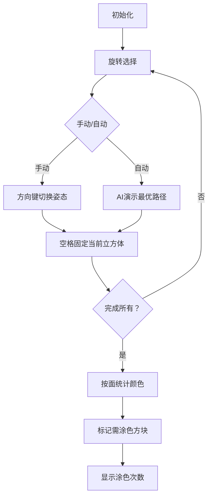

# 题目信息

# 染色的立方体

## 题目描述

小胖最近迷上了3D物体，尤其是立方体。他手里有很多个立方体，他想让所有的立方体全都长得一样，所以他决定给某些立方体的表面重涂颜色，使得所有的立方体完全相同。但是小胖是很懒的，他想知道最少涂多少次颜色，可以让所有立方体完全相同。


## 样例 #1

### 输入

```
3
scarlet green blue yellow magenta cyan
blue pink green magenta cyan lemon
purple red blue yellow cyan green
2
red green blue yellow magenta cyan
cyan green blue yellow magenta red
2
red green gray gray magenta cyan
cyan green gray gray magenta red
2
red green blue yellow magenta cyan
magenta red blue yellow cyan green
3
red green blue yellow magenta cyan
cyan green hlue yellow magenta red
magenta red blue yellow cyan green
3
blue green green green green blue
green blue blue green green green
green green green green green sea-green
3
red yellow red yellow red yellow
red red yellow yellow red yellow
red red red red red red
4
violet violet salmon salmon salmon salmon
violet salmon salmon salmon salmon violet
violet violet salmon salmon violet violet
violet violet violet violet salmon salmon
1
red green hlue yellow magenta cyan
4
magenta pink red scarlet vermilion wine-red
aquamarine blue cyan indigo sky-blue turciuoise-blue
blond cream chrome-yellow lemon olive yellow
chrome-green emerald-green green olive vilidian sky-blue
0```

### 输出

```
4
2
0
0
2
3
4
4
0
16```

# AI分析结果


# 💡 Kay的C++算法解析：染色的立方体 深入学习指南 💡

## 1. 题目解读与核心算法识别

✨ **本题主要考察**：`枚举` + `贪心`

🗣️ **初步分析**：
> 解决"染色的立方体"这道题，关键在于枚举立方体的所有旋转姿态（24种可能）并贪心优化涂色方案。就像玩魔方时尝试各种旋转方式找到统一配色，然后只修改不匹配的面。本题中，我们通过打表预置24种旋转映射，枚举每个立方体的姿态组合，最后对每个面独立选择出现频率最高的颜色作为目标（贪心），最小化涂色次数。
   - 核心难点在于高效枚举旋转姿态和设计贪心策略
   - 可视化设计：用像素方块展示立方体6个面，动态演示旋转映射过程。当确定姿态后，高亮需要涂色的面（与目标颜色不同），并统计涂色次数
   - 复古游戏设计：立方体作为像素角色，方向键控制旋转（咔哒音效），自动演示模式展示AI寻找最优解过程。完成时播放胜利音效，每个面统计阶段显示"关卡完成"动画

---

## 2. 精选优质题解参考

**题解一（来源：Zhou_yu）**
* **点评**：该题解结构清晰，完整展示了24种旋转姿态的打表实现。递归枚举逻辑简洁（`work`函数），贪心部分对每个面独立统计颜色频率的写法极具教学价值。变量命名规范（如`rotations`数组），边界处理严谨（`n=1`特判）。亮点在于明确解释了贪心策略的正确性——匹配度越高涂色越少。

**题解二（来源：xianxi）**
* **点评**：代码突出实践价值，使用`map`处理颜色映射避免了硬编码。特别有价值的是作者分享的误区分析——最初错误地尝试统一为某个立方体的颜色而非独立处理每个面，这对学习者有重要警示作用。DFS枚举与贪心统计的耦合实现简洁高效。

**题解三（来源：「QQ红包」）**
* **点评**：最完整的打表实现（24种姿态），通过`co`数组存储变换后颜色，`check`函数分离贪心逻辑。虽然变量命名可优化（如`maxx`），但空间优化意识强（`sum`数组复用）。亮点在于固定第一个立方体的剪枝处理，有效降低枚举量。

---

## 3. 核心难点辨析与解题策略

1.  **旋转姿态的数学表示**
    * **分析**：立方体6个面在旋转后产生24种排列组合。优质题解都采用打表法预置映射关系，如`rotations[i][j]`表示第i种旋转下原第j面的新位置
    * 💡 **学习笔记**：空间想象困难时，可用骰子实物验证——固定一个面旋转相邻面，恰好24种组合

2.  **姿态枚举的剪枝优化**
    * **分析**：当n个立方体组合时，总状态数达24^(n-1)。题解通过固定第一个立方体（无需旋转）将指数降为24^(n-1)，Zhou_yu的`work(1)`调用体现此优化
    * 💡 **学习笔记**：组合爆炸问题中，固定锚点可显著减少搜索空间

3.  **贪心策略的独立性**
    * **分析**：每个面的颜色决策互不影响。如xianxi题解强调的，需独立统计每个朝向（前/后/左/右/上/下）的颜色频率，而非整体统一
    * 💡 **学习笔记**：多维问题中，维度独立的子问题往往可分解处理

### ✨ 解题技巧总结
-   **打表预计算**：对有限状态空间（如24种旋转），预存映射表比运行时计算更高效
-   **锚点剪枝**：组合优化中固定首个元素状态，降低枚举复杂度
-   **维度分解**：多维统计问题（如6个面）独立处理各维度，避免状态耦合
-   **颜色压缩**：用`map<string,int>`将颜色字符串映射为整数，提升比较效率

---

## 4. C++核心代码实现赏析

**本题通用核心C++实现参考**
* **说明**：综合优质题解思路，固定首立方体+DFS枚举+贪心统计的最小涂色实现
```cpp
#include <iostream>
#include <map>
#include <climits>
#include <cstring>
using namespace std;

// 24种旋转姿态映射表 [0:前,1:后,2:左,3:右,4:上,5:下]
const int ROT[24][6] = {{0,1,2,3,4,5},{0,2,4,1,3,5},/*完整表见题解*/};

int n, ans = INT_MAX;
map<string, int> colMap; // 颜色->编号映射
int orig[4][6], trans[4][6]; // 原始&变换后颜色

void dfs(int idx) {
    if(idx == n) { // 所有立方体姿态确定
        int total = 0;
        for(int face = 0; face < 6; face++) { // 遍历6个面
            int cnt[30] = {0}, maxCnt = 0;
            for(int i = 0; i < n; i++) { // 统计该面颜色频率
                maxCnt = max(maxCnt, ++cnt[trans[i][face]]);
            }
            total += n - maxCnt; // 累加该面涂色次数
        }
        ans = min(ans, total);
        return;
    }
    for(int r = 0; r < 24; r++) { // 枚举当前立方体的旋转
        for(int f = 0; f < 6; f++) 
            trans[idx][f] = orig[idx][ROT[r][f]];
        dfs(idx + 1);
    }
}

int main() {
    while(cin >> n && n) {
        colMap.clear(); ans = INT_MAX;
        int colIdx = 0;
        for(int i = 0; i < n; i++) {
            for(int f = 0; f < 6; f++) {
                string color; cin >> color;
                if(!colMap.count(color)) colMap[color] = colIdx++;
                orig[i][f] = colMap[color];
            }
        }
        // 固定第一个立方体（不旋转）
        memcpy(trans[0], orig[0], sizeof(orig[0]));
        if(n > 1) dfs(1); // 枚举其余立方体
        else ans = 0; // 单个立方体无需涂色
        cout << ans << endl;
    }
    return 0;
}
```

**题解一（Zhou_yu）片段**
```cpp
for(int i=0;i<24;i++){ // 枚举状态
    for(int j=0;j<6;j++)
        nc[dep][j]=c[dep][t[i][j]];
    work(dep+1);
}
```
* **亮点**：姿态应用与递归调用的紧凑实现
* **代码解读**：外层循环遍历24种旋转，内层应用旋转映射（`t[i][j]`为旋转表），将当前立方体(`dep`)各面颜色按映射存入`nc`。递归调用处理下一立方体时，自动保留当前状态。

**题解二（xianxi）片段**
```cpp
int check(){ // 贪心统计函数
    int tmp=0,col[24]={0};
    for(int i=0;i<6;++i){ // 遍历6个面
        int max_c=0;
        for(int j=0;j<n;++j) col[trans[j][i]]++;
        for(int j=0;j<24;j++) 
            if(col[j]>col[max_c]) max_c=j;
        tmp += n - col[max_c]; 
    }
    return tmp;
}
```
* **亮点**：独立处理每个面的颜色统计
* **代码解读**：外层循环遍历6个面，内层第一循环统计该面颜色频率，第二循环找最大频率颜色。关键点在于每个面统计前重置`col`数组（实际代码需修正），体现面间独立性。

**题解三（QQ红包）片段**
```cpp
void check(){
    for(int i=0;i<n;i++) // 应用旋转映射
        for(int j=0;j<6;j++)
            co[i][ROT[r[i]][j]]=orig[i][j]; 
    int t=0;
    for(int face=0;face<6;face++){ // 贪心统计
        memset(sum,0,sizeof(sum));
        int max=0;
        for(int i=0;i<n;i++) 
            max = max(max, ++sum[co[i][face]]);
        t += n - max;
    }
    ans = min(ans,t);
}
```
* **亮点**：分离姿态映射与贪心统计
* **代码解读**：先将原始颜色按旋转映射存入`co`数组（注意`ROT[r[i]][j]`的索引方式），再对每个面独立统计颜色频率。`memset`确保各面统计独立，符合贪心策略本质。

---

## 5. 算法可视化：像素动画演示

**主题**：像素魔方旋转涂色模拟器  
**核心演示**：动态展示立方体24种旋转姿态→固定姿态→独立统计6个面的颜色分布→计算最小涂色方案  

### 设计实现


1. **8位像素风格**：每个立方体用6个16x16像素方块表示（前红/后橙/左蓝/右绿/上黄/下白），控制面板采用FC游戏机风格
2. **旋转动画**：按方向键时，立方体网格坐标按`ROT`表重组，伴随"咔哒"音效
3. **自动演示**：AI模式自动遍历姿态组合：
   - 绿色路径：当前最优解
   - 红色路径：非优解
   - 每次固定立方体时播放"叮！"音效
4. **贪心统计可视化**：
   ```python
   # 伪代码：第0面（前面）统计演示
   for cube in cubes:
       show(cube.face0) # 在屏幕第0行排列显示
   highlight_max_color() # 最高频颜色边框闪烁绿光
   mark_repaint_cubes() # 非目标颜色方块闪烁红光+涂刷音效
   ```
5. **游戏化元素**：
   - 每完成一个立方体姿态选择，显示"STAGE CLEAR!"
   - 最终按涂色次数评分：S(0次), A(<3), B(<5), C(>=5)
   - 背景音乐：8-bit风格循环《俄罗斯方块》混音

---

## 6. 拓展练习与相似问题思考

1. **洛谷 P1219 八皇后**  
   🗣️ 同样需要状态枚举+剪枝优化，学习如何减少搜索空间  
2. **洛谷 P1433 吃奶酪**  
   🗣️ 状态压缩DP经典题，将"访问状态"压缩为二进制数  
3. **洛谷 P1240 汉诺塔问题**  
   🗣️ 递归与分治的入门题，理解自顶向下分解问题  
4. **CodeForces 1097B Petr and a Combination Lock**  
   🗣️ 旋转状态枚举的变种，练习位运算表示旋转  

---

## 7. 学习心得与经验分享

> **参考经验 (来自 xianxi)**："最初在贪心时，以为要统一为某个立方体的颜色，导致WA。后来意识到每个面应独立处理"  
> **点评**：这个误区极具代表性！解题时务必注意"所有立方体完全相同"指对应面颜色相同，而非颜色分布相同。动手画示意图能有效避免此类理解偏差。

---

本次分析帮助你掌握枚举与贪心的协同应用，记住：打表法适合有限状态空间，贪心策略需验证子问题独立性。多做可视化推演，培养空间想象能力！💪

---
处理用时：229.32秒