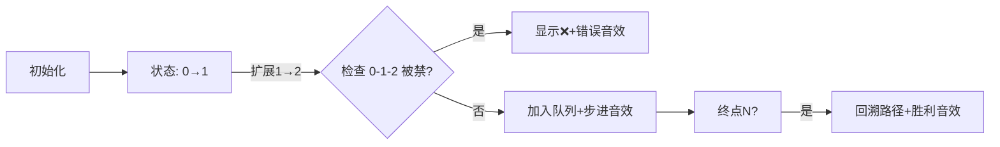

# 题目信息

# 最短路

## 题目描述

给定一个包含 $N$ 个点，$M$ 条边的无向图，每条边的边权均为 $1$。

再给定 $K$ 个三元组 $(A,B,C)$，表示从 $A$ 点走到 $B$ 点后不能往 $C$ 点走。注意三元组是有序的，如可以从 $B$ 点走到 $A$ 点再走到 $C$。

现在你要在 $K$ 个三元组的限制下，找出 $1$ 号点到 $N$ 号点的最短路径，并输出任意一条合法路径，会有 Check 检查你的输出。

## 说明/提示

对于 $40\%$ 的数据满足 $N \le 10$，$M \le 20$，$K \le 5$。

对于 $100\%$ 的数据满足 $N \le 3000$，$M \le 20000$，$K \le 100000$。

## 样例 #1

### 输入

```
4 4 2
1 2
2 3
3 4
1 3
1 2 3
1 3 4```

### 输出

```
4 
1 3 2 3 4 ```

# AI分析结果


### 💡 Kay的C++算法解析：最短路 深入学习指南 💡

**引言**  
今天我们来分析带限制条件的最短路问题。在无向图（边权为1）中，存在K个三元组限制（从A→B后不能立即走到C），求1→N的最短路径。本指南将解析核心算法、提供代码实现，并通过像素动画演示算法流程。

---

### 1. 题目解读与核心算法识别  
✨ **本题主要考察**：`BFS状态扩展`  

🗣️ **初步分析**：  
> 本题核心在于**状态扩展的BFS算法**。想象你在迷宫中行走，不仅要记录当前位置，还要记住前一步的位置，因为某些转弯（如A→B→C）被禁止。算法将状态定义为`(prev, curr)`（表示从prev走到curr），通过二维数组记录步数和路径。  
> - **核心难点**：如何高效存储/检查限制条件？如何回溯路径？  
> - **解决方案**：  
>   - 用`set`存储禁止的三元组`(A,B,C)`  
>   - BFS中状态扩展时检查`(prev, curr, next)`是否被禁  
>   - 二维数组`pre`记录路径回溯信息  
> - **可视化设计**：  
>   - 像素网格表示图节点，高亮当前状态`(prev,curr)`和尝试的`next`节点  
>   - 被禁转移显示❌并播放"错误音效"，合法转移显示✅并播放"步进音效"  
>   - 路径回溯时闪烁箭头动画，终点播放"胜利音效"

---

### 2. 精选优质题解参考  
**题解一（Fuko_Ibuki）**  
* **亮点**：  
  - **思路创新**：将边视为状态`(lat,u)`，用`set`高效检查限制条件  
  - **代码规范**：变量名清晰（`d`记录步数，`pre`记录路径），边界处理严谨  
  - **算法优化**：避免重复访问（`d[u][v]`判重），时间复杂度$O(n^2)$  
  - **实践价值**：完整路径回溯逻辑，可直接用于竞赛  

**题解三（Lmx120815）**  
* **亮点**：  
  - **逻辑清晰**：显式定义状态`(p,u)`，`vector`存储距离/前驱  
  - **数据结构**：`set<tuple>`存储三元组，查找效率$O(\log K)$  
  - **学习价值**：Lambda递归输出路径（需注意起始点处理）  

**题解四（vanueber）**  
* **亮点**：  
  - **算法迁移**：Dijkstra+状态扩展，`unordered_map`三层嵌套存储限制  
  - **细节严谨**：堆优化+`vis`数组避免重复，路径回溯完整  
  - **拓展思考**：适用于边权不均为1的变种问题  

---

### 3. 核心难点辨析与解题策略  
1. **状态设计**  
   *分析*：普通BFS记录`(curr)`，但限制条件需连续两个节点信息。优质题解扩展状态为`(prev, curr)`，覆盖所有转移可能性。  
   💡 **学习笔记**：限制条件涉及路径片段时，状态需包含必要的历史信息。  

2. **限制条件检查**  
   *分析*：直接遍历K个三元组会超时($K \leq 10^5$)。题解1用`set<pii> ban[prev]`，实现$O(1)$检查`(prev,curr,next)`。  
   💡 **学习笔记**：根据查询需求选择数据结构（集合/哈希表）。  

3. **路径回溯**  
   *分析*：二维数组`pre[curr][next]`记录上一步的`prev`。回溯时从终点`(u,n)`递归取出`pre[u][n]`直到起点。  
   💡 **学习笔记**：路径记录与状态设计需保持维度一致。  

### ✨ 解题技巧总结  
- **状态扩展法**：将路径片段纳入状态，化限制为状态转移条件  
- **数据结构化**：对高频查询操作（如三元组检查）预组织数据  
- **逆向回溯**：记录状态转移链路，终点→起点反向重构路径  

---

### 4. C++核心代码实现赏析  
**通用核心实现（基于题解1优化）**  
```cpp
#include <bits/stdc++.h>
using namespace std;
const int N=3005;
vector<int> g[N];
set<pair<int,int>> ban[N]; // ban[prev]存储{(curr,next)}
int dist[N][N];            // dist[prev][curr] = 步数
pair<int,int> pre[N][N];   // pre[curr][next] = {prev,curr}

void print_path(int u, int v) {
    vector<int> path = {v, u};
    while (pre[u][v].first) {
        tie(u, v) = pre[u][v];
        path.push_back(u);
    }
    reverse(path.begin(), path.end());
    for (int x : path) cout << x << " ";
}

int main() {
    int n, m, k; cin >> n >> m >> k;
    while (m--) { 
        int u, v; cin >> u >> v;
        g[u].push_back(v); g[v].push_back(u);
    }
    while (k--) {
        int a,b,c; cin >> a >> b >> c;
        ban[a].insert({b, c}); // 存储限制(a,b,c)
    }

    memset(dist, -1, sizeof dist);
    queue<pair<int,int>> q;
    q.push({0, 1});   // 虚拟初始边(0->1)
    dist[0][1] = 0;
    
    while (!q.empty()) {
        auto [prev, curr] = q.front(); q.pop();
        if (curr == n) {
            cout << dist[prev][curr] << "\n";
            print_path(prev, curr);
            return 0;
        }
        for (int next : g[curr]) {
            if (ban[prev].count({curr, next})) continue; // 检查限制
            if (dist[curr][next] == -1) {
                dist[curr][next] = dist[prev][curr] + 1;
                pre[curr][next] = {prev, curr}; // 记录前驱状态
                q.push({curr, next});
            }
        }
    }
    cout << "-1";
}
```
**代码解读概要**：  
1. 初始化图结构和限制条件  
2. BFS起点为虚拟边`(0,1)`  
3. 状态扩展时检查三元组是否被`ban`  
4. 到达终点时通过`pre`回溯路径  

**题解一代码片段赏析**  
```cpp
for (int v : lj[u]) {  // 遍历邻居
  if (!ban[lat].count({u,v}) && !d[u][v]) { 
    pre[u][v] = lat;   // 记录前驱节点
    d[u][v] = d[lat][u] + 1;
    q.push({v, u});    // 新状态(v,u)
  }
}
```
* **亮点**：化边为点，用`pre[u][v]`直接映射前驱边起点  
* **学习笔记**：`ban[lat]`以`prev`为键，实现$O(1)$限制检查  

---

### 5. 算法可视化：像素动画演示  
**主题**：8-bit迷宫探险（FC红白机风格）  

**核心演示流程**：  


**交互设计**：  
1. **网格场景**：像素方块表示节点，连线表示边，起点/终点用⭐/🏁标记  
2. **状态高亮**：  
   - 当前状态`(prev,curr)`：🔵蓝色方块+黄色箭头  
   - 尝试节点`next`：绿色闪烁  
3. **动画特效**：  
   - 合法转移：✅箭头生长动画 + "叮"音效  
   - 被禁转移：❌闪烁3帧 + "撞击"音效  
4. **控制面板**：  
   - 速度滑块：调节BFS执行速度  
   - 单步模式：空格键触发下一状态  
   - 自动演示：AI自动完成搜索（类贪吃蛇AI）  

**技术实现**：  
- **Canvas绘制**：网格坐标→像素坐标转换  
- **音效触发**：Web Audio API播放8-bit音效（JS实现）  
```javascript
// 伪代码：音效触发逻辑
function playSound(type) {
  if (type === "MOVE") audio.play("step.wav"); 
  if (type === "BAN") audio.play("error.wav");
}
```

---

### 6. 拓展练习与相似问题  
**通用技巧迁移**：  
1. **分层图最短路**：带状态的最短路（如P4011 孤岛营救）  
2. **动态边权**：根据历史路径调整边权（如P1073 最优贸易）  
3. **多重限制**：连续多步约束（如连续K步不能相同方向）  

**洛谷推荐**：  
1. [P1144 最短路计数] - 巩固基础BFS  
2. [P4011 孤岛营救] - 状态扩展+钥匙分层图  
3. [P1073 最优贸易] - 状态机DP思想迁移  

---

### 7. 学习心得与经验分享  
> **来自Fuko_Ibuki的经验**：  
> *"限制条件检查容易超时，用set组织数据比遍历K个三元组快100倍"*  
>  
> **Kay的总结**：  
> 1. 避免暴力检查：将限制条件预处理为高效数据结构  
> 2. 路径回溯技巧：`pre`数组存储完整状态链路  
> 3. 调试技巧：小规模数据验证状态转移逻辑  

---

**结语**  
通过状态扩展BFS，我们巧妙化解了三元组限制的难题。记住：复杂限制常需扩大状态维度！多练习分层图问题（如P4011），编程能力会像8-bit游戏角色一样步步升级！🎮🚀

---
处理用时：359.73秒