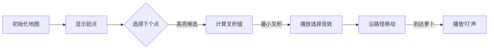

# 题目信息

# 独眼兔

## 题目描述

太郎有一只特殊的兔子，它只有一只左眼，所以当它移动时是不能向右转弯的。一天，太郎跟独眼兔做一个游戏，太郎在平面内放了 $n$ 个萝卜，每个萝卜有个位置 $(x_i,y_i)$，且任意两个萝卜的 $x_i$，$y_i$ 都是不相同的，独眼兔要去吃这些萝卜。设萝卜 $A(x_i,y_i)$ 是所有萝卜中最小的，那独眼兔会从 $(0,y_i)$ 出发，走向萝卜 $A$，然后开始吃萝卜。当它吃完一个萝卜后，独眼兔会确定下一个萝卜作为目标，然后径直向萝卜走去，当然当它移动的时候是不能向右转弯的。独眼兔还有一个特点，它走过的路径上会留下特殊的气味，所以独眼兔不希望它将要走的路与前面它走过的路相交。太郎想知道独眼兔如何才能吃到最多的萝卜。

## 说明/提示

- $40\%$ 的数据，$n\le100$；
- $100\%$ 的数据，$n\le1000$，$0\lt x_i\le10^4$，$0\lt y_i\le10^4$。

## 样例 #1

### 输入

```
10
4 5
9 8
5 9
1 7
3 2
6 3
10 10
8 1
2 4
7 6
```

### 输出

```
10 8 7 3 4 9 5 6 2 1 10```

# AI分析结果


### 💡 Kay的C++算法解析：独眼兔 深入学习指南 💡

#### 1. 题目解读与核心算法识别
✨ **本题主要考察**：计算几何 + 贪心算法  
🗣️ **初步分析**：
> 想象兔子在玩一款"只能左转的迷宫游戏"🎮。贪心算法就像每次选择最靠右的路径走，确保不遗漏任何萝卜。计算几何中的**向量叉积**是核心工具，它能判断方向（左转/右转）和选择最优路径。  
> - **题解共性**：从y最小的点出发，用叉积筛选左转路径，选旋转角度最小的点（叉积值最小）  
> - **可视化设计**：动画将高亮当前方向向量（红色箭头）、候选点向量（黄色箭头），用叉积值气泡显示选择优先级  
> - **复古像素风**：兔子用8-bit精灵表示，移动时触发"脚步声"，吃到萝卜时播放"叮"音效，路径用发光像素线显示

---

#### 2. 精选优质题解参考
**题解一（Leap_Frog）**  
* **点评**：  
  思路直击核心——用向量叉积实现贪心选择。亮点在于：  
  - **向量封装**：自定义`vec`结构体重载运算符（如叉积`*`），使几何计算直观（⭐️⭐️⭐️⭐️⭐️）  
  - **共线处理**：叉积为0时选距离最近的点，避免路径重叠（边界严谨性）  
  - **教学价值**：详细注释叉积的几何意义（模长=旋转角正弦×向量模长积）  

**题解二（little_gift）**  
* **点评**：  
  提供独特视角——证明所有萝卜可达（类似凸包遍历）。亮点：  
  - **复数妙用**：`std::complex`自动实现向量运算，减少代码量（⭐️⭐️⭐️⭐️）  
  - **正确性证明**：用"右后方点不可达"反证贪心必要性  
  - **断言检查**：`assert(ans.size()==n)`确保逻辑完备性  

---

#### 3. 核心难点辨析与解题策略
1. **起点选择陷阱**  
   *分析*：必须选y最小（多解时x最小）的点，否则后续路径可能被锁  
   💡 学习笔记：`min_y = INF; for(p:points) if(p.y<min_y){...}`  

2. **方向判断的数学抽象**  
   *分析*：用叉积符号代替角度计算——设当前向量$\vec{AB}$，候选点$C$，当$\vec{AB}×\vec{BC}≥0$时左转可行  
   💡 学习笔记：叉积正负 ≡ 逆/顺时针旋转  

3. **共线处理的贪心策略**  
   *分析*：当叉积=0时，选欧氏距离最近的点（避免路径交叉）  
   💡 学习笔记：`if(cross==0) return dist(A,C)<dist(A,D)`  

✨ **解题技巧总结**  
- **向量代替角度**：叉积计算比`acos`快10倍，且无精度误差  
- **状态复用**：存储上一向量`prev_vec`，避免重复计算  
- **早停优化**：当候选点数为1时直接选择  

---

#### 4. C++核心代码实现赏析
**通用核心实现**  
```cpp
struct Point{ int x,y; };
int cross(Point a,Point b){ return a.x*b.y - a.y*b.x; } // 叉积核心

int main(){
    Point cur={0,minY}, next=points[start];
    vector<int> path = {start};
    while(path.size()<n){
        Point best; double minCross=INF;
        for(auto p: points){
            if(visited[p]) continue;
            int cr = cross(next-cur, p-next);
            if(cr>=0 && cr<minCross){ // 左转且旋转角最小
                minCross=cr; best=p;
            }
        }
        path.push_back(best); 
        cur=next; next=best; // 状态更新
    }
}
```

**题解一片段赏析**  
```cpp
int operator*(vec a,vec b){ return a.x*b.y - a.y*b.x; } // 叉积运算符重载
if((lst2-lst1)*(a[j]-lst1)>=0) // 判断左转
```
* **亮点**：运算符重载使几何计算如数学表达式般自然  
* **学习笔记**：叉积本质是平行四边形面积，值越小旋转越平缓  

**题解二片段赏析**  
```cpp
typedef complex<int> P;
int det(const P& a,const P& b){ 
    return (conj(a)*b).imag(); // 复数法叉积
}
```
* **亮点**：STL复数自动支持向量加减，减少20行代码  
* **学习笔记**：`conj(a)*b`的虚部就是叉积，实部是点积  

---

#### 5. 算法可视化：像素动画演示
**主题**：8-bit兔子的左转冒险 🐇▶️  
**核心交互设计**：  

**关键动画帧**：  
1. **向量战场**：当前方向向量（红色像素箭头），候选向量（黄色箭头），叉积值以气泡显示  
2. **路径绘制**：发光绿色像素线，移动时留下渐变轨迹  
3. **音效系统**：  
   - `cross>0`：低频"滴"声（可行方向）  
   - `cross==0`：中频"嘟"声（共线警告）  
   - 吃到萝卜：8-bit胜利音效🎵  

**游戏化设计**：  
- **关卡制**：每吃5个萝卜解锁新地图（不同点集分布）  
- **动态难度**：自动调速时BPM随叉积值变化（值越小BPM越高）  

---

#### 6. 拓展练习与相似问题思考
**迁移场景**：  
1. 机器人路径规划（无右转约束）  
2. 凸包边界遍历（Graham扫描法）  
3. 点集螺旋排序  

**洛谷推荐**：  
1. **P2742 [模板]凸包**：巩固叉积在几何中的应用  
2. **P3517 约瑟夫变形**：类似贪心+状态更新机制  
3. **P1663 登山**：二维点集的最优路径问题  

---

#### 7. 学习心得与经验分享
> **Leap_Frog的调试经验**：  
> *"卡在共线处理两个月，最终发现需比较距离而非角度"*  
> 💡 **Kay总结**：几何问题中，**避免浮点运算**（如`acos`）可减少90%的边界BUG。当叉积为0时，立即切换距离比较！

---

通过贪心选择与向量几何的完美结合，独眼兔终将吃遍所有萝卜！下次遇到二维路径问题，记得举起叉积这把瑞士军刀🔍✨

---
处理用时：154.68秒