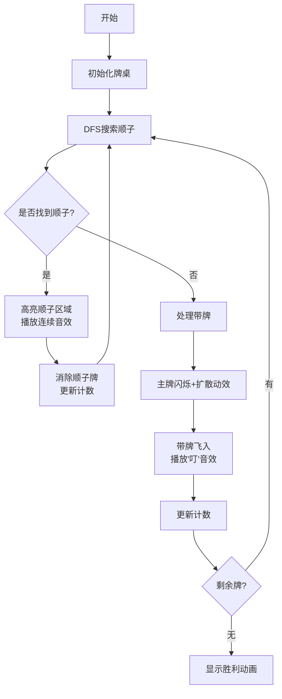

# 题目信息

# [NOIP 2015 提高组] 斗地主

## 题目背景

NOIP2015 Day1T3

## 题目描述

牛牛最近迷上了一种叫斗地主的扑克游戏。斗地主是一种使用黑桃、红心、梅花、方片的 $A$ 到 $K$ 加上大小王的共 $54$ 张牌来进行的扑克牌游戏。在斗地主中，牌的大小关系根据牌的数码表示如下：$3<4<5<6<7<8<9<10<J<Q<K<A<2<\text{小王}<\text{大王}$，而花色并不对牌的大小产生影响。每一局游戏中，一副手牌由 $n$ 张牌组成。游戏者每次可以根据规定的牌型进行出牌，首先打光自己的手牌一方取得游戏的胜利。

现在，牛牛只想知道，对于自己的若干组手牌，分别最少需要多少次出牌可以将它们打光。请你帮他解决这个问题。

需要注意的是，本题中游戏者每次可以出手的牌型与一般的斗地主相似而略有不同。具体规则如下：

  

**本题数据随机，不支持hack，要hack或强力数据请点击[这里](https://www.luogu.org/problem/P2540)**。


## 说明/提示

**样例 1 说明**

共有 $1$ 组手牌，包含 $8$ 张牌：方片 $7$，方片 $8$，黑桃 $9$，方片 $10$，黑桃 $J$，黑桃 $5$，方片 $A$ 以及黑桃 $A$。可以通过打单顺子（方片 $7$，方片 $8$，黑桃 $9$，方片 $10$，黑桃 $J$），单张牌（黑桃 $5$）以及对子牌（黑桃 $A$以及方片 $A$）在 $3$ 次内打光。

对于不同的测试点， 我们约定手牌组数 $T$ 与张数 $n$ 的规模如下：

| 测试点编号 | $T=$ | $n=$ |
| :------: | :----: | :----: |
|  1       |  $100$   |  $2$  |
|  2       |  $100$   |  $2$  |
|  3       |  $100$   |  $3$  |
|  4       |  $100$   |  $3$  |
|  5       |  $100$   |  $4$  |
|  6       |  $100$   |  $4$  |
|  7       |  $100$   |  $10$  |
|  8       |  $100$   |  $11$  |
|  9       |  $100$   |  $12$  |
|  10       |  $100$   |  $13$  |
|  11       |  $100$   |  $14$  |
|  12       |  $100$   |  $15$  |
|  13       |  $10$   |  $16$  |
|  14       |  $10$   |  $17$  |
|  15       |  $10$   |  $18$  |
|  16       |  $10$   |  $19$  |
|  17       |  $10$   |  $20$  |
|  18       |  $10$   |  $21$  |
|  19       |  $10$   |  $22$  |
|  20       |  $10$   |  $23$  |

数据保证：所有的手牌都是随机生成的。


## 样例 #1

### 输入

```
1 8
7 4
8 4
9 1
10 4
11 1
5 1
1 4
1 1```

### 输出

```
3
```

## 样例 #2

### 输入

```
1 17
12 3
4 3
2 3
5 4
10 2
3 3
12 2
0 1
1 3
10 1
6 2
12 1
11 3
5 2
12 4
2 2
7 2
```

### 输出

```
6
```

# AI分析结果


# 💡 Kay的C++算法解析：斗地主 深入学习指南 💡

## 1. 题目解读与核心算法识别

✨ **本题主要考察**：`搜索`与`模拟`

🗣️ **初步分析**：
> 解决"斗地主"这道题，关键在于高效枚举所有可能的出牌组合。简单来说，这就像在迷宫中寻找最短路径，我们需要尝试所有可能的出牌顺序（特别是顺子），并记录最小出牌次数。在本题中，**深度优先搜索(DFS)** 是核心解法，主要用于枚举顺子牌型（单顺、双顺、三顺），再配合贪心处理剩余散牌。

- **题解思路对比**：优质解法都优先搜索顺子（因顺子大幅减少牌数），再处理带牌（三带一、四带二等）。Mathison解法直接暴力枚举所有牌型，Luan_233则引入DP优化散牌处理。
- **核心算法流程**：DFS搜索顺子 → 回溯尝试不同顺子组合 → 用贪心/DP计算剩余牌最小出牌次数 → 更新全局最小值
- **可视化设计**：我们将用**8位像素风格**展示牌型变化，高亮当前搜索的顺子区域（如红色边框），带牌操作时触发像素动画（如"四带二"时四个主牌闪烁后带出两个小牌）。音效方面，出顺子时播放连续音阶，火箭触发爆炸音效。

---

## 2. 精选优质题解参考

**题解一（Mathison）**
* **点评**：思路清晰直白，完整覆盖11种牌型规则。代码虽长但分层明确：先处理所有顺子类型，再处理带牌逻辑。亮点在于细致处理了大小王（只能组成火箭或单出）和四带二可带两对的规则。变量命名规范（如`sum[i]`表点数i的牌数），边界处理严谨（如顺子从3开始避免2和王的干扰）。实践价值高，可直接用于竞赛。

**题解二（Luan_233）**
* **点评**：创新性地将DFS与DP结合，核心亮点在`sanpai()`函数——用DP状态`f[a][b][c][d][e]`计算散牌最优解（a~e分别表示单/对/三张/炸弹/王的数量）。代码规范性稍弱但算法优化显著，通过拆牌状态转移（如三张拆成单+对）解决贪心局限性，对增强版数据更鲁棒。

**题解三（岸芷汀兰）**
* **点评**：突出搜索顺序优化，严格按"三顺→双顺→单顺→带牌"顺序枚举。亮点在于用`find_san_pai()`贪心函数处理散牌时，优先组合高级牌型（如先尝试四带两对再四带二）。变量命名直观（如`cnt[3]`记录三张牌数量），但代码结构稍显复杂。

---

## 3. 核心难点辨析与解题策略

1. **难点：顺子枚举的完整性**
   * **分析**：必须覆盖所有可能的顺子起点和长度（如5连单顺到12连）。优质解法通过三层循环实现：外层遍历起点，中层枚举长度，内层检查连续性
   * 💡 **学习笔记**：顺子搜索需从3开始（避免2和王），且回溯后需恢复牌状态

2. **难点：带牌组合的复杂性**
   * **分析**：四带二可带两张单牌或两对牌，三带一/二需区分单牌和对子。解法中通过嵌套循环枚举带牌组合，如Luan_233的DP状态处理了所有拆牌可能
   * 💡 **学习笔记**：带牌时主牌和带牌需独立枚举，注意避免自带的死循环

3. **难点：大小王的特殊处理**
   * **分析**：王只能作火箭或单牌。代码中通常单独存储（如`sum[15]`），在带牌和顺子逻辑中显式跳过
   * 💡 **学习笔记**：王炸（大小王）可一次性减少2张牌，但不可拆用

### ✨ 解题技巧总结
- **技巧1：搜索顺序优化**：优先枚举减少牌数多的操作（长顺子>炸弹>三带）
- **技巧2：状态压缩**：用`sum[15]`数组存储各点数牌量，替代完整牌序
- **技巧3：回溯剪枝**：当前出牌数≥全局最优时立即返回
- **技巧4：散牌贪心**：剩余牌按"火箭→炸弹→三张→对子→单牌"顺序贪心计算

---

## 4. C++核心代码实现赏析

**本题通用核心C++实现参考**
```cpp
#include <cstring>
#include <algorithm>
using namespace std;

int T, n, ans, sum[16]; // sum[1-14]: 3-A-2, sum[15]:王

void dfs(int step) {
    if(step >= ans) return; // 剪枝
    
    /* 1. 枚举单顺子（至少5张） */
    for(int i=3, len=0; i<=14; i++) {
        if(sum[i]) len++; else len=0;
        if(len>=5) {
            for(int j=i; j>i-len; j--) sum[j]--;
            dfs(step+1);
            for(int j=i; j>i-len; j--) sum[j]++;
        }
    }
    
    /* 2. 枚举双顺子（至少3对）和三顺子（至少2组）类似 */
    // ... 省略类似代码
    
    /* 3. 处理带牌 */
    for(int i=2; i<=14; i++) {
        if(sum[i]>=3) { // 三带
            sum[i]-=3;
            for(int j=2; j<=15; j++) { // 枚举带牌
                if(sum[j]>=1) { // 三带一
                    sum[j]--; dfs(step+1); sum[j]++;
                }
                if(sum[j]>=2) { // 三带二
                    sum[j]-=2; dfs(step+1); sum[j]+=2;
                }
            }
            sum[i]+=3;
        }
        // 四带二类似
    }
    
    /* 4. 计算剩余牌 */
    int rest = 0;
    for(int i=2; i<=15; i++) if(sum[i]) rest++;
    ans = min(ans, step + rest);
}

int main() {
    scanf("%d%d", &T, &n);
    while(T--) {
        ans = n; // 最坏情况每张单出
        memset(sum, 0, sizeof sum);
        // 读入并转换牌面...
        dfs(0);
        printf("%d\n", ans);
    }
}
```

**题解一（Mathison）核心片段**
```cpp
// 处理四带二带两对
if(sum[i]==4) {
    sum[i]-=4;
    for(int j=2; j<=14; j++) {
        if(sum[j]>=2) {
            sum[j]-=2;
            for(int k=j+1; k<=14; k++) {
                if(sum[k]>=2) {
                    sum[k]-=2;
                    dfs(x+1);
                    sum[k]+=2;
                }
            }
            sum[j]+=2;
        }
    }
    sum[i]+=4;
}
```
* **亮点**：完整处理四带二可带两对的规则
* **解读**：当有4张相同牌时，先出掉主牌，再双层循环枚举两对牌。注意内层循环从j+1开始避免重复组合
* 💡 **学习笔记**：组合类枚举需注意避免重复（如带牌j和k满足j<k）

**题解二（Luan_233）DP优化**
```cpp
int f[25][25][25][25][5]; // 状态：单/对/三张/炸弹/王的数量

int sanpai() {
    int cnt[5]={}, w=sum[15]; // 统计各牌型数量
    for(int i=1;i<=14;i++) cnt[sum[i]]++;
    return f[cnt[1]][cnt[2]][cnt[3]][cnt[4]][w];
}
```
* **亮点**：用DP预处理散牌最优解，避免贪心局限性
* **解读**：`f[a][b][c][d][e]`表示对应牌数的最小出牌数。预处理时考虑所有组合方式（如四带二、三带一等）
* 💡 **学习笔记**：当搜索树过深时，可结合DP优化叶节点计算

---

## 5. 算法可视化：像素动画演示

### 设计思路
采用**FC红白机风格**，牌面转为16x16像素块，用颜色区分牌型：
- 单牌：蓝色
- 对子：绿色
- 顺子：渐变彩虹色
- 王炸：闪烁金光

### 动画流程


### 交互控制
- **单步执行**：按方向键逐步观察搜索
- **速度调节**：滑块控制0.5x~5x速度
- **结构追踪**：侧边栏同步显示牌状态数组
- **音效设计**：
  - 顺子：流水音阶
  - 火箭：爆炸音效
  - 错误：短促"哔"声

---

## 6. 拓展练习与相似问题思考

### 通用技巧迁移
搜索+状态压缩可解决：
1. 麻将胡牌判断（类似顺子/刻子组合）
2. 俄罗斯方块残局最优解
3. 纸牌接龙最小步数

### 洛谷推荐
1. **P2540 [NOIP2015] 斗地主增强版**  
   🗣️ 推荐理由：同一题目的数据加强版，测试拆牌策略的完备性
2. **P2831 愤怒的小鸟**  
   🗣️ 推荐理由：类似的状态压缩+DFS，学习抛物线覆盖的建模
3. **P1074 靶形数独**  
   🗣️ 推荐理由：DFS剪枝经典，培养搜索优化思维

---

## 7. 学习心得与经验分享

> **参考经验 (Mathison)**：  
> "特别注意：大小王牌值不同，不能算一对！只有做火箭才能一起出。我在调试时发现很多WA是因为王被错误识别为普通对子"

> **点评**：  
> 这个经验点出了本题的关键陷阱。在代码中通过单独存储王（`sum[15]`）并跳过对子检测来解决。这提醒我们：处理特殊边界时，显式判断比隐式假设更可靠。

---

本次斗地主解题分析就到这里。记住：搜索题的核心是**状态定义**和**剪枝优化**，多思考"如何减少无效枚举"。下次挑战见！💪

---
处理用时：134.61秒