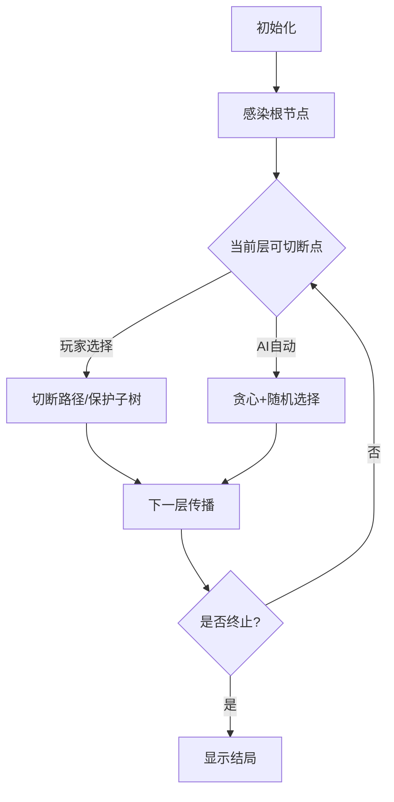

# 题目信息

# [NOIP 2003 提高组] 传染病控制

## 题目背景

本题是错题，后来被证明没有靠谱的多项式复杂度的做法。测试数据非常的水，各种玄学做法都可以通过，不代表算法正确。因此本题题目和数据仅供参考。

[关于此类题目的详细内容](https://www.luogu.com.cn/paste/pf94n89x)

---

近来，一种新的传染病肆虐全球。蓬莱国也发现了零星感染者，为防止该病在蓬莱国大范围流行，该国政府决定不惜一切代价控制传染病的蔓延。不幸的是，由于人们尚未完全认识这种传染病，难以准确判别病毒携带者，更没有研制出疫苗以保护易感人群。于是，蓬莱国的疾病控制中心决定采取切断传播途径的方法控制疾病传播。经过 WHO（世界卫生组织）以及全球各国科研部门的努力，这种新兴传染病的传播途径和控制方法已经研究清楚，剩下的任务就是由你协助蓬莱国疾控中心制定一个有效的控制办法。


## 题目描述

研究表明，这种传染病的传播具有两种很特殊的性质；

第一是它的传播途径是树型的，一个人 $X$ 只可能被某个特定的人 $Y$ 感染，只要 $Y$ 不得病，或者是 $XY$ 之间的传播途径被切断，则 $X$ 就不会得病。


第二是，这种疾病的传播有周期性，在一个疾病传播周期之内，传染病将只会感染一代患者，而不会再传播给下一代。


这些性质大大减轻了蓬莱国疾病防控的压力，并且他们已经得到了国内部分易感人群的潜在传播途径图（一棵树）。但是，麻烦还没有结束。由于蓬莱国疾控中心人手不够，同时也缺乏强大的技术，以致他们在一个疾病传播周期内，只能设法切断一条传播途径，而没有被控制的传播途径就会引起更多的易感人群被感染（也就是与当前已经被感染的人有传播途径相连，且连接途径没有被切断的人群）。当不可能有健康人被感染时，疾病就中止传播。所以，蓬莱国疾控中心要制定出一个切断传播途径的顺序，以使尽量少的人被感染。


你的程序要针对给定的树，找出合适的切断顺序。


## 说明/提示

对于 $100\%$ 的数据，$1 \leq n \leq 300$。

**【题目来源】**

NOIP 2003 提高组第四题

## 样例 #1

### 输入

```
7 6
1 2
1 3
2 4
2 5
3 6
3 7
```

### 输出

```
3
```

# AI分析结果


# 💡 Kay的C++算法解析：传染病控制 深入学习指南 💡

## 1. 题目解读与核心算法识别

✨ **本题主要考察**：`树形搜索优化` (编程技巧应用)

🗣️ **初步分析**：
> 解决"传染病控制"这道题，关键在于在树形结构上**优化搜索策略**。想象一棵倒置的大树，病毒从树根(1号节点)向下"流动"，每层我们可放置一个"挡板"（切断一条边）阻止病毒流向某个分支。目标是通过精心选择挡板位置，让病毒淹没的区域最小。

- **题解思路对比**：主流解法是DFS按层搜索，辅以剪枝优化；部分题解尝试贪心+随机化策略。核心难点在于**状态表示**（标记已保护子树）和**搜索顺序优化**（优先处理大子树加速剪枝）。
- **可视化设计**：动画将展示树形结构，用颜色区分感染/安全区域。关键步骤高亮：当前层节点闪烁提示选择，切断时播放"咔嚓"音效，被保护子树变绿色。采用复古像素风格，节点设计为16x16像素方块，感染扩散过程呈现"水波蔓延"效果。
- **游戏化交互**：设计"防疫指挥官"角色，每成功保护一个子树获得积分。AI演示模式可自动执行贪心策略，速度可调（1x-5x），关键操作配8-bit音效（选择"叮"，错误"哔"）。

---

## 2. 精选优质题解参考

**题解一：(来源：RikoHere)**
* **点评**：该解法思路清晰完整，通过预处理子树大小和分层信息，建立高效搜索框架。代码采用模块化设计（clean/reclean函数独立），变量命名合理（bol标记保护状态）。亮点在于**用BFS预处理层级关系**替代传统DFS，避免递归过深。实践价值高，直接可用于竞赛，但需注意树规模较大时标记操作可能成为瓶颈。

**题解二：(来源：山水一程_)**
* **点评**：创新性采用**逆向思维**（计算最大可保护人数），利用并查集思想快速判断祖先保护状态。代码简洁高效（仅120行），使用二维数组存储层级节点节省空间。亮点在于**fin()函数设计**，避免重复保护已覆盖子树。虽未显式剪枝，但状态判断逻辑天然减少搜索量。

**题解三：(来源：henry_y)**
* **点评**：大胆尝试**贪心+随机化**策略，为经典问题提供新视角。使用优先队列动态选择子树，以233取模引入随机性跳出局部最优。亮点在于**双优先队列结构**（q/t）维护候选节点，实践演示了随机化算法实现技巧。适合数据较弱场景，但严格意义非正解。

---

## 3. 核心难点辨析与解题策略

1.  **状态表示与回溯**：
    * **难点**：如何高效标记/取消标记被保护子树？直接遍历子树耗时O(n)
    * **解决方案**：优质题解采用**递归标记法**（如clean/reclean），回溯时精准恢复状态。学习使用bitset压缩状态可优化空间
    * 💡 **学习笔记**：树形问题回溯时，递归进出的对称操作是关键

2.  **搜索顺序优化**：
    * **难点**：朴素搜索需枚举每层所有节点，组合爆炸
    * **解决方案**：预处理子树大小并**降序排序**（RikoHere），或使用**优先队列**（henry_y）。优先切断大子树加速最优性剪枝
    * 💡 **学习笔记**："最可能影响结果的决策优先尝试"是搜索通用优化原则

3.  **边界处理与剪枝**：
    * **难点**：链状结构导致提前终止搜索
    * **解决方案**：增加**全保护检测**（CRH_Beijingzhan），当某层无节点可选时立即更新答案
    * 💡 **学习笔记**：树形搜索中，叶节点检测和层级终止条件需特殊处理

### ✨ 解题技巧总结
- **技巧A (问题转化)**：将"最小感染"转化为"最大保护"，简化目标函数
- **技巧B (预处理加速)**：BFS/DFS预处理深度、子树大小、层级关系
- **技巧C (对称回溯)**：递归标记时，进出操作保持严格对称
- **技巧D (搜索剪枝)**：按子树大小降序枚举，结合当前最优解及时剪枝

---

## 4. C++核心代码实现赏析

**本题通用核心C++实现参考**
* **说明**：综合优质题解思路，体现分层处理+递归标记的完整框架
* **完整核心代码**：
```cpp
#include <vector>
#include <algorithm>
using namespace std;
const int N=305;

vector<int> G[N], layer[N];
int sz[N], dep[N], maxDep;
bool protected[N];
int ans=1e9, n;

// 预处理子树大小和深度
void dfs_pre(int u, int fa, int d) {
    dep[u] = d;
    sz[u] = 1;
    maxDep = max(maxDep, d);
    for(int v : G[u]) {
        if(v == fa) continue;
        dfs_pre(v, u, d+1);
        sz[u] += sz[v];
    }
}

// 分层存储节点
void classify() {
    for(int i=1; i<=n; i++)
        if(dep[i]) layer[dep[i]].push_back(i);
}

// 递归标记/取消标记
void mark(int u, int fa, bool status) {
    protected[u] = status;
    for(int v : G[u]) {
        if(v == fa) continue;
        mark(v, u, status);
    }
}

// 核心搜索：d-当前层，saved-已保护人数
void dfs(int d, int saved) {
    if(d > maxDep) {
        ans = min(ans, n - saved);
        return;
    }
    
    vector<int> candidates;
    for(int u : layer[d]) 
        if(!protected[u]) candidates.push_back(u);
    
    if(candidates.empty()) {
        ans = min(ans, n - saved);
        return;
    }

    // 按子树大小降序排序（加速剪枝）
    sort(candidates.begin(), candidates.end(), [](int a, int b){
        return sz[a] > sz[b];
    });

    for(int u : candidates) {
        if(n - (saved + sz[u]) >= ans) continue; // 最优性剪枝
        mark(u, -1, true);
        dfs(d+1, saved + sz[u]);
        mark(u, -1, false); // 回溯
    }
}
```

**题解一：(RikoHere)**
* **亮点**：BFS预处理替代DFS，避免递归栈溢出
* **核心代码片段**：
```cpp
void solve(){ // BFS预处理层级
    priority_queue<node> que;
    dis[1]=0; que.push(node(1,0));
    while(!que.empty()){
        node temp=que.top(); que.pop();
        for(int j : k[temp.x]) // k为邻接表
            if(dis[j] > dis[temp.x]+1){
                dis[j]=dis[temp.x]+1;
                que.push(node(j,dis[j]));
            }
    }
}
```
* **代码解读**：
  > 使用优先队列实现的Dijkstra算法进行BFS遍历，`dis`数组记录各节点到根节点距离。相比DFS，避免递归深度限制，且天然按距离排序便于分层处理。注意`node`结构体重载了`<`运算符实现最小堆
* 💡 **学习笔记**：BFS预处理特别适合深度较大的树结构

**题解二：(山水一程_)**
* **亮点**：并查集思想快速判断祖先保护状态
* **核心代码片段**：
```cpp
bool fin(int x) { // 判断是否被保护
    if(x==1) return false;
    if(f[x]) return true; // f[x]标记当前点是否被保护
    return fin(fa[x]); // 递归检查祖先
}
```
* **代码解读**：
  > 通过`fin`函数高效判断节点是否在已保护子树中：若当前节点被保护，或其祖先被保护，返回`true`。避免全树遍历，将判断复杂度从O(n)降至O(depth)
* 💡 **学习笔记**：树链查询可考虑递归父节点替代全局扫描

**题解三：(henry_y)**
* **亮点**：优先队列+随机化策略
* **核心代码片段**：
```cpp
// 候选节点管理
priority_queue<Node> q, t; 
/* q: 当前层候选 t: 下轮候选 */

// 随机选择策略
if(!t.empty() && rand()%233==0){ 
    num = t.top().val; t.pop(); // 小概率选次优解
} else num = u; // 通常选最优解
```
* **代码解读**：
  > 使用双优先队列动态管理候选集，`q`存储当前层节点，`t`存储下轮候选。随机数233引入不确定性，避免贪心陷入局部最优。注意需`#include <ctime>`和`srand(time(0))`初始化
* 💡 **学习笔记**：随机化是突破贪心局限性的有效手段

---

## 5. 算法可视化：像素动画演示

**主题**：《病毒防御者》8-bit策略游戏  
**核心演示**：树形结构上的感染传播与阻断决策  

### 动画框架设计


### 实现细节
1. **像素艺术**：
   - 树节点：16x16像素方块，根节点为红色皇冠图标
   - 感染状态：红色波纹填充，安全状态：绿色盾牌图标
   - 层级线：灰色虚线，随动画推进动态绘制

2. **关键交互**：
   ```javascript
   // 伪代码：核心动画循环
   function animateStep() {
       highlightCurrentLevel(); // 黄色闪烁当前层节点
       if(AUTO_MODE) {
           let target = selectByGreedy(); 
           if(Math.random()<0.05) target = selectSecondBest(); // 5%随机率
           cutBranch(target); // 切断目标分支
       }
       spreadVirus(); // 红色扩散动画
       updateScoreBoard(); // 更新保护/感染计数
   }
   ```

3. **音效设计**：
   - 切断路径：8-bit "咔嚓"声 (矩形波 400Hz+600Hz)
   - 感染扩散：脉冲波短音 (频率递减 800Hz→200Hz)
   - 关卡通过：上升琶音 (C大调三和弦)

4. **数据同步**：
   - 右侧面板实时显示对应C++代码
   - 当前执行行高亮显示（如`mark(u,false);`）
   - 变量监视器显示`protected[]`等关键状态

> **设计意图**：通过游戏化演示将抽象树结构具象化，音效强化操作反馈，帮助理解"层"和"子树"概念。自动模式展示贪心与随机策略差异，速度调节满足不同学习节奏。

---

## 6. 拓展练习与相似问题思考

1. **通用技巧迁移**：
   - 树形问题分层处理 → P3379 LCA（最近公共祖先）
   - 子树标记与回溯 → P2015 二叉苹果树（树形DP）
   - 贪心+随机化 → P2210 Haywire（随机化优化）

2. **洛谷推荐**：
   - **P1352 没有上司的舞会**  
     → 树形DP基础，学习状态设计与转移
   - **P2014 选课**  
     → 树形DP+背包，理解"子树→物品"转化
   - **P1040 加分二叉树**  
     → 区间DP在树形结构的应用
   - **P5021 赛道修建**  
     → 树形问题+二分答案，综合训练

---

## 7. 学习心得与经验分享

> **RikoHere的经验**：  
> "分模块处理是关键——将预处理、标记、搜索解耦。调试时在`clean/reclean`中加入打印语句，观察子树标记范围是否准确。"

> **henry_y的反思**：  
> "贪心在链状结构表现良好，但面对'胖分支'结构需随机化扰动。代价是失去确定性，需平衡随机概率与效率。"

> **Kay的总结**：  
> 本题核心训练树形结构的**状态管理能力**和**搜索优化意识**。调试时重点关注：
> 1. 预处理数据准确性（深度/子树大小）
> 2. 标记与回溯的对称性
> 3. 剪枝条件触发频率
> 建议用小型链状树（7节点）和星型树验证边界情况。

---

掌握树形问题的分解与状态管理，你已具备挑战更复杂树形DP的能力！下次我们将探索《选课》中的背包+树形DP组合技巧，继续加油！🚀

---
处理用时：190.74秒