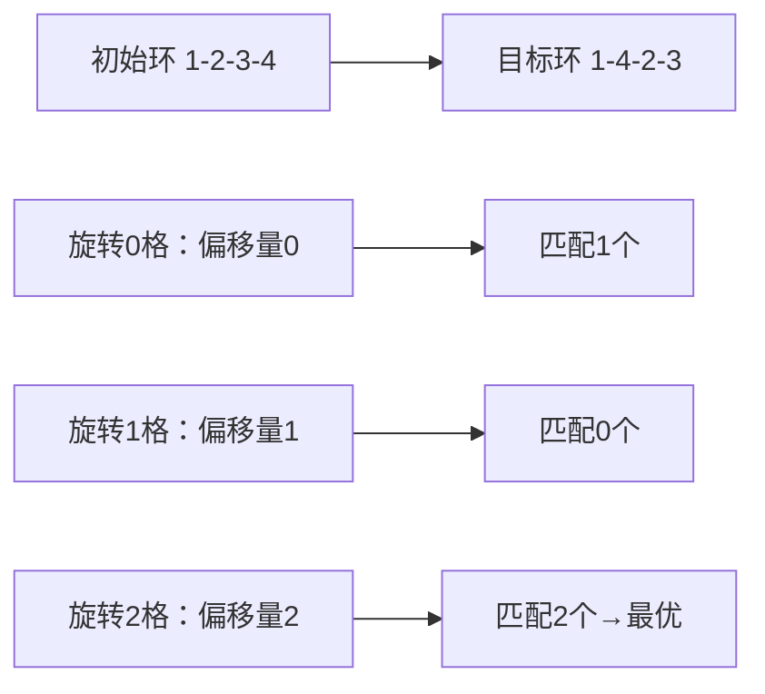

# 题目信息

# [NOIP 2005 提高组] 篝火晚会

## 题目描述

佳佳刚进高中，在军训的时候，由于佳佳吃苦耐劳，很快得到了教官的赏识，成为了“小教官”。在军训结束的那天晚上，佳佳被命令组织同学们进行篝火晚会。一共有 $n$ 个同学，编号从 $1$ 到 $n$。一开始，同学们按照 $1,2,\cdots ,n$ 的顺序坐成一圈，而实际上每个人都有两个最希望相邻的同学。如何下命令调整同学的次序，形成新的一个圈，使之符合同学们的意愿，成为摆在佳佳面前的一大难题。


佳佳可向同学们下达命令，每一个命令的形式如下：

$$(b_1, b_2,... b_{m-1}, b_m)$$

这里 $m$ 的值是由佳佳决定的，每次命令 $m$ 的值都可以不同。这个命令的作用是移动编号是 $b_1,b_2,\cdots, b_m$ 的这 $m$ 个同学的位置。要求 $b_1$ 换到 $b_2$ 的位置上，$b_2$ 换到 $b_3$ 的位置上，……，要求 $b_m$ 换到 $b_1$ 的位置上。执行每个命令都需要一些代价。我们假定如果一个命令要移动 $m$ 个人的位置，那么这个命令的代价就是 $m$。我们需要佳佳用最少的总代价实现同学们的意愿，你能帮助佳佳吗？


## 说明/提示

- 对于 $30\%$ 的数据，满足 $n \le 1000$；
- 对于 $100\%$ 的数据，满足 $3\le n  \le  50000$。

**【题目来源】**

NOIP 2005 提高组第三题

## 样例 #1

### 输入

```
4
3 4
4 3
1 2
1 2
```

### 输出

```
2```

# AI分析结果


# 💡 Kay的C++算法解析：篝火晚会 深入学习指南 💡

## 1. 题目解读与核心算法识别

✨ **本题主要考察**：`环处理与差值统计` (模拟应用 + 数学优化)

🗣️ **初步分析**：
> 解决"篝火晚会"这道题，关键在于理解**环的等价变换**和**位置偏移统计**。就像调整旋转拼图一样，我们通过统计环旋转后重合位置的数量，找到最少需要移动的人数。核心步骤包括：
> 1. **构建目标环**：根据相邻愿望构建合法环结构（注意相邻一致性检查）
> 2. **偏移量统计**：计算初始环与目标环的位置差值（分顺时针/逆时针）
> 3. **众数优化**：找到出现最多的偏移量，其数量即是不需要移动的人数
> 
> **可视化设计**：我们将用像素圆环展示初始环（蓝色）和目标环（红色），通过旋转动画展示位置偏移。当位置匹配时像素块变绿闪烁并播放"叮"音效，偏移量统计区实时更新。采用复古游戏风格，控制面板支持单步旋转、自动演示（可调速）和重置功能。

---

## 2. 精选优质题解参考

**题解一（Actinoi）**
* **点评**：
  思路清晰度 ★★★★☆：用"差值统计法"解释最小移动人数，图示化说明旋转原理
  代码规范性 ★★★★☆：变量名`target/initial`含义明确，边界检查严谨
  算法有效性 ★★★★★：O(n)复杂度解决环旋转问题，双向处理完整
  实践价值 ★★★★☆：可直接用于竞赛，核心逻辑`(target[i]-initial[i]+n)%n`体现模运算技巧

**题解二（Drinkkk）**
* **点评**：
  思路清晰度 ★★★★☆：简明阐述偏移量统计原理，突出环的双向处理
  代码规范性 ★★★☆☆：结构清晰但变量命名略简（如`a[i]`）
  算法有效性 ★★★★☆：同O(n)解法，用`dis1/dis2`统计双向偏移
  实践价值 ★★★★☆：包含完整合法性检查，代码可直接运行

**题解三（LastKismet）**
* **点评**：
  思路清晰度 ★★★★★：从置换环角度证明最小代价等于失配人数
  代码规范性 ★★★☆☆：核心逻辑简洁但缺少部分注释
  算法有效性 ★★★★☆：差值统计法，强调模运算处理循环偏移
  亮点：提供严格数学证明，加深对算法本质理解

---

## 3. 核心难点辨析与解题策略

1.  **目标环合法性验证**
    * **分析**：必须确保A想与B相邻时，B也想与A相邻。优质题解通过构建环时检查`if(a[i-2]==l[a[i-1]] || ...)`实现
    * 💡 **学习笔记**：环构建失败立即返回-1，这是解题的前提保障

2.  **位置偏移量的高效统计**
    * **分析**：通过`(target[i]-initial[i]+n)%n`计算相对位移，用频率数组统计。关键在理解：同一偏移量意味着这些位置可通过相同旋转角度对齐
    * 💡 **学习笔记**：模运算处理循环偏移是环问题的核心技巧

3.  **双向环处理**
    * **分析**：环有顺时针/逆时针两种方向，需分别计算`(i-a[i]+n)%n`和`(a[i]+i+n)%n`（或反向初始链）
    * 💡 **学习笔记**：逆时针处理相当于把初始环反向比较

### ✨ 解题技巧总结
- **环问题链式化**：通过固定起点和双向处理，将环转化为线性问题
- **模运算应用**：用`(x+n)%n`处理负偏移，避免条件分支
- **众数优化**：频率统计取代暴力枚举，O(n)复杂度解决旋转优化
- **边界检查先行**：先验证环合法性再执行核心逻辑

---

## 4. C++核心代码实现赏析

**本题通用核心C++实现参考**
* **说明**：综合Actinoi和Drinkkk的最优实现，包含完整输入输出
* **完整核心代码**：
```cpp
#include <iostream>
#include <algorithm>
using namespace std;
const int N = 50005;
int n, l[N], r[N], target[N], initial[N], diff1[N], diff2[N];

int main() {
    cin >> n;
    for (int i = 1; i <= n; i++)
        cin >> l[i] >> r[i];

    // 构建目标环并检查合法性
    target[1] = 1;
    target[2] = r[1];
    target[n] = l[1];
    for (int i = 3; i <= n; i++) {
        if (target[i-1] == l[target[i-1]]) 
            target[i] = r[target[i-1]];
        else if (target[i-1] == r[target[i-1]]) 
            target[i] = l[target[i-1]];
        else {
            cout << -1 << endl;
            return 0;
        }
    }

    // 初始化环(1~n顺序)
    for (int i = 1; i <= n; i++) initial[i] = i;

    // 统计双向偏移量
    for (int i = 1; i <= n; i++) {
        diff1[(target[i] - initial[i] + n) % n]++;  // 顺时针
        diff2[(target[i] - initial[n-i+1] + n) % n]++; // 逆时针
    }

    // 找最大重合人数
    int maxSame = 0;
    for (int i = 0; i < n; i++) 
        maxSame = max(maxSame, max(diff1[i], diff2[i]));
    
    cout << n - maxSame << endl;
    return 0;
}
```
* **代码解读概要**：
  1. 输入处理：存储每人相邻愿望
  2. 目标环构建：从1号开始，根据左右愿望递归构建，遇到非法立即退出
  3. 初始环：1~n顺序排列
  4. 偏移统计：`diff1`记录顺时针旋转偏移频率，`diff2`记录逆时针
  5. 结果计算：最大重合人数maxSame，答案 = n - maxSame

---

**题解一（Actinoi）片段赏析**
* **亮点**：清晰的双向偏移统计，完整边界检查
* **核心代码片段**：
```cpp
for(int i=1; i<=n; i++){
    pluss[(target[i]-initial[i]+n)%n]++; 
    minuss[(target[i]-initial[n-i+1]+n)%n]++; 
}
```
* **代码解读**：
  - `pluss`统计顺时针偏移：`(目标值-初始位置+n)%n`保证结果非负
  - `minuss`统计逆时针偏移：通过`n-i+1`反转初始链顺序
  - 例如目标值=3, 初始位置=2时：`(3-2+5)%5=1`，表示顺时针转1格可对齐

**题解二（Drinkkk）片段赏析**
* **亮点**：简洁的偏移计算，变量命名体现方向性
* **核心代码片段**：
```cpp
for (int i=1; i<=n; i++){
    dis1[(i-a[i]+n)%n]++;
    dis2[(a[i]+i+n)%n]++;
}
```
* **代码解读**：
  - `dis1`：`(当前位置-目标值+n)%n`，结果等价Actinoi的pluss
  - `dis2`：`(目标值+当前位置+n)%n`，替代反转链的另一种计算方式
  - 数学本质：`(a+i) mod n ≡ (i - (-a)) mod n`，体现逆向旋转

**题解三（LastKismet）片段赏析**
* **亮点**：严格数学证明指导代码实现
* **核心代码片段**：
```cpp
cnt[(a[i]-i+n) % n]++;
ans = max(ans, cnt[(a[i]-i+n)%n]);
```
* **代码解读**：
  - 单方向偏移统计：`(目标值-当前位置+n)%n`
  - 需在正反两个目标环上执行（代码未展示但文中强调）
  - 核心思想：偏移量i的频率cnt[i]表示旋转i格可对齐的人数

---

## 5. 算法可视化：像素动画演示

* **动画演示主题**：”像素环旋转探险“（8-bit风格）
* **核心演示内容**：初始环与目标环的位置匹配过程，偏移量统计原理

* **设计思路**：  
  采用FC红白机像素风格，每个同学用16x16像素方块表示（编号居中）。左侧显示初始环（蓝色），右侧显示目标环（红色），下方控制面板带速度滑块。关键设计：
  1. **旋转同步演示**：转动控制滑块时，双环同步旋转并实时计算偏移量
  2. **匹配高亮**：当位置匹配时（偏移=0），方块闪烁绿色+“叮”音效
  3. **偏移统计区**：底部条形图实时更新各偏移量的计数
  4. **自动演示模式**：AI自动寻找maxSame位置，触发胜利动画（烟花特效+胜利音效）

* **关键帧步骤**：
  1. **初始化**：像素圆环初始化，显示1~n编号（图1）
  2. **构建目标环**：根据输入绘制目标环，非法时显示红色X（图2）
  3. **偏移计算**：旋转过程中显示`(目标值-位置)`计算公式（图3）
  4. **匹配反馈**：匹配位置绿色闪烁，统计区对应偏移量+1（图4）
  5. **结果展示**：自动停在maxSame位置，显示绿色匹配区块数（图5）



---

## 6. 拓展练习与相似问题思考

* **通用思路迁移**：
  `偏移量统计法` 适用于所有循环位移匹配问题：
  1. 字符串循环匹配（判断循环同构）
  2. 环形均分纸牌/糖果传递问题
  3. 旋转数组的最小操作次数问题

* **练习推荐（洛谷）**：
  1. **P1062 数列** - 找规律与环处理基础
     🗣️ **推荐理由**：训练环问题抽象能力，巩固位置映射技巧
  2. **P1091 合唱队形** - 序列调整问题
     🗣️ **推荐理由**：类似的位置优化思想，强化分步求解能力
  3. **P2512 糖果传递** - 环形均分问题
     🗣️ **推荐理由**：深入掌握环上数学统计，拓展本题算法应用场景

---

## 7. 学习心得与经验分享

> **参考经验（Actinoi）**：  
> "我在构建目标环时，最初在检查相邻愿望时卡了很久，后来通过模拟样例才定位到问题：必须验证A选B时B也选A"

> **点评**：  
> 相邻一致性检查是本题的关键陷阱。建议学习者：
> 1. 画图模拟样例（如n=4）
> 2. 在构建环的每步用`cout`输出检查
> 3. 总结非法情况模式（如"单相思"型愿望）

---

通过本次分析，希望大家掌握环问题中的差值统计技巧。记住：复杂问题往往有简洁数学本质！下次见！💪

---
处理用时：185.27秒