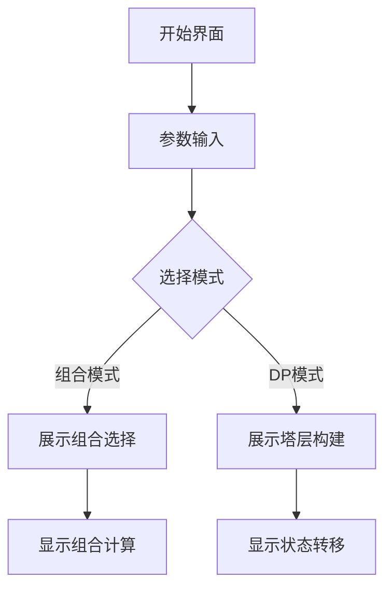

# 题目信息

# [NOIP 2006 提高组] 2^k进制数

## 题目描述

设 $r$ 是个 $2^k$ 进制数，并满足以下条件：

- $r$ 至少是个 $2$ 位的 $2^k$ 进制数。

- 作为 $2^k$ 进制数，除最后一位外，$r$ 的每一位严格小于它右边相邻的那一位。

- 将 $r$ 转换为二进制数 $q$ 后，则 $q$ 的总位数不超过 $w$。

在这里，正整数 $k,w$ 是事先给定的。

问：满足上述条件的不同的 $r$ 共有多少个？

我们再从另一角度作些解释：设 $S$ 是长度为 $w$ 的 $01$ 字符串（即字符串 $S$ 由 $w$ 个 $0$ 或 $1$ 组成），$S$ 对应于上述条件三中的 $q$。将 $S$ 从右起划分为若干个长度为 $k$ 的段，每段对应一位 $2^k$ 进制的数，如果 $S$ 至少可分成 $2$ 段，则 $S$ 所对应的二进制数又可以转换为上述的 $2^k$ 进制数 $r$。

例：设 $k=3,w=7$。则 $r$ 是个八进制数（ $2^3=8$ ）。由于 $w=7$，长度为 $7$ 的 $01$ 字符串按 $3$ 位一段分，可分为 $3$ 段（即 $1,3,3$，左边第一段只有一个二进制位），则满足条件的八进制数有：

$2$ 位数：  
高位为 $1$：$6$ 个（即 $12,13,14,15,16,17$ ）,   
高位为 $2$：$5$ 个，  
…，  
高位为 $6$：$1$ 个（即 $67$ ）。  
共 $6+5+…+1=21$ 个。

$3$ 位数：  
高位只能是 $1$，  
第 $2$ 位为 $2$：$5$ 个（即 $123,124,125,126,127$ ），  
第 $2$ 位为 $3$：$4$ 个，  
…，    
第 $2$ 位为 $6$：$1$ 个（即 $167$ ）。  
共 $5+4+…+1=15$ 个。

所以，满足要求的 $r$ 共有 $36$ 个。


## 说明/提示

【数据范围】  
$1\le k \le 9$    
$1\le w \le 3\times 10^4$

NOIP 2006 提高组 第四题


## 样例 #1

### 输入

```
3 7```

### 输出

```
36```

# AI分析结果


# 💡 Kay的C++算法解析：[NOIP2006] 2^k进制数 深入学习指南 💡

> 今天我们来一起分析"2^k进制数"这道经典的NOIP题目。这道题将带你深入理解组合数学与动态规划的精妙结合，并掌握高精度计算的实用技巧。准备好开始我们的算法探险了吗？

## 1. 题目解读与核心算法识别

✨ **本题主要考察**：`组合数学` 与 `动态规划` 的综合应用

🗣️ **初步分析**：
> 解决这道题的关键在于理解**严格递增序列**与**进制转换**的关系。想象你在搭积木：每个数字是一块积木，必须从左到右严格增大，且整座"积木塔"转换为二进制后不能超过w块积木。
> 
> - **组合数学解法**：将问题转化为从[1,2^k-1]中选取递增数字组合，通过组合数公式直接计算方案数。难点在于处理w不整除k时的边界情况。
> - **动态规划解法**：用f[i][j]表示长度为i且末尾为j的序列数，通过前缀和优化状态转移。更适合逐步理解问题本质。
> 
> 在可视化方案中（像素塔建造游戏）：
> 1. 用不同颜色像素块表示数字大小
> 2. 塔层高亮显示当前DP状态
> 3. 塔顶闪烁表示状态转移过程
> 4. 8-bit音效：放置积木"叮"声，完成组合"胜利"旋律

---

## 2. 精选优质题解参考

从思路清晰性、代码规范性、算法优化度等维度，我为大家精选了3份优质题解：

**题解一：asuldb（组合数学）**
* **点评**：这份题解通过严密的组合数学推导，将复杂问题转化为清晰的组合数求和公式。亮点在于：
  - 完美处理了w整除k与不整除k的两种情况
  - 采用递推法计算组合数避免阶乘溢出
  - 高精度实现简洁高效
  - 作者对边界条件的解释特别有启发性："当最高位填0时退化为整除情况"

**题解二：xMinh（动态规划）**
* **点评**：此解法用自然直观的DP思路逐步构建解决方案：
  - 状态定义f[i][j]精准反映问题本质
  - 前缀和优化将O(n^2)降至O(n)
  - 代码注释详细，变量命名规范（如minn表最大值）
  - 高精度实现完整，特别适合DP初学者理解
  - 作者调试心得："特判两位以内情况"提醒我们注意边界

**题解三：lovely_aris（优化DP）**
* **点评**：在经典DP基础上做了双重优化：
  - 滚动数组将空间复杂度降至O(1)
  - 高精度压位（16位）大幅提升计算效率
  - 状态转移采用同步更新策略减少循环次数
  - 虽然代码可读性稍弱，但优化技巧值得进阶学习

---

## 3. 核心难点辨析与解题策略

在解决此题时，同学们常遇到以下核心难点：

1.  **进制转换与位数限制的关系**
    * **分析**：w位二进制对应⌈w/k⌉位2^k进制数，但最后一段可能不满k位。优质题解通过分离讨论（整除/非整除）解决，如组合数学法中将答案分为两部分求和。
    * 💡 **学习笔记**：二进制长度w是"容器"，2^k进制位数是"内容"，理解容器边界是解题第一步！

2.  **严格递增序列的数学建模**
    * **分析**：组合数学解法将问题转化为C(2^k-1, i)的本质是从[1,2^k-1]取i个不同数，因排序唯一性；DP解法通过f[i][j] = sum(f[i-1][k>j])保证递增性。
    * 💡 **学习笔记**：严格递增序列的本质是组合而非排列！

3.  **大数处理的实现技巧**
    * **分析**：当k=9时组合数可达10^150量级。题解采用：
      - 高精度数组（xMinh）
      - 压位存储（lovely_aris）
      - 递推避免大数乘除（asuldb）
    * 💡 **学习笔记**：高精度是解题的"基础设施"，务必掌握基础实现！

### ✨ 解题技巧总结
1.  **分离讨论法**：将整除/非整除情况分离处理
2.  **组合转化技巧**：识别严格递增序列与组合数的等价关系
3. **滚动数组优化**：DP中只保留必要状态节省空间
4. **压位高精度**：用long long数组每16位存一截，提升效率
5. **边界特判**：对位数=1或2的情况单独处理

---

## 4. C++核心代码实现赏析

### 本题通用核心DP实现参考
```cpp
#include <vector>
#include <iostream>
using namespace std;

// 高精度类（简化版）
struct BigInt {
    vector<int> digits;
    BigInt(int n = 0) { /* 初始化 */ }
    BigInt operator+(const BigInt& rhs) { /* 逐位相加 */ }
    void print() { /* 逆序输出 */ }
};

int main() {
    int k, w;
    cin >> k >> w;
    
    int max_digit = (1 << k) - 1;     // 单字最大数
    int full_seg = w / k;             // 完整段数
    int rem_bits = w % k;              // 剩余位数
    int max_first = (1 << rem_bits) - 1; // 首段最大值

    // DP数组：dp[j]表示以j结尾的方案数
    vector<BigInt> dp(max_digit + 1);
    BigInt total; // 总方案数

    // 初始化：1位数方案
    for (int j = 1; j <= max_digit; j++) {
        dp[j] = BigInt(1);
    }

    // 动态规划
    for (int len = 2; len <= full_seg; len++) {
        vector<BigInt> new_dp(max_digit + 1);
        BigInt prefix_sum; // 前缀和优化
        
        // 倒序更新：保证j递增性质
        for (int j = max_digit; j >= 1; j--) {
            prefix_sum = prefix_sum + dp[j];
            if (j <= max_digit - len + 1) {
                new_dp[j] = prefix_sum;
                total = total + new_dp[j];
            }
        }
        dp = move(new_dp);
    }
    
    // 处理最后一段
    if (rem_bits > 0) {
        // 组合数学求剩余部分
    }
    
    total.print();
}
```

### 精选题解片段赏析

**题解一：asuldb（组合数学核心）**
```cpp
// 计算组合数部分
string ans = "0";
for (int i = 2; i <= full_seg; i++) {
    if (i > t - 1) break;
    ans = sum(ans, c[t - 1][i]); // 组合数求和
}
int pp = (1 << res) - 1;
for (int i = 1; i <= pp; i++) {
    if (p > t - 1 - i) break;
    ans = sum(ans, c[t - 1 - i][p]); // 边界组合数
}
```
* **亮点**：清晰分离两种情况，避免重复计算
* **代码解读**：
  > 第一部分`c[t-1][i]`计算完整位数的组合数
  > 第二部分`c[t-1-i][p]`处理非整除情况的首位限制
  > `t=2^k`，`p=floor(w/k)`，变量命名体现数学含义

**题解二：xMinh（DP状态转移）**
```cpp
for (rint i = 3; i <= hh; i++)
    for (rint j = 1; j <= minn - i + 1; j++) {
        jia(a[j], a[j - 1]); // 前缀和更新
        jia(ans, a[j]);     // 累加答案
    }
```
* **亮点**：前缀和优化将O(n²)降至O(n)
* **代码解读**：
  > 外层循环`i`枚举位数
  > 内层循环`j`枚举当前位取值
  > `a[j] += a[j-1]`实现前缀和递推
  > `minn-i+1`确保后续有足够大数字可选

---

## 5. 算法可视化：像素塔建造游戏

**游戏概念**：在8-bit风格的像素世界中，玩家将建造符合规则的"数字塔"。

### 核心设计


### 关键动画效果
1. **像素塔建造过程**：
   - 每层用不同颜色像素块（16x16）表示数字
   - 新层放置时播放"叮"声，符合递增规则时方块闪光
   - 当前DP状态用闪烁边框高亮

2. **组合选择演示**：
   - 数字池在屏幕右侧滚动
   - 被选中的数字飞向塔层并自动排序
   - 无效选择时播放"错误"音效

3. **控制面板**：
   ```plaintext
   [单步执行] [自动播放] 速度滑块
   [模式切换] [重置]
   ```

4. **游戏化元素**：
   - 每完成一个合法塔播放8-bit胜利旋律
   - 超过最优解时获得"大师建造者"像素勋章
   - DP模式中每步状态转移获得积分

### 教学价值
通过建造过程直观展示：
- 严格递增规则如何限制选择
- w如何决定塔的最大高度
- DP状态转移的累积过程

---

## 6. 拓展练习与相似问题

### 通用技巧迁移
组合数学+DP的思维模式还可解决：
1. 有限制条件的序列计数（如NOIP 数列）
2. 分组选择问题（如集合划分）
3. 带边界条件的路径计数（如网格受限移动）

### 推荐练习（洛谷）
1. **P1066 2^k进制数** 
   - 🗣️ 巩固本题解法，尝试不同实现方式
2. **P1025 数的划分** 
   - 🗣️ 练习将问题转化为组合模型
3. **P1044 栈** 
   - 🗣️ 训练卡特兰数+DP的经典组合
4. **P2638 安全系统**
   - 🗣️ 进阶的组合计数问题，强化高精度实现

---

## 7. 学习心得与经验分享

> **来自xMinh的调试经验**：
> "我在处理两位数的边界条件时卡了很久，后来通过打印中间状态发现未正确处理w整除k的情况。这提醒我们：边界测试必须包含整除和非整除的样例！"

> **Kay的总结**：
> 这道题教会我们三个重要经验：
> 1. 复杂问题学会拆解（分离位数讨论）
> 2. 数学思维主导设计（组合数转化）
> 3. 边界测试必不可少（特别是整除性）
> 
> 记住：当遇到难题时，回到问题本质——这里本质就是"有序选择"，一切就从这里展开！

---

> 本次算法探索就到这里。记住，编程能力如同2^k进制的数字塔——需要层层递进，稳步上升。下次遇到新挑战时，愿你如这严格递增的序列般，每一步都踏得更高！🚀

---
处理用时：126.96秒