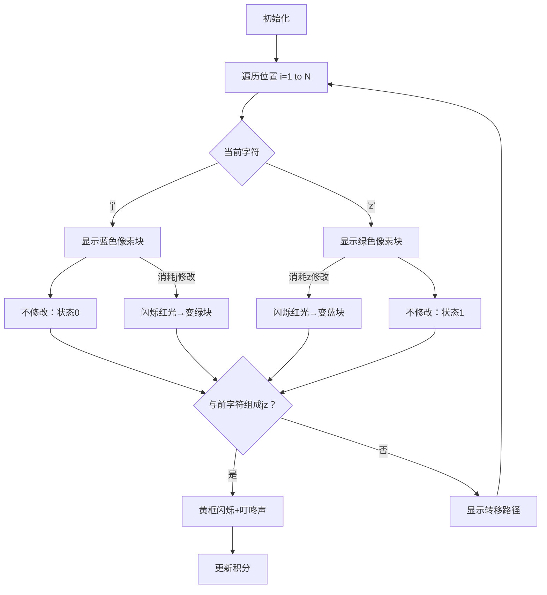

# 题目信息

# 迎接仪式

## 题目描述

LHX 教主要来 X 市指导 OI 学习工作了。为了迎接教主，在一条道路旁，一群“Orz 教主 er”穿着文化衫站在道路两旁迎接教主，每件文化衫上都印着大字。一旁的 Orzer 依次摆出“欢迎欢迎欢迎欢迎……”的大字，但是领队突然发现，另一旁穿着“教”和“主”字文化衫的 Orzer 却不太和谐。

为了简单描述这个不和谐的队列，我们用 `j` 替代“教”，`z` 替代“主”。而一个 `j` 与 `z` 组成的序列则可以描述当前的队列。为了让教主看得尽量舒服，你必须调整队列，使得 `jz` 子串尽量多。每次调整你可以交换任意位置上的两个人，也就是序列中任意位置上的两个字母。而因为教主马上就来了，时间仅够最多做 $K$ 次调整（当然可以调整不满 $K$ 次），所以这个问题交给了你。

## 说明/提示

**【样例说明】**

第 $1$ 次交换位置 $1$ 上的 `z` 和位置 $4$ 上的 `j`，变为 `jzzzj`；

第 $2$ 次交换位置 $4$ 上的 `z` 和位置 $5$ 上的 `j`，变为 `jzzjz`。

最后的串有 $2$ 个 `jz` 子串。

**【数据规模与约定】**

对于 $10 \%$ 的数据，有 $N \le 10$；  
对于 $30 \%$ 的数据，有 $K \le 10$；  
对于 $40 \%$ 的数据，有 $N \le 50$；  
对于 $100 \%$ 的数据，有 $1 \le N \le 500$，$1 \le K \le 100$。

## 样例 #1

### 输入

```
5 2 
zzzjj
```

### 输出

```
2
```

# AI分析结果


### 💡 Kay的C++算法解析：迎接仪式 深入学习指南 💡

#### 1. 题目解读与核心算法识别
✨ **本题主要考察**：`动态规划（状态机模型）`

🗣️ **初步分析**：
> 解决"迎接仪式"的关键在于设计多维DP状态，记录字符修改过程。就像玩拼图游戏，我们需记录：①拼到哪块（位置）②修改了多少"j"和"z"（操作次数）③当前拼图形状（字符状态）。  
> - 核心思路：交换本质是修改字符，且修改的'j'和'z'数量必须相等。状态设计为`f[i][a][b][0/1]`，表示前`i`位修改`a`个'j'和`b`个'z'，且第`i`位为'j'(0)或'z'(1)时的最大"jz"数  
> - 难点：状态转移需分4种情况讨论（原字符是'j'/'z'，修改/不修改）  
> - 可视化设计：用像素方块表示字符（蓝=J/绿=Z），修改时闪烁红光，组成"jz"时黄框闪烁+音效。自动演示时同步显示DP状态表，高亮当前转移路径  
> - 复古元素：FC游戏音效（修改=哔声，组成jz=叮咚声），每步积分（组成jz+10分），通关动画（显示最终答案）

---

#### 2. 精选优质题解参考
**题解一（hzoi_liuchang）**
* **点评**：状态定义清晰完整（四维DP），详细推导转移方程，特别强调初始化的重要性（memset负无穷）。代码中`f[i][j][k][0/1]`的维度命名直观，边界处理严谨（判断`k>0`等），可直接用于竞赛。亮点在于完整覆盖所有转移情况，避免HACK点。

**题解二（gorokokoro）**
* **点评**：直击其他题解漏洞（不记录末位状态会导致统计遗漏），用`INT_MIN`初始化确保安全。代码将字符映射为0/1（`a[i]=s[i-1]=='z'`），简化条件判断。算法有效性突出——用正确状态设计解决关键HACK案例，是调试思维的优秀示范。

**题解三（A_Bit_Cold）**
* **点评**：代码简洁高效（仅30行核心DP），状态转移浓缩为两个分支。实践价值高——字符串从1开始索引，避免下标越界；循环边界`j>=1`等处理规范。亮点在于平衡简洁性与正确性，适合初学者理解DP框架。

---

#### 3. 核心难点辨析与解题策略
1. **状态设计维度选择**
   * **分析**：必须同时记录位置、修改次数（区分j和z）、当前字符状态。这是因为：①修改j/z次数需相等 ②当前字符状态直接影响是否能与前字符组成"jz"
   * 💡 **学习笔记**：多维DP中，每个维度都应承载独立信息且无后效性

2. **状态转移分类讨论**
   * **分析**：需根据当前字符原值分情况：
     - 原字符'j'：不修改→状态0；修改→消耗j修改次数→状态1（若前字符为j则组成jz）
     - 原字符'z'：不修改→状态1（若前字符为j则组成jz）；修改→消耗z修改次数→状态0
   * 💡 **学习笔记**：画状态转移图辅助理清条件分支

3. **初始化与非法状态处理**
   * **分析**：起点`f[0][0][0][1]=0`（虚拟第0位为z），其他设为负无穷，避免从未初始化状态转移
   * 💡 **学习笔记**：DP初始化决定正确性边界，非法状态必须隔离

✨ **解题技巧总结**：
- **状态压缩**：观察发现`a==b`才有效，最终答案只需遍历`a=b`的状态
- **滚动数组**：`f[i]`只依赖`f[i-1]`，可用二维数组交替保存节省空间
- **调试技巧**：打印中间状态表（如`i=5`时所有`a,b`组合值）

---

#### 4. C++核心代码实现赏析
**通用核心实现（综合优化版）**
```cpp
#include <iostream>
#include <cstring>
using namespace std;
const int N=505, K=105;

int n, m, f[N][K][K][2]; // f[i][a][b][0/1]
char s[N];

int main() {
    cin >> n >> m >> (s+1);
    memset(f, 0x80, sizeof f); // 初始化为负无穷
    f[0][0][0][1] = 0; // 虚拟起点

    for(int i=1; i<=n; ++i)
    for(int a=0; a<=m; ++a) // 修改j的次数
    for(int b=0; b<=m; ++b) { // 修改z的次数
        if(s[i]=='j') {
            // 不修改→当前为j
            f[i][a][b][0] = max(f[i-1][a][b][0], f[i-1][a][b][1]);
            // 修改→当前为z（消耗1次j修改）
            if(a) f[i][a][b][1] = max(f[i-1][a-1][b][0]+1, f[i-1][a-1][b][1]);
        } else {
            // 不修改→当前为z（可能与前位j组成jz）
            f[i][a][b][1] = max(f[i-1][a][b][0]+1, f[i-1][a][b][1]);
            // 修改→当前为j（消耗1次z修改）
            if(b) f[i][a][b][0] = max(f[i-1][a][b-1][0], f[i-1][a][b-1][1]);
        }
    }

    int ans = 0;
    for(int a=0; a<=m; ++a)
        ans = max(ans, max(f[n][a][a][0], f[n][a][a][1]));
    cout << ans;
}
```
**代码解读概要**：  
- 四维数组`f[i][a][b][0/1]`记录DP状态  
- 初始化：`f[0][0][0][1]=0`为起点，其他负无穷  
- 双循环遍历位置与修改次数，分字符类型处理  
- 结果取所有`a=b`状态的最大值  

---

**题解一片段赏析（hzoi_liuchang）**
```cpp
if(s[i]=='z'){
    f[i][j][k][1]=max(f[i-1][j][k][0]+1,f[i-1][j][k][1]);
    if(k) f[i][j][k][0]=max(f[i-1][j][k-1][0],f[i-1][j][k-1][1]);
}
```
**亮点**：原字符'z'的两种处理路径清晰  
**代码解读**：  
> 当字符为'z'时：  
> - 不修改（保持z）：若前一位是j（状态0），则组成jz（+1）；前位是z（状态1）则不加  
> - 修改为j（需k>0）：当前位变为j，不会组成新jz  
**学习笔记**：状态转移中`max`的取值顺序体现决策优先级  

---

#### 5. 算法可视化：像素动画演示
**主题**：8位像素风格的DP状态探险  
**核心演示**：动态展示DP状态转移与字符修改过程  



**关键交互设计**：
1. **像素艺术**：
   - 16x16像素块：蓝=J/绿=Z
   - 修改操作：红白闪烁动画+8bit音效
   - 组成jz：金色边框脉冲动画+胜利音效

2. **控制面板**：
   - 速度滑块：调节单步延时（100ms~2s）
   - 模式切换：单步/自动/AI演示（自动完成最优路径）
   - 状态追踪：实时显示`f[i][a][b][0/1]`值

3. **动态信息**：
   - 右侧状态表：高亮当前最优解
   - 转移路径图：红色箭头指示状态转移来源
   - 积分系统：每组成jz+10分，通关显示总分

---

#### 6. 拓展练习与相似问题思考
**通用技巧迁移**：  
本DP模型适用于：  
1. 带操作次数限制的字符串优化问题  
2. 双目标计数（如修改两种物品次数需相等）  
3. 状态机模型（当前状态依赖前一状态）  

**洛谷推荐**：  
1. **P2758 编辑距离**  
   🗣️ 练习相同DP框架（操作次数+状态记录），将字符串A转为B的最少操作  

2. **P1136 欢迎仪式·改**  
   🗣️ 同类题型加强版，需结合贪心优化DP状态数  

3. **P4170 涂色**  
   🗣️ 区间DP+操作次数限制，巩固状态设计思维  

---

#### 7. 学习心得与经验分享
> **参考经验（来自 gorokokoro）**：  
> "我在调试时发现不记录末位状态会导致统计遗漏——当修改后的j与后续z组成jz时会被忽略"  
>  
> **Kay点评**：  
> 这个教训揭示了DP设计的核心原则：**状态必须包含所有影响未来的因素**。建议学习者：  
> 1. 用小数据手工模拟DP过程  
> 2. 特别关注状态边界（如第1位/最后1位）  
> 3. 用`assert`验证状态转移合法性  

---

通过本次分析，我们深入掌握了多维DP的状态设计与转移技巧。记住：好的状态设计是DP成功的核心！下次挑战见！💪

---
处理用时：192.25秒