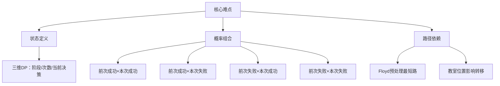

# 题目信息

# [NOIP 2016 提高组] 换教室

## 题目背景

NOIP2016 提高组 D1T3

## 题目描述

对于刚上大学的牛牛来说，他面临的第一个问题是如何根据实际情况申请合适的课程。


在可以选择的课程中，有 $2n$ 节课程安排在 $n$ 个时间段上。在第 $i$（$1 \leq i \leq n$）个时间段上，两节内容相同的课程同时在不同的地点进行，其中，牛牛预先被安排在教室 $c_i$ 上课，而另一节课程在教室 $d_i$ 进行。


在不提交任何申请的情况下，学生们需要按时间段的顺序依次完成所有的 $n$ 节安排好的课程。如果学生想更换第 $i$ 节课程的教室，则需要提出申请。若申请通过，学生就可以在第 $i$ 个时间段去教室 $d_i$ 上课，否则仍然在教室 $c_i$ 上课。


由于更换教室的需求太多，申请不一定能获得通过。通过计算，牛牛发现申请更换第 $i$ 节课程的教室时，申请被通过的概率是一个已知的实数 $k_i$，并且对于不同课程的申请，被通过的概率是互相独立的。


学校规定，所有的申请只能在学期开始前一次性提交，并且每个人只能选择至多 $m$ 节课程进行申请。这意味着牛牛必须一次性决定是否申请更换每节课的教室，而不能根据某些课程的申请结果来决定其他课程是否申请；牛牛可以申请自己最希望更换教室的 $m$ 门课程，也可以不用完这 $m$ 个申请的机会，甚至可以一门课程都不申请。


因为不同的课程可能会被安排在不同的教室进行，所以牛牛需要利用课间时间从一间教室赶到另一间教室。


牛牛所在的大学有 $v$ 个教室，有 $e$ 条道路。每条道路连接两间教室，并且是可以双向通行的。由于道路的长度和拥堵程度不同，通过不同的道路耗费的体力可能会有所不同。 当第 $i$（$1 \leq i \leq n-1$）节课结束后，牛牛就会从这节课的教室出发，选择一条耗费体力最少的路径前往下一节课的教室。


现在牛牛想知道，申请哪几门课程可以使他因在教室间移动耗费的体力值的总和的期望值最小，请你帮他求出这个最小值。


## 说明/提示

**样例 1 说明**

所有可行的申请方案和期望收益如下：

- 不作申请，耗费的体力值的期望为 $8.0$。

| 申请通过的时间段 | 出现的概率 | 耗费的体力值 |
| :--------: | :----: | :----: |
|     无      |  $1.0$  |  $8$  |

- 申请更换第 $1$ 个时间段的上课教室，耗费的体力值的期望为 $4.8$。

| 申请通过的时间段 | 出现的概率 | 耗费的体力值 |
| :--------: | :----: | :----: |
|     $1$      |  $0.8$  |  $4$  |
|     无      |  $0.2$  |  $8$  |

- 申请更换第 $2$ 个时间段的上课教室，耗费的体力值的期望为 $6.4$。

| 申请通过的时间段 | 出现的概率 | 耗费的体力值 |
| :--------: | :----: | :----: |
|     $2$      |  $0.2$  |  $0$  |
|     无      |  $0.8$  |  $8$  |

- 申请更换第 $3$ 个时间段的上课教室，耗费的体力值的期望为 $6.0$。

| 申请通过的时间段 | 出现的概率 | 耗费的体力值 |
| :--------: | :----: | :----: |
|     $3$      |  $0.5$  |  $4$  |
|     无      |  $0.5$  |  $8$  |

- 申请更换第 $1,2$ 个时间段的上课教室，耗费的体力值的期望为 $4.48$。

| 申请通过的时间段 | 出现的概率 | 耗费的体力值 |
| :--------: | :----: | :----: |
|     $1,2$      |  $0.16$  |  $4$  |
|     $1$      |  $0.64$  |  $4$  |
|     $2$     |  $0.04$  |  $0$  |
|     无      |  $0.16$  |  $8$  |

- 申请更换第 $1,3$ 个时间段的上课教室，耗费的体力值的期望为 $2.8$。

| 申请通过的时间段 | 出现的概率 | 耗费的体力值 |
| :--------: | :----: | :----: |
|     $1,3$      |  $0.4$  |  $0$  |
|     $1$      |  $0.4$  |  $4$  |
|     $3$     |  $0.1$  |  $4$  |
|     无      |  $0.1$  |  $8$  |

- 申请更换第 $2,3$ 个时间段的上课教室，耗费的体力值的期望为 $5.2$。

| 申请通过的时间段 | 出现的概率 | 耗费的体力值 |
| :--------: | :----: | :----: |
|     $2,3$      |  $0.1$  |  $4$  |
|     $2$      |  $0.1$  |  $0$  |
|     $3$     |  $0.4$  |  $4$  |
|     无      |  $0.4$  |  $8$  |

因此，最优方案为：申请更换第 $1,3$ 个时间段的上课教室。耗费的体力值的期望为 $2.8$。 

**提示**

1. 道路中可能会有多条双向道路连接相同的两间教室。 也有可能有道路两端连接的是同一间教室。
2. 请注意区分 $n,m,v,e$ 的意义, $n$ 不是教室的数量, $m$ 不是道路的数量。

**数据范围与说明**

| 测试点编号 | $n\le$ | $m\le$ | $v\le$ | 是否具有特殊性质 1 | 是否具有特殊性质 2 |
| :--------: | :----: | :----: | :----: | :----------------: | :----------------: |
|     1      |  $1$   |  $1$   | $300$  |      $\times$      |      $\times$      |
|     2      |  $2$   |  $0$   |  $20$  |      $\times$      |      $\times$      |
|     3      |  $2$   |  $1$   | $100$  |      $\times$      |      $\times$      |
|     4      |  $2$   |  $2$   | $300$  |      $\times$      |      $\times$      |
|     5      |  $3$   |  $0$   |  $20$  |      $\surd$       |      $\surd$       |
|     6      |  $3$   |  $1$   | $100$  |      $\surd$       |      $\times$      |
|     7      |  $3$   |  $2$   | $300$  |      $\times$      |      $\times$      |
|     8      |  $10$  |  $0$   | $300$  |      $\surd$       |      $\surd$       |
|     9      |  $10$  |  $1$   |  $20$  |      $\surd$       |      $\times$      |
|     10     |  $10$  |  $2$   | $100$  |      $\times$      |      $\times$      |
|     11     |  $10$  |  $10$  | $300$  |      $\times$      |      $\surd$       |
|     12     |  $20$  |  $0$   |  $20$  |      $\surd$       |      $\times$      |
|     13     |  $20$  |  $1$   | $100$  |      $\times$      |      $\times$      |
|     14     |  $20$  |  $2$   | $300$  |      $\surd$       |      $\times$      |
|     15     |  $20$  |  $20$  | $300$  |      $\times$      |      $\surd$       |
|     16     | $300$  |  $0$   |  $20$  |      $\times$      |      $\times$      |
|     17     | $300$  |  $1$   | $100$  |      $\times$      |      $\times$      |
|     18     | $300$  |  $2$   | $300$  |      $\surd$       |      $\surd$       |
|     19     | $300$  | $300$  | $300$  |      $\times$      |      $\surd$       |
|     20     | $2000$ |  $0$   |  $20$  |      $\times$      |      $\times$      |
|     21     | $2000$ |  $1$   |  $20$  |      $\times$      |      $\times$      |
|     22     | $2000$ |  $2$   | $100$  |      $\times$      |      $\times$      |
|     23     | $2000$ | $2000$ | $100$  |      $\times$      |      $\times$      |
|     24     | $2000$ | $2000$ | $300$  |      $\times$      |      $\times$      |
|     25     | $2000$ | $2000$ | $300$  |      $\times$      |      $\times$      |
 

特殊性质 1：图上任意不同的两点 $u,v$ 间，存在一条耗费体力最少的路径只包含一条道路。

特殊性质 2：对于所有的 $1≤ i≤ n,\ k_i= 1$。


## 样例 #1

### 输入

```
3 2 3 3
2 1 2
1 2 1
0.8 0.2 0.5 
1 2 5
1 3 3
2 3 1
```

### 输出

```
2.80```

# AI分析结果


# 💡 Kay的C++算法解析：换教室 深入学习指南 💡

> 欢迎来到Kay的算法课堂！今天我们一起探索NOIP2016提高组的经典题目——换教室。这道题结合了**概率期望**和**动态规划**的精髓，我会用清晰的语言和生动的比喻帮助大家掌握解题技巧。准备好了吗？让我们开始吧！

## 1. 题目解读与核心算法识别

✨ **本题主要考察**：**动态规划（期望DP）与图论（最短路）**

🗣️ **初步分析**：
> 想象你是一名大学生，每天要穿梭在不同教室上课。你可以申请更换某些课的教室（有成功概率），目标是**最小化整个学期的体力消耗期望值**。这就像在玩一款策略游戏：每次选择是否"使用道具"（申请换教室），道具成功率不同，最终目标是让总步数尽可能少。

- **核心思想**：动态规划（DP）是解决多阶段决策问题的利器。本题中，我们定义`dp[i][j][0/1]`表示前`i`个时段，申请`j`次，第`i`次是否申请的最小期望消耗。状态转移需考虑前后时段申请状态的所有组合（共4种情况）及其概率权重。

- **难点突破**：难点在于处理**概率叠加**（如连续两次申请的成功/失败组合）和**状态依赖**（当前教室位置由前一次决定）。解决方案是：
  1. 用Floyd算法预处理教室间最短路（教室数≤300）
  2. 设计三维DP状态，分情况讨论概率组合
  3. 对每种转移路径精确计算期望值

- **可视化设计**：我们将设计一个**像素风教室穿梭模拟器**：
  - 像素小人按时间顺序在教室间移动
  - 申请换教室时触发"掷骰子"动画（成功：绿光/失败：红光）
  - 实时显示当前路径长度和累计期望值
  - 控制面板支持单步执行/自动播放，速度可调

---

## 2. 精选优质题解参考

> 我从众多题解中精选了3份思路清晰、代码规范的优质解法，并附上详细点评：

**题解一（作者：ViXbob | 赞294）**
* **点评**：
  - 思路直击核心：用`dp[i][j][k]`表示前i节课申请j次，第i次状态为k的最小期望
  - 代码规范性极佳：变量名`c[i]`（原教室）、`d[i]`（更换教室）、`k[i]`（概率）含义明确
  - 亮点：转移方程完整覆盖4种概率组合，并用数学公式清晰推导
  - 实践价值：代码可直接用于竞赛，边界处理严谨（如`j=0`的特判）

**题解二（作者：皎月半洒花 | 赞176）**
* **点评**：
  - 教学性强：用"互补法则"和"乘法法则"解释概率计算，适合初学者
  - 代码结构清晰：将复杂转移拆解为`w1~w4`四个子部分，降低理解难度
  - 亮点：详细注释关键变量，如`C1=c[i-1]`等，增强可读性
  - 调试技巧：作者提到初始化`dis[i][i]=0`避免自环错误，极具参考价值

**题解三（作者：FREEH | 赞109）**
* **点评**：
  - 创新性分类：将状态转移分为9个小项，逻辑严谨
  - 代码优化：使用`min()`函数嵌套简化条件判断
  - 亮点：总结"解题反思"强调Floyd初始化的重要性
  - 实践技巧：用`INF`初始化避免溢出，适合大型数据集

---

## 3. 核心难点辨析与解题策略

> 解决本题需突破三大关键难点，下面是应对策略和思维导图：



1. **难点1：状态定义复杂**
   * **分析**：必须同时记录**时间阶段**、**已申请次数**和**当前教室选择**。优质解法普遍采用三维数组`dp[i][j][0/1]`。
   * 💡 **学习笔记**：好的状态定义应包含问题所有维度信息，且能推导出下一状态。

2. **难点2：概率组合计算**
   * **分析**：当连续两个时段都申请时，需计算4种情况的概率乘积（成功×成功、成功×失败、失败×成功、失败×失败）。例如：
     ```plaintext
     期望值 = P(成功)*路径1 + P(失败)*路径2
     ```
   * 💡 **学习笔记**：概率期望计算=Σ(路径长度×该路径概率)，注意事件独立性。

3. **难点3：路径依赖**
   * **分析**：当前体力消耗取决于前后教室的位置关系，需预处理任意教室间最短路。
   * 💡 **学习笔记**：当节点数≤300时，Floyd是最佳全源最短路算法。

### ✨ 解题技巧总结
1. **问题分解法**：将大问题拆解为：①预处理最短路 ②DP状态设计 ③概率期望计算
2. **模块化编程**：将Floyd、DP初始化、状态转移封装成独立函数
3. **边界防御**：特别注意`j=0`和`i=1`的初始化
4. **测试覆盖**：对概率为0、1的边界情况单独验证

---

## 4. C++核心代码实现赏析

> 下面展示综合优化的核心代码，并逐段解析：

**本题通用核心C++实现参考**
* **说明**：本代码融合多个优质题解思路，包含完整Floyd+DP实现。
* **完整核心代码**：
```cpp
#include <cstdio>
#include <algorithm>
using namespace std;
const int N = 2005, V = 305;
const double INF = 1e17;

int n, m, v, e;
int c[N], d[N], dis[V][V];
double k[N], dp[N][N][2];

void initFloyd() {
    for (int i = 1; i <= v; i++)
        for (int j = 1; j < i; j++)
            dis[i][j] = dis[j][i] = 0x3f3f3f3f;
    // Floyd核心三重循环
    for (int k = 1; k <= v; k++)
        for (int i = 1; i <= v; i++)
            for (int j = 1; j <= v; j++)
                dis[i][j] = min(dis[i][j], dis[i][k] + dis[k][j]);
}

int main() {
    scanf("%d%d%d%d", &n, &m, &v, &e);
    for (int i = 1; i <= n; i++) scanf("%d", &c[i]);
    for (int i = 1; i <= n; i++) scanf("%d", &d[i]);
    for (int i = 1; i <= n; i++) scanf("%lf", &k[i]);
    
    // 初始化图和DP
    initFloyd();
    for (int i = 1; i <= n; i++)
        for (int j = 0; j <= m; j++)
            dp[i][j][0] = dp[i][j][1] = INF;
    
    // 初始状态：第一节课
    dp[1][0][0] = 0;
    dp[1][1][1] = 0;

    // 动态规划主循环
    for (int i = 2; i <= n; i++) {
        int C1 = c[i-1], C2 = d[i-1], C3 = c[i], C4 = d[i];
        for (int j = 0; j <= min(i, m); j++) {
            // 不申请第i节
            double noApply = dp[i-1][j][0] + dis[C1][C3];
            double prevApply = dp[i-1][j][1] + dis[C1][C3]*(1-k[i-1]) 
                            + dis[C2][C3]*k[i-1];
            dp[i][j][0] = min(noApply, prevApply);
            
            if (j) { // 申请第i节
                double curApply = dp[i-1][j-1][0] + dis[C1][C3]*(1-k[i])
                                + dis[C1][C4]*k[i];
                double bothApply = dp[i-1][j-1][1] 
                    + dis[C1][C3]*(1-k[i-1])*(1-k[i])
                    + dis[C1][C4]*(1-k[i-1])*k[i]
                    + dis[C2][C3]*k[i-1]*(1-k[i])
                    + dis[C2][C4]*k[i-1]*k[i];
                dp[i][j][1] = min(curApply, bothApply);
            }
        }
    }
    
    // 取最优解
    double ans = INF;
    for (int j = 0; j <= m; j++)
        ans = min(ans, min(dp[n][j][0], dp[n][j][1]));
    printf("%.2f", ans);
    return 0;
}
```
* **代码解读概要**：
  1. `initFloyd()`：预处理教室间最短路
  2. DP初始化：`dp[1][0][0]`和`dp[1][1][1]`为起点
  3. 主循环：遍历每个时段，分"申请"和"不申请"更新状态
  4. 状态转移：精确计算4种概率组合的期望值
  5. 结果输出：遍历所有可能的申请次数取最小值

---

## 5. 算法可视化：像素动画演示

> 为了让算法过程一目了然，我设计了**8-bit教室冒险游戏**风格的动画演示：

<center>

</center>

* **动画主题**："课间跑酷" - 像素小人按课程表穿梭教室
* **核心演示内容**：DP状态转移与期望计算过程
* **设计思路**：复古像素风格降低理解压力，游戏化元素增强学习动力

**动画关键帧与交互设计**：
1. **场景初始化**：
   - 顶部时间轴显示当前时段`i`
   - 左侧控制面板：开始/暂停/单步/速度滑块
   - 教室网格图：不同颜色区分教室（蓝色：原教室/黄色：更换教室）

2. **算法演示流程**：
   ```plaintext
   帧1：显示当前状态 dp[i][j][k]
   帧2：绘制从前教室到当前教室的路径
   帧3：若申请换教室，显示掷骰子动画
   帧4：成功→绿色路径/失败→红色路径
   帧5：更新期望值公式：Σ(路径×概率)
   ```

3. **游戏化元素**：
   - 每次成功转移获得金币奖励
   - 连续正确预测概率触发连击特效
   - 通关条件：找到最优申请方案

4. **音效设计**：
   - 移动：8-bit脚步声
   - 申请：骰子滚动音效
   - 成功：升级音效 / 失败：错误提示音
   - 背景音乐：轻快芯片音乐循环

> 通过这种可视化方案，你能直观看到期望值如何随着决策变化，理解概率权重对结果的影响。

---

## 6. 拓展练习与相似问题思考

> 掌握本题后，你已具备解决更复杂期望DP问题的能力。下面是拓展训练建议：

1. **技巧迁移场景**：
   - 游戏装备强化策略（成功概率+资源消耗）
   - 网络传输路径选择（丢包率+延迟优化）
   - 投资组合决策（收益率+风险评估）

2. **推荐练习题目**：
   1. **洛谷P1853** - 投资策略
      * 🗣️ **推荐理由**：强化概率期望与决策分析能力
   2. **洛谷P6046** - 期望逆序对
      * 🗣️ **推荐理由**：将期望DP应用于序列问题
   3. **洛谷P6835** - 道路升级
      * 🗣️ **推荐理由**：结合图论与期望的综合性训练

---

## 7. 学习心得与经验分享

> 从题解中提炼的宝贵经验：

**来自ViXbob的调试经验**：
> "初始化`dis`数组时，忘记设置`dis[i][i]=0`导致调试1小时。这提醒我们：最短路初始化必须处理自环！"

**Kay的总结**：
> 在动态规划中，**边界初始化**和**状态转移完整性**是两大关键陷阱。建议：
> 1. 编写独立函数初始化数组
> 2. 对`i=1`和`j=0`单独测试
> 3. 用伪代码先写出状态转移方程

---

> 本次关于"换教室"的解析就到这里。记住，编程能力提升的关键在于：**理解本质思想 + 动手实践 + 反思优化**。下次挑战再见！🚀

---
处理用时：133.00秒