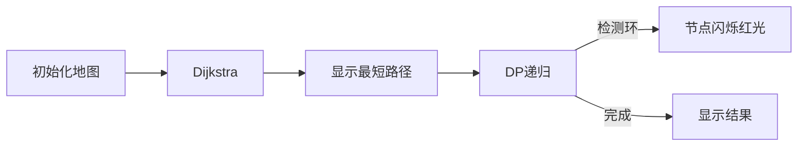

# 题目信息

# [NOIP 2017 提高组] 逛公园

## 题目背景

NOIP2017 D1T3

## 题目描述

策策同学特别喜欢逛公园。公园可以看成一张 $N$ 个点 $M$ 条边构成的有向图，且没有 自环和重边。其中 $1$ 号点是公园的入口，$N$ 号点是公园的出口，每条边有一个非负权值， 代表策策经过这条边所要花的时间。

策策每天都会去逛公园，他总是从 $1$ 号点进去，从 $N$ 号点出来。

策策喜欢新鲜的事物，它不希望有两天逛公园的路线完全一样，同时策策还是一个 特别热爱学习的好孩子，它不希望每天在逛公园这件事上花费太多的时间。如果 $1$ 号点 到 $N$ 号点的最短路长为 $d$，那么策策只会喜欢长度不超过 $d + K$ 的路线。

策策同学想知道总共有多少条满足条件的路线，你能帮帮它吗？

为避免输出过大，答案对 $P$ 取模。

如果有无穷多条合法的路线，请输出 $-1$。


## 说明/提示

【样例解释1】


对于第一组数据，最短路为 $3$。 $1\to 5, 1\to 2\to 4\to 5, 1\to 2\to 3\to 5$ 为 $3$ 条合法路径。


【测试数据与约定】

对于不同的测试点，我们约定各种参数的规模不会超过如下


测试点编号　　|$T$　　　|$N$　　　|$M$　　　|$K$　　　|是否有 $0$ 边
-|-|-|-|-|-
$1$|$5$|$5$|$10$|$0$|否
$2$|$5$|$10^3$|$2\times 10^3$|$0$|否
$3$|$5$|$10^3$|$2\times 10^3$|$50$|否
$4$|$5$|$10^3$|$2\times 10^3$|$50$|否
$5$|$5$|$10^3$|$2\times 10^3$|$50$|否
$6$|$5$|$10^3$|$2\times 10^3$|$50$|是
$7$|$5$|$10^5$|$2\times 10^5$|$0$|否
$8$|$3$|$10^5$|$2\times 10^5$|$50$|否
$9$|$3$|$10^5$|$2\times 10^5$|$50$|是
$10$|$3$|$10^5$|$2\times 10^5$|$50$|是


对于 $100\%$ 的数据，$1 \le P \le 10^9$，$1 \le a_i,b_i \le N$，$0 \le c_i \le 1000$。

数据保证：至少存在一条合法的路线。

---

- 2019.8.30 增加了一组 hack 数据 by @skicean
- 2022.7.21 增加了一组 hack 数据 by @djwj233

## 样例 #1

### 输入

```
2
5 7 2 10
1 2 1
2 4 0
4 5 2
2 3 2
3 4 1
3 5 2
1 5 3
2 2 0 10
1 2 0
2 1 0```

### 输出

```
3
-1

```

# AI分析结果


# 💡 Kay的C++算法解析：逛公园 深入学习指南 💡

## 1. 题目解读与核心算法识别

✨ **本题主要考察**：`动态规划` + `最短路算法`

🗣️ **初步分析**：
> 解决“逛公园”这道题，关键在于结合**最短路算法**和**动态规划**。想象你在公园迷宫中寻找宝藏（点n），Dijkstra算法帮你绘制最短路径地图（dis数组），而动态规划则像一位向导，记录所有允许绕路（不超过最短路径+K）的路线方案（dp数组）。  
- **核心思路**：先用Dijkstra求出1→n的最短路d，再用dp[u][k]表示从1→u且路径长度=dis[u]+k的方案数。通过记忆化搜索实现状态转移，同时检测0权边构成的环（无穷解情况）。  
- **算法流程**：  
  1. 正反图Dijkstra求dis/dis2（用于0环检测）  
  2. 记忆化搜索dp[n][k]（k∈[0,K]）  
  3. 递归中用vis数组检测0环  
- **可视化设计**：采用**8位像素风格**，玩家（像素小人）从起点（绿色）出发：  
  - **Dijkstra阶段**：当前节点高亮黄色，更新邻居时显示距离数字跳动，伴随"滴"声  
  - **DP阶段**：递归路径用蓝色光迹追踪，发现0环时节点闪烁红光并播放警报音  
  - **控制面板**：步进/暂停/速度滑块，支持自动演示模式（AI贪吃蛇式路径探索）

---

## 2. 精选优质题解参考

**题解一（JayJessy）**  
* **点评**：思路清晰直白，用记忆化搜索实现DP是亮点。代码中`flg`全局变量检测0环的写法简洁实用，变量命名规范（dis/dp/vis）。边界处理严谨（nk<0时跳过），递归终止条件明确（u=1且k=0返回1）。实践价值高，稍加修改即可用于竞赛，作者调试心得（flg处理）对学习者很有启发。

**题解二（2014吕泽龙）**  
* **点评**：提供拓扑排序和记忆化搜索双解法，拓宽解题视野。拓扑排序处理0环的推导尤其精彩（通过SCC判断环位置），代码中`rk[]`记录拓扑序体现算法有效性。虽然代码较长，但模块划分清晰（Dij/Topsort/Dp），复杂度分析到位，是理解图论与DP结合的优质参考。

**题解三（CJZJC）**  
* **点评**：分测试点讨论的讲解方式对初学者友好，强调k=0时的最短路计数基础。代码注释详细，dp状态转移前先判断`dis[i]+dis2[i]≤d+K`的0环检测逻辑严谨，变量名`flag`/`vis`可读性强。特别标注的"坑点"（如dij用大根堆错误）极具实践指导意义。

---

## 3. 核心难点辨析与解题策略

1. **难点1：DP状态设计与转移方程**  
   * **分析**：定义dp[u][k]表示"从1到u，路径长度=dis[u]+k"的方案数。转移时需计算：nk'=dis[u]-dis[v]+k-w。难点在于理解nk'的物理意义：从v→u的边w使路径比最短路多出的长度。优质题解均通过数学推导明确此关系。
   * 💡 **学习笔记**：状态定义需满足最优子结构——当前路径的"冗余长度"k完全由前驱状态决定。

2. **难点2：0环检测与无穷解判断**  
   * **分析**：当存在边权全0的环且在合法路径上时（dis[环]+dis2[环]≤dis[n]+K），方案数无限。记忆化搜索中用vis[u][k]标记当前递归路径，若重复访问同一状态则有0环。部分题解（如2014吕泽龙）额外通过Tarjan缩点精确判断环位置。
   * 💡 **学习笔记**：vis数组标记的是递归栈而非全局访问，避免误判DAG分支。

3. **难点3：记忆化搜索的递归方向**  
   * **分析**：从终点n向起点1反向递归（建反图）可自然处理状态依赖。正向递归需按dis排序保证无后效性，但实现更复杂。优质题解中JayJessy的反图递归最简洁。
   * 💡 **学习笔记**：反图递归时，dp[u][k]实际表示u→n的路径，需注意边界设在起点（u=1,k=0）。

### ✨ 解题技巧总结
1. **最短路预处理**：Dijkstra必须用优先队列优化（O(mlogn)），同时求反图dis2用于0环检测  
2. **状态转移剪枝**：计算nk'后立即判断是否∈[0,K]，避免无效递归  
3. **多测清空**：vector/e.clear()优于memset，防止超时  
4. **环检测优化**：全局flag变量+本地vis数组组合，检测到环立即中断递归  

---

## 4. C++核心代码实现赏析

**本题通用核心C++实现参考**  
* **说明**：综合JayJessy和ykzzldz题解优化，记忆化搜索实现，含0环检测。
* **完整核心代码**：
```cpp
#include <bits/stdc++.h>
using namespace std;
typedef long long ll;
typedef pair<ll, ll> PLL;
const ll N = 1e5 + 10;

ll t, n, m, K, p, dis[N], dis2[N], dp[N][51];
bool vis[N][51], has_cycle; // vis: 记忆化搜索标记；has_cycle: 全局环标记
vector<PLL> G[N], revG[N]; // G: 正图, revG: 反图

void dijkstra(int st, ll dist[], vector<PLL> graph[]) {
    priority_queue<PLL, vector<PLL>, greater<PLL>> pq;
    memset(dist, 0x3f, sizeof(dis)); // 注意实际使用需调整
    memset(vis, 0, sizeof(vis));
    pq.push({0, st});
    dist[st] = 0;
    while (!pq.empty()) {
        ll u = pq.top().second;
        pq.pop();
        if (vis[u][0]) continue;
        vis[u][0] = true;
        for (auto [v, w] : graph[u]) {
            if (dist[v] > dist[u] + w) {
                dist[v] = dist[u] + w;
                pq.push({dist[v], v});
            }
        }
    }
}

ll dfs(ll u, ll k) {
    if (k < 0 || k > K) return 0;
    if (vis[u][k]) { // 当前递归栈重复访问
        has_cycle = true;
        return 0;
    }
    if (dp[u][k] != -1) return dp[u][k];

    vis[u][k] = true;
    ll res = 0;
    for (auto [v, w] : revG[u]) { // 反图递归
        ll nk = dis[u] - dis[v] + k - w;
        res = (res + dfs(v, nk)) % p;
        if (has_cycle) break;
    }
    vis[u][k] = false;

    if (u == 1 && k == 0) res = 1; // 边界条件
    return dp[u][k] = res;
}

int main() {
    cin >> t;
    while (t--) {
        cin >> n >> m >> K >> p;
        // 初始化
        for (int i = 1; i <= n; i++) {
            G[i].clear();
            revG[i].clear();
        }
        while (m--) {
            ll u, v, w; cin >> u >> v >> w;
            G[u].push_back({v, w});
            revG[v].push_back({u, w}); // 反图
        }
        dijkstra(1, dis, G);
        dijkstra(n, dis2, revG); // 反图最短路用于0环检测

        memset(dp, -1, sizeof(dp));
        memset(vis, 0, sizeof(vis));
        has_cycle = false;

        ll ans = 0;
        for (int k = 0; k <= K; k++) {
            ans = (ans + dfs(n, k)) % p;
            if (has_cycle) break;
        }
        cout << (has_cycle ? -1 : ans) << endl;
    }
    return 0;
}
```
* **代码解读概要**：  
  1. `dijkstra()`：通用最短路实现，支持正反图  
  2. `dfs(u, k)`：核心记忆化搜索。先判环，再递归反图邻居，边界条件处理起点  
  3. 主函数：正反图初始化 → 双方向最短路 → 对每个k值累加方案  

---

**题解一（JayJessy）片段赏析**  
* **亮点**：用`flg`全局变量传递环信息，避免函数返回值嵌套
* **核心代码**：
```cpp
ll dfs(ll u,ll k) {
    if(vis2[u][k]) { // 已访问标记检测环
        flg = 1;
        return 0;
    }
    if(~dp[u][k]) return dp[u][k]; // 记忆化
    // ...转移逻辑
}
```
* **代码解读**：  
  > `vis2[u][k]`标记当前递归路径中的状态，若二次访问说明存在0环，置位`flg`。`~dp[u][k]`利用补码特性检测-1（未计算），比`dp[u][k]!=-1`更简洁。  
* 💡 **学习笔记**：状态标记需在递归前设置，回溯时清除，类似图遍历的visited数组。

**题解二（2014吕泽龙）片段赏析**  
* **亮点**：拓扑排序解决0环的完整方案
* **核心代码**：
```cpp
bool Topsort() {
    queue<int> q;
    for(int i=1; i<=n; i++) 
        if(!d[i]) q.push(i); // 入度0入队
    while(!q.empty()) {
        int u = q.front(); q.pop();
        for(int i=G.pr[u]; i; i=G.nx[i]) 
            if(!G.w[i] && !--d[G.to[i]]) // 0边处理
                q.push(G.to[i]);
    }
    return 无剩余节点; // 判环
}
```
* **代码解读**：  
  > 单独处理0边构造新图，拓扑排序后未入队节点即构成环。需注意仅当环上点满足`dis[i]+dis2[i]≤dis[n]+K`时才输出-1。  
* 💡 **学习笔记**：拓扑序与dis结合排序，可保证DP无后效性。

---

## 5. 算法可视化：像素动画演示

**动画演示主题**：像素探险家寻宝（复古RPG风格）  

**核心演示内容**：  
1. **Dijkstra阶段**：  
   - 网格地图：节点按坐标排列，起点(1)绿色★，终点(n)红色🏆，普通节点灰色□  
   - 当前节点高亮💛，邻居节点闪烁💧，距离更新时显示数字跃动（配"滴"声）  
   - 完成时显示最短路径（金色路径）  

2. **DP阶段**：  
   - 记忆化搜索过程：从终点n反向展开递归树（蓝色光迹）  
   - 状态卡片：每个节点显示`dp[u][k]=值`，当前状态框高亮  
   - 0环检测：重复访问节点时触发电光特效⚡和警报音  

3. **控制面板**：  
   - 按钮：开始/暂停/单步/重置  
   - 速度滑块：调整自动演示速度  
   - 模式切换：正常模式 vs 自动演示（AI自动寻路）  

**关键帧设计**：  


**音效设计**：  
- 节点访问：8-bit短音"嘟"  
- 状态转移："叮"声  
- 发现0环：警报长鸣  
- 解题成功：胜利旋律🎶  

**实现要点**：  
- Canvas绘制：节点用16x16像素块，状态卡片用浮动文本框  
- 动画时序：`setInterval`控制帧率，递归树用深度优先绘制  
- 交互反馈：点击节点可查看当前dp值  

---

## 6. 拓展练习与相似问题思考

**通用技巧迁移**：  
1. **最短路+DP计数**：适用于带限制的路径计数问题（如：边权限制、访问次数限制）  
2. **0环检测**：可扩展至负环检测（SPFA）、必经点环路等场景  
3. **分层图DP**：当K较大时，可转化为分层图最短路（如P4568 飞行路线）  

**洛谷题目推荐**：  
1. **P1144 最短路计数**  
   🗣️ *推荐理由*：k=0的特例，帮助理解最短路计数基础  
2. **P2865 [USACO06NOV]Roadblocks G**  
   🗣️ *推荐理由*：次短路应用，巩固最短路+DP思想  
3. **P4568 [JLOI2011] 飞行路线**  
   🗣️ *推荐理由*：分层图DP经典题，将K维转化为图层  

---

## 7. 学习心得与经验分享

> **参考经验（JayJessy）**：  
> “我在解决这个问题时，最初在0环检测时卡了很久，后来通过添加`vis2`数组标记递归路径才解决。这让我意识到**状态标记需与递归栈生命周期一致**。”  
>  
> **点评**：  
> 这是记忆化搜索的经典陷阱——仅用`dp[u][k]!=-1`无法区分"已计算"和"计算中"状态。`vis`数组的引入确保了环的实时检测，值得学习者借鉴。  

> **参考经验（CJZJC）**：  
> “调试中发现k<0的边界处理遗漏导致WA，添加`if(nk<0)continue`后通过”  
>  
> **点评**：  
> 边界条件处理是DP的关键步骤，建议编码时先写防御性判断。  

---

本次关于“逛公园”的C++解题分析就到这里。记住，编程能力的提升在于持续学习、勤于思考和勇于实践。下次我们再一起探索新的编程挑战！💪

---
处理用时：207.22秒