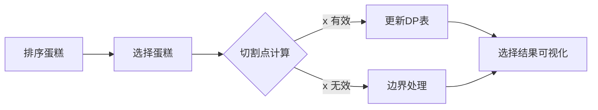

# 题目信息

# [THUPC 2021 初赛] 切切糕

## 题目描述

Kiana 喜欢吃甜点，某天她从商店中买回来 $N$ 块切糕与 Tinytree 共同分享，其中第 $i$ 块切糕的大小用一个数 $A_i$ 来表示。

因为每块切糕的风味都不同，所以 Kiana 和 Tinytree 决定将每块切糕都切成两份，两人各选一份品尝。但切切糕是一个自古以来的大难题，经过商议，Kiana 打算执刀来切切糕，而 Tinytree 有 $M$ 次“优先选糕权”，可以获得一些切糕切开后的优先选择权，具体来说，两人按照如下流程进行操作：

步骤一：Kiana 从还没切的切糕中按自己的想法选一块出来，并将其切成两份，其中**每份切糕的大小可以是任意正实数，也可以是 $\mathbf{0}$，且两份切糕的大小之和与切之前的大小相同**。

步骤二：Tinytree 观察完 Kiana 切出的两份切糕大小后，如果还有“优先选糕权”次数剩余，则可以决定是否消耗 $1$ 次“优先选糕权”来进行优先选择。

步骤三：如果 Tinytree 选择使用“优先选糕权”，则她可以从两份切糕中任选一份，另一份则归 Kiana，如果 Tinytree 选择不使用或者已经用完了 $M$ 次“优先选糕权”，则 Kiana 从两份切糕中任选一份，另一份则归 Tinytree，然后两人回到步骤一，直到所有的切糕都切完。

假设 Kiana 和 Tinytree 都足够聪明，在自己可以操作时总是想办法**让自己最终获得的切糕总大小尽可能大**，且开始切第一块切糕之前 $N$ 块切糕的大小是两人都已知的，“优先选糕权”不要求全部用完。现在 Kiana 想知道，自己能获得的切糕总大小是多少，由于 Kiana 自己不会算，所以希望你能够帮助她。

## 说明/提示

**【样例解释 #1】**

在这个样例中总共有 $4$ 块切糕，大小分别为 $4,3,2,1$，Tinytree 的“优先选糕权”一共有三次，两人可以按照如下顺序和方式来分配切糕：

第一块：Kiana 选择大小为 $3$ 的切糕，将其切成大小为 $1.25$ 和 $1.75$ 的两部分，Tinytree 使用一次“优先选糕权”选走 $1.75$ 的部分，Kiana 目前总共获得大小 $1.25$ 的切糕。

第二块：Kiana 选择大小为 $1$ 的切糕，将其切成大小为 $0$ 和 $1$ 的两部分，Tinytree 不使用“优先选糕权”，Kiana 独得此糕，目前总共获得大小 $2.25$ 的切糕。

第三块：Kiana 选择大小为 $2$ 的切糕，将其切成大小为 $1$ 和 $1$ 的两部分，Tinytree 使用一次“优先选糕权”选走 $1$ 的部分，Kiana 目前总共获得大小 $3.25$ 的切糕。

第四块：Kiana 选择大小为 $4$ 的切糕，将其切成大小为 $2$ 和 $2$ 的两部分，Tinytree 使用一次“优先选糕权”选走 $2$ 的部分，Kiana 目前总共获得大小 $5.25$ 的切糕。

综上所述，该样例输出 $5.250000$，且可以证明在这个方案中如果任意一人改变自己的策略，其获得的切糕总大小不可能变得更大。

**【题目来源】**

来自 2021 清华大学学生程序设计竞赛暨高校邀请赛（THUPC2021）初赛。

题解等资源可在 <https://github.com/THUSAAC/THUPC2021-pre> 查看。

## 样例 #1

### 输入

```
4 3
4 3 2 1
```

### 输出

```
5.250000
```

# AI分析结果


# 💡 Kay的C++算法解析：切切糕 深入学习指南 💡

## 1. 题目解读与核心算法识别

✨ **本题主要考察**：`动态规划（DP）`与`博弈论策略`

🗣️ **初步分析**：
> 这道题就像两个棋手在下棋，Kiana负责切蛋糕，Tinytree负责选择蛋糕。动态规划在这里就像我们的"战略地图"，记录每种情况下Tinytree能获得的最大收益。  
> - **核心思路**：将蛋糕降序排序后，用DP状态`dp[i][j]`表示前i块蛋糕使用j次优先权时Tinytree的最大收益
> - **关键难点**：确定蛋糕切割点使Tinytree的收益最小化，同时处理边界条件
> - **可视化设计**：像素动画将展示蛋糕切割过程，用颜色区分选择结果，动态更新DP表格，配合8-bit音效增强理解

---

## 2. 精选优质题解参考

### 题解一（来源：vectorwyx）
* **点评**：思路最严谨的解法，采用倒序DP并详细处理切割点边界。代码中`lim`变量的计算和边界判断展现了扎实的博弈论分析能力，变量命名清晰（`f[i][j]`表示剩余蛋糕和优先权），实践价值高，可直接用于竞赛。

### 题解二（来源：decoqwq）
* **点评**：最简洁优雅的解法，通过降序排序避免边界判断。状态转移`(dp[i-1][j-1]+dp[i-1][j]+a[i])/2`的推导体现了对博弈平衡点的深刻理解，代码仅20行但完整解决问题，适合初学者学习DP本质。

### 题解三（来源：hzoi_Shadow）
* **点评**：将问题关联到经典博弈模型CF1628D1，通过`f[i][j]=max(..., sum[i]/2)`处理了j=i的边界情况。前缀和数组的引入优化了计算，完整注释和公式推导增加了可读性，有很好的教学价值。

---

## 3. 核心难点辨析与解题策略

1. **蛋糕排序策略**
   * **分析**：降序排序（大蛋糕优先）是关键预处理！这限制了Tinytree的选择——使用优先权可能失去后面更大的蛋糕。优质题解都通过`sort(a+1,a+n+1,greater<int>())`实现
   * 💡 **学习笔记**：排序是博弈问题的常见预处理，能简化决策分析

2. **状态转移设计**
   * **分析**：定义`dp[i][j]`为前i块蛋糕用j次优先权时Tinytree的最大收益。转移需计算切割点x使`max(x+dp[i-1][j], (a[i]-x)+dp[i-1][j-1])`最小化，解为`x=(a[i]+dp[i-1][j-1]-dp[i-1][j])/2`
   * 💡 **学习笔记**：DP转移方程实质是博弈双方的均衡点计算

3. **边界条件处理**
   * **分析**：当j=0时（无优先权）`dp[i][0]=0`；当j=i时（全优先权）`dp[i][i]=sum/2`。需判断x是否在[0,a[i]/2]内，否则调整切割策略
   * 💡 **学习笔记**：边界处理是DP正确性的保证

### ✨ 解题技巧总结
- **技巧1：降序预处理** - 大蛋糕优先处理可简化决策分析
- **技巧2：均衡点计算** - 令双方收益相等找到最优切割点
- **技巧3：前缀和优化** - 预处理求和提升代码效率
- **技巧4：状态压缩** - 注意dp数组维度优化（N=2500）

---

## 4. C++核心代码实现赏析

**本题通用核心C++实现参考**
* **说明**：综合优质题解思路，采用降序排序+均衡点转移的清晰实现
* **完整核心代码**：
```cpp
#include <iostream>
#include <algorithm>
using namespace std;

const int N = 2510;
double dp[N][N];
int a[N], sum[N], n, m;

int main() {
    cin >> n >> m;
    for (int i = 1; i <= n; i++) cin >> a[i];
    sort(a+1, a+n+1, greater<int>());
    
    for (int i = 1; i <= n; i++) 
        sum[i] = sum[i-1] + a[i];
    
    for (int i = 1; i <= n; i++) {
        for (int j = 1; j <= min(i, m); j++) {
            if (j == i) dp[i][j] = sum[i] / 2.0;
            else {
                double val = (dp[i-1][j-1] + dp[i-1][j] + a[i]) / 2.0;
                dp[i][j] = max(dp[i-1][j], val);
            }
        }
    }
    printf("%.6f\n", sum[n] - dp[n][m]);
}
```
* **代码解读概要**：
  1. 降序排序蛋糕
  2. 计算前缀和数组
  3. DP核心循环：处理j=0和j=i边界
  4. 均衡点转移方程计算Tinytree收益
  5. 总蛋糕减去Tinytree收益得Kiana收益

---

**题解一（vectorwyx）**
* **亮点**：严谨的边界处理与倒序DP实现
* **核心代码片段**：
```cpp
for(int i=n; i>=1; i--){
    for(int j=m; j>=0; j--){
        if(j==0) dp[i][j] = dp[i+1][j];
        else {
            double lim = (dp[i+1][j-1]-dp[i+1][j]+a[i])/2;
            if(lim > a[i]/2) dp[i][j] = dp[i+1][j-1] + a[i]/2;
            else if(lim < 0) dp[i][j] = dp[i+1][j];
            else dp[i][j] = min(dp[i+1][j-1]+a[i]-lim, dp[i+1][j]+lim);
        }
    }
}
```
* **代码解读**：
  > 1. **倒序处理**：`i`从n递减，符合"后蛋糕先决策"逻辑
  > 2. **lim计算**：切割点`lim=(dp[i+1][j-1]-dp[i+1][j]+a[i])/2`是博弈均衡点
  > 3. **边界处理**：当`lim`超出[0,a[i]/2]时调整策略
  > 4. **min取优**：Tinytree会选择对自己有利的方案
* 💡 **学习笔记**：倒序DP适合"剩余决策"类问题，边界判断提升鲁棒性

**题解二（decoqwq）**
* **亮点**：最简实现中的数学之美
* **核心代码片段**：
```cpp
for(int i=1;i<=n;i++){
    sum += a[i];
    for(int j=1;j<=min(i,m);j++){
        if(j==i) dp[i][j] = sum/2.0;
        else dp[i][j] = max(dp[i-1][j], 
               (dp[i-1][j-1]+dp[i-1][j]+a[i])/2);
    }
}
```
* **代码解读**：
  > 1. **实时求和**：`sum`随循环更新，避免前缀和数组
  > 2. **均衡点转移**：`(dp[i-1][j-1]+dp[i-1][j]+a[i])/2`是博弈均衡解
  > 3. **隐式边界**：降序排序确保`lim`始终有效
* 💡 **学习笔记**：数学推导可简化代码，但需排序预处理保证正确

**题解三（hzoi_Shadow）**
* **亮点**：经典问题迁移与完整边界处理
* **核心代码片段**：
```cpp
for(i=1;i<=n;i++){
    for(j=1;j<=min(i,m);j++){
        if(j==i) f[i][j]=1.0*sum[i]/2;
        else f[i][j]=max(f[i-1][j],
             (f[i-1][j-1]+f[i-1][j]+a[i])/2);
    }
}
```
* **代码解读**：
  > 1. **前缀和优化**：`sum[i]`提升求和效率
  > 2. **j=i处理**：显式处理Tinytree使用全优先权的情况
  > 3. **max选择**：Tinytree会在使用/不使用优先权间选最优
* 💡 **学习笔记**：迁移经典问题模型（如Game on Sum）可快速解题

---

## 5. 算法可视化：像素动画演示

**主题**：切糕大作战（8-bit风格策略模拟）  
**核心演示**：降序蛋糕队列的切割决策与DP表更新过程  



1. **场景设计**：
   - 左侧：垂直排列的蛋糕条（高度=大小），降序排列
   - 右侧：动态DP表格（i行j列显示dp[i][j]值）
   - 底部：控制面板（开始/暂停/单步/速度条）

2. **动画流程**：
   - 初始化：蛋糕降序排列（大→小），DP表清零
   - 切割动画：当前蛋糕分裂为两部分（比例=切割点x）
   - 选择特效：
     * Tinytree使用优先权 → 拿走较大块（红色闪光+"叮"声）
     * 未使用优先权 → Kiana拿走较大块（蓝色闪光）
   - DP更新：当前状态格子闪烁并更新数值

3. **游戏化元素**：
   - 每块蛋糕处理为1小关
   - 正确处理边界时获得★奖励
   - 背景音乐：8-bit轻快旋律
   - 音效设计：
     * 切割："咔嚓"声
     * 选择："叮"声
     * 过关：上升音阶

4. **交互控制**：
   - 单步执行：观察每步决策
   - 速度调节：0.5x~5x速度
   - AI演示：自动完成策略展示

---

## 6. 拓展练习与相似问题思考

1. **通用技巧迁移**：
   - 分蛋糕问题：均涉及资源分配与博弈
   - 有约束的DP：状态设计需考虑额外维度（如优先权次数）
   - 排序预处理：常见于贪心与DP结合问题

2. **推荐练习（洛谷）**：
   1. **P1280 尼克的任务**  
      → 练习排序预处理与DP状态设计
   2. **P1880 石子合并**  
      → 强化区间DP与决策分析能力
   3. **P2858 奶牛零食**  
      → 学习DP中的时序决策与状态转移

---

## 7. 学习心得与经验分享

> **参考经验（来自decoqwq）**：  
> "排序是核心！先处理大蛋糕会让对手更纠结——用优先权怕错过后面更大的，不用又可惜"

> **Kay的总结**：  
> 1. 降序排序是此类博弈问题的关键预处理
> 2. DP状态转移本质是寻找博弈均衡点
> 3. 边界条件处理能力决定代码鲁棒性
> 4. 多测试边界数据（如m=0或m=n的情况）

---

通过本次分析，我们深入理解了动态规划在博弈问题中的应用精髓。记住，优秀的算法设计=严谨的数学推导+巧妙的预处理+完备的边界处理！下次挑战再见！💪

---
处理用时：330.92秒