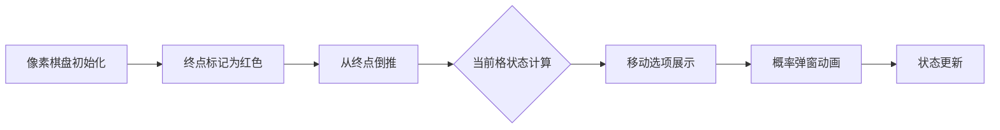

# 题目信息

# [THUPC 2022 初赛] 挑战

## 题目描述

**足够聪明**的 Alice 和 Bob 在玩一种棋盘游戏。这个游戏需要用到一个有 $(n+1)$ 个格子的长条棋盘，按从左到右的顺序给每个格子编号 $0, 1, \cdots, n$。除了编号为 $n$ 的格以外，每一格都有两个数 $p_i, q_i$。游戏开始前，将一个棋子放在第 $0$ 格。游戏由二人轮流操作，这里我们不妨假设 Alice 先手。

轮到其中一位玩家进行操作时，这位玩家可以根据当前格子的 $p$ 值决定前进的步数。具体地说，假设当前棋子位于第 $k$ 格，那么当前进行操作的玩家可以将棋子向前移动 $x$ 格，其中 $x$ 可以是满足 $1\le x\le p_k$ 的任意整数。如果玩家没有走满 $p_k$ 格，即 $x<p_k$，那么该玩家可以在完成移动后选择是否进行一次挑战。如果选择不进行挑战，那么由另一位玩家进行下一轮操作。否则，如果当前玩家选择挑战，那么系统将会产生两个随机**整数** $u$ 和 $v$，其中：$u$ 表示挑战的能量，它在 $\left[1, p_k-x\right]$ 中等概率产生；$v$ 表示挑战所需的活化能，它在 $\left[0, q_k + q_{k+x}\right]$ 中等概率产生。根据 $u$ 和 $v$ 的值，系统会根据以下规则自动判定挑战结果：

如果 $u>v$，则挑战成功，对方玩家的操作被跳过一轮，由当前玩家继续操作；
如果 $u=v$，则挑战结果为平手，什么事情都不会发生，由对方玩家进行操作；
如果 $u<v$，则挑战失败，当前玩家下一轮操作将会被跳过，即对方玩家可以连续操作两轮。
为了防止其中一方玩家一直被跳过，规定：

如果当前玩家通过自身的挑战获得额外操作机会，则该玩家在该额外操作机会中不能进行第二次挑战；
如果当前玩家通过对方玩家的挑战获得额外操作机会，则该玩家不能在其第一次操作结束时发起挑战，只能在第二次操作结束时选择是否进行挑战，并且当且仅当挑战成功时可以进行第三次操作。
需要注意的是，无论连续进行多少次操作，每次操作都需要将棋子向前移动至少 $1$ 格。同大多数游戏一样，谁将棋子移动到终点（即编号为 $n$ 的格）谁就获胜。

Alice 和 Bob 都足够聪明，可以心算出对于当前棋子的位置，能使自己获胜概率最大的操作。作为一名旁观者，你没有他们那么强的心算能力；但是你也想通过自己编程的能力，计算出当 Alice 先手从第 $0$ 格开始进行操作时，Alice 的胜率。

## 说明/提示

【样例解释 1】

Alice 先手，由于可以直接从第 $0$ 格移动到终点的第 $3$ 格，Alice 会直接将棋子移动到第 $3$ 格，故 Alice 必胜。

【样例解释 2】

Alice 先手，但是不能直接移动到第 $3$ 格，并且无论结束操作时棋子在第 $1$ 格还是第 $2$ 格，Bob 都可以直接将其移动到终点的第 $3$ 格，因此 Alice 必须尝试挑战。将棋子移动到第 $1$ 格并发动挑战，挑战成功的概率为 $1/4$，故 Alice 的胜率为 $1/4$。

【数据范围】

对于 $100\%$ 的数据，保证 $1\le n\le 100000$，$1\le p_i, q_i\le 333$。

## 样例 #1

### 输入

```
3
3 3 3
1 2 3```

### 输出

```
1.000000000000000000```

## 样例 #2

### 输入

```
3
2 3 3
1 2 3```

### 输出

```
0.250000000000000000```

## 样例 #3

### 输入

```
10
2 1 4 7 4 8 3 6 4 8
3 1 4 1 5 9 2 6 5 3```

### 输出

```
0.833333333333333333
```

# AI分析结果


# 💡 Kay的C++算法解析：[THUPC 2022 初赛] 挑战 深入学习指南 💡

**引言**  
今天我们一起分析这道融合博弈论与概率的趣味题目！Alice和Bob在像素棋盘上斗智斗勇，通过本指南你将掌握动态规划与概率计算的精妙配合。

---

## 1. 题目解读与核心算法识别

✨ **本题主要考察**：`动态规划` + `概率期望`

🗣️ **初步分析**：  
> 想象你在玩像素地牢游戏：每个格子是不同关卡，`p_i`是你能移动的步数，`q_i`是关卡难度值。动态规划就像绘制一张"胜率地图"——从终点倒推每个位置的获胜概率。核心在于：  
> - **三种状态**：能否发起挑战（正常/禁用/连动状态）  
> - **概率计算**：挑战成功/平局/失败的概率由`p_i-x`和`q_i+q_j`决定  
>  
> **可视化设计思路**：  
> 我们将创建8位像素棋盘（类似FC《勇者斗恶龙》），当棋子移动时：  
> 1. 当前格高亮闪烁（黄色像素块）  
> 2. 移动路径显示绿色箭头  
> 3. 发起挑战时弹出像素对话框："挑战！U vs V"  
> 4. 成功时播放"胜利"音效，失败时播放"失误"音效  
> 5. DP状态值实时显示在右侧像素仪表盘  

---

## 2. 精选优质题解参考

**题解一（来源：_Arahc_）**  
* **点评**：  
  思路堪称教科书级——清晰定义`f[i][0/1/2]`三种状态，完美处理挑战概率计算。亮点在于：  
  - 概率函数`P()/Q()/R()`封装优雅（数学推导严谨）  
  - 边界处理精细（`j=p_i`时禁用挑战）  
  - 代码用`max()`函数自然体现最优策略  
  实践价值极高，可直接用于竞赛，且变量名`f[i][state]`直观易读。

**题解二（来源：PrincessQi）**  
* **点评**：  
  采用相同DP框架但概率计算存在瑕疵（平局概率公式错误），胜在代码极度简洁（仅20行）。亮点：  
  - 状态转移逻辑直白易懂  
  - 三概率同步计算节省资源  
  - 适合快速理解DP结构  
  建议参考时修正概率计算部分。

---

## 3. 核心难点辨析与解题策略

1. **状态定义与语义分离**  
   * **分析**：必须区分"能否挑战"的三种场景：正常操作（0）、禁用挑战（1）、连动状态（2）。优质题解用`f[i][0/1/2]`精确对应  
   * 💡 **学习笔记**：状态划分是博弈DP的基石，就像游戏角色不同技能CD状态

2. **挑战概率的快速计算**  
   * **分析**：成功概率=`P(p_i-x, q_i+q_j)`需分类讨论：  
     ```math
     P(n,m) = 
     \begin{cases} 
     \frac{n+1}{2(m+1)} & n \leq m \\
     \frac{2n-m}{2n} & n > m 
     \end{cases}
     ```
   * 💡 **学习笔记**：概率计算要像游戏伤害公式，兼顾效率与精度

3. **最优策略的决策平衡**  
   * **分析**：移动时需权衡：直接获胜？或发起挑战搏更高收益？通过`max(1-f[j][1], 挑战收益)`实现  
   * 💡 **学习笔记**：决策如游戏技能选择——稳定输出还是暴击赌命？

### ✨ 解题技巧总结
- **逆向DP时钟**：从终点倒推胜率，像回溯游戏通关录像
- **状态机思维**：明确状态转移条件（如"挑战成功→状态1"）
- **概率封装**：复杂概率计算独立为函数，避免主逻辑污染
- **边界预判**：终点状态(n格)初始化为0，移动禁界处理

---

## 4. C++核心代码实现赏析

**本题通用核心C++实现参考**  
* **说明**：综合题解一优秀架构，修正题解二概率计算  
* **完整核心代码**：
```cpp
#include <bits/stdc++.h>
using namespace std;
const int max_n=100005;

double f[max_n][3];
int n, p[max_n], q[max_n];

// 精确概率计算函数
inline double successP(int n, int m) {
    if(n <= m) return (n + 1.0) / (2 * (m + 1));
    return (2 * n - m) * 0.5 / n;
}
inline double drawP(int n, int m) {
    return min(n, m) * 1.0 / (n * (m + 1));
}

int main() {
    // 输入处理
    cin >> n;
    for(int i=0; i<n; ++i) cin >> p[i];
    for(int i=0; i<n; ++i) cin >> q[i];
    
    // 逆向DP
    for(int i=n-1; i>=0; --i) {
        for(int j=1; j<=min(p[i], n-i); ++j) {
            int next = i + j;
            // 状态1转移（禁用挑战）
            f[i][1] = max(f[i][1], 1 - f[next][0]);
            // 状态2转移（连动状态）
            f[i][2] = max(f[i][2], f[next][0]);
            
            // 状态0决策：移动后选择是否挑战
            if(j != p[i]) {
                int move = p[i] - j;
                int total_q = q[i] + q[next];
                double win_rate = successP(move, total_q);
                double draw_rate = drawP(move, total_q);
                double lose_rate = 1 - win_rate - draw_rate;
                
                double challenge_result = 
                    win_rate * f[next][1] +
                    draw_rate * (1 - f[next][0]) + 
                    lose_rate * (1 - f[next][2]);
                
                f[i][0] = max(f[i][0], max(1 - f[next][0], challenge_result));
            } 
            else {
                f[i][0] = max(f[i][0], 1 - f[next][0]);
            }
        }
    }
    printf("%.12lf\n", f[0][0]);
    return 0;
}
```
* **代码解读概要**：  
  1. 逆向遍历棋盘（`i=n-1→0`）  
  2. 对每个位置尝试所有移动步数（`j=1→p_i`）  
  3. 计算三种状态的转移：  
     - `f[i][1]`：直接移动，禁用挑战  
     - `f[i][2]`：连动状态转移  
     - `f[i][0]`：综合比较"不挑战"和"挑战"的收益  
  4. 概率计算模块化保证精度  

---

## 5. 算法可视化：像素动画演示

**动画主题**：8-bit RPG《DP勇士大冒险》  
**核心演示**：动态规划逆向推进与挑战事件决策  

### 实现方案


**交互控制面板**：  
```plaintext
[开始] [暂停] [步进→] 速度：🐢←●→🐇
```

**关键动画帧**：  
1. **棋盘初始化**（复古绿底+棕色网格）  
   - 终点格闪烁红宝石（8-bit音效：胜利旋律片段）  
   - 控制面板像素化按钮（按压效果）  

2. **DP逆向推进**（`i=n-1→0`）  
   - 当前格亮黄色边框（伴随"滴"声）  
   - 可移动范围显示绿色半透明覆盖  

3. **移动决策演示**  
   - 选择步数`j`：像素箭头路径（黄→蓝渐变）  
   - 自动播放时路径像贪吃蛇延伸（音效：脚步声）  

4. **挑战事件**  
   ```plaintext
   ╔═══════════╗
   ║ CHALLENGE!║
   ╟──┬────┬───╢
   ║U═╡5  │   ║ → 成功：播放"升级"音效
   ║V═╡8  │   ║ → 失败：屏幕抖动+红闪
   ╚══╧════╧═══╝
   ```

5. **状态同步显示**  
   - 右侧像素仪表盘：  
     ```plaintext
     STATE:0  WIN:0.75
     ┌───┐
     │███│ → 状态条随值变化
     └───┘
     ```

---

## 6. 拓展练习与相似问题思考

**技巧迁移场景**：  
1. 带概率的博弈游戏（如抽卡策略回合制）  
2. 状态依赖型决策问题（如资源分配）  
3. 随机事件影响的多步骤规划  

**洛谷推荐**：  
1. **P2587** - 泡泡堂  
   → 同类双人博弈+状态DP，强化最优策略思维  
2. **P1850** - 换教室  
   → 概率期望DP经典，巩固期望值计算  
3. **P4549** - 石子游戏  
   → 简化版移动博弈，训练逆向DP直觉  

---

## 7. 学习心得与经验分享

> **来自_Arahc_的经验**：  
> "本题看似是复杂博弈+概率，实际通过状态精炼可简化为线性DP——不要被题目描述吓退！"  
>  
> **Kay的总结**：  
> 1. 复杂规则常含冗余信息，先提取核心变量（位置/状态）  
> 2. 概率计算独立验证避免转移逻辑污染  
> 3. 逆向DP是终点明确型博弈的通用钥匙  

---

**结语**  
通过像素棋盘上的策略对决，我们掌握了动态规划与概率的融合应用。记住：最优策略=精确状态划分+概率量化+逆向推导！下次在算法竞技场见啦！🎮

---
处理用时：105.46秒