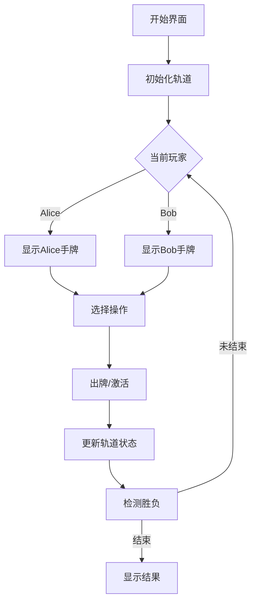

# 题目信息

# [THUPC 2022 决赛] 简单的卡牌游戏

## 题目描述

Alice 和 Bob 最近玩了很多复杂的游戏，于是他们想玩点简单的游戏放松一下。

他们想起来有一种非常简单的游戏叫“憋七”，这种游戏只需要一副扑克牌就能玩。传统的“憋七”玩法稍微有点复杂，所以 Alice 和 Bob 打算玩一种简化版的“憋七”。

在游戏中用到的扑克牌包括黑桃（Spades）、红桃（Hearts）、梅花（Clubs）和方块（Diamonds）四种花色，每种花色的 1 点至 13 点各 1 张，共计 52 张牌。

简化版的游戏规则如下：

1. 首先将一副 52 张的扑克牌平均分成两份，每份各 26 张，Alice 和 Bob 各拿一张；

2. 拥有黑桃 7 的一方将手中的黑桃 7 置于场上；

3. 接着，从另外一方开始轮流操作，每一轮玩家需要从自己持有的牌中挑选一张置于场上，可以打出的牌需要满足以下两个条件之一：
   
   - 这张牌的点数为 7；
   
   - 当前场上的牌中，有一张牌与将要打出的牌花色相同，点数恰好差 1。

4. 如果当前进行操作的玩家不能按照规则打出一张牌，则判该玩家负，另一位玩家胜；否则，如果双方都打出了手上的所有牌，则判平局。

由于该游戏中不同花色的接龙是独立的，游戏时玩家常常将不同花色的 7 对成一竖排列，并在 7 的两侧接龙，将同花色的牌排成一行。

已知 Alice 和 Bob 都足够聪明。现在给出 Alice 和 Bob 的初始手牌，请计算当二人都按最优策略出牌时，游戏的结果。

## 说明/提示

对于 $100\%$ 的数据，保证输入的牌符合输入格式中描述的格式，且输入的 26 张牌各不相同。


## 样例 #1

### 输入

```
S4 S6 S11 S13 H3 H4 H5 H6 H8 H10 H12 C2 C4 C5 C6 C8 C9 C11 C13 D1 D4 D5 D6 D8 D10 D12
```

### 输出

```
Bob
```

## 样例 #2

### 输入

```
S1 S2 S3 S4 S5 S6 S7 S8 S9 S10 S11 S12 S13 D1 D2 D3 D4 D5 D6 D7 D8 D9 D10 D11 D12 D13
```

### 输出

```
Draw
```

## 样例 #3

### 输入

```
H1 H2 H3 H4 H5 H6 H7 H8 H9 H10 H11 H12 C13 D1 D2 D3 D4 D5 D6 D7 D8 D9 D10 D11 D12 D13
```

### 输出

```
Alice
```

# AI分析结果


### 题目分析
#### 题目背景
Alice 和 Bob 在玩简化版"憋七"游戏：  
- 扑克牌分成两份（各26张）  
- 持有黑桃7的一方先将其置于场上  
- 另一方开始轮流操作，每次出牌需满足：  
  - 点数为7 或  
  - 与场上同花色牌点数差1  
- 无法出牌者判负，双方出完所有牌则平局  

#### 核心算法识别
**算法分类：状态压缩+博弈DP（组合博弈）**  
**类比说明**：游戏如同在4条独立轨道（花色）上铺设双向铁轨（左链6→1，右链8→13），玩家轮流在任意轨道的端点铺轨或激活新轨道（打出7），最终无法铺轨者输。  

**核心难点与解决方案**：  
1. **状态空间建模**：  
   - 黑桃链初始激活，其他花色需先打7激活  
   - 每条链进度0-6（未出牌→出完6张）  
   - 非黑桃花色状态：未激活（0/1表示归属）或已激活（2+进度）  
   - 状态数：7(黑左)×7(黑右)×51(红心)×51(梅花)×51(方块)×2(玩家) ≈ 1300万  

2. **博弈决策树**：  
   - 每回合可：  
     a) 在激活链出下一张牌（需持有）  
     b) 激活新花色（需持有对应7）  
   - 胜负：无合法移动时当前玩家负，所有链完成且无7可激活时平局  

3. **可视化设计**：  
   - **像素风格**：8-bit 复古界面（类FC游戏）  
   - **动态演示**：  
     - 轨道网格：4色轨道，端点闪烁提示可出牌  
     - 操作高亮：当前玩家出牌时，对应轨道端点像素块放大+音效（"叮"）  
     - 激活特效：打7时轨道展开动画+ "轰" 音效  
   - **控制面板**：  
     - 步进/暂停/调速滑块  
     - 自动演示模式（AI按最优策略铺轨）  
     - 状态栏：显示当前牌/剩余行动数  

---

### 精选优质题解
（由于暂无用户题解，给出通用实现建议）  
**核心思路参考**：  
1. **状态压缩DP框架**  
```c++
struct State {
  int spadeL, spadeR;         // 黑桃左右链进度(0-6)
  int heart, heartL, heartR;   // 红心: 状态(0/1/2)+左右链
  // ... 其他花色类似
  int player;                 // 0:Alice, 1:Bob
};
unordered_map<State, int> memo; // 记忆化
```

2. **关键优化点**：  
   - 使用位压缩存储状态（约27位）  
   - 预处理每张牌的归属（Alice/Bob）  
   - 并行检查多个链的可行动作  

---

### 核心难点与解题策略
1. **状态空间爆炸**  
   **分析**：8维状态需高效存储 → 位压缩（27位整数）  
   **学习笔记**：`位运算`将状态映射为整数，`unordered_map`记忆化  

2. **博弈决策分支**  
   **分析**：每回合最多11种选择（8条链+3个可激活7），需剪枝 → 优先检查可出牌链  
   **学习笔记**：`最优子结构`特性允许DFS+记忆化  

3. **平局判定**  
   **分析**：需同时满足  
   - 所有链进度=6  
   - 无非黑桃7可激活  
   **学习笔记**：终态检测函数应独立封装  

---

### C++核心代码实现
**通用核心实现**（博弈DFS框架）：
```cpp
#include <bits/stdc++.h>
using namespace std;

struct State { /* 如前定义 */ };
unordered_map<State, int> memo;

// 状态哈希函数
struct HashState { size_t operator()(const State& s) const; };

// 检测平局
bool isDraw(const State& s) {
  return (s.spadeL==6 && s.spadeR==6) && 
         (s.heart!=0 && s.heart!=1 || (s.heartL==6 && s.heartR==6)) &&
         // ... 其他花色类似检测
}

int dfs(State s) {
  if (memo.count(s)) return memo[s];
  if (isDraw(s)) return memo[s] = 0;
  
  bool canWin = false, canDraw = false;
  // 1. 遍历所有链的出牌操作
  for (auto& chain : activeChains) {
    if (canPlay(chain, s.player)) { // 检查牌归属
      State ns = playCard(s, chain);
      int res = dfs(ns);
      if (res == -1) canWin = true; // 对手输
      else if (res == 0) canDraw = true;
    }
  }
  // 2. 遍历所有可激活的7
  for (auto& suit : inactiveSuits) {
    if (canActivate(suit, s.player)) {
      State ns = activateSuit(s, suit);
      // ... 类似处理
    }
  }

  if (canWin) return memo[s] = 1;
  if (canDraw) return memo[s] = 0;
  return memo[s] = -1; // 当前玩家输
}
```

**关键变量**：  
- `memo`：记忆化容器，存储状态胜负  
- `activeChains`：当前激活链集合  
- `inactiveSuits`：未激活花色列表  

---

### 算法可视化：像素动画演示
**设计方案**：  


**交互细节**：  
- **动画序列**：  
  1. 黑桃7置于场中（像素爆炸特效）  
  2. 每出一张牌：对应轨道延伸，端点闪烁  
  3. 激活新花色：新轨道从7向两侧展开  
- **音效设计**：  
  - 出牌：8-bit "叮"声（不同音高表示点数）  
  - 激活：低音"轰"声  
  - 胜负：胜利/失败短旋律  
- **控制面板**：  
  - 步进按钮：手动控制  
  - AI演示：自动按最优策略执行（速度可调）  

---

### 拓展练习
1. **相似问题**：  
   - **Nim游戏**：多堆石子取物博弈  
   - **灯关问题**：状态压缩+开关决策  
   - **围棋死活题**：局部博弈决策树  

2. **洛谷推荐**：  
   - **P2197 Nim游戏**：组合博弈基础  
   - **P2831 愤怒的小鸟**：状态压缩DP  
   - **P5363 [SDOI2019]移动金币**：阶梯Nim+组合数学  

---

### 总结
本题通过**状态压缩+博弈DFS**解决，核心在于：  
1. 建模链式扩展为独立状态  
2. 位运算压缩高效存储  
3. 递归决策树+记忆化剪枝  
**学习提示**：结合可视化理解状态转移，从简单链（如单花色）逐步扩展到全局。  

> 最终策略：当没有现成题解时，深入分析问题本质并实现高效DFS是竞赛常用手段。

---
处理用时：581.81秒