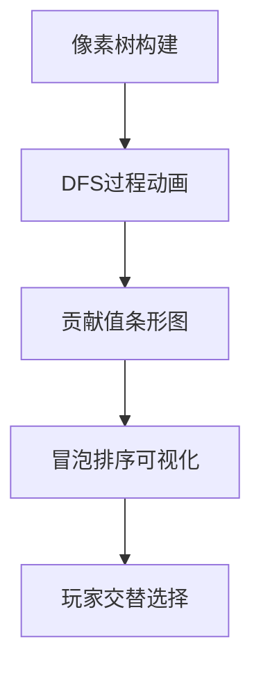

# 题目信息

# [THUPC 2023 初赛] 大富翁

## 题目背景

有一天，小 W 和小 H 在玩大富翁。

## 题目描述

这版大富翁的游戏规则比较独特。它的地图是一棵 $n$ 个节点的有根树，其中 $1$ 号节点为根。树上每个节点都有一个价格，第 $x$ 号节点的价格记为 $w_x$。

对于树上两个不同的节点 $x,y$，若 $x$ 是 $y$ 的祖先节点（即，$x$ 在 $1$ 号点到 $y$ 号点的简单路径上），则称 $x$ **支配** $y$。

游戏过程中，小 W 和小 H 轮流**购买**树上的一个未被人购买过的节点，直到树上的 $n$ 个节点都被小 W 或小 H 购买。（游戏开始前，树上的所有节点都没有被购买。）

对于一次购买，假设买方购买了 $x$ 号节点，那么他首先要向系统支付 $w_x$ 个游戏币。假设此时 $x$ 支配着 $n_1$ 个已被买方的对手购买了的节点，同时又被 $n_2$ 个已被对手购买了的节点支配。若 $n_1>n_2$，那么对手要向买方支付 $n_1-n_2$ 个游戏币，若 $n_1<n_2$，那么买方要向对手支付 $n_2-n_1$ 个游戏币。

小 W 和小 H 都是绝顶聪明的人，他们都会在游戏中采用最优策略，来使自己赚到尽量多的游戏币。现在，小 W 想考考你：如果他先手，他最终能赚到多少个游戏币？（即，在整个游戏过程中，小 W 从小 H 手中获得的游戏币个数减去他支付给系统和小 H 的游戏币个数。你可以认为，游戏开始前，小 H 和小 W 手中都有足够数量的游戏币。注意：答案可能为负数。）

## 说明/提示

#### 样例解释 1

一个可能的游戏过程是：

- 第一次购买：小 W 购买 $1$ 号节点，向系统支付 $0$ 个游戏币。
- 第二次购买：小 H 购买 $2$ 号节点，向系统支付 $0$ 个游戏币，并向小 W 支付 $1$ 个游戏币。
- 第三次购买：小 W 购买 $3$ 号节点，向系统支付 $1$ 个游戏币。
- 第四次购买：小 H 购买 $4$ 号节点，向系统支付 $0$ 个游戏币，并向小 W 支付 $1$ 个游戏币。
- 第五次购买：小 W 购买 $6$ 号节点，向系统支付 $0$ 个游戏币。
- 第六次购买：小 H 购买 $5$ 号节点，向系统支付 $0$ 个游戏币，并向小 W 支付 $1$ 个游戏币。
- 第七次购买：小 W 购买 $7$ 号节点，向系统支付 $0$ 个游戏币。

#### 子任务

对于所有测试数据，$1\leq n\leq 2\times 10^5$，$0\leq w_x\leq 2\times 10^5$。保证输入的图为一棵以 $1$ 号节点为根的有根树。

#### 题目来源

来自 2023 清华大学学生程序设计竞赛暨高校邀请赛（THUPC2023）初赛。

题解等资源可在 <https://github.com/THUSAAC/THUPC2023-Pre> 查看。

## 样例 #1

### 输入

```
7
0 0 1 0 0 0 0
1 1 2 2 3 3
```

### 输出

```
2```

## 样例 #2

### 输入

```
见附件中的 2.in```

### 输出

```
见附件中的 2.ans```

# AI分析结果


### 💡 Kay的C++算法解析：[THUPC 2023 初赛] 大富翁 深入学习指南 💡

---

#### **1. 题目解读与核心算法识别**  
✨ **本题主要考察**：`数学推导与贪心策略`  

🗣️ **初步分析**：  
> 解决本题的关键在于将复杂的博弈规则转化为**独立点贡献模型**。想象大富翁游戏中，每个地块都有"净收益值"（子树大小 - 深度 - 成本），玩家轮流挑选收益最高的地块。  
> - **核心思路**：通过数学推导证明每个节点的最终贡献与操作顺序无关，仅取决于公式：`贡献值 = sz[u] - dep[u] - w[u]`（`sz[u]`为子树大小，`dep[u]`为深度，`w[u]`为成本）  
> - **难点突破**：支付规则中的相互影响被拆解为独立项，最终转化为对所有点按贡献值排序后贪心选择  
> - **可视化设计**：像素动画将展示树结构→DFS计算→贡献值条形图→冒泡排序动画→玩家交替选择（蓝色/红色高亮），用8-bit音效强化关键操作  

---

#### **2. 精选优质题解参考**  
**题解一（Demeanor_Roy）**  
* **点评**：  
  推导严谨，从支付规则逐步拆解出独立贡献公式，逻辑清晰直击本质。代码简洁高效（DFS+排序），变量命名规范（`sz`, `dep`, `w`），直接输出排序后奇数位和，边界处理完整。亮点在于**索引数组排序**技巧避免数据移动，竞赛实用性强。  

**题解二（Loser_King）**  
* **点评**：  
  提供独特视角——"最终状态无关操作顺序"，并通过心路历程增强理解。代码中贡献值计算与深度定义自洽（`dep[1]=0`），虽公式形式不同但数学等价。亮点在于**问题转化思维**（将双方操作视为整体局面）和调试经验分享（数组开小罚时）。  

**题解三（cryozwq）**  
* **点评**：  
  独创"购买时给祖先交钱"的感性模型，将抽象规则具象化为现金流，大幅降低理解门槛。代码与主流解法一致但**解释更具象化**，适合初学者建立直觉。  

---

#### **3. 核心难点辨析与解题策略**  
1. **难点1：规则复杂性与贡献独立化**  
   * **分析**：支付规则涉及祖先/后代节点的动态影响，需通过数学证明操作顺序不影响最终贡献  
   * 💡 **学习笔记**：复杂规则常蕴含静态性质，拆解贡献是突破口  

2. **难点2：树参数计算与公式理解**  
   * **分析**：`sz[u]`（支配潜力）和`dep[u]`（被支配成本）需DFS预处理，注意根节点深度定义为1（避免偏移错误）  
   * 💡 **学习笔记**：`贡献值 = 可支配节点数 - 被支配节点数 - 成本`  

3. **难点3：贪心策略的正确性证明**  
   * **分析**：独立贡献值具有线性可加性，最优策略即按值降序轮流选取  
   * 💡 **学习笔记**：当贡献与交互无关时，贪心排序即最优策略  

### ✨ 解题技巧总结  
- **技巧1：规则转化**（将交互式规则转化为静态独立贡献）  
- **技巧2：数学拆解**（利用求和线性性质消除交叉项）  
- **技巧3：树DFS模板**（深度/子树大小预处理）  
- **技巧4：索引排序优化**（避免大规模结构体移动）  

---

#### **4. C++核心代码实现赏析**  
**通用核心实现**（综合优质题解）  
```cpp
#include <iostream>
#include <vector>
#include <algorithm>
using namespace std;
const int N = 2e5+10;

vector<int> g[N];
long long w[N], dep[N], sz[N];

void dfs(int u) {
    sz[u] = 1;
    for(int v : g[u]) {
        dep[v] = dep[u] + 1;  // 深度=父深度+1
        dfs(v);
        sz[u] += sz[v];       // 累加子树大小
    }
}

int main() {
    int n; cin >> n;
    for(int i=1; i<=n; i++) cin >> w[i];
    for(int i=2; i<=n; i++) {
        int p; cin >> p;
        g[p].push_back(i);
    }
    dep[1] = 1; // 根节点深度=1
    dfs(1);

    vector<long long> val;
    for(int i=1; i<=n; i++) 
        val.push_back(sz[i] - dep[i] - w[i]);
    
    sort(val.rbegin(), val.rend()); // 降序排序
    
    long long ans = 0;
    for(int i=0; i<n; i+=2)  // 先手选奇数位
        ans += val[i];
    cout << ans;
}
```
**代码解读概要**：  
1. **树构建**：邻接表存储父子关系  
2. **DFS预处理**：递归计算深度(`dep[]`)和子树大小(`sz[]`)  
3. **贡献计算**：`val[i] = sz[i]-dep[i]-w[i]`  
4. **贪心策略**：降序排序后累加奇数索引值（先手优势）  

---

**题解片段赏析**  
**题解一（索引排序技巧）**  
```cpp
int p[N]; // 索引数组
sort(p+1, p+n+1, [](int a,int b){
    return sz[a]-w[a]-dep[a] > sz[b]-w[b]-dep[b];
});
for(int i=1; i<=n; i+=2) 
    ans += sz[p[i]] - w[p[i]] - dep[p[i]];
```
**亮点**：避免数据复制，通过索引访问原数据  
**学习笔记**：对大规模数据排序时，索引法可提升缓存命中率  

**题解二（深度偏移处理）**  
```cpp
dep[1]=0; // 根深度=0
// DFS中: dep[child]=dep[parent]+1
val[i] = sz[i]-dep[i]-w[i]-1; // 公式偏移
sort(val+1, val+n+1); // 升序排序
for(int i=n; i>=1; i-=2) // 倒序选取
    ans += val[i];
```
**亮点**：深度定义不同但数学等价，展示实现灵活性  
**学习笔记**：保证公式自洽比绝对数值更重要  

---

#### **5. 算法可视化：像素动画演示**  
**主题**：大富翁之树形冒险（8-bit RPG风格）  
**核心流程**：  

**关键交互设计**：  
1. **树结构可视化**  
   - 节点样式： 编号+价格（e.g. `#1 $0`）  
   - 边绘制：绿色像素线连接父子节点  

2. **DFS动画**  
   - 当前节点闪烁（黄色边框）  
   - 递归时播放"探索音效"(↓音阶)，回溯更新`sz`时显示数字增长动画  

3. **贡献值展示**  
   - 节点旁显示：`贡献值=◼️◼️◼️| -◼️ -$`（条形图长度表数值）  
   - 负值为红色条形，正值为绿色  

4. **排序阶段**  
   - 冒泡排序动画：相邻条形比较时高亮，交换时播放"交换音效"(乒乓声)  
   - 控制面板：速度滑块调节排序速度  

5. **玩家选择**  
   - 先手(蓝色光标)选择：播放"金币音效"↑，条形变蓝  
   - 后手(红色光标)选择：播放"支付音效"↓，条形变红  
   - 积分板实时显示：`小W收益：+◼️◼️◼️`  

**复古元素**：  
- 背景音乐：FC《大富翁》改编8-bit循环BGM  
- 过关机制：完成DFS/排序/选择阶段时弹出`STAGE CLEAR!`  
- 成就系统：计算贡献值时触发`COMBO!`连击提示  

---

#### **6. 拓展练习与相似问题**  
**通用套路应用场景**：  
1. 操作顺序不改变贡献的博弈问题  
2. 树结构独立贡献计算（如子树统计）  
3. 贪心排序策略的最优性证明  

**洛谷推荐**：  
1. **P2123 皇后游戏**  
   🗣️ 强化独立指标设计和贪心证明，本题的"精神续作"  
2. **P1080 国王游戏**  
   🗣️ 经典排序贪心，巩固指标推导能力  
3. **P1230 智力大冲浪**  
   🗣️ 时间约束下的贪心策略，拓展应用场景  

---

#### **7. 学习心得与经验分享**  
> **来自Loser_King的调试经验**：  
> "数组开小导致WA，贡献计算时没注意遍历顺序又WA一發"  
>   
> **Kay点评**：  
> 即使算法正确，实现细节仍可致命：  
> - 树问题注意数组规模（`2e5`边需开`vector`或`2N`）  
> - 贡献值公式必须全程保持一致（深度定义/偏移量）  
> 调试时**打印中间变量**（如前10个点的`sz`/`dep`）可快速定位逻辑错误  

---

> 博弈的本质是看透规则背后的静态规律，  
> 如同大富翁中——最赚钱的地块永远在转角处等待智者。  
> 保持好奇，继续挑战下一场冒险吧！ 🎮🚀

---
处理用时：254.03秒