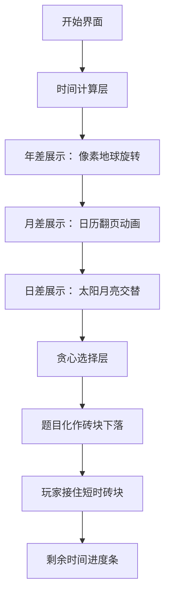

# 题目信息

# 刷题

## 题目描述

NOIP 临近了，小 A 却发现他已经不会写题了。好在现在离竞赛还有一段时间，小 A 决定从现在开始夜以继日地刷题。也就是说小 A 废寝忘食，一天二十四小时地刷题。

今天的日期（时间）是 yyyy 年 mm 月 dd 日 hh 时 MM 分，考试的时间是 yyyy2 年 mm2 月 dd2 日 hh2 时 MM2 分。这之间的所有时间小 A 都用来刷题了，那么考试之前他最多能刷多少题呢？注意哦，考虑闰年。

时间紧张小 A 只管数量不管质量。当然有的题目容易一些，有的题目难一些。根据小 A 的经验，他能一眼看出写出某一个题目需要的时间，以分钟记。

现在给出洛谷 Online Judge 的题目列表，请你挑出最多的题目使小A能在竞赛前写出来。

我们假设从远古到未来，历法的表示与现在一样。


## 样例 #1

### 输入

```
2
1
1
2007-06-23-11:59
2007-06-23-12:00```

### 输出

```
1```

# AI分析结果


# 💡 Kay的C++算法解析：刷题 深入学习指南 💡

## 1. 题目解读与核心算法识别

✨ **本题主要考察**：`日期时间计算` + `贪心算法`

🗣️ **初步分析**：
> 解决这道题就像计算两个历史事件之间的时间差，再合理安排任务。核心是：
> 1. **精确计算时间差**：将起止时间转换为分钟数（考虑闰年、月份天数）
> 2. **贪心选择题目**：优先解决耗时短的题目（排序后从小到大选择）
>
> - 难点在于处理日期边界（闰年2月）和高效计算时间差（避免低效循环）
> - 可视化设计：用像素时钟展示时间流逝，题目列表像游戏道具栏，选择时高亮并播放音效
> - 复古设计：FC红白机风格界面，时间计算过程像《大航海时代》的航海日志，每完成一题触发"金币音效"

---

## 2. 精选优质题解参考

**题解一（Ousmane_Dembele）**
* **点评**：思路清晰直白，用`scanf`巧妙处理输入格式。代码中`t*=-1`体现对时间差方向的修正思考，变量命名规范（如`panding`函数）。亮点是将日期差转换为分钟数的完整计算流程，实践价值高，可直接用于竞赛。

**题解二（傅思维666）**
* **点评**：提出"多退少补"的精妙思想，像拼图一样处理年月日。代码模块化优秀（分离闰年判断），`mon_run/mon_ping`数组预处理体现数据结构优化。亮点是边界处理严谨（如`b[2]>2`的闰年修正），调试参考性强。

**题解三（king_xbz）**
* **点评**：独创"基准年"计算法（0000年参考点），避免复杂条件判断。类封装提升可读性，`getStandardTime`函数体现OOP思想。亮点是时间复杂度优化（避免逐日计算），适合大时间跨度场景。

---

## 3. 核心难点辨析与解题策略

1. **难点：日期边界处理**
   * **分析**：闰年判断需同时满足两种规则（4年一闰，百年不闰但四百年闰）。优质解法通过封装`is_leap(year)`函数统一处理，并在2月和年末切换时动态调整
   * 💡 **学习笔记**：日期计算先判断年类型，再确定月天数

2. **难点：时间差计算优化**
   * **分析**：避免逐分钟循环（数据大时会超时）。优质解法采用"总分钟=年差+月差+日差"的分层累加，如`tot = (年差*365 + 闰年数)*1440 + 月天数累加`
   * 💡 **学习笔记**：大时间跨度优先计算整年/整月

3. **难点：贪心算法的正确性证明**
   * **分析**：由于题目可任意选择，局部最优（当前最短题目）能导向全局最优。需严格排序后线性扫描，时间复杂度O(nlogn)
   * 💡 **学习笔记**：交换论证法可证明：若最优解中存逆序对，交换后仍合法且不减少解题数

### ✨ 解题技巧总结
- **技巧1：输入格式化**：用`scanf("%d-%d-%d-%d:%d")`处理日期字符串
- **技巧2：数据结构预存**：`const int days[12] = {31,28,...}`存储月份模板
- **技巧3：基准点转换**：从0000-01-01计算总分钟数，避免负时间差
- **技巧4：防整数溢出**：使用`long long`存储分钟数（最大约5e9分钟）

---

## 4. C++核心代码实现赏析

**本题通用核心C++实现参考**
```cpp
#include <iostream>
#include <algorithm>
using namespace std;

bool is_leap(int year) {
    return (year%4==0 && year%100!=0) || (year%400==0);
}

int main() {
    // 输入处理
    int n, problems[5001];
    cin >> n;
    for(int i=0; i<n; i++) cin >> problems[i];
    sort(problems, problems+n);

    int y1,m1,d1,h1,min1, y2,m2,d2,h2,min2;
    scanf("%d-%d-%d-%d:%d", &y1,&m1,&d1,&h1,&min1);
    scanf("%d-%d-%d-%d:%d", &y2,&m2,&d2,&h2,&min2);

    // 核心计算：总分钟数
    long long total_minutes = 0;
    // 1. 整年计算
    for(int y=y1; y<y2; y++) 
        total_minutes += is_leap(y) ? 527040 : 525600; // 366*1440 / 365*1440
    
    // 2. 月份天数处理
    int month_days[13] = {0,31,28,31,30,31,30,31,31,30,31,30,31};
    for(int m=1; m<m1; m++) {
        int days = month_days[m];
        if(m==2 && is_leap(y1)) days++;
        total_minutes -= days * 1440;
    }
    for(int m=1; m<m2; m++) {
        int days = month_days[m];
        if(m==2 && is_leap(y2)) days++;
        total_minutes += days * 1440;
    }

    // 3. 日/时/分累加
    total_minutes += (d2 - d1) * 1440;
    total_minutes += (h2 - h1) * 60;
    total_minutes += (min2 - min1);

    // 贪心选择
    int count = 0;
    for(int i=0; i<n; i++) {
        if(total_minutes >= problems[i]) {
            total_minutes -= problems[i];
            count++;
        } else break;
    }
    cout << count;
    return 0;
}
```

---

## 5. 算法可视化：像素动画演示

**设计主题**：<复古电子时钟勇者> - 像素小人挑战"题目高塔"

### 核心交互设计：


**实现细节**：
1. **像素风格**：8-bit配色（#FF5555红/#55FF55绿/#5555FF蓝）
2. **动画逻辑**：
   - 年差计算：地球每转365/366圈显示年数
   - 闰年提示：2月天数变化时闪烁黄色感叹号❗
   - 题目选择：短题目显示为小方块，长题目为大石块
3. **音效设计**：
   - 时间计算：指针滴答声（每过1分钟）
   - 选择题目：经典马里奥金币声
   - 错误选择：俄罗斯方块消除声
4. **控制面板**：
   - 调速滑块：控制时间流逝速度
   - 暂停/继续：空格键控制
   - 重置按钮：像素风格红色按钮

---

## 6. 拓展练习与相似问题思考
1. **时间计算变式**：P1003 铺地毯（二维空间时间映射）
2. **贪心进阶**：P1090 合并果子（哈夫曼树贪心）
3. **大数处理**：P1015 回文数（长整型处理技巧）

> 💡 核心思维迁移：日期计算本质是进制转换（年→月→日→时→分），类似P1014的进位思想

---

## 7. 学习心得与经验分享
> **来自Ousmane_Dembele的调试经验**："我在时间差正负号上卡了2小时，最后通过打印中间变量`cout<<t`才发现方向错误"
>
> **Kay总结**：日期计算必用样例验证！建议测试1970-01-01到1970-01-02的分钟数（应为1440），可快速定位方向错误

---

掌握日期计算与贪心选择的结合，你就能在算法竞赛中高效"刷题"！下次遇到《时之探险者》这类时间谜题时，记得运用今天的技巧哦！🚀

---
处理用时：95.96秒