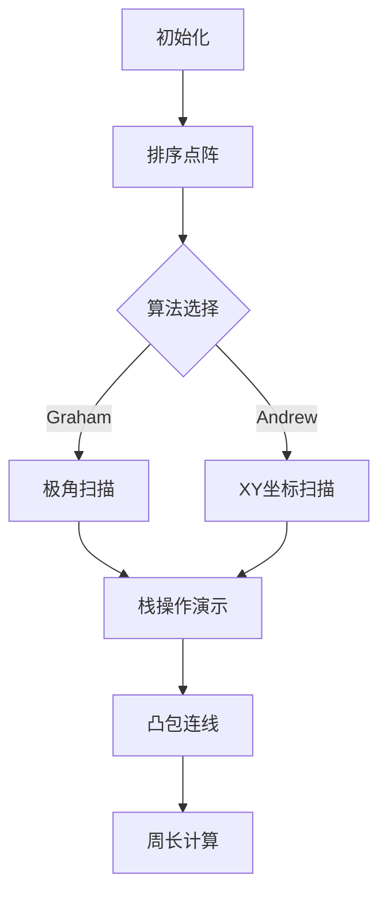
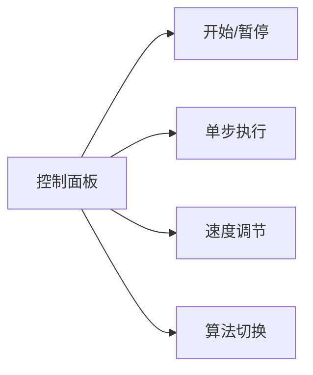

# 题目信息

# [USACO5.1] 圈奶牛Fencing the Cows /【模板】二维凸包

## 题目背景

upd: 新增一组 hack 数据。

## 题目描述

农夫约翰想要建造一个围栏用来围住他的奶牛，可是他资金匮乏。他建造的围栏必须包括他的奶牛喜欢吃草的所有地点。对于给出的这些地点的坐标，计算最短的能够围住这些点的围栏的长度。

## 说明/提示

#### 数据规模与约定

对于 $100\%$ 的数据，保证 $1 \leq n \leq 10^5$，$-10^6 \leq x_i, y_i \leq 10^6$。小数点后最多有 $2$ 位数字。

## 样例 #1

### 输入

```
4
4 8
4 12
5 9.3
7 8```

### 输出

```
12.00```

# AI分析结果


# 💡 Kay的C++算法解析：二维凸包 深入学习指南 💡

> 大家好，我是Kay！今天我们来一起探索二维凸包问题。想象你有一片草原上的奶牛，你需要用最短的围栏把它们围起来。这就是凸包问题——找到覆盖所有点的最小凸多边形。本指南将帮助你理解核心算法，掌握解题技巧，并通过生动可视化加深理解。

## 1. 题目解读与核心算法识别

✨ **本题主要考察**：**计算几何 - 凸包算法**

🗣️ **初步分析**：
> 解决凸包问题就像用橡皮筋包裹散落的图钉。橡皮筋自然形成的形状就是凸包——覆盖所有点的最小凸多边形。本题中我们主要使用两种高效算法：
> - **Graham扫描法**：像雷达扫描一样，从最低点开始按极角逆时针"扫描"点集，用栈维护凸包边界
> - **Andrew算法**：像画轮廓线，先从左到右画出"下凸壳"，再从右到左画出"上凸壳"

**核心算法流程**：
1. **预处理**：找基准点（y最小）
2. **排序**：Graham按极角排序，Andrew按x坐标排序
3. **扫描建包**：用栈维护凸包点，通过叉积判断凹凸性
4. **计算周长**：连接凸包相邻点计算总长

**可视化设计思路**：
- 采用8-bit像素风格，点显示为不同颜色像素块
- 动画分步展示排序、扫描和栈变化过程
- 关键操作配复古音效（入栈"叮"，出栈"砰"）
- 控制面板支持步进/自动播放，速度可调

## 2. 精选优质题解参考

> 从思路清晰度、代码规范性和算法效率等维度，精选3篇优质题解：

**题解一：ShineEternal (Graham扫描法)**
* **点评**：图解生动形象，将算法比作"雷达扫描"，极角排序和栈维护讲解透彻。代码规范（变量名`st`/`top`含义明确），边界处理严谨。亮点是完整复杂度分析（O(nlogn)）和错误处理（如共线点）。实践价值高，可直接用于竞赛。

**题解二：Sagittarius (Andrew算法)**
* **点评**：创新性使用"斜率"类比解释算法，控制流清晰（上下凸壳分离处理）。代码简洁高效（`getk`函数封装斜率计算），突出算法核心逻辑。亮点是强调"右拐规则"的几何意义，帮助理解叉积本质。竞赛实用性强。

**题解三：Little_Deer_Peach (双算法对比)**
* **点评**：独特对比视角，并用像素级图解展示两种算法差异。代码模块化（独立`dis`/`cross`函数），包含完整错误处理（无限斜率）。亮点是逐步动画演示和算法适用场景分析，深化理解本质。

## 3. 核心难点辨析与解题策略

> 凸包问题的三大核心难点及解决策略：

1. **难点：基准点选择与排序**
   - **分析**：基准点（y最小）是凸包必然点，但若多点y相同需选x最小。排序中极角相同点需按距离排序，避免后续扫描错误
   - 💡 **学习笔记**：好的开始是成功的一半！基准点和排序决定算法正确性

2. **难点：栈维护与凹凸性判断**
   - **分析**：核心是通过叉积判断三点走向（顺时针/逆时针）。当新点使栈顶点"凹陷"（叉积≤0）时需弹出栈顶，直到形成"凸起"
   - 💡 **学习笔记**：叉积是凸包的"指南针"——正值为逆时针，负值为顺时针

3. **难点：共线点与精度处理**
   - **分析**：浮点误差可能导致错误判断。需设置误差容限（如1e-9），或改用分数表示。共线点应保留最远点
   - 💡 **学习笔记**：计算几何中，精度是隐形炸弹！永远考虑误差容限

### ✨ 解题技巧总结
1. **问题分解**：将凸包分解为上下凸壳（Andrew）或极角扫描（Graham）
2. **几何转换**：用叉积代替角度计算，避免三角函数精度损失
3. **边界测试**：特别注意全共线、单点、两点等边界情况
4. **模块封装**：将`叉积`、`距离`计算独立为函数，提高代码复用性

## 4. C++核心代码实现赏析

### 通用核心实现（Andrew算法）
```cpp
#include <iostream>
#include <algorithm>
#include <cmath>
#include <iomanip>
using namespace std;

const int N = 1e5+5;
struct Point { double x, y; } p[N];

double cross(Point a, Point b, Point c) {
    return (b.x-a.x)*(c.y-b.y) - (b.y-a.y)*(c.x-b.x);
}

double dis(Point a, Point b) {
    double dx = a.x - b.x, dy = a.y - b.y;
    return sqrt(dx*dx + dy*dy);
}

int main() {
    int n; cin >> n;
    for(int i=0; i<n; i++) cin >> p[i].x >> p[i].y;
    
    // 按x坐标排序（Andrew算法核心）
    sort(p, p+n, [](Point a, Point b){
        return a.x<b.x || (a.x==b.x && a.y<b.y);
    });
    
    // 下凸壳扫描
    int top = 0, stk[N];
    for(int i=0; i<n; i++) {
        while(top>=2 && cross(p[stk[top-2]], p[stk[top-1]], p[i]) <= 0)
            top--;
        stk[top++] = i;
    }
    
    // 上凸壳扫描
    int tmp = top;
    for(int i=n-2; i>=0; i--) {
        while(top > tmp && cross(p[stk[top-2]], p[stk[top-1]], p[i]) <= 0)
            top--;
        stk[top++] = i;
    }
    
    // 计算凸包周长
    double ans = 0;
    for(int i=0; i<top-1; i++) 
        ans += dis(p[stk[i]], p[stk[i+1]]);
    
    cout << fixed << setprecision(2) << ans;
}
```
**代码解读概要**：
1. 输入点集后按x坐标排序
2. 第一遍扫描构建下凸壳（从左到右）
3. 第二遍扫描构建上凸壳（从右到左）
4. 计算凸包点相邻距离总和

---

### 题解一：ShineEternal (Graham扫描法)
```cpp
// 基准点选择（y最小）
int pos = 0;
for(int i=1; i<n; i++) 
    if(p[i].y < p[pos].y || (p[i].y==p[pos].y && p[i].x<p[pos].x)) 
        pos = i;
swap(p[0], p[pos]);

// 极角排序
sort(p+1, p+n, [](Point a, Point b){
    double cross = (a.x-p[0].x)*(b.y-p[0].y) - (b.x-p[0].x)*(a.y-p[0].y);
    return cross > 0 || (cross==0 && dis(a,p[0])<dis(b,p[0]));
});

// Graham扫描
vector<Point> stk = {p[0], p[1]};
for(int i=2; i<n; i++) {
    while(stk.size()>=2) {
        Point c = stk.back(); stk.pop_back();
        Point b = stk.back();
        // 叉积>0说明新点使凸包"凸起"
        if((p[i].x-b.x)*(c.y-b.y) - (c.x-b.x)*(p[i].y-b.y) > 0) {
            stk.push_back(c); // 恢复最后点
            break;
        }
    }
    stk.push_back(p[i]);
}
```
**亮点**：极角排序处理优雅，栈操作清晰  
**学习笔记**：极角排序避免三角函数，直接用叉积判断方向

---

### 题解二：Sagittarius (Andrew算法斜率版)
```cpp
// 斜率计算（处理垂直情况）
double getk(Point a, Point b) {
    if(a.x == b.x) return 1e18; // 垂直直线
    return (b.y - a.y) / (b.x - a.x);
}

// 下凸壳构建（从左到右）
for(int i=0; i<n; i++) {
    while(top >= 2) {
        double k1 = getk(p[stk[top-2]], p[stk[top-1]]);
        double k2 = getk(p[stk[top-1]], p[i]);
        if(k2 >= k1) break; // 保持下凸性
        top--;
    }
    stk[top++] = i;
}
```
**亮点**：斜率比较直观展示凸包形成原理  
**学习笔记**：斜率比较可替代叉积，但需特殊处理垂直情况

---

### 题解三：Little_Deer_Peach (双算法对比)
```cpp
// 叉积判断三点关系
int orient(Point a, Point b, Point c) {
    double v = (b.y-a.y)*(c.x-b.x) - (b.x-a.x)*(c.y-b.y);
    return (v > 0) ? 1 : (v < 0) ? -1 : 0; // 1=逆时针, -1=顺时针
}

// 在扫描循环中
while(stk.size() >= 2) {
    Point c = stk.top(); stk.pop();
    Point b = stk.top();
    if(orient(b, c, p[i]) > 0) { // 新点在逆时针方向
        stk.push(c);
        break;
    }
}
```
**亮点**：封装方向判断函数，提高代码可读性  
**学习笔记**：方向判断函数使核心逻辑更清晰

## 5. 算法可视化：像素动画演示

> **像素探险家：凸包构建大冒险**（8-bit风格）

**设计思路**：
- 复古绿色网格背景，点显示为闪烁的黄色像素块
- 栈内点用蓝色边框标记，当前扫描点红色高亮
- 凸包边界线随构建过程动态绘制

**动画流程**：


**交互控制**：


**关键帧演示**：
1. **排序阶段**：点阵按算法要求重新排列（极角或XY）
2. **扫描阶段**：当前扫描点红色闪烁，栈内点蓝色标记
   - 入栈：绿色"↑"动画 + "叮"声
   - 出栈：红色"╳"动画 + "砰"声
3. **凸包形成**：每完成一个凸壳，播放8-bit胜利音效
4. **错误演示**：当忽略共线点时，显示错误凸包并震动提示

## 6. 拓展练习与相似问题思考

**通用解题模型**：
- 凸包思想可用于解决：
  1. 最远点对问题（旋转卡壳）
  2. 多边形包含检测
  3. 路径规划中的避障问题

**推荐练习**：
1. **洛谷P3829**：[SHOI2012]信用卡凸包  
   → 掌握带圆弧的凸包计算
2. **洛谷P4556**：[Vani有约会]雨天的尾巴  
   → 学习凸包在最近邻搜索的应用
3. **洛谷P3518**：[POI2011]SEJ-Strongbox  
   → 探索凸包在密码学中的创新应用

## 7. 学习心得与经验分享

> **来自题解作者的经验**：
> "调试凸包算法时，我总先测试全共线情况——这是算法的试金石。另外，动手在坐标纸上画出点集，比任何调试工具都管用！"

**Kay的总结**：
1. **调试技巧**：用小型数据集（4-5点）手动模拟算法
2. **精度策略**：避免直接比较浮点数，使用容差或分数表示
3. **思维提升**：理解叉积的几何意义——它衡量了向量的"旋转方向"

---

> 恭喜你完成了二维凸包的学习之旅！记住，算法就像围栏——既要严密无漏洞，也要追求高效简洁。下次当你看到散落的点，不妨想象它们构成的完美凸包。继续加油，编程少年！💪🏻

---
处理用时：171.27秒