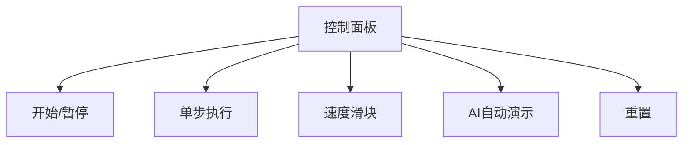

# 题目信息

# [USACO16OPEN] Landscaping P

## 题目背景

*本题与 [2012 年 3 月月赛银组同名题目](/problem/P3049) 在题意上一致，唯一的差别是数据范围。*

## 题目描述

Farmer John 打算修建一座花园，他需要移动不少泥土。

花园由 $N$ 个花坛组成（$1 \leq N \leq 10^5$），其中花坛 $i$ 包含 $A_i$ 单位的泥土。FJ 希望花坛 $i$ 包含 $B_i$ 单位的泥土，保证 $0 \leq A_i,B_i \leq 10$。

为了达到这个目标，他可以做这几件事情：

- 购买一单位的泥土，放在指定的花坛中，费用为 $X$。
- 从任意一个花坛中移走一单位泥土，费用为 $Y$。
- 从花坛 $i$ 运送一单位泥土到花坛 $j$，费用为 $Z|i-j|$。

请你帮 FJ 计算移动泥土的最小开销。

## 说明/提示

按下面的方案，最小花费为 $210$，可以证明不存在开销更小的方案。

- 移除 $4$ 号花坛的一单位泥土，花费 $200$。
- 将 $4$ 号花坛的三单位泥土移到 $1$ 号花坛，花费 $3 \times 3=9$。
- 将 $3$ 号花坛的一单位泥土移到 $2$ 号花坛，花费 $1 \times 1=1$。

## 样例 #1

### 输入

```
4 100 200 1
1 4
2 3
3 2
4 0```

### 输出

```
210```

# AI分析结果


### 💡 Kay的C++算法解析：Landscaping P 深入学习指南 💡

**引言**  
今天我们一起分析"Landscaping P"这道C++编程题。本指南将帮助大家梳理题目思路，理解核心算法，并掌握解题技巧。

---

### 1. 题目解读与核心算法识别

✨ **本题主要考察**：`反悔贪心` (堆优化应用)  

🗣️ **初步分析**：  
> 解决这道题的关键在于理解反悔贪心思想。就像玩拼图游戏时，你可以临时放置一块拼图（直接操作），但发现更好的位置时，可以撤回之前的决定（反悔）重新放置。  
> - **核心思路**：将每个花坛的泥土拆分成单位处理，用两个堆分别记录"多余泥土"和"缺少泥土"的位置及代价信息。遍历花坛时，比较直接操作（买/扔）和移动泥土的代价，选择更优方案。  
> - **核心难点**：动态维护最优决策链，通过堆实现O(log n)的决策更新。关键变量是当前花坛位置`i`和堆顶存储的`j*Z + cost`值。  
> - **可视化设计**：采用8位像素风格，用不同颜色方块表示花坛状态（绿=正常，红=多土，蓝=少土）。动画将高亮当前操作（泥土移动路径、堆顶元素闪光），并配合音效（移动时"叮"，反悔时特殊音效）。控制面板支持单步执行和AI自动演示模式。

---

### 2. 精选优质题解参考

**题解一（lytqwq，15赞）**  
* **点评**：推导严谨，详细解释了反悔贪心的数学形式（`V_i = min(X, Z|i-j| - V_j)`）。代码变量命名清晰（ovo/ovo2区分堆），边界处理完整。亮点在于用`小根堆+负值`巧妙实现大根堆功能，时间复杂度优化到O(10n log n)，实践价值高。

**题解二（Usada_Pekora，12赞）**  
* **点评**：代码最简洁高效（仅30行），用`q[2]`数组管理双堆。亮点是统一处理逻辑（符号技巧`f = a>b`），循环内直接比较`i*z - q.top()`与操作代价。虽然变量名较简略，但核心逻辑突出，适合竞赛参考。

**题解三（AuCloud，7赞）**  
* **点评**：教学性最强，逐步推导反悔机制（如`(j-i)*z - cost`的拆解）。代码结构清晰，注释详细。亮点是强调"反悔的数学意义"，帮助理解`2*i*z - top`的入堆原理。

---

### 3. 核心难点辨析与解题策略

1. **难点1：如何选择当前操作（直接买/扔 vs 移动）？**  
   * **分析**：通过维护两个堆（存`j*Z + cost`），计算移动代价`i*Z - heap_top`，与直接代价（X/Y）比较。关键是通过堆快速获取最优历史决策。
   * 💡 **学习笔记**：反悔贪心的本质是用数据结构动态维护最优子决策。

2. **难点2：如何更新堆以支持后续反悔？**  
   * **分析**：选择移动时，新代价`2*i*Z - heap_top`入堆。这样后续位置可基于此进一步反悔，形成决策链。
   * 💡 **学习笔记**：堆中存储的值本质是"位置*Z + 当前代价"，为后续反悔提供数学基础。

3. **难点3：如何处理多个泥土单位？**  
   * **分析**：因`A_i/B_i ≤ 10`，可对每个单位独立处理。循环次数为`|a_i - b_i|`，不影响整体复杂度O(n log n)。
   * 💡 **学习笔记**：小数据范围是突破口，可暴力枚举单位泥土。

### ✨ 解题技巧总结
- **技巧1：反悔贪心框架** - 当前操作可能被后续决策修正，需记录"可反悔状态"。
- **技巧2：堆优化决策** - 用优先队列高效获取最优历史决策（大根堆维护`j*Z + cost`）。
- **技巧3：问题分解** - 将每个花坛的泥土差拆解为单位处理，降低复杂度。

---

### 4. C++核心代码实现赏析

**通用核心实现参考**  
```cpp
#include <iostream>
#include <queue>
using namespace std;
typedef long long ll;

int main() {
    ll n, x, y, z, ans = 0;
    cin >> n >> x >> y >> z;
    priority_queue<ll> surplus; // 多余泥土堆
    priority_queue<ll> lack;    // 缺少泥土堆

    for (int i = 1; i <= n; i++) {
        ll a, b;
        cin >> a >> b;
        // 处理多余泥土（需移除或送出）
        for (int j = 0; j < a - b; j++) {
            ll cost = y; // 直接移除的代价
            if (!lack.empty() && i*z - lack.top() < cost) {
                cost = i*z - lack.top();
                lack.pop();
                surplus.push(2*i*z - (i*z - cost)); // 反悔入堆
            } else {
                surplus.push(i*z + y);
            }
            ans += cost;
        }
        // 处理缺少泥土（需购买或移入）
        for (int j = 0; j < b - a; j++) {
            ll cost = x; // 直接购买的代价
            if (!surplus.empty() && i*z - surplus.top() < cost) {
                cost = i*z - surplus.top();
                surplus.pop();
                lack.push(2*i*z - (i*z - cost));
            } else {
                lack.push(i*z + x);
            }
            ans += cost;
        }
    }
    cout << ans << endl;
    return 0;
}
```
* **代码解读概要**：  
  1. 用两个大根堆分别管理多余/缺少泥土的决策信息（存储`j*Z + cost`）  
  2. 遍历花坛时，对每个单位泥土比较直接操作（y/x）和移动代价（`i*Z - heap_top`）  
  3. 选择移动时更新堆：`surplus.push(2*i*z - (i*z - cost))`实现反悔机制  
  4. 累加总代价`ans`

**题解一片段赏析（lytqwq）**  
```cpp
priority_queue<ll, vector<ll>, greater<ll>> ovo, ovo2;
// 处理多余泥土
ovo2.push(-V[i] - i*z);
```
* **亮点**：用`greater`小根堆+负值实现大根堆功能  
* **学习笔记**：通过`-V[i]-i*z`的存储设计，使小根堆的top等效于最大值  

**题解二片段赏析（Usada_Pekora）**  
```cpp
for (int j=1; j<=abs(a-b); j++) 
    if (q[f^1].empty() || i*z - q[f^1].top() > c[f^1]) 
        ans += c[f^1], q[f].push(i*z + c[f^1]);
```
* **亮点**：用位运算`f^1`切换堆类型，代码极简  
* **学习笔记**：`f = a > b`将多余/缺少状态统一为布尔值，大幅简化逻辑  

---

### 5. 算法可视化：像素动画演示

**设计主题**  
"泥土搬运工"：8位像素风格（FC红白机），花坛为网格，泥土单位用棕色像素方块表示。

**核心演示内容**  
- **数据结构可视化**：  
  - 两个堆显示为像素方块柱（橙色=多余堆，蓝色=缺少堆）  
  - 堆顶方块持续闪烁，标记当前最优反悔选项  
- **操作动画**：  
  - 直接购买：泥土从顶部掉落+$X$标签  
  - 直接移除：泥土爆炸消失+$Y$标签  
  - 移动泥土：像素方块沿网格线滑动，显示路径箭头和费用`Z*|i-j|`  
  - 反悔操作：原花坛泥土恢复+闪光，新移动路径高亮  
- **状态标记**：  
  - 花坛颜色：绿（达标），红（多余），蓝（缺少）  
  - 当前操作花坛用黄色边框闪烁  

**交互控制**  


**音效设计**  
- 关键操作：泥土移动时"叮"（8bit短音）  
- 状态变化：直接操作时"噗"（购买）/"咔嚓"（移除）  
- 结果提示：达标时胜利音效，无解时低沉音效  
- 背景音乐：循环8bit风格BGM  

**动画流程伪代码**  
```
1. 初始化网格和堆（像素方块绘制）
2. FOR i=1 to n:
   - 高亮当前花坛i
   - FOR 每个单位泥土差异:
        IF 多余泥土:
            比较 y 和 (i*z - lack.top)
            IF 选择移动: 
                播放移动动画（源花坛→i）
                更新堆动画（lack.pop → surplus.push）
            ELSE:
                播放移除动画
        ELSE 类似逻辑
3. 达标时播放胜利动画
```

---

### 6. 拓展练习与相似问题思考

**通用技巧迁移**  
反悔贪心+堆优化适用于：  
1. 允许撤回次优决策的问题（如任务调度）  
2. 代价与距离/时间相关的问题  
3. 资源动态分配问题  

**洛谷练习推荐**  
1. **P3049 [USACO12MAR]Landscaping S**  
   * 理由：本题的弱化版，数据量小，适合练习反悔贪心基础  
2. **P4053 [JSOI2007]建筑抢修**  
   * 理由：经典反悔贪心，通过堆替换低收益任务  
3. **P3620 [APIO/CTSC2007]数据备份**  
   * 理由：相邻元素约束下的反悔贪心，强化堆的应用  

---

### 7. 学习心得与经验分享

> **参考经验（lytqwq）**："把前面的费用给减去"  
> **点评**：精炼概括反悔贪心本质——当前决策可优化历史操作的代价。  

> **参考经验（AuCloud）**："维护`j*Z + cost`是关键"  
> **点评**：直指算法核心，堆存储的这个值正是反悔决策的数学基础。  

---

**结语**  
本次Landscaping P的解析就到这里。记住：反悔贪心是强大的算法框架，核心在于"记录可反悔状态+高效决策"。多练习堆的应用，下次遇到类似问题你一定能迎刃而解！💪

---
处理用时：184.32秒